# WindCloud_V4 全流程时序图详解

## 1. 文档目标

这份文档专门用**时序图**来解释当前 V4 代码中的关键交互顺序。

这三份“全流程图解”文档的分工如下：

1. [V4全流程活动图详解.md](/home/liwenshuo/my_project/WindCloud_V4/docs/V4全流程活动图详解.md:1)
   重点看流程骨架、判断分支和循环结构。
2. [V4全流程时序图详解.md](/home/liwenshuo/my_project/WindCloud_V4/docs/V4全流程时序图详解.md:1)
   重点看模块交互顺序、协议包顺序和调用顺序。
3. [V4全流程状态图详解.md](/home/liwenshuo/my_project/WindCloud_V4/docs/V4全流程状态图详解.md:1)
   重点看核心对象的状态变化和状态切换条件。

如果说活动图主要回答的是：

- 先做什么
- 后做什么
- 在哪里分支

那么时序图主要回答的是：

- 是谁先调用了谁
- 是谁先给谁发送了什么数据
- 某一步完成后，下一步由哪个模块继续接手
- 某个失败分支到底在哪一侧被发现，又是如何返回的

本文会把当前 V4 的时序拆成下面这些核心场景：

1. 客户端登录成功并接收 token
2. 客户端注册
3. 一条普通短命令的完整交互
4. `cd` 命令成功后客户端和服务端如何同步路径
5. `puts` 上传的完整交互
6. `puts` 的秒传分支
7. `puts` 的续传 / 中断分支
8. `gets` 下载的完整交互
9. `gets` 的本地续传分支
10. 主连接超时断开和客户端重新登录
11. 服务端退出时主线程与工作线程的协作

本文主要对照这些代码：

- `src/client/client.c`
- `src/client/client_command_handle.c`
- `src/client/client_puts.c`
- `src/client/client_gets.c`
- `src/server/server.c`
- `src/server/session.c`
- `src/server/file_transfer.c`
- `src/server/worker.c`
- `src/server/auth.c`
- `src/server/dao_vfs.c`
- `src/server/dao_file.c`
- `src/common/protocol.c`

---

## 2. 阅读时序图的方法

### 2.1 先看参与者，再看消息

Mermaid 的 `sequenceDiagram` 里最重要的是两件事：

1. 左右有哪些参与者
2. 这些参与者之间按什么顺序传递消息

在本文里，常见参与者有：

- `U`：用户输入
- `CMain`：客户端主线程
- `CThread`：客户端上传 / 下载线程
- `MainConn`：客户端主连接
- `TransConn`：客户端独立传输连接
- `SMain`：服务端主线程
- `Sess`：`session.c`
- `Auth`：`auth.c`
- `JWT`：`jwt.c`
- `Worker`：工作线程
- `FT`：`file_transfer.c`
- `VFS`：`dao_vfs.c`
- `DF`：`dao_file.c`
- `DB`：MySQL
- `Disk`：`test/files/<sha256>` 里的真实文件

### 2.2 时序图和活动图的关系

这组文档中的活动图文档是：

- [V4全流程活动图详解.md](/home/liwenshuo/my_project/WindCloud_V4/docs/V4全流程活动图详解.md:1)

那份文档偏重：

- 流程骨架
- 判断分支
- 循环结构

这一份时序图文档偏重：

- 消息顺序
- 协议包顺序
- 模块交接顺序

可以把两份文档配合起来读：

1. 先用活动图确定流程大方向
2. 再用时序图看这条链里每一步到底是谁和谁交互

---

## 3. 登录成功并接收 token 时序图

这是 V4 所有后续链路的起点。

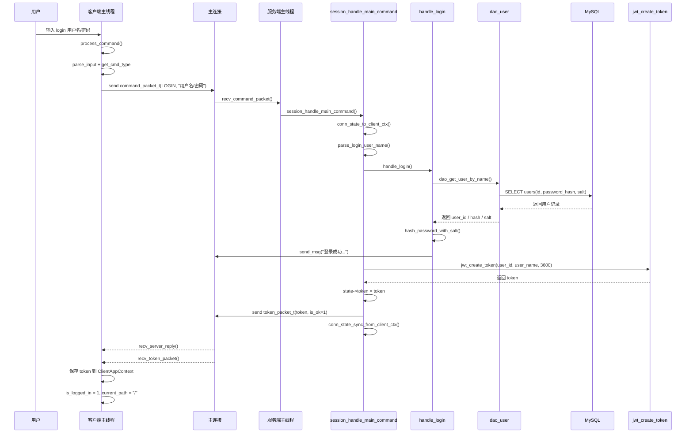

### 3.1 这条时序最关键的四件事

#### A. 登录命令本身仍然只是普通短命令

客户端先发的是：

```c
command_packet_t
```

不是特殊协议。

这一点在 `client_command_handle.c` 里很清楚：

```c
init_command_packet(&cmd_packet, cmd_type, arg);
send_command_packet(ctx->sock_fd, &cmd_packet);
```

#### B. token 不是和登录文本响应混在一起发的

服务端登录成功后，会连续发两包：

1. 普通文本响应包
2. `token_packet_t`

对应客户端代码：

```c
ret = recv_server_reply(ctx->sock_fd, &reply_packet);
if (cmd_type == CMD_TYPE_LOGIN && ret == 1) {
    recv_login_token(ctx);
}
```

#### C. token 是长命令链的前提

客户端只有在这里拿到 token，后面才有资格启动：

- `puts`
- `gets`

否则 `handle_puts_command()` / `handle_gets_command()` 会直接拒绝：

```c
if (!ctx->is_logged_in || ctx->token[0] == '\0') {
    printf("请先登录后再上传文件。\n");
    return -1;
}
```

#### D. 登录成功时，服务端会同时初始化目录状态

在 `session_handle_main_command()` 里，首次登录成功后会执行：

```c
strcpy(ctx.current_path, "/");
ctx.current_dir_id = 0;
```

这一步很重要，因为：

1. 后续主连接短命令要依赖当前目录
2. 后续传输连接也要从当前路径恢复目录上下文

---

## 4. 注册命令时序图

注册没有 token，下图可以和登录流程对照看。

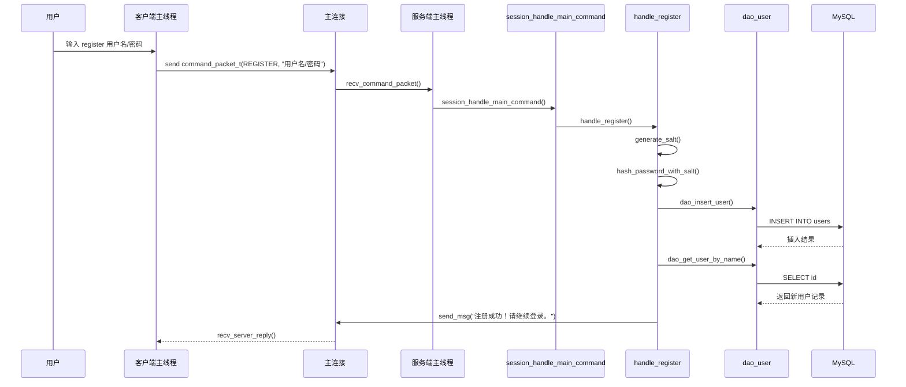

### 4.1 为什么注册不下发 token

因为当前项目里：

> token 代表“已经通过登录校验的会话身份”

注册只是创建用户，并不代表已经进入登录态。  
所以注册成功后客户端仍然停留在登录菜单，而不是直接进入已登录主循环。

---

## 5. 普通短命令时序图

下面先用 `pwd` 作为最简单的短命令例子。

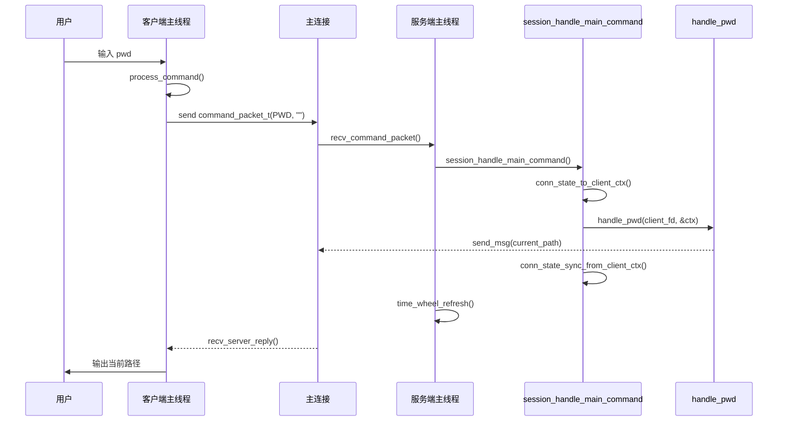

### 5.1 这条链路的关键点

#### A. 短命令不会进入线程池

在 `server.c` 里，只要首包不是 `CMD_TYPE_AUTH`，主线程就直接：

```c
recv_command_packet(fd, &cmd_packet);
session_handle_main_command(fd, state, &cmd_packet);
time_wheel_refresh(&time_wheel, state);
```

所以：

- `pwd`
- `ls`
- `mkdir`
- `touch`
- `rm`
- `rmdir`

都是主线程直接处理。

#### B. 短命令处理完成后会刷新时间轮

这表示：

> 一条普通短命令本身就代表“这个主连接最近有活动”

所以超时位置要往后顺延。

---

## 6. `cd` 成功后的路径同步时序图

`cd` 比 `pwd` 多一层“客户端本地路径也要同步”的动作。

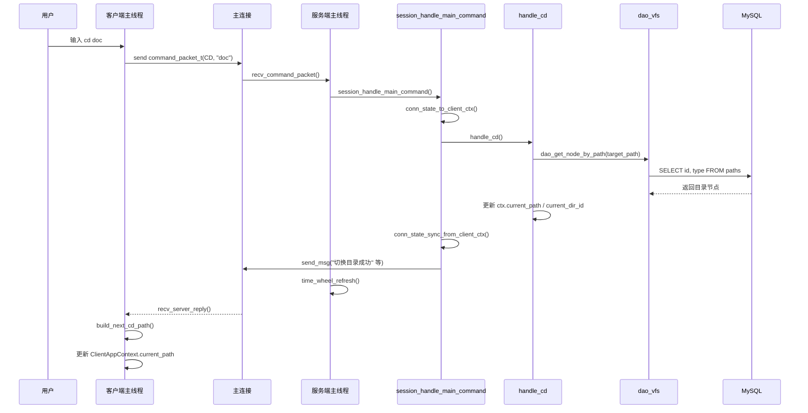

### 6.1 为什么 `cd` 要两边都更新

服务端更新是为了后续业务正确执行。  
客户端更新是为了后续长命令线程在发 `auth_packet_t` 时，能带上正确的 `current_path`。

所以 `cd` 这条短命令会同时影响：

1. 服务端 `ServerConnState`
2. 客户端 `ClientAppContext`

这正是长短命令分离能跑起来的基础之一。

---

## 7. `puts` 上传完整时序图

这张图是第二步里最重要的一张图之一。

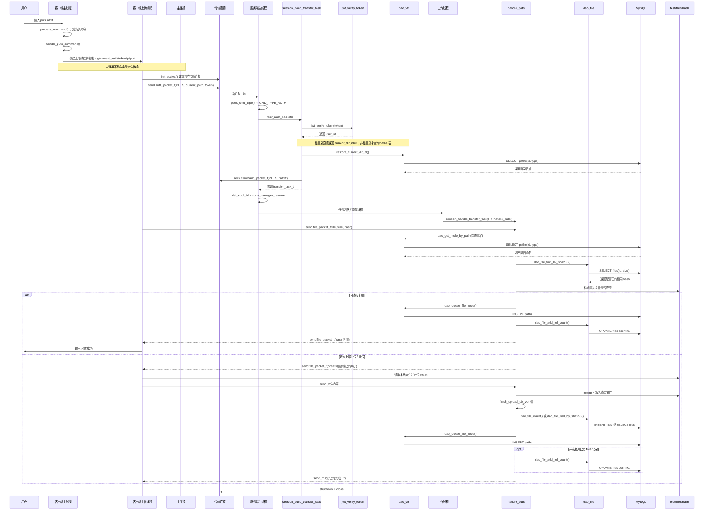

## 7.1 为什么 `puts` 的时序要分成“主线程接入”和“工作线程执行”

因为当前 V4 的实现明确分成了两层：

### 第一层：主线程前置整理

主线程负责：

1. 看首包是不是 `CMD_TYPE_AUTH`
2. 校验 JWT
3. 恢复目录上下文
4. 收真正的 `PUTS` 命令包
5. 组装 `transfer_task_t`

### 第二层：工作线程执行业务

工作线程负责：

1. 真正进入 `handle_puts()`
2. 收 `file_packet_t`
3. 秒传 / 续传 / 正常上传判断
4. 写真实文件
5. 补数据库关系

如果把这两层不分开，就很难看清为什么 V4 线程池已经和 V3 不一样了。

## 7.2 `puts` 的协议顺序一定要记住

在真实代码里，上传链上的包顺序是：

1. `auth_packet_t`
2. `command_packet_t(PUTS, 文件名)`
3. `file_packet_t(file_size, hash, offset=0)`
4. 服务端回 `file_packet_t(offset=已有进度 或 hash 相同)`
5. 如果不是秒传，再继续发送真实文件内容
6. 服务端最后回普通文本结果

这个顺序一旦记混，客户端和服务端就会协议错位。

---

## 8. `puts` 秒传分支时序图

秒传是 `puts` 的一个重要分支，单独拆出来更容易理解。

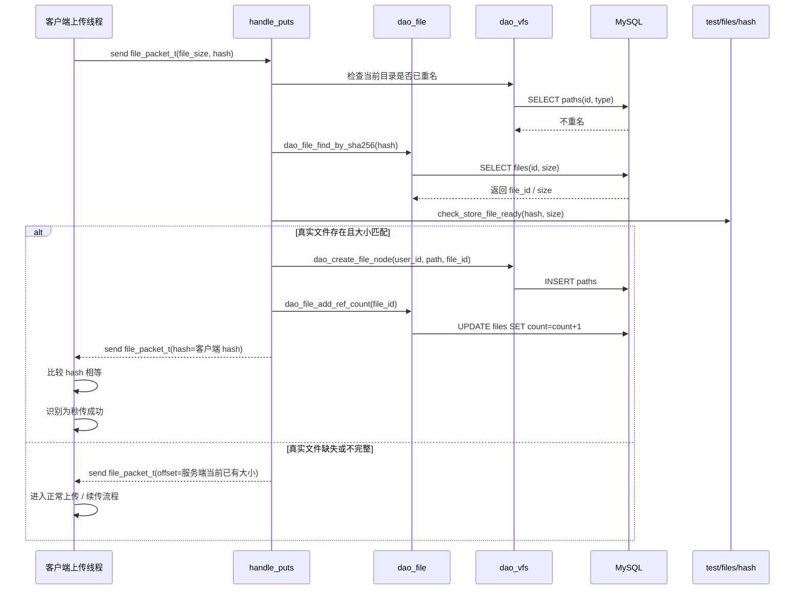

### 8.1 当前项目里，秒传不只看数据库

这一点必须特别明确。

服务端不会因为 `files` 表里查到相同 hash，就立刻秒传。  
它还会继续检查：

1. `test/files/<hash>` 是否存在
2. 它是不是普通文件
3. 它的大小是否和 `files.size` 一致

只有三者都成立，才会真正进入秒传。

对应代码在 `file_transfer.c`：

```c
int store_ready = check_store_file_ready(client_file_packet.hash, existed_file_size, &store_size);
if (store_ready == 1) {
    ...
}
```

这条设计避免了：

> 数据库有记录，但真实文件不完整时仍被错误复用

另外，真实文件缺失或不完整时，服务端并不会在这里直接结束上传流程；它会继续回到正常上传 / 续传握手，向客户端返回当前真实文件已有的偏移量。

---

## 9. `puts` 续传 / 中断分支时序图

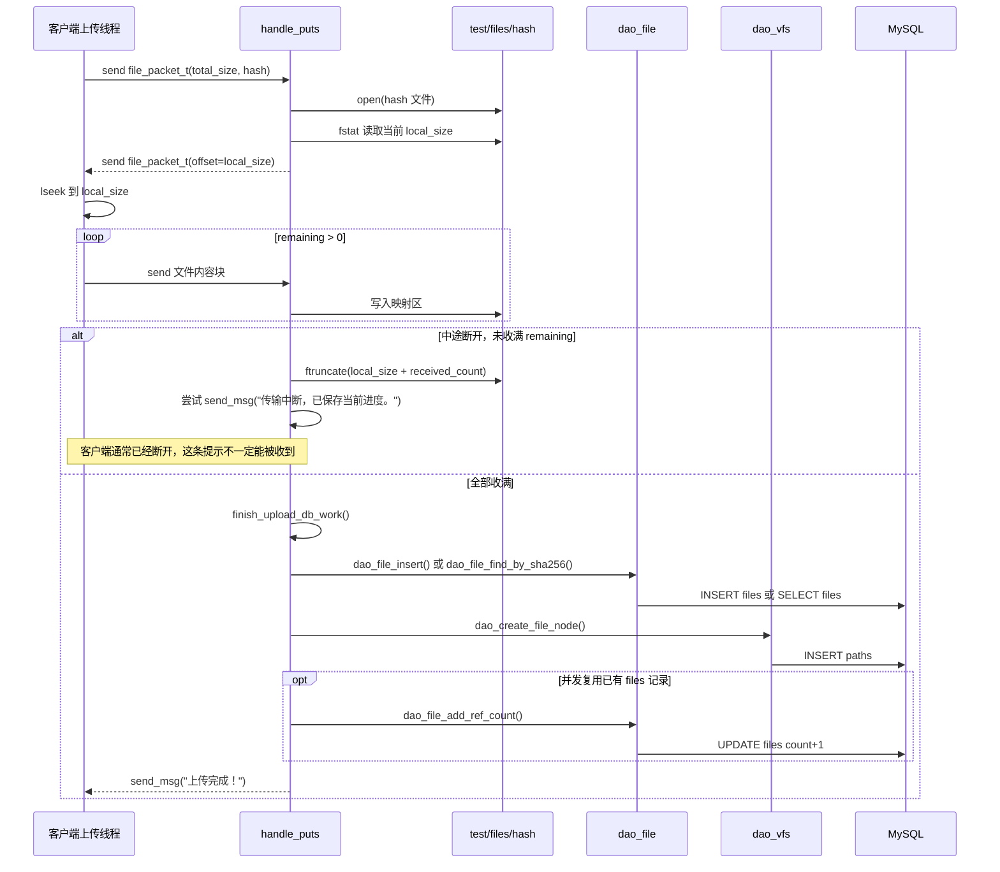

### 9.1 为什么中断后还要 `ftruncate`

因为服务端在接收前可能已经：

```c
ftruncate(file_fd, file_len);
```

把文件扩展到了目标总大小。  
如果中途断开却不把它截回真实收到的位置，就会留下尾部空洞或脏内容。

所以当前代码在未收满时会做：

```c
ftruncate(file_fd, local_size + received_count);
```

这一步是续传能继续成立的关键。

需要再补充一点：服务端在中断分支里虽然会尝试发送“已保存当前进度”的普通文本提示，但很多情况下客户端连接已经断开，因此这条提示不一定真的能被客户端线程收到。

---

## 10. `gets` 下载完整时序图

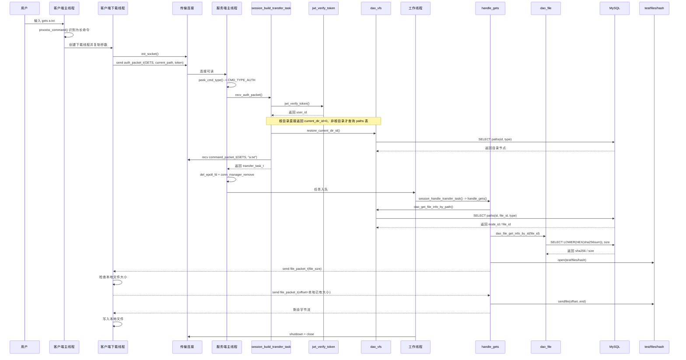

## 10.1 `gets` 的核心链路是“双跳查找”

下载时，服务端不是直接“文件名 -> 磁盘文件”。

它必须经过：

1. 逻辑路径查 `paths.file_id`
2. `file_id` 再查 `files.sha256sum`
3. `sha256sum` 再拼接成真实文件路径

也就是：

```text
逻辑路径 -> paths.file_id -> files.sha256 -> test/files/<sha256>
```

这也是为什么 V4 虽然改了连接模型，但下载业务本体仍然和虚拟文件系统紧密绑定。

---

## 11. `gets` 本地续传分支时序图

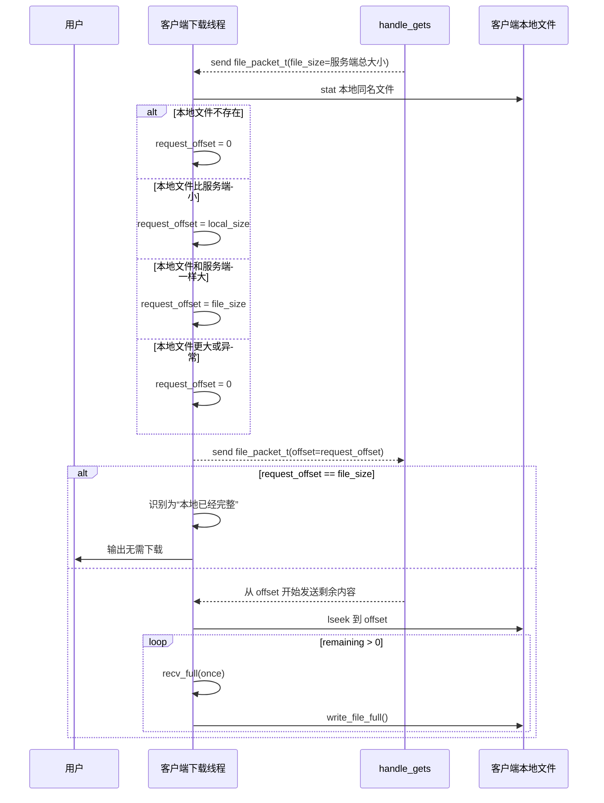

### 11.1 为什么下载续传偏移由客户端决定

因为只有客户端自己知道：

1. 本地是否已经有同名文件
2. 本地这个文件现在有多大

所以下载协议里是：

1. 服务端先告诉客户端“服务器文件总大小”
2. 客户端再回传“我本地已经有多少”

上传则正好相反，是服务端回给客户端已有进度。

---

## 12. 主连接超时断开与客户端重新登录时序图

这一条链路把时间轮和客户端重连逻辑连接起来。

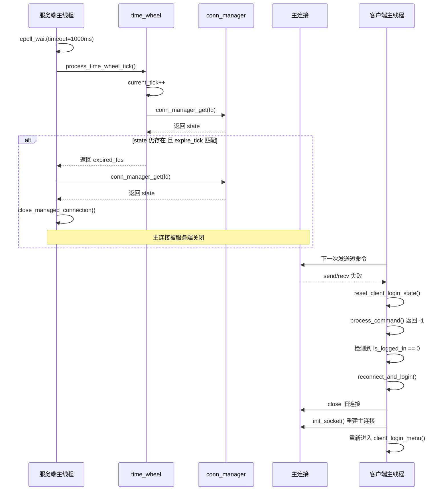

### 12.1 这里最容易误解的一点

客户端并不会在“服务端关闭连接的瞬间”立刻知道自己掉线。  
它通常是在：

1. 下一次发送命令
2. 或下一次接收响应

失败时，才发现主连接已经失效。

所以当前实现属于：

> 服务端主动关闭  
> 客户端按需发现并恢复

---

## 13. 服务端退出时主线程和工作线程协作时序图

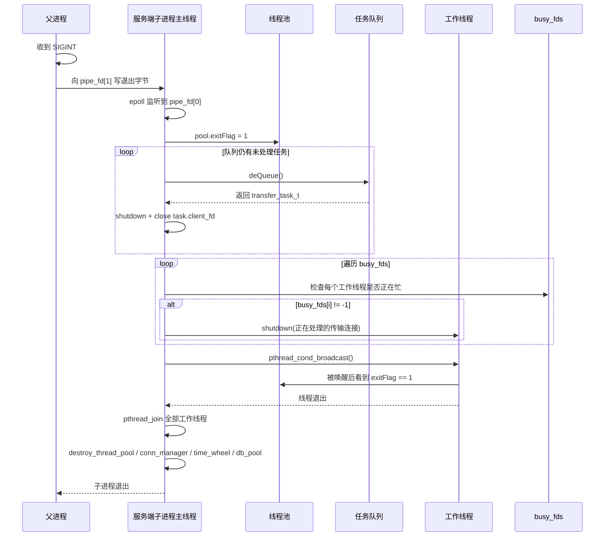

### 13.1 为什么退出链路也要看时序

因为这里不是“主线程退出，工作线程自然消失”这么简单。  
当前代码明确考虑了三类资源：

1. 队列里尚未开始的任务
2. 工作线程已经拿到手的任务
3. 线程池本身和连接状态管理结构

这个时序图能帮助你看清：

> 退出不是一个点，而是一整条有先后顺序的回收链

---

## 14. 把几条关键时序并排比较

读完整份文档后，建议把下面三条链并排记住：

### 14.1 登录链

```text
客户端主线程
-> 主连接
-> 服务端主线程
-> auth.c
-> users 表
-> 服务端主线程签发 token
-> 客户端保存 token
```

### 14.2 短命令链

```text
客户端主线程
-> 主连接
-> 服务端主线程
-> session_handle_main_command
-> file_cmds
-> DAO / DB
-> 主连接返回响应
```

### 14.3 长命令链

```text
客户端主线程
-> 创建传输线程
-> 独立传输连接
-> 服务端主线程认证并构造任务
-> 工作线程
-> file_transfer
-> DAO / DB / 真实文件
-> 传输连接关闭
```

这三条链正好对应 V4 当前最核心的三种交互模式。

---

## 15. 建议配套阅读顺序

如果你想把代码和这份时序图文档一起读，建议按下面顺序：

1. [client.c](/home/liwenshuo/my_project/WindCloud_V4/src/client/client.c:1)
先看客户端启动、登录菜单和已登录主循环。

2. [client_command_handle.c](/home/liwenshuo/my_project/WindCloud_V4/src/client/client_command_handle.c:1)
看命令怎么被拆成短命令、上传、下载三条链。

3. [server.c](/home/liwenshuo/my_project/WindCloud_V4/src/server/server.c:1)
看服务端主线程如何接入、预读、分流、入队。

4. [session.c](/home/liwenshuo/my_project/WindCloud_V4/src/server/session.c:1)
看短命令处理、传输任务构造和工作线程执行入口。

5. [file_transfer.c](/home/liwenshuo/my_project/WindCloud_V4/src/server/file_transfer.c:1)
看上传下载业务本体。

6. [auth.c](/home/liwenshuo/my_project/WindCloud_V4/src/server/auth.c:1) 和 [jwt.c](/home/liwenshuo/my_project/WindCloud_V4/src/server/jwt.c:1)
看登录校验和传输连接身份恢复。

7. [dao_vfs.c](/home/liwenshuo/my_project/WindCloud_V4/src/server/dao_vfs.c:1) 和 [dao_file.c](/home/liwenshuo/my_project/WindCloud_V4/src/server/dao_file.c:1)
看虚拟目录树和真实文件元数据如何接入数据库。

---

## 16. 一句话总结

从时序角度看，当前 V4 的本质可以概括成下面这句话：

> 登录通过主连接建立长期身份并下发 token；短命令始终由客户端主线程和服务端主线程直接交互；`puts/gets` 则由客户端启动独立线程建立独立传输连接，服务端主线程先完成认证和任务整理，再把真正的上传下载交给工作线程；时间轮负责关闭长时间无活动的主连接，而客户端在下一次命令失败时负责重新建立主连接并重新登录。
