# WindCloud_V4 全流程活动图详解

## 1. 文档目标

这份文档专门用**活动图**的方式，把当前 V4 实际代码中的主要执行流程拆开讲清楚。

这三份“全流程图解”文档的分工如下：

1. [V4全流程活动图详解.md](/home/liwenshuo/my_project/WindCloud_V4/docs/V4全流程活动图详解.md:1)
   重点看流程骨架、判断分支和循环结构。
2. [V4全流程时序图详解.md](/home/liwenshuo/my_project/WindCloud_V4/docs/V4全流程时序图详解.md:1)
   重点看模块交互顺序、协议包顺序和调用顺序。
3. [V4全流程状态图详解.md](/home/liwenshuo/my_project/WindCloud_V4/docs/V4全流程状态图详解.md:1)
   重点看核心对象的状态变化和状态切换条件。

本文的重点不是模块分层，而是：

1. 程序从哪里开始进入
2. 每条主链路经历了哪些判断
3. 每个阶段可能分出哪些分支
4. 分支最终如何回到主流程，或者直接结束

为了方便对照代码，本文中的活动图都会尽量对应到当前实际文件：

- `src/server/server.c`
- `src/server/session.c`
- `src/server/worker.c`
- `src/server/time_wheel.c`
- `src/server/conn_manager.c`
- `src/client/client.c`
- `src/client/client_command_handle.c`
- `src/client/client_puts.c`
- `src/client/client_gets.c`

这份文档重点解决“**流程骨架怎么跑**”的问题。  
如果要继续向下钻细节，建议再配合时序图文档和状态图文档一起看。

---

## 2. 阅读方法

活动图和时序图、状态图的关注点不同：

### 2.1 活动图看什么

活动图主要看：

1. 当前执行到哪一步
2. 这一步会做什么判断
3. 判断失败和判断成功分别往哪里走
4. 哪些流程会结束，哪些流程会回到循环入口

所以活动图特别适合回答这类问题：

- 服务端启动时到底先做什么再做什么
- 登录成功后客户端下一步会进入哪个循环
- 服务端是怎么判断一个连接到底是短命令还是传输连接的
- `puts` 和 `gets` 到底在哪一步进入线程池
- 超时断开和重连是从哪里切出去的

### 2.2 本文为什么拆成多张活动图

如果把 V4 所有流程硬塞进一张大图，会非常难读。

所以本文按真实代码执行层次，拆成下面几部分：

1. 服务端启动与退出总流程
2. 客户端启动、登录与主循环总流程
3. 客户端命令分流流程
4. 服务端 `epoll` 主循环流程
5. 主线程短命令处理流程
6. 上传 `puts` 活动图
7. 下载 `gets` 活动图
8. 工作线程执行传输任务流程
9. 时间轮超时处理流程
10. 客户端主连接失效后的重连流程

这样读的时候，可以先看总图，再顺着某一条分支钻进去。

---

## 3. V4 总体执行骨架

先用一张总活动图把客户端和服务端的主要运行方式放在一起。

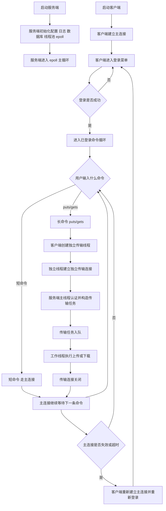

这张总图只强调一件事：

> V4 的核心不是“多了几个模块”，而是命令从输入开始就会被分流成两条执行链

这两条链分别是：

1. **短命令链**：主连接 + 服务端主线程
2. **长命令链**：独立传输连接 + 主线程认证入队 + 工作线程执行

---

## 4. 服务端启动与退出活动图

服务端入口是 `src/server/server.c` 的 `main()`。

## 4.1 服务端启动主流程

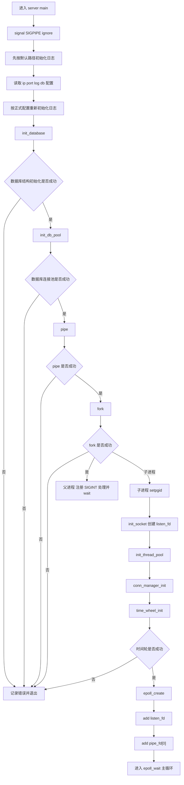

### 4.1.1 这张图要抓住的重点

#### A. 服务端不是单进程死循环

实际代码里保留了：

```c
if (pipe(pipe_fd) != 0) { ... }
pid_t pid = fork();
```

也就是说：

1. 父进程负责接收 `SIGINT`
2. 父进程通过管道通知子进程退出
3. 子进程才真正运行服务器主逻辑

#### B. `epoll` 主循环之前，V4 比 V3 多了两套关键状态

在监听开始前，除了线程池，还额外做了：

```c
ConnManager conn_manager;
TimeWheel time_wheel;
conn_manager_init(&conn_manager);
time_wheel_init(&time_wheel, SERVER_TIME_WHEEL_SIZE, SERVER_TIME_OUT_SECONDS);
```

这意味着 V4 在正式接收连接前，就已经准备好了：

1. 主连接状态维护能力
2. 主连接超时控制能力

#### C. 主线程不是只负责 `accept`

这在后面的主循环图里会展开，但启动阶段已经能看出设计方向：

> 线程池是提前启动的  
> 但真正的连接分流逻辑发生在主线程

---

## 4.2 服务端退出活动图

服务端退出同样是一条很完整的流程，不是直接 `exit()`。

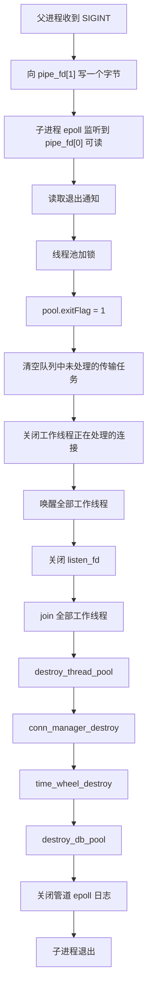

### 4.2.1 退出流程为什么值得单独画

因为当前代码不是“只关主线程”，而是还要处理：

1. 队列中尚未开始的传输任务
2. 工作线程已经在处理的传输连接
3. 主线程维护的状态链表
4. 时间轮内部节点

这部分在 `server.c` 里的关键代码是：

```c
pool.exitFlag = 1;

while(pool.queue.size > 0){
    transfer_task_t task;
    if(deQueue(&pool.queue, &task) == 0){
        shutdown(task.client_fd, SHUT_RDWR);
        close(task.client_fd);
    }
}

for(int i = 0; i < pool.num; i++){
    if(pool.busy_fds[i] != -1){
        shutdown(pool.busy_fds[i], SHUT_RDWR);
    }
}

pthread_cond_broadcast(&pool.cond);
```

这段代码说明：

> V4 的退出流程已经考虑到“线程池里有任务”和“线程池正在执行任务”这两种情况

---

## 5. 客户端启动、登录与主循环活动图

客户端入口是 `src/client/client.c` 的 `main()`。

## 5.1 客户端启动与登录总流程

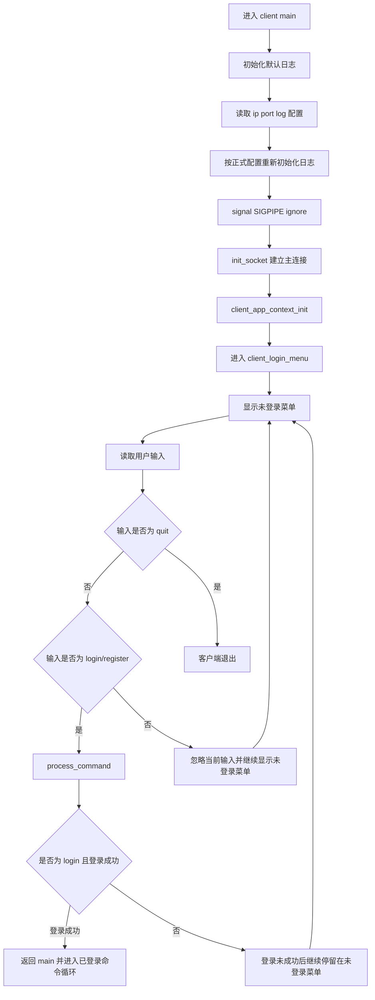

### 5.1.1 登录菜单的实际含义

`client_login_menu()` 的作用不是简单打印菜单，它实际上承担了：

1. 未登录阶段的输入限制
2. 登录和注册命令的首次分发
3. 判断是否已经拿到有效登录态

关键代码：

```c
if(strncmp(input,"login ",6)==0||strncmp(input,"register ",9)==0){
    int ret=process_command(app_ctx,input);
    if(ret==1&&strncmp(input,"login ",6)==0){
        return 0;
    }
    ...
}
```

也就是说，登录菜单并没有绕开统一命令分发逻辑，而是仍然走 `process_command()`。  
另外，和活动图里新增的 `C17` 一样，当前代码对于既不是 `login`、也不是 `register`、也不是 `quit` 的输入，不会额外报错，而是直接继续显示未登录菜单。

---

## 5.2 已登录命令循环活动图

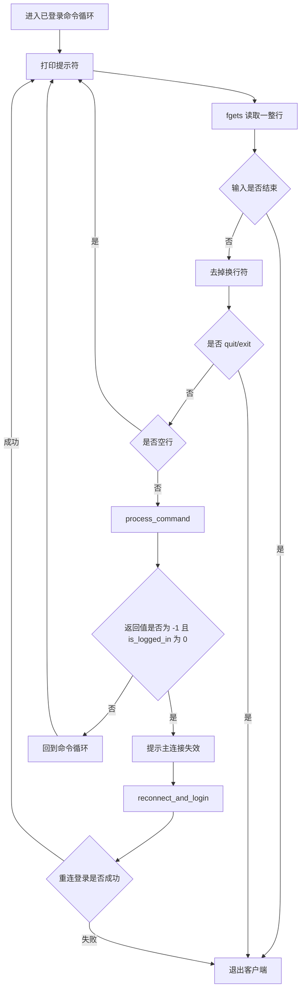

### 5.2.1 这条流程里最重要的异常分支

这段代码在 `client.c` 中：

```c
int ret = process_command(&app_ctx, input);
if (ret == -1 && app_ctx.is_logged_in == 0) {
    printf("主连接已失效，请重新登录。\n");
    if (reconnect_and_login(&app_ctx) == -1) {
        break;
    }
}
```

这说明客户端对于“主连接失效”的处理不是直接退出，而是：

1. 先把状态识别成掉线
2. 再重新建立主连接
3. 然后回到登录菜单

这条分支和时间轮超时控制直接对应。

---

## 6. 客户端命令分流活动图

客户端真正把命令分成“短命令链”和“长命令链”的地方，在 `src/client/client_command_handle.c` 的 `process_command()`。

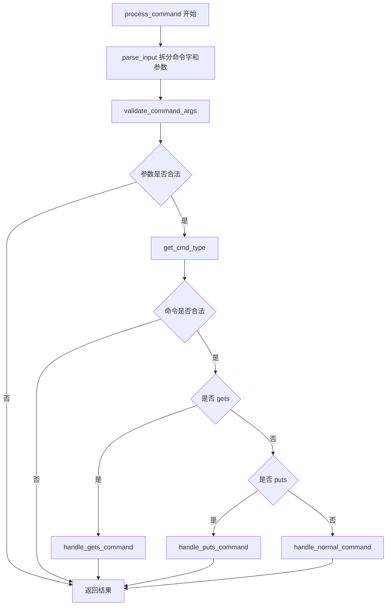

### 6.1 这张图为什么重要

因为这就是长短命令分离的**第一个真正分叉点**。

在这一步之前，所有命令都只是用户输入的一行字符串。  
从这一步开始，命令被拆成三类：

1. 非法命令
2. 长命令 `puts/gets`
3. 其它普通命令

### 6.2 `handle_normal_command()` 内部还有一层活动图

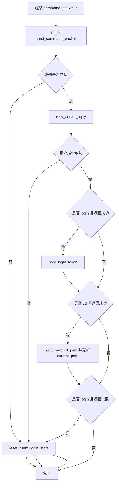

这张图说明：

> 短命令虽然都走主连接，但登录、`cd` 这两类命令还会额外引起本地状态变化

也就是说，客户端主连接上下文不是静态数据，而是随着命令不断更新。

---

## 7. 服务端 `epoll` 主循环活动图

这张图是整套 V4 里最关键的一张活动图，因为所有服务端连接最终都先经过这里。

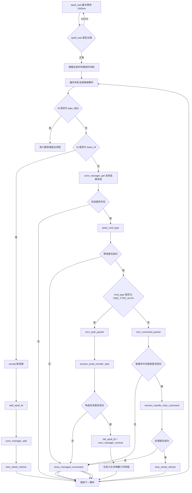

## 7.1 这张图的核心意义

这张图说明 V4 服务端主线程已经同时承担了四件事：

1. 监听退出信号
2. 接收新连接
3. 处理短命令
4. 识别并分发长命令

### 7.1.1 为什么先 `peek_cmd_type()`

关键代码：

```c
ret = recv(client_fd, cmd_type, sizeof(int), MSG_PEEK | MSG_WAITALL);
```

这一步的目的不是读取完整协议，而是先回答一个问题：

> 这条连接后面是普通命令，还是认证包

只有先回答这个问题，主线程才知道后面应该：

1. 把它当 `command_packet_t` 去收
2. 还是把它当 `auth_packet_t` 去收

### 7.1.2 连接为什么一开始都要先进入 `ConnManager`

因为 `accept` 后主线程还不知道这条连接到底是什么用途。  
所以当前代码的做法是：

1. 新连接先登记默认状态
2. 先刷新一次时间轮位置
3. 等它真正发来第一包以后，再判断是短命令连接还是传输连接

这和后面时序图、状态图里的状态变化是能对上的。

---

## 8. 主线程短命令处理活动图

短命令最终进入的是 `session_handle_main_command()`。

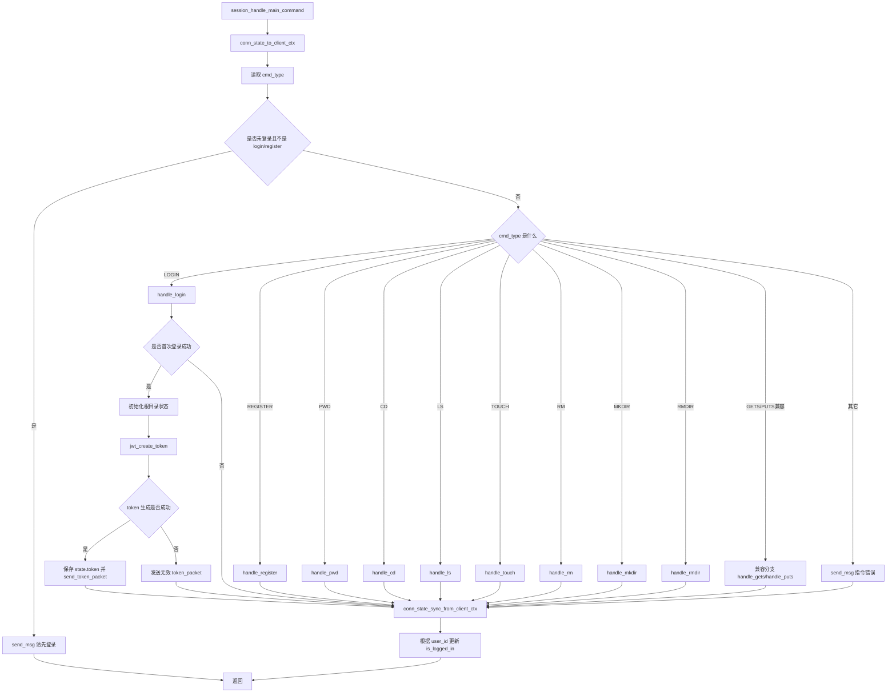

### 8.1 短命令处理流程的三个关键点

#### A. 主线程处理前先把连接状态转成 `ClientContext`

```c
if (conn_state_to_client_ctx(state, &ctx) != 0) {
    return -1;
}
```

这说明业务层仍然围绕 `ClientContext` 工作。  
只是 V4 里主线程长期保存的是 `ServerConnState`，每次进入业务函数前再临时转换。

#### B. 登录成功后不只是返回文本，还要额外下发 token

```c
if (jwt_create_token(...) == 0) {
    strncpy(state->token, token, sizeof(state->token) - 1);
    init_token_packet(&token_packet, state->token, 1);
    send_token_packet(client_fd, &token_packet);
}
```

也就是说，主连接短命令链里已经嵌入了后续长命令链要用的认证材料。

#### C. 处理完命令后还要把结果写回连接状态

```c
if (conn_state_sync_from_client_ctx(state, &ctx) != 0) {
    return -1;
}
```

这一步决定了：

1. `cd` 之后新的路径会保存下来
2. 后续短命令还能接着在新的目录状态上工作
3. 后续传输连接也能依赖这个主连接上下文

---

## 9. 上传 `puts` 全流程活动图

## 9.1 客户端上传分支活动图

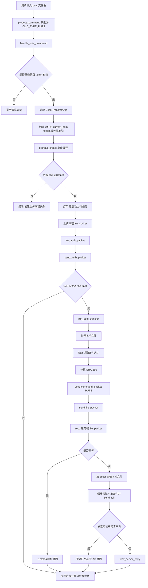

### 9.1.1 这条图里最值得注意的四个阶段

#### A. 客户端主线程只负责“启动任务”

真正执行上传的是后台线程，不是主线程。

#### B. 后台线程在真正上传前，先做认证

```c
init_auth_packet(&auth_packet, CMD_TYPE_PUTS, transfer_args->current_path, transfer_args->token);
send_auth_packet(sock_fd, &auth_packet);
```

#### C. 上传协议本体仍然保留 V3 的两段结构

认证完成后，才继续发送：

1. `command_packet_t`
2. `file_packet_t`
3. 文件内容

#### D. 上传过程中断时，不会把整个流程当成致命错误

代码里明确写了：

```c
if (send_full(sock_fd, buf, nread) == -1) {
    printf("上传中断，已经发送的内容由服务端自己保留。\n");
    ...
    return 0;
}
```

这说明当前设计允许上传中途中断，后续再通过续传继续。

---

## 9.2 服务端上传接入活动图

上传连接到服务端以后，先走的是主线程分流链，而不是直接进入 `handle_puts()`。

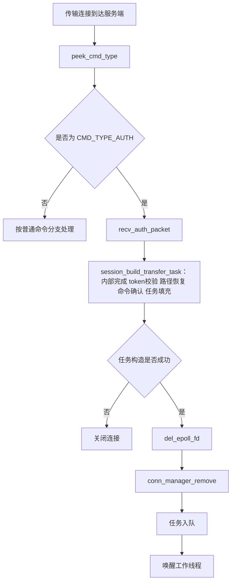

### 9.2.1 为什么上传不能直接进入工作线程

因为工作线程只适合处理“已经整理好的传输任务”。  
如果把下面这些步骤也扔给工作线程：

1. token 校验
2. 路径恢复
3. `command_packet_t` 二次确认

那线程池又会重新变得很重。

所以当前设计明确把“前置整理”留在主线程里。  
需要注意的是，实际代码里这些步骤都封装在 `session_build_transfer_task()` 内部完成；上面的活动图用一个黑盒把这段整理流程概括出来，避免把函数内部失败分支和主线程外层调度混在一张图里。

---

## 10. 下载 `gets` 全流程活动图

## 10.1 客户端下载分支活动图

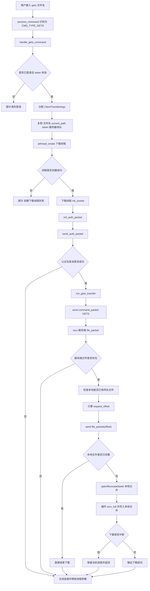

### 10.1.1 下载流程和上传流程的差别

上传时，客户端先告诉服务端“我本地文件多大、哈希是什么”；  
下载时，客户端先等服务端告诉自己“服务器文件多大”，然后再决定续传偏移。

所以二者虽然都属于长命令，但中间活动并不对称。

---

## 10.2 服务端下载接入活动图

下载连接进入服务端前半段，和上传几乎完全一致：

1. 主线程先识别 `CMD_TYPE_AUTH`
2. 校验 JWT
3. 恢复目录上下文
4. 再收真正的 `GETS` 命令包
5. 入队给工作线程

因此这里不再重复画一张与上传接入几乎相同的图。  
真正不同的地方，发生在工作线程里执行 `handle_gets()` 的阶段。

---

## 11. 工作线程执行传输任务活动图

无论是上传还是下载，任务一旦入队，工作线程的活动骨架都是统一的。

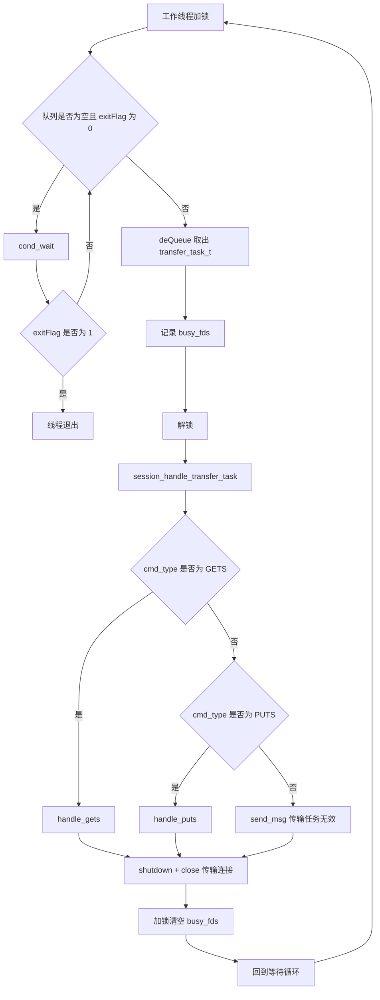

### 11.1 这张图的重点

#### A. 工作线程不知道“主连接会话”

工作线程只拿到：

```c
transfer_task_t task;
```

它并不参与：

1. 登录认证
2. token 下发
3. 主连接超时管理
4. `epoll` 事件分流

#### B. 工作线程只负责“把任务做完”

对应代码：

```c
session_handle_transfer_task(&task);
shutdown(task.client_fd, SHUT_RDWR);
close(task.client_fd);
```

这说明一条传输连接的生命周期，在工作线程里是一次性的。

---

## 12. 时间轮超时处理活动图

V4 时间轮负责的是主连接超时，不是传输线程内部的文件收发超时。

## 12.1 时间轮刷新活动图

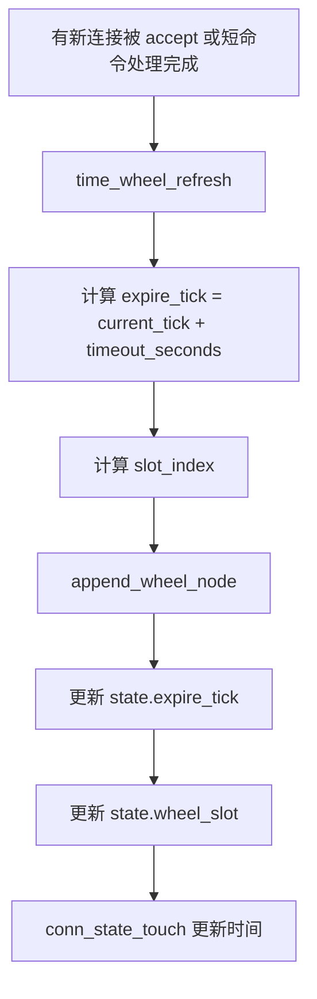

### 12.1.1 哪些情况会刷新

当前代码里，至少有两类时机会刷新：

1. `accept` 到新连接之后
2. 主线程成功处理完一条普通命令之后

对应 `server.c` 里的位置：

```c
time_wheel_refresh(&time_wheel, state);
```

### 12.1.2 为什么传输连接也会先刷新一次

因为刚 `accept` 的时候，主线程还没看首包。  
所以它暂时不知道这是主连接还是传输连接。

当前代码的顺序是：

1. 新连接先登记状态
2. 先放进时间轮
3. 等看到首包是 `CMD_TYPE_AUTH` 后
4. 再从 `ConnManager` 移除

所以最终效果仍然是：

> 长期受时间轮管理的是主连接  
> 传输连接只是短暂经过这一套入口流程

---

## 12.2 时间轮推进活动图

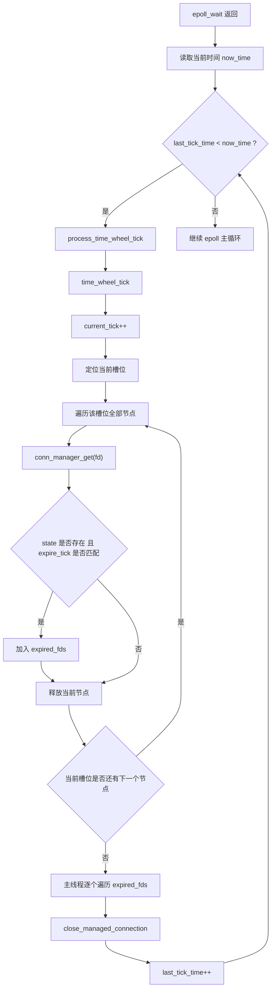

### 12.2.1 这条流程解决了什么问题

它解决的是：

> 主连接长时间没有任何短命令活动时，服务端如何自动把它清掉

在当前项目里，这个机制带来的直接表现就是：

1. 服务端会关闭超时主连接
2. 客户端在下一次发命令时发现主连接失效
3. 客户端自动回到重新登录流程

---

## 13. 主连接失效后的客户端重连活动图

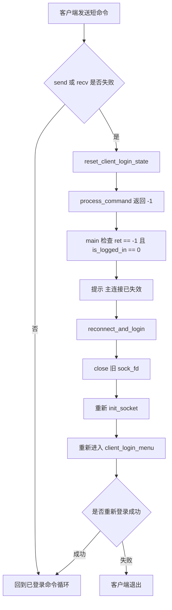

### 13.1 为什么这条图很关键

因为它把“时间轮超时断开”这一侧的服务端行为，和客户端用户可见行为接上了。

服务端只负责：

1. 找出超时主连接
2. 关闭它

客户端负责：

1. 在真正发命令时发现这条主连接已经不可用
2. 清理本地登录态
3. 重新连服务端
4. 重新登录

这样两个方向拼起来，整个功能才完整。

---

## 14. 把几条主链路连起来看

如果把前面的活动图压缩成一句话，V4 当前代码的主运行方式可以概括成下面这张图：

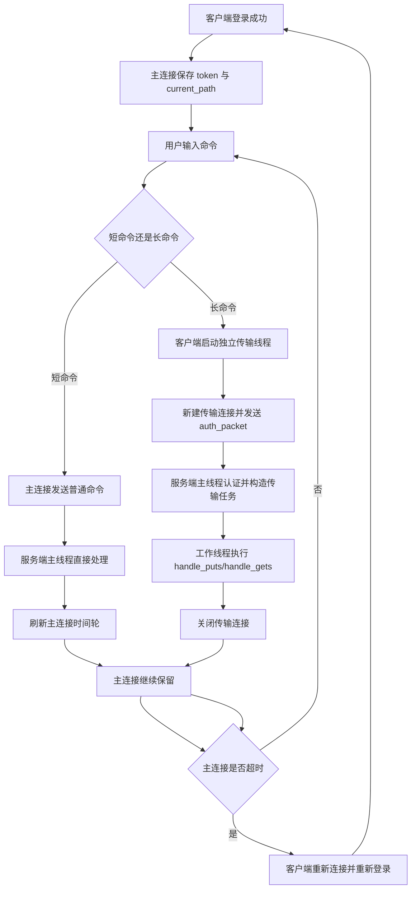

这张图把 V4 当前最核心的四个设计同时串起来了：

1. 长短命令分离
2. JWT 认证传输连接
3. 线程池任务化
4. 时间轮超时断开与重连

---

## 15. 本文对应代码索引

如果你想按图回看代码，建议按下面顺序读：

1. [server.c](/home/liwenshuo/my_project/WindCloud_V4/src/server/server.c:1)
对应服务端启动、`epoll` 主循环、时间轮推进、退出流程。

2. [session.c](/home/liwenshuo/my_project/WindCloud_V4/src/server/session.c:1)
对应短命令处理、传输任务构造、工作线程任务分发。

3. [worker.c](/home/liwenshuo/my_project/WindCloud_V4/src/server/worker.c:1)
对应线程池里一次传输任务的执行骨架。

4. [time_wheel.c](/home/liwenshuo/my_project/WindCloud_V4/src/server/time_wheel.c:1)
对应超时位置刷新和时间轮推进。

5. [client.c](/home/liwenshuo/my_project/WindCloud_V4/src/client/client.c:1)
对应客户端启动、登录菜单、已登录主循环、重连。

6. [client_command_handle.c](/home/liwenshuo/my_project/WindCloud_V4/src/client/client_command_handle.c:1)
对应命令解析、参数校验、长短命令分流、登录后 token 接收、`cd` 后路径更新。

7. [client_puts.c](/home/liwenshuo/my_project/WindCloud_V4/src/client/client_puts.c:1)
对应上传线程、认证包发送、上传活动。

8. [client_gets.c](/home/liwenshuo/my_project/WindCloud_V4/src/client/client_gets.c:1)
对应下载线程、认证包发送、下载活动。

---

## 16. 一句话总结

如果只从活动图角度理解当前 V4，可以把它概括成下面这句话：

> 客户端先通过主连接完成登录并保存 token；此后普通命令继续走主连接，由服务端主线程直接处理并刷新主连接超时位置；`puts/gets` 则由客户端启动独立线程建立独立传输连接，服务端主线程先完成认证和任务整理，再交给工作线程执行；主连接若因长时间无活动被时间轮关闭，客户端会在下一次命令失败后重新建立主连接并重新登录。
