# WindCloud_V4 全流程状态图详解

## 1. 文档目标

这份文档专门用**状态图**来解释当前 V4 代码中的核心对象是如何变化的。

这三份“全流程图解”文档的分工如下：

1. [V4全流程活动图详解.md](/home/liwenshuo/my_project/WindCloud_V4/docs/V4全流程活动图详解.md:1)
   重点看流程骨架、判断分支和循环结构。
2. [V4全流程时序图详解.md](/home/liwenshuo/my_project/WindCloud_V4/docs/V4全流程时序图详解.md:1)
   重点看模块交互顺序、协议包顺序和调用顺序。
3. [V4全流程状态图详解.md](/home/liwenshuo/my_project/WindCloud_V4/docs/V4全流程状态图详解.md:1)
   重点看核心对象的状态变化和状态切换条件。

如果说：

- 活动图主要讲“流程怎么走”
- 时序图主要讲“谁先和谁交互”

那么状态图主要讲：

> 某个对象在运行过程中，会处于哪些状态  
> 它为什么会从状态 A 进入状态 B  
> 哪段代码负责触发这次变化

这份文档重点覆盖下面这些对象：

1. 客户端 `ClientAppContext`
2. 服务端 `ServerConnState`
3. 主连接
4. 独立传输连接
5. `transfer_task_t`
6. 工作线程
7. 时间轮节点
8. 上传任务状态
9. 下载任务状态
10. 客户端登录态与重连态

本文主要对应这些代码文件：

- `include/client_command_handle.h`
- `src/client/client.c`
- `src/client/client_command_handle.c`
- `src/client/client_puts.c`
- `src/client/client_gets.c`
- `include/conn_manager.h`
- `src/server/conn_manager.c`
- `src/server/server.c`
- `src/server/session.c`
- `src/server/worker.c`
- `include/queue.h`
- `src/server/time_wheel.c`

---

## 2. 阅读状态图的方法

### 2.1 状态图看什么

状态图最适合回答下面这类问题：

- 一个对象刚创建时有哪些初始字段
- 什么时候算“已登录”
- 什么时候从“主连接状态”切到“传输任务状态”
- 时间轮节点为什么会失效
- 工作线程从空闲到忙碌，再回到空闲，具体是怎么切换的

### 2.2 当前项目里“状态”通常有两种来源

当前代码中的状态变化，主要来自两类信息：

#### A. 显式字段

例如：

- `ClientAppContext.is_logged_in`
- `ClientAppContext.token`
- `ServerConnState.user_id`
- `ServerConnState.expire_tick`
- `thread_pool_t.busy_fds[i]`

这些字段本身就是状态的一部分。

#### B. 对象当前所处的位置

例如：

- 一个连接还在 `epoll + ConnManager` 中
- 一个传输连接已经从 `ConnManager` 移除并变成 `transfer_task_t`
- 一个任务已经在队列里，还是已经被工作线程取走

这类状态不是单一字段，而是“这个对象现在被哪个模块持有”。

---

## 3. 先看 V4 的总体状态关系

先用一张总状态图把几个核心对象的关系放在一起。

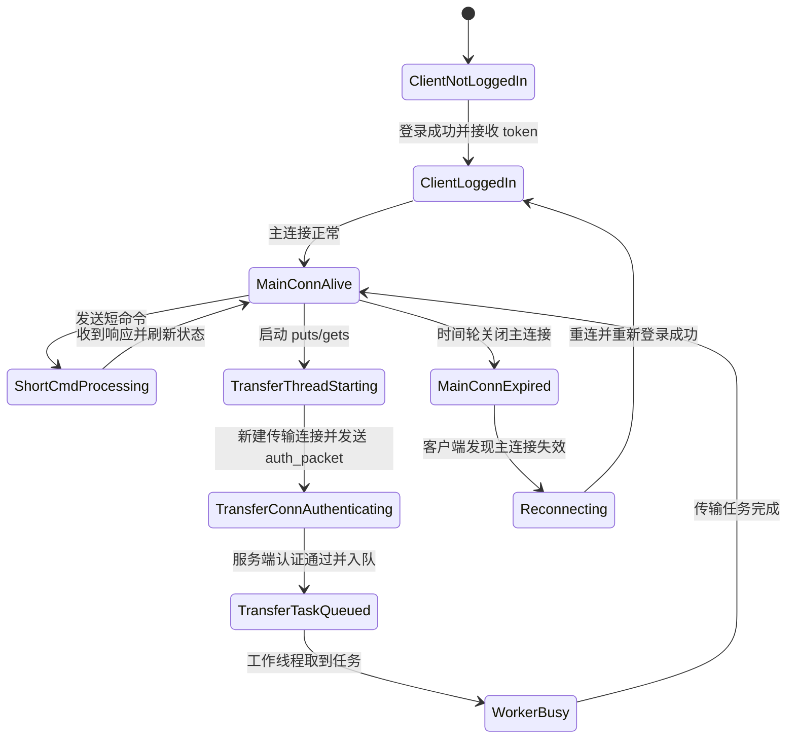

这张图强调的是：

1. 主连接状态是一条长期状态线
2. 传输连接状态是一条短生命周期状态线
3. 工作线程只在传输任务出现时才进入忙碌状态

---

## 4. `ClientAppContext` 的状态图

`ClientAppContext` 定义在 [client_command_handle.h](/home/liwenshuo/my_project/WindCloud_V4/include/client_command_handle.h:1)：

```c
typedef struct {
    int sock_fd;
    int is_logged_in;
    char current_path[CMD_DATA_LEN];
    char token[TOKEN_LEN];
    char server_ip[64];
    char server_port[32];
} ClientAppContext;
```

它是客户端主线程长期维护的状态对象。

## 4.1 `ClientAppContext` 总状态图

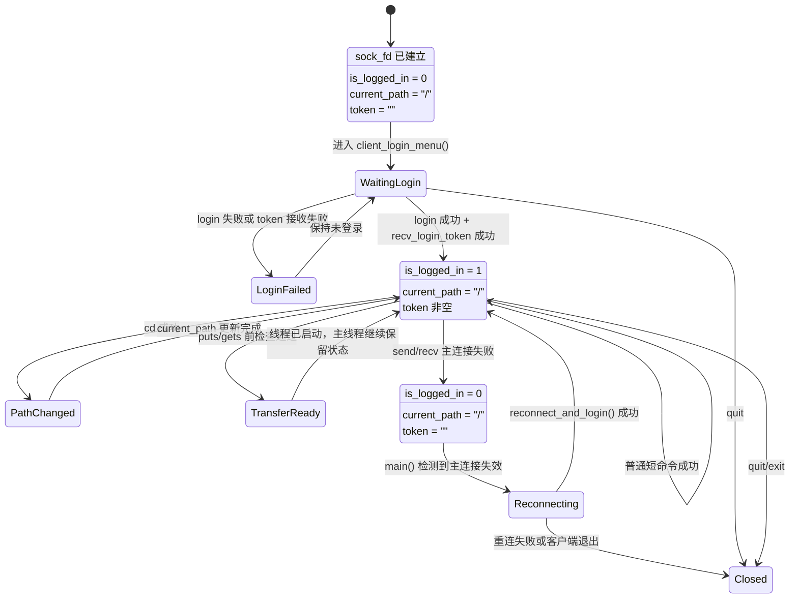

## 4.2 `ClientAppContext` 的关键状态切换

### 4.2.1 初始化态

由 `client_app_context_init()` 触发：

```c
memset(ctx, 0, sizeof(ClientAppContext));
ctx->sock_fd = sock_fd;
strcpy(ctx->current_path, "/");
```

所以它刚创建时的特征是：

1. 已有主连接 fd
2. 还没有登录
3. 当前路径先按根目录处理
4. token 为空

### 4.2.2 登录成功态

由 `recv_login_token()` 触发：

```c
strncpy(ctx->token, token_packet.token, sizeof(ctx->token) - 1);
ctx->is_logged_in = 1;
strcpy(ctx->current_path, "/");
```

所以从“未登录”切到“已登录”，不是只看服务端文本里有没有“登录成功”，而是还要满足：

1. 服务端文本响应成功
2. 客户端成功收到有效 `token_packet_t`

### 4.2.3 路径变化态

由 `handle_normal_command()` 中的 `cd` 成功分支触发：

```c
if (cmd_type == CMD_TYPE_CD && ret == 1) {
    build_next_cd_path(...);
    strncpy(ctx->current_path, next_path, ...);
}
```

这里说明：

> 客户端当前路径不是服务端主动推送过来的  
> 而是客户端根据 `cd` 参数和结果，自行同步维护的

### 4.2.4 登录态重置

由 `reset_client_login_state()` 触发：

```c
ctx->is_logged_in = 0;
strcpy(ctx->current_path, "/");
ctx->token[0] = '\0';
```

这会在两类情况发生：

1. 登录失败
2. 主连接收发失败

需要注意的是，`reconnect_and_login()` 这个函数内部会重新进入一次 `client_login_menu()`；但它只有在重新登录成功后才返回给 `main()`，所以从外层主循环看，`Reconnecting` 结束后会直接回到 `LoggedIn`。

---

## 5. `ServerConnState` 的状态图

`ServerConnState` 定义在 [conn_manager.h](/home/liwenshuo/my_project/WindCloud_V4/include/conn_manager.h:1)：

```c
typedef struct ServerConnState {
    int fd;
    int is_logged_in;
    int user_id;
    int current_dir_id;
    int wheel_slot;
    unsigned long long expire_tick;
    time_t last_active_time;
    char current_path[CMD_DATA_LEN];
    char token[TOKEN_LEN];
    struct ServerConnState *next;
} ServerConnState;
```

它是服务端主线程维护的“连接级状态”。

## 5.1 `ServerConnState` 总状态图

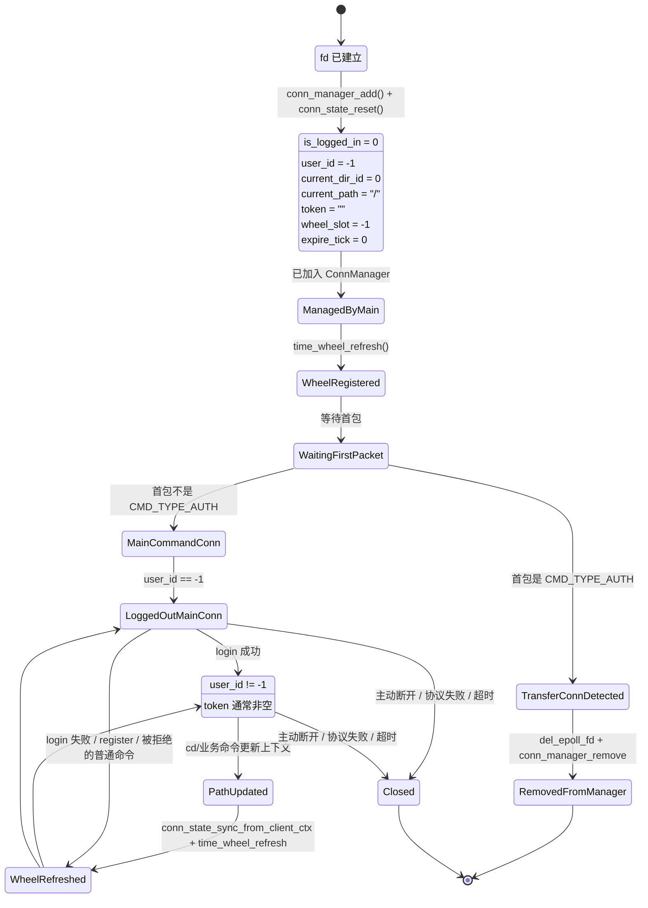

## 5.2 `ServerConnState` 的核心状态切换

### 5.2.1 新连接默认态

由 `conn_manager_add()` 触发：

```c
node = (ServerConnState *)calloc(1, sizeof(ServerConnState));
node->fd = fd;
conn_state_reset(node);
```

而 `conn_state_reset()` 会设置：

```c
state->is_logged_in = 0;
state->user_id = -1;
state->current_dir_id = 0;
state->wheel_slot = -1;
state->expire_tick = 0;
strcpy(state->current_path, "/");
state->token[0] = '\0';
```

所以“新连接默认态”的含义非常明确：

1. 已经有 fd
2. 还没有身份
3. 当前目录先按根目录
4. 还没进入时间轮有效位置

### 5.2.2 登录成功态

在 `session_handle_main_command()` 里，登录成功后会先更新 `ClientContext`，再回写到 `ServerConnState`：

```c
ctx.user_id != -1
...
conn_state_sync_from_client_ctx(state, &ctx);
if (state->user_id != -1) {
    state->is_logged_in = 1;
}
```

并且还会保存 token：

```c
strncpy(state->token, token, sizeof(state->token) - 1);
```

因此 `ServerConnState` 在登录成功后，才真正变成“已登录主连接状态”。  
不过还要注意一个细节：如果账号密码校验成功、但 `jwt_create_token()` 失败，服务端仍然会把这条主连接视为已登录，只是 `state->token` 会保持为空字符串。

### 5.2.3 传输连接识别态

一个很容易误解的地方是：

> 独立传输连接在 `accept` 的那一刻，也会先生成 `ServerConnState`

但它不会长期保留。

在 `server.c` 中，一旦识别到：

```c
if (cmd_type == CMD_TYPE_AUTH) {
    ...
    del_epoll_fd(epfd, fd);
    conn_manager_remove(&conn_manager, fd);
}
```

这条连接就会从“主线程维护的连接状态对象”转换成“线程池任务”，不再继续作为 `ServerConnState` 存活。

---

## 6. 主连接的状态图

这里的“主连接”不是某个结构体，而是“客户端长期保留、服务端主线程长期管理”的那条连接。

## 6.1 主连接生命周期状态图

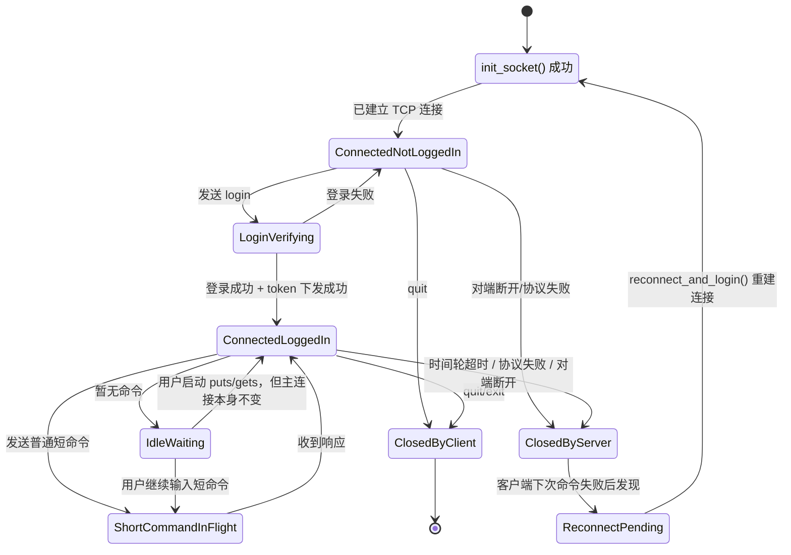

## 6.2 主连接状态与传输连接状态的边界

主连接的一个核心特点是：

> 它不会因为 `puts/gets` 启动就切换成“传输中”状态

因为当前 V4 的设计是：

- 主连接继续保持在“已登录、可发短命令”的状态
- `puts/gets` 自己另开独立传输连接

这也是 V4 相比 V3 最核心的状态拆分。

---

## 7. 独立传输连接的状态图

独立传输连接的生命周期比主连接短很多。

## 7.1 传输连接生命周期状态图

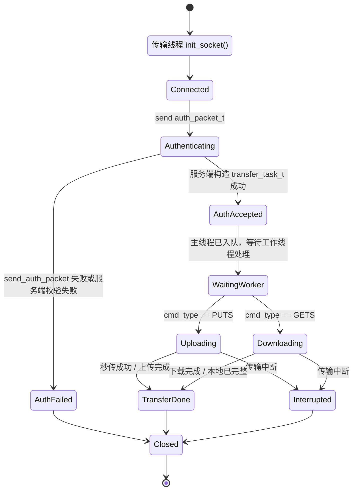

## 7.2 传输连接有一个关键“身份切换点”

在服务端主线程识别到 `CMD_TYPE_AUTH` 之前，这条连接还只是：

> 一个刚接入的新 fd

在 `session_build_transfer_task()` 成功之后，这条连接才真正变成：

> 一个已经携带用户身份和目录上下文的传输连接

这个切换点，是 V4 长短命令分离的关键。

---

## 8. `transfer_task_t` 的状态图

`transfer_task_t` 定义在 [queue.h](/home/liwenshuo/my_project/WindCloud_V4/include/queue.h:1)：

```c
typedef struct{
    int client_fd;
    int cmd_type;
    ClientContext ctx;
    char arg[CMD_DATA_LEN];
}transfer_task_t;
```

它是当前 V4 中最典型的“任务级状态对象”。

## 8.1 `transfer_task_t` 生命周期状态图

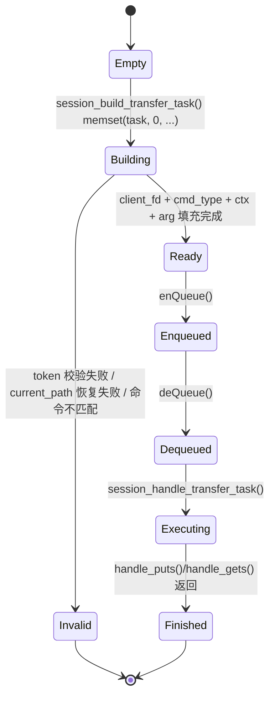

## 8.2 这张状态图的意义

它说明线程池现在处理的不是“连接”，而是：

> 已经包含完整传输上下文的一次任务

任务一旦进入 `Ready` 状态，就已经具备：

1. 执行这次传输要用的 fd
2. 这次是 `PUTS` 还是 `GETS`
3. 这次属于哪个用户
4. 当前逻辑路径和目录节点是什么
5. 本次命令参数是什么

所以工作线程不再需要自己恢复这些信息。

---

## 9. 工作线程的状态图

工作线程入口在 [worker.c](/home/liwenshuo/my_project/WindCloud_V4/src/server/worker.c:1)。

## 9.1 工作线程状态图

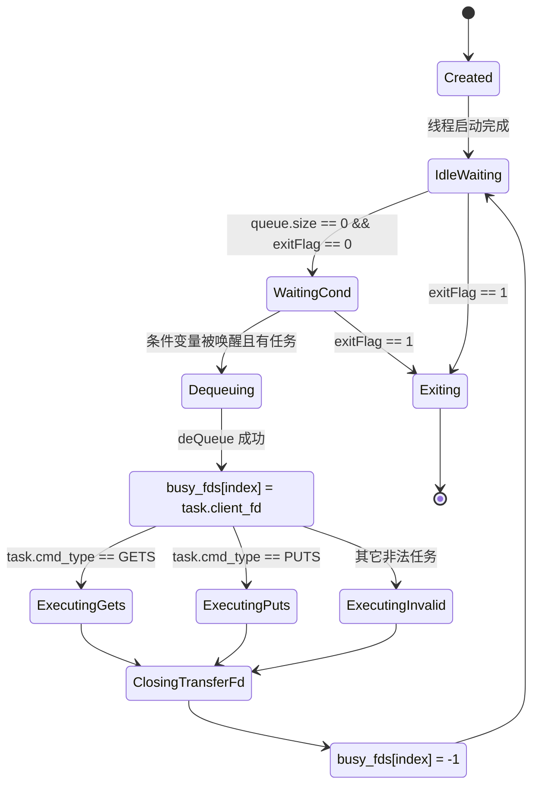

## 9.2 `busy_fds` 是工作线程状态的一部分

`thread_pool_t` 中有：

```c
int *busy_fds;
```

这个数组的意义不是普通缓存，而是：

> 主线程用于感知“哪个工作线程当前手里有传输连接”

状态切换位置非常明确：

开始处理任务前：

```c
pool->busy_fds[worker_index] = task.client_fd;
```

处理结束后：

```c
pool->busy_fds[worker_index] = -1;
```

所以工作线程的“空闲 / 忙碌”状态，可以直接通过 `busy_fds[index]` 判断。

---

## 10. 时间轮节点的状态图

`TimeWheelNode` 定义在 [time_wheel.h](/home/liwenshuo/my_project/WindCloud_V4/include/time_wheel.h:1)：

```c
typedef struct TimeWheelNode {
    int fd;
    unsigned long long expire_tick;
    struct TimeWheelNode *next;
} TimeWheelNode;
```

## 10.1 时间轮节点状态图

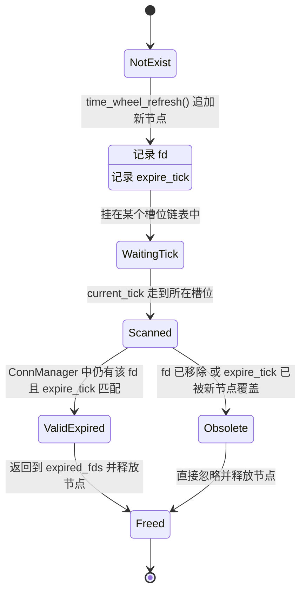

## 10.2 为什么旧节点不会误杀新连接

这是当前时间轮实现最重要的理解点之一。

服务端当前不是“移动原节点”，而是：

1. 每次刷新都追加一个新节点
2. 节点里记录当时的 `expire_tick`
3. 真正扫描时，再去比对：

```c
state->fd == cur->fd &&
state->expire_tick == cur->expire_tick
```

所以旧节点即使还留在旧槽位里，只要当前连接已经被刷新到更晚的 `expire_tick`，旧节点就会变成：

> `Obsolete` 状态

然后被安全忽略。

---

## 11. 上传任务的状态图

这里说的“上传任务状态”，不是单一结构体，而是一次 `puts` 业务从认证到结束的业务状态。

## 11.1 上传任务状态图

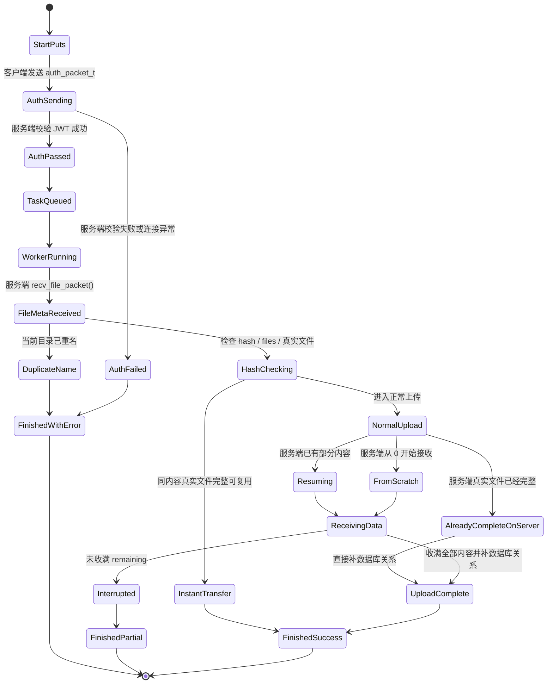

## 11.2 上传任务里有三个容易混淆的结束态

### A. `InstantTransfer`

也就是秒传成功。  
特点是：

1. 客户端不再发送真实文件内容
2. 服务端只补逻辑节点和引用计数

### B. `UploadComplete`

也就是服务端确认这次上传已经完成。  
特点是：

1. 可能是本次连接收满了全部剩余字节
2. 也可能是服务端真实文件本来就已经完整，只需要补数据库关系
3. 最终都会补齐 `files` 和 `paths`

### C. `FinishedPartial`

这不是完整成功，但也不是彻底失败。  
特点是：

1. 本次连接中断
2. 已收到的内容被保留
3. 下次还可以继续续传

---

## 12. 下载任务的状态图

## 12.1 下载任务状态图

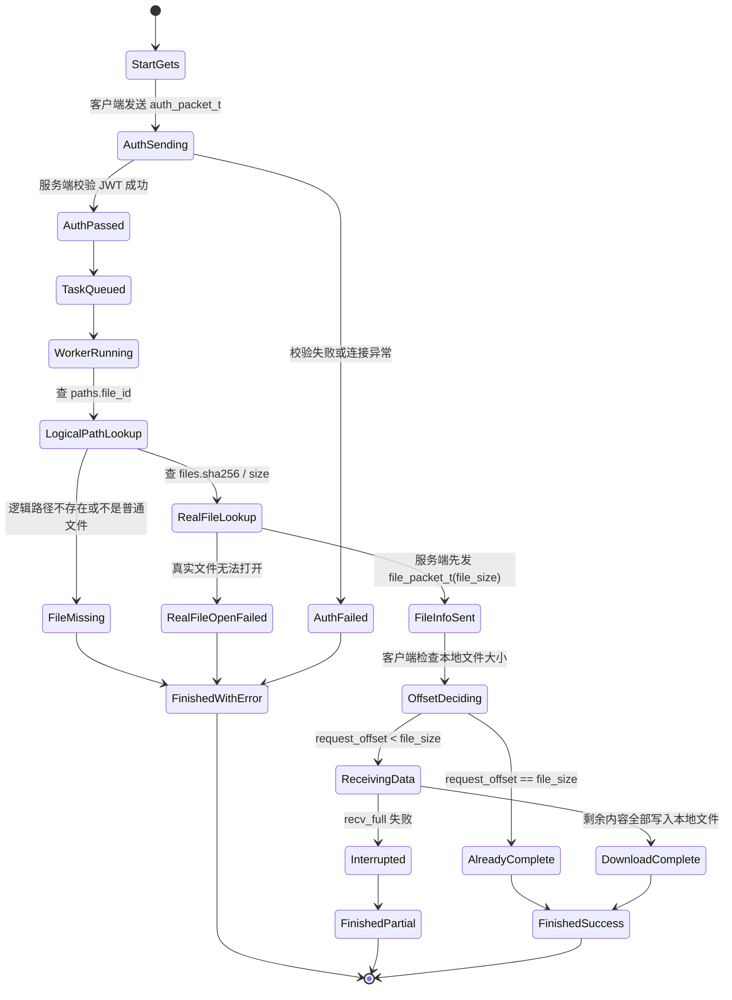

## 12.2 下载任务比上传任务更依赖客户端本地状态

因为下载续传偏移不是服务端决定的，而是客户端根据本地文件现状决定的。

所以下载任务里多了一个很重要的状态：

> `OffsetDeciding`

它由客户端本地文件状态驱动，而不是由服务端数据库状态直接驱动。

---

## 13. 客户端登录态和重连态的状态图

虽然前面已经单独讲过 `ClientAppContext` 和主连接，这里再用一张“用户视角”的状态图把登录与重连拼起来。

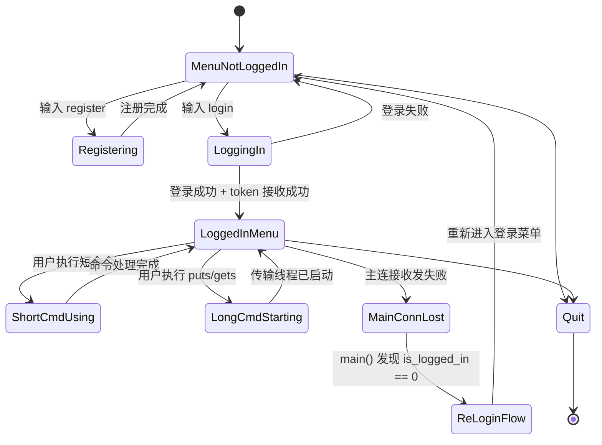

## 13.1 这张图的作用

它不是为了讲字段，而是为了回答一个更直观的问题：

> 用户在客户端看到的状态变化，和代码中的哪些状态变化是一一对应的

例如：

- “未登录菜单” 对应 `is_logged_in = 0`
- “已登录命令循环” 对应 `is_logged_in = 1 && token 非空`
- “主连接已失效，请重新登录” 对应 `reset_client_login_state()` 已执行

---

## 14. 把三类状态对象放在一起比较

为了避免混淆，最后把三个最核心的状态对象放在一起比较。

| 对象 | 所在位置 | 生命周期 | 核心作用 |
| --- | --- | --- | --- |
| `ClientAppContext` | 客户端主线程 | 长 | 保存主连接、登录态、当前路径、token |
| `ServerConnState` | 服务端主线程 | 中 | 保存主连接的服务端状态、时间轮信息、当前目录、token |
| `transfer_task_t` | 主线程到工作线程之间 | 短 | 描述一次上传或下载任务的完整执行上下文 |

可以把它们理解成：

1. `ClientAppContext` 管客户端长期状态
2. `ServerConnState` 管服务端主连接长期状态
3. `transfer_task_t` 管一次长命令任务的短期状态

当前 V4 能保持结构清晰，很大程度上就是因为这三类状态对象被分开了。

---

## 15. 建议配套阅读顺序

如果你要对着状态图回看代码，建议按这个顺序：

1. [client_command_handle.h](/home/liwenshuo/my_project/WindCloud_V4/include/client_command_handle.h:1)
先看 `ClientAppContext` 的字段定义。

2. [client_command_handle.c](/home/liwenshuo/my_project/WindCloud_V4/src/client/client_command_handle.c:1)
看登录态、路径状态、token 状态如何变化。

3. [client.c](/home/liwenshuo/my_project/WindCloud_V4/src/client/client.c:1)
看登录菜单、已登录主循环、重连流程这些大状态如何切换。

4. [conn_manager.h](/home/liwenshuo/my_project/WindCloud_V4/include/conn_manager.h:1) 和 [conn_manager.c](/home/liwenshuo/my_project/WindCloud_V4/src/server/conn_manager.c:1)
看 `ServerConnState` 的字段和默认状态。

5. [server.c](/home/liwenshuo/my_project/WindCloud_V4/src/server/server.c:1)
看主连接如何从“新连接”进入“短命令连接”或“传输连接”。

6. [session.c](/home/liwenshuo/my_project/WindCloud_V4/src/server/session.c:1)
看 `ServerConnState` 如何转成 `ClientContext`，以及 `transfer_task_t` 如何构造。

7. [worker.c](/home/liwenshuo/my_project/WindCloud_V4/src/server/worker.c:1)
看工作线程“等待 -> 忙碌 -> 回到等待”的状态转换。

8. [time_wheel.h](/home/liwenshuo/my_project/WindCloud_V4/include/time_wheel.h:1) 和 [time_wheel.c](/home/liwenshuo/my_project/WindCloud_V4/src/server/time_wheel.c:1)
看时间轮节点状态为什么不会误判。

---

## 16. 一句话总结

从状态图角度看，当前 V4 的核心变化可以概括成一句话：

> V4 不再把“一个客户端连接的全部生命周期”都交给某个工作线程，而是把长期状态留在客户端 `ClientAppContext` 和服务端 `ServerConnState` 里，把短生命周期的上传下载执行态抽成 `transfer_task_t` 交给工作线程，同时用时间轮单独管理主连接的超时状态。
