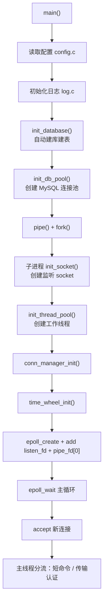
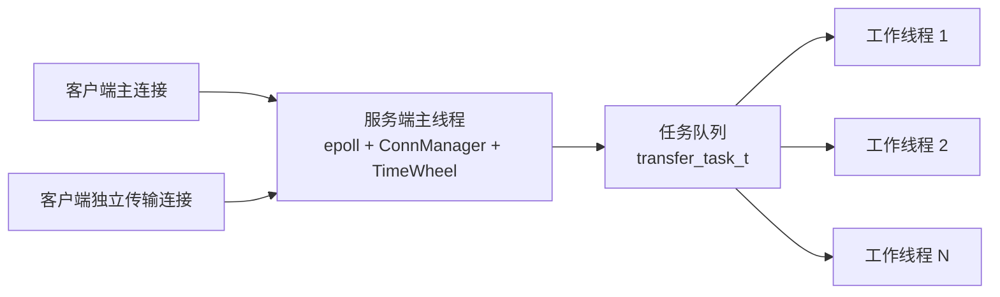
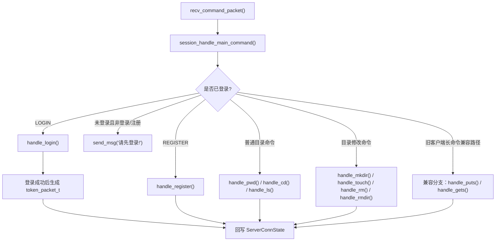
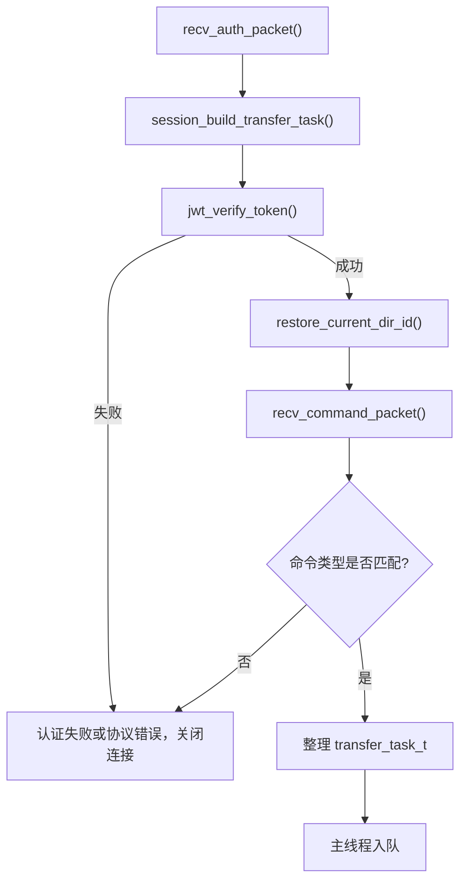
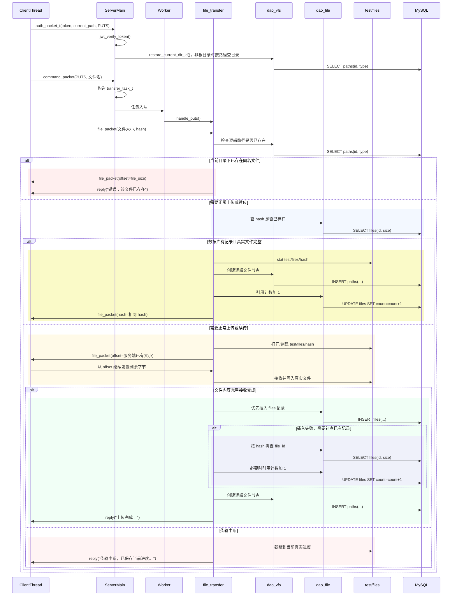
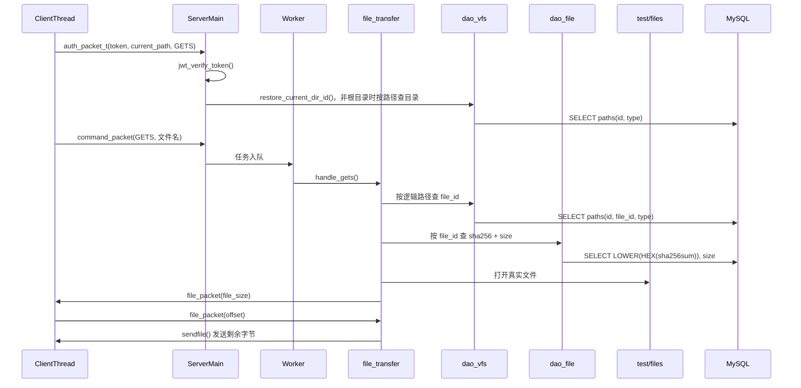
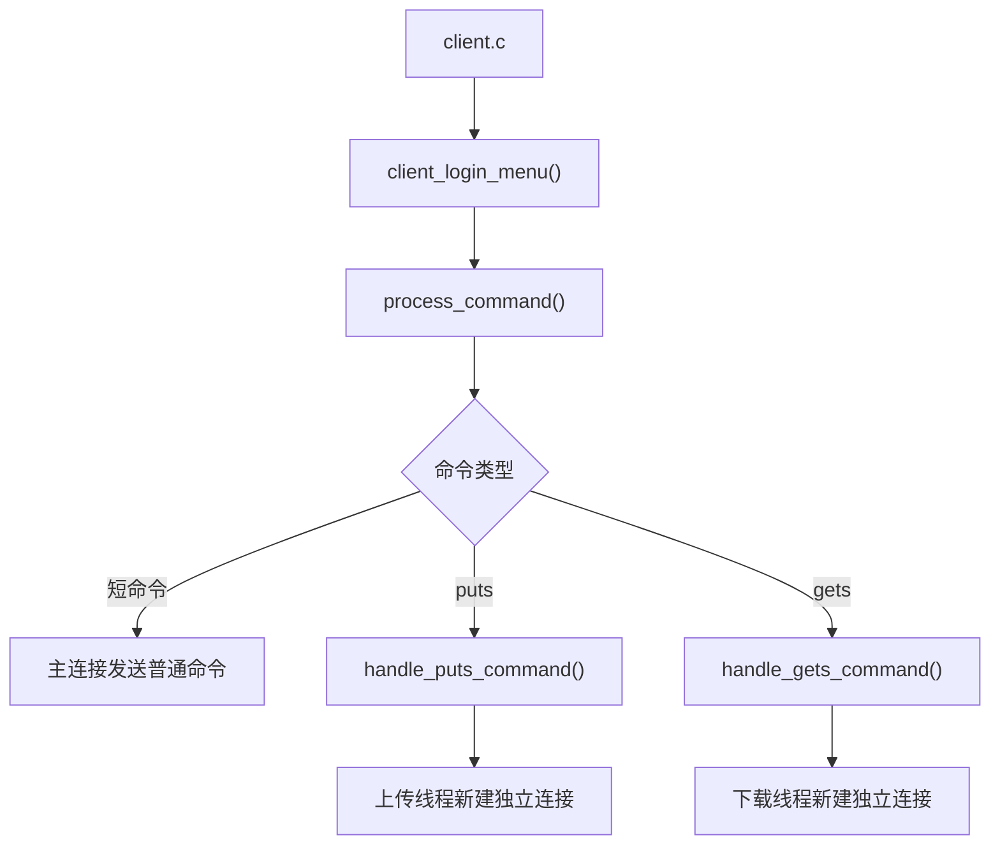

# WindCloud_V4 整体项目架构详解

## 1. 文档目标

这份文档不是“理想化分层图”，而是基于当前仓库代码的**真实实现**来解释：

1. V4 相比 V3 在架构上真正发生了哪些变化
2. 客户端和服务端分别由哪些模块组成
3. 主连接、独立传输连接、线程池、JWT、时间轮分别负责什么
4. 一条短命令、一条上传命令、一条下载命令分别经过哪些模块
5. 虚拟目录、真实文件、协议、数据库之间如何配合

当前版本已经包含：

- 登录 / 注册
- 虚拟目录命令：`pwd`、`cd`、`ls`、`mkdir`、`touch`、`rm`、`rmdir`
- 文件上传 `puts`
- 文件下载 `gets`
- 长短命令分离
- 独立传输连接认证
- 基于 HS256 的 JWT
- 空闲主连接超时断开
- 客户端主连接失效后的重新登录
- 断点续传
- 基于 SHA-256 的同内容文件复用

---

## 2. 总体架构总览

### 2.1 逻辑分层图


### 2.2 当前项目可以映射成的“推荐分层”

虽然仓库目录没有严格按层命名，但从职责上可以清楚映射到下面这组分层：

| 分层 | 当前模块 |
| --- | --- |
| 协议层 `protocol` | `include/protocol.h`、`src/common/protocol.c` |
| 主连接状态层 `conn/session/time_wheel` | `conn_manager.c`、`session.c`、`time_wheel.c` |
| 认证层 `auth/jwt` | `auth.c`、`jwt.c` |
| 业务层 `file_cmds/file_transfer` | `file_cmds.c`、`file_transfer.c` |
| DAO 层 `dao_user/dao_vfs/dao_file` | `dao_user.c`、`dao_vfs.c`、`dao_file.c` |
| 基建层 `thread_pool/db_pool/log/config/socket` | `thread_pool.c`、`worker.c`、`queue.c`、`db_pool.c`、`db_init.c`、`log.c`、`config.c`、`server_socket.c`、`epoll.c` |

这里最关键的理解是：

- **协议层**解决“网络上怎么发”
- **主连接状态层**解决“这个 fd 是谁、是否登录、当前在哪个目录”
- **认证层**解决“独立传输连接怎么识别用户身份”
- **业务层**解决“命令具体要做什么”
- **DAO 层**解决“数据库怎么查和改”
- **基建层**解决“线程、连接池、日志、配置、socket 怎么运转”

---

## 3. 目录与模块组织

### 3.1 源码目录

```text
include/
├── protocol.h
├── client_command_handle.h
├── client_socket.h
├── auth.h
├── jwt.h
├── conn_manager.h
├── time_wheel.h
├── session.h
├── file_cmds.h
├── file_transfer.h
├── dao_user.h
├── dao_vfs.h
├── dao_file.h
├── db_pool.h
├── db_init.h
├── thread_pool.h
├── queue.h
├── worker.h
├── server_socket.h
├── epoll.h
├── path_utils.h
├── config.h
├── log.h
└── sha256_utils.h

src/client/
├── client.c
├── client_command_handle.c
├── client_gets.c
├── client_puts.c
└── client_socket.c

src/server/
├── server.c
├── server_socket.c
├── epoll.c
├── thread_pool.c
├── worker.c
├── queue.c
├── session.c
├── auth.c
├── jwt.c
├── conn_manager.c
├── time_wheel.c
├── file_cmds.c
├── file_transfer.c
├── dao_user.c
├── dao_vfs.c
├── dao_file.c
├── db_pool.c
├── db_init.c
└── path_utils.c

src/common/
├── protocol.c
├── config.c
├── log.c
└── sha256_utils.c
```

### 3.2 V4 相比 V3 最重要的架构变化

V3 的核心特点是：

1. 一个客户端连接进入线程池
2. 一个工作线程长期服务这条连接
3. `puts/gets` 直接占用这条连接

V4 的核心特点是：

1. **主连接只处理短命令**
2. **上传下载改成独立传输连接**
3. **独立传输连接先用 JWT 做认证**
4. **线程池不再处理整条连接，而是处理一次传输任务**
5. **主线程用时间轮管理主连接超时**

因此当前项目本质上已经从：

> 连接级线程池服务模型

变成了：

> 主线程维护短命令会话 + 工作线程处理长命令任务 的混合模型

### 3.3 模块关系的一个关键事实

这个项目仍然不是“客户端直接操作 Linux 当前目录，服务端直接按用户目录保存文件”。

它始终维护两套系统：

1. **逻辑文件系统**
   - 面向用户
   - 保存到数据库 `paths`
   - 支持 `pwd`、`cd`、`ls`、`mkdir`、`touch`、`rm`、`rmdir`
2. **真实文件系统**
   - 面向服务端内部存储
   - 保存到 `test/files/<sha256>`
   - 不按用户名和目录存储，只按内容哈希存储

因此项目本质上仍然是：

> 协议驱动的虚拟文件系统 + 真实文件去重存储系统

V4 只是把“连接模型和认证链路”升级了。

---

## 4. 服务端架构详解

## 4.1 服务端启动链

服务端入口是 `src/server/server.c`。

启动顺序如下：



启动过程中几个特别重要的点：

### A. 服务端仍然是“父进程控制退出、子进程运行业务”

`server.c` 里依然保留了：

- `pipe()`
- `fork()`
- 父进程监听 `SIGINT`
- 父进程通过管道通知子进程退出

所以 V4 不是单进程死循环，而是沿用了 V3 的退出控制方式。

### B. `epoll` 的职责在 V4 扩大了

V3 里 `epoll` 主要负责：

1. 监听 `listen_fd`
2. 监听退出管道

V4 里 `epoll` 负责：

1. 监听 `listen_fd`
2. 监听退出管道
3. 监听所有主连接和独立传输连接
4. 让主线程可以先判断一个 fd 是普通命令连接还是认证连接

也就是说，当前 V4 不是“epoll 只做接入”，而是：

> `epoll` 负责连接接入和主线程分流，线程池负责执行长命令任务

### C. 服务端启动时会初始化三套关键状态

除了 V3 已有的监听 socket、线程池、数据库连接池，V4 额外初始化了：

1. `ConnManager`
2. `TimeWheel`
3. `JWT` 使用所需的协议和校验链路

这三者共同支撑：

- 主连接长期维护
- 独立传输连接认证
- 主连接超时断开

---

## 4.2 主线程、连接状态与任务模型

### 4.2.1 V4 并发模型



### 4.2.2 主线程现在负责什么

主线程的职责已经明显比 V3 重：

1. `accept()` 新连接
2. 把连接加入 `epoll`
3. 为新连接创建 `ServerConnState`
4. 先为新连接刷新一次超时位置，后续识别成传输连接时再移出状态管理
5. 用 `peek_cmd_type()` 预读首包命令类型
6. 普通连接上直接处理短命令
7. 认证连接上先校验 `auth_packet_t`
8. 构造 `transfer_task_t`
9. 把传输任务投递给线程池
10. 推进时间轮并关闭真正超时的主连接

### 4.2.3 工作线程现在负责什么

V4 中工作线程不再负责“服务整条连接直到断开”，而是：

1. 从队列中取出一条 `transfer_task_t`
2. 调用 `session_handle_transfer_task()`
3. 执行一次 `puts` 或 `gets`
4. 任务结束后关闭当前传输连接

所以当前线程池已经变成：

> 面向长命令任务的线程池

而不是：

> 面向整条连接会话的线程池

### 4.2.4 为什么说这是 V4 最大的结构变化

因为 V3 的主要问题就是：

- 上传下载时，一个工作线程会长期被某个连接占住
- 这个连接在文件传输间隙也会持续占线程
- 短命令和长命令混在一条连接里

V4 的变化是：

- 短命令交给主线程直接处理
- 长命令改成独立传输连接
- 线程池只接长命令

这样就把“慢任务”和“快任务”分开了。

---

## 4.3 主连接状态层：`conn_manager.c` + `time_wheel.c`

### 4.3.1 `ServerConnState` 是什么

当前定义在 `include/conn_manager.h`：

```c
typedef struct ServerConnState {
    int fd;
    int is_logged_in;
    int user_id;
    int current_dir_id;
    int wheel_slot;
    unsigned long long expire_tick;
    time_t last_active_time;
    char current_path[CMD_DATA_LEN];
    char token[TOKEN_LEN];
    struct ServerConnState *next;
} ServerConnState;
```

这个结构体保存的是**服务端主线程维护的连接状态**：

- `fd`
  - 当前连接 fd
- `is_logged_in`
  - 当前连接是否处于登录态
- `user_id`
  - 当前连接对应的用户 ID
- `current_path`
  - 当前逻辑路径
- `current_dir_id`
  - 当前目录节点 ID
- `token`
  - 登录成功后为该连接签发并缓存的 token
- `wheel_slot` / `expire_tick`
  - 当前连接在时间轮中的位置

它相当于把 V3 里“局部会话状态”提升成了“主线程长期维护的连接状态”。

### 4.3.2 `ConnManager` 的职责

`conn_manager.c` 负责：

1. 新连接加入时创建默认状态
2. 根据 fd 查找状态
3. 连接关闭时删除状态
4. 把 `ServerConnState` 转成 `ClientContext`
5. 把业务处理后的 `ClientContext` 同步回连接状态

当前实现使用的是单链表。

这不是追求极限性能的做法，但非常适合当前项目规模和当前代码风格：

- 结构直观
- 易于调试
- 不需要大改 V3 工程骨架

### 4.3.3 时间轮当前是怎样和连接配合的

从业务效果上看，时间轮最终只会持续作用在：

> 主连接

但从当前代码实现看，新 `accept()` 进来的连接都会先：

1. 建立 `ServerConnState`
2. 调用一次 `time_wheel_refresh()`

后面如果主线程发现该连接首包是 `CMD_TYPE_AUTH`，就会在构造完 `transfer_task_t` 后把它从 `ConnManager` 中移除。

这意味着：

1. 传输连接在“刚接入、尚未识别身份”这一小段时间里，也会先登记一次时间轮信息
2. 但一旦被识别为传输连接，就不会继续按主连接长期管理
3. 时间轮后续再扫到这类旧节点时，因为 `ConnManager` 中已经找不到对应状态，所以会自然跳过

因此更准确的说法是：

> 时间轮的长期管理对象是主连接  
> 传输连接只会在接入初期短暂经过同一套登记流程

### 4.3.4 时间轮如何工作

`time_wheel.c` 的核心逻辑是：

1. 新连接进入主线程时，先调用一次 `time_wheel_refresh()`
2. 如果后续识别为认证传输连接，则从 `ConnManager` 中移除，不再继续按主连接维护
3. 主连接每处理完一次短命令，再调用 `time_wheel_refresh()`
4. 主循环里每秒推进一次 `time_wheel_tick()`
5. 本轮槽位中的节点如果仍然和当前连接状态匹配，就判定为真正超时
6. 主线程关闭该连接，并从 `ConnManager` 中删除状态

当前时间轮不是复杂层级时间轮，而是：

> 固定槽位数 + 过期 tick 校验 的简单循环时间轮

这正符合当前项目“代码直观、改动尽量小”的目标。

---

## 4.4 会话层 `session.c`

`src/server/session.c` 仍然是整个服务端业务调度的枢纽，只是职责已经从 V3 的“整连接循环”变成了 V4 的“四段式”。

### 4.4.1 V4 会话层拆成了四个入口

当前 `session.c` 主要暴露：

1. `send_msg()`
2. `session_handle_main_command()`
3. `session_build_transfer_task()`
4. `session_handle_transfer_task()`

这四个函数刚好对应 V4 的四类动作：

- 普通文本响应
- 主连接短命令处理
- 独立传输连接认证与任务构造
- 工作线程里的长命令执行

### 4.4.2 主连接命令分发图



### 4.4.3 独立传输连接构造任务图



### 4.4.4 为什么 `session.c` 在 V4 里更关键

因为它现在要同时协调三种上下文：

1. `ServerConnState`
2. `ClientContext`
3. `transfer_task_t`

也就是说，V4 的会话层不仅要分发命令，还要负责：

- 主连接状态和业务上下文之间的转换
- token 校验后的用户恢复
- 路径恢复和目录节点恢复
- 主线程和工作线程之间的任务衔接

---

## 5. 业务层架构详解

业务层由四条主线组成：

- `auth.c`
- `jwt.c`
- `file_cmds.c`
- `file_transfer.c`

其中：

- `auth.c` 负责账号密码登录注册
- `jwt.c` 负责独立传输连接认证
- `file_cmds.c` 负责短命令目录业务
- `file_transfer.c` 负责长命令传输业务

## 5.1 认证业务：`auth.c` + `jwt.c`

### 5.1.1 注册仍然沿用 V3 的数据库认证方式

注册流程仍然是：

1. 从 `用户名/密码` 字符串里拆出用户名和密码
2. 生成随机盐 `salt`
3. 计算 `SHA256(password + salt)`
4. 写入 `users`
5. 再查一次用户，把 `user_id` 返回上层

这部分没有被 JWT 取代。

### 5.1.2 登录仍然先做账号密码校验

登录流程仍然是：

1. 按用户名查询 `users`
2. 取回 `password_hash` 和 `salt`
3. 对输入密码重新做加盐哈希
4. 比较是否一致
5. 一致则设置 `ctx.user_id`

所以当前项目不是“只看 token 就能登录”，而是：

> 登录时仍然是传统账号密码校验  
> token 只用于后续独立传输连接认证

### 5.1.3 登录成功后的新增动作

V4 中登录成功后，服务端除了发送原有文字提示，还会继续：

1. 把 `current_path` 重置为 `/`
2. 把 `current_dir_id` 重置为 `0`
3. 调用 `jwt_create_token()`
4. 把生成出的 token 保存到 `ServerConnState`
5. 通过 `token_packet_t` 发给客户端

因此客户端登录后的真实协议变成了两段：

1. 普通文本响应包
2. token 包

### 5.1.4 `jwt.c` 在当前项目中的职责

`jwt.c` 负责：

1. Base64URL 编解码
2. HMAC-SHA256 签名
3. 生成 `header.payload.signature`
4. 校验签名
5. 解析 payload 中的 `uid`、`uname`、`iat`、`exp`
6. 校验过期时间

当前实现没有引入新的大型库，而是直接基于已经链接的 OpenSSL 完成。

### 5.1.5 token 在当前项目里是怎么用的

当前 token 的使用方式是：

1. 用户在主连接上登录成功
2. 服务端签发 token 给客户端
3. 客户端把 token 保存到 `ClientAppContext`
4. 之后每次 `puts/gets` 都重新建立独立传输连接
5. 独立传输连接先发送 `auth_packet_t`
6. 服务端主线程用 `jwt_verify_token()` 校验这个 token
7. 校验通过后才允许进入上传或下载流程

这使独立传输连接不需要再次走账号密码登录。

---

## 5.2 虚拟文件系统短命令：`file_cmds.c`

这个模块仍然负责：

- `pwd`
- `ls`
- `cd`
- `mkdir`
- `touch`
- `rm`
- `rmdir`

V4 对它的主要影响不是“命令语义改变”，而是：

> 这些命令全部改由主线程直接处理

### 5.2.1 路径处理策略没有变

这里操作的始终都是**虚拟路径**，不是 Linux 进程当前目录。

例如执行：

```text
cd work
```

实际做的是：

1. 用 `current_path` 和参数拼逻辑路径
2. 到 `paths` 表里查询目标节点
3. 判断是不是目录
4. 更新 `ctx.current_path` 和 `ctx.current_dir_id`

并不会调用 `chdir()`。

### 5.2.2 V4 中为什么短命令更轻了

因为它们现在不再和 `puts/gets` 抢同一条连接和同一个工作线程。

这意味着：

- `pwd`、`ls`、`cd` 不会被大文件传输拖住
- 目录命令响应路径更直接
- 主连接状态可以持续由 `ServerConnState` 维护

### 5.2.3 `cd` 在 V4 中还有一个额外作用

因为独立传输连接需要知道“用户当前在哪个逻辑目录”，所以 `cd` 成功后会影响两边：

1. 服务端主连接状态中的 `current_path` / `current_dir_id`
2. 客户端本地保存的 `current_path`

这样后续上传下载线程才能带着正确路径发起认证。

---

## 5.3 文件传输业务 `file_transfer.c`

这是当前项目中最复杂、最关键的模块。

它负责：

- `gets`
- `puts`
- 断点续传
- 同内容文件复用
- 虚拟路径和真实文件之间的桥接

### 5.3.1 真实文件存储策略

真实文件统一存放在：

```text
test/files/<sha256>
```

其特点是：

1. 文件名不是用户原名，而是内容哈希
2. 逻辑目录树和物理存储完全解耦
3. 相同内容天然共用一份真实文件

### 5.3.2 上传 `puts` 的完整链路



### 5.3.3 上传中的关键设计点

#### A. V4 只是改了连接模型，没有推翻原有文件协议

上传线程仍然按两段式协议工作：

1. `command_packet_t`
2. `file_packet_t`

也就是说，V4 复用的是：

- 原有 `puts` 命令包
- 原有断点续传握手
- 原有哈希判断逻辑

新增的只是：

> 在真正发 `puts` 之前，先发一包 `auth_packet_t`

#### B. 同内容文件复用的判断仍然不只看数据库

即使 `files` 表里找到了相同哈希，还要继续检查：

1. `test/files/<hash>` 是否存在
2. 它是否是普通文件
3. 它的大小是否和 `files.size` 一致

只有“数据库记录存在 + 真实文件完整”时，才会直接复用。

如果数据库有记录但真实文件不完整，就退回正常上传 / 续传流程。

#### C. 数据库写入仍然放在“文件完整”之后

当前代码仍然坚持这个原则：

1. 同内容文件可直接复用时，再补逻辑节点
2. 正常上传真正收满后，再补 `files` 和 `paths`
3. 空文件也要走补齐数据库关系的流程

这样可以保证数据库中的“文件存在”，总是对应一份完整的真实文件。

### 5.3.4 下载 `gets` 的完整链路



### 5.3.5 下载中的关键设计点

下载链路不是：

```text
文件名 -> 磁盘文件
```

而是：

```text
文件名 -> 逻辑路径 -> paths.file_id -> files.sha256 -> 真实文件
```

所以 V4 虽然引入了独立传输连接，但下载业务本体并没有被重写。

---

## 6. DAO 层架构详解

DAO 层仍然拆成三类：

- 用户表 DAO
- 虚拟文件系统 DAO
- 真实文件 DAO

## 6.1 `dao_user.c`

只负责 `users` 表：

- `dao_get_user_by_name()`
- `dao_insert_user()`

认证业务不直接拼 SQL，而是通过这一层访问 `users`。

## 6.2 `dao_vfs.c`

只负责 `paths` 表，也就是虚拟目录树：

- `dao_get_node_by_path()`
- `dao_list_dir()`
- `dao_create_node()`
- `dao_create_file_node()`
- `dao_get_file_info_by_path()`
- `dao_is_dir_empty()`
- `dao_delete_node()`

### 根目录不是 `paths` 表中的真实记录

当前项目仍然保持这个约定：

- 根目录 `/` 的 `id = 0`
- 根目录类型固定是目录
- 数据库中不会真的插一条“根目录记录”

这意味着：

- 根目录下的顶层节点，其 `parent_id = 0`
- 主连接初始目录状态也是 `current_dir_id = 0`
- `restore_current_dir_id()` 遇到 `/` 时直接返回 `0`

V4 的独立传输连接恢复目录时，也依赖这套约定。

## 6.3 `dao_file.c`

只负责 `files` 表：

- `dao_file_find_by_sha256()`
- `dao_file_insert()`
- `dao_file_add_ref_count()`
- `dao_file_sub_ref_count()`
- `dao_file_get_ref_count()`
- `dao_file_delete()`
- `dao_file_get_info_by_id()`

这一层解决的是：

- 某份真实文件是否已经存在
- 它的 `file_id` 是多少
- 它的大小是多少
- 它被多少逻辑节点引用

---

## 7. 数据库模型详解

当前数据库仍然是 `netdisk_db`，核心三张表没有因为 V4 发生结构性变化：

## 7.1 `users`

负责账号体系：

- 用户名
- 密码哈希
- 盐值

V4 没有新增会话表，也没有新增 token 表。

## 7.2 `files`

负责真实文件元数据：

- `sha256sum`
- `size`
- `count`

V4 的 JWT 和超时控制都不依赖新增数据库字段。

## 7.3 `paths`

负责虚拟目录树：

- 每个用户能看到哪些目录和文件
- 节点类型是目录还是文件
- 文件节点关联哪个 `file_id`

### 7.3.1 三张表的关系没有改变


### 7.3.2 为什么 V4 不新增会话表

因为当前方案使用的是：

1. 主连接由服务端内存中的 `ServerConnState` 维护
2. 独立传输连接通过 JWT 恢复用户身份
3. token 本身带有用户信息和过期时间

所以当前实现不需要专门引入数据库会话表。

---

## 8. 协议层架构详解

V4 的协议层仍然由 `protocol.h` 和 `protocol.c` 组成，但协议种类从 V3 的两类扩展成了四类。

## 8.1 四种协议包

### 8.1.1 `command_packet_t`

用于：

1. 普通短命令
2. 服务端文本响应
3. 独立传输连接上的 `puts/gets` 命令包

### 8.1.2 `file_packet_t`

用于：

1. 上传文件信息
2. 下载文件信息
3. 断点续传偏移
4. 同内容文件复用结果

### 8.1.3 `auth_packet_t`

这是 V4 新增的认证包，用于：

1. 告诉服务端“我是独立传输连接”
2. 告诉服务端“我要执行的是 `puts` 还是 `gets`”
3. 携带当前逻辑路径
4. 携带登录成功后获得的 token

### 8.1.4 `token_packet_t`

这是 V4 新增的 token 返回包，用于：

1. 登录成功后服务端向客户端下发 token
2. 客户端明确判断 token 是否有效

## 8.2 为什么要继续保留 `send_full()` / `recv_full()`

因为当前项目的大部分协议包仍然是固定长度结构体：

- `command_packet_t`
- `file_packet_t`
- `auth_packet_t`
- `token_packet_t`

只要网络层没有一次性收满，协议就会错位。

所以协议层统一封装完整收发函数仍然非常必要。

## 8.3 V4 协议层新增的一个关键技巧

`server.c` 中引入了 `peek_cmd_type()`：

1. 用 `MSG_PEEK` 预读前四个字节
2. 先判断这次连接上来的首包命令类型
3. 再决定后续按 `command_packet_t` 还是 `auth_packet_t` 去收

这使主线程可以在不破坏接收顺序的前提下，先完成连接分流。

---

## 9. 客户端架构详解

## 9.1 客户端模块分工

V4 客户端主要由五个模块组成：

- `client.c`
  - 程序入口
  - 登录菜单
  - 命令循环
  - 主连接失效后的重新登录
- `client_command_handle.c`
  - 输入解析
  - 参数校验
  - 命令分发
  - token 接收
  - 本地当前路径维护
- `client_puts.c`
  - 独立上传线程
  - 独立传输连接认证
- `client_gets.c`
  - 独立下载线程
  - 独立传输连接认证
- `client_socket.c`
  - 新建 socket 并连接服务端

## 9.2 `ClientAppContext` 是什么

当前定义在 `include/client_command_handle.h`：

```c
typedef struct {
    int sock_fd;
    int is_logged_in;
    char current_path[CMD_DATA_LEN];
    char token[TOKEN_LEN];
    char server_ip[64];
    char server_port[32];
} ClientAppContext;
```

这个结构体保存的是客户端主线程长期维护的状态：

- 主连接 fd
- 登录状态
- 当前逻辑路径
- token
- 服务端地址

它对应服务端的 `ServerConnState`，只是客户端不保存目录节点 ID。

## 9.3 客户端调用链



## 9.4 客户端在 V4 中最重要的三个变化

### A. 登录成功后会额外接收 token

客户端现在在登录成功分支会：

1. 先接收服务端文本响应
2. 再接收 `token_packet_t`
3. 保存 token
4. 把 `current_path` 重置为 `/`

### B. `cd` 成功后会同步更新本地路径

这是 V4 的关键点之一。

因为独立传输线程发认证包时，要把当前路径一起带给服务端，所以客户端必须自己维护一份当前路径。

### C. 主连接失效后会重新登录

当主连接因为超时被服务端关闭后，客户端会：

1. 发现“发送失败”或“接收服务端响应失败”
2. 清理本地登录状态
3. 重新建立主连接
4. 回到登录菜单

当前这一版没有做自动免密恢复，而是要求用户重新登录。

这样实现更稳，也更符合当前项目风格。

---

## 10. 典型调用链总览

## 10.1 普通目录命令调用链

```text
用户输入 ls
-> client.c 命令循环
-> client_command_handle.c 解析命令
-> 主连接 send_command_packet()
-> server.c 主线程收到 command_packet_t
-> session_handle_main_command()
-> handle_ls()
-> dao_vfs.c 查询 paths
-> send_msg()
-> 客户端 recv_server_reply()
```

## 10.2 上传调用链

```text
用户输入 puts a.txt
-> client_command_handle.c 分发到 handle_puts_command()
-> client_puts.c 创建上传线程
-> 上传线程新建独立传输连接
-> 先发送 auth_packet_t
-> 再发送 command_packet_t(PUTS)
-> server.c 主线程识别为认证连接
-> session_build_transfer_task()
-> 任务入线程池
-> worker.c 取出 transfer_task_t
-> session_handle_transfer_task()
-> handle_puts()
-> dao_vfs / dao_file / test/files
-> 上传完成后关闭独立传输连接
```

## 10.3 下载调用链

```text
用户输入 gets a.txt
-> client_command_handle.c 分发到 handle_gets_command()
-> client_gets.c 创建下载线程
-> 下载线程新建独立传输连接
-> 先发送 auth_packet_t
-> 再发送 command_packet_t(GETS)
-> server.c 主线程识别为认证连接
-> session_build_transfer_task()
-> 任务入线程池
-> worker.c 取出 transfer_task_t
-> session_handle_transfer_task()
-> handle_gets()
-> dao_vfs -> dao_file -> test/files
-> sendfile() 把剩余内容发回客户端
-> 下载完成后关闭独立传输连接
```

## 10.4 主连接超时断开调用链

```text
主连接一段时间没有新的短命令
-> server.c 主循环每秒推进一次 time_wheel_tick()
-> 找到真正超时的 fd
-> 主线程关闭该主连接
-> 客户端下次发送或接收时发现主连接失效
-> client.c 重置状态并重新登录
```

---

## 11. 当前架构的优点

### 11.1 基本保留了 V3 的代码骨架

V4 并没有推翻原来的：

- `auth.c`
- `file_cmds.c`
- `file_transfer.c`
- DAO 层
- 协议层

而是在这些模块外侧补上了：

- JWT
- 主连接状态管理
- 时间轮
- 独立传输连接认证

这使项目既完成了第四期目标，又没有把原有汇报口径全部打散。

### 11.2 长短命令职责清楚

当前职责划分已经很明确：

- 主连接负责短命令
- 独立传输连接负责长命令
- 主线程负责连接状态和分流
- 工作线程负责长命令执行

这比 V3 的“所有命令都挤在一条连接里”更清楚。

### 11.3 认证链路完整

当前认证已经拆成两层：

1. 主连接登录时用账号密码校验
2. 独立传输连接上用 JWT 校验

这样既保持了传统登录方式，又让独立传输连接可以快速恢复用户身份。

### 11.4 主连接超时机制已经接进真实代码

当前超时不是文档设计，而是已经落成了真实实现：

- `ConnManager`
- `TimeWheel`
- `server.c` 主循环的每秒推进
- 客户端超时后的重新登录处理

---

## 12. 当前架构下仍然值得继续优化的点

### 12.1 `ConnManager` 目前是单链表

当前连接数量不大时没有问题，但如果连接数继续增多：

- 查找 fd 是线性的
- 删除 fd 也是线性的

后续可以再考虑哈希表方案。

### 12.2 token 目前只用于传输连接认证

当前 token 不参与：

- 主连接自动续期
- 免密自动重新登录
- 多端并发控制

也就是说，当前实现是“够用、直观”的版本，而不是完整会话中心。

### 12.3 线程池仍然只负责长命令，不是完全任务化服务器

当前项目虽然已经把 `puts/gets` 任务化了，但还不是完全事件驱动服务器。

例如：

- 主线程仍然直接处理短命令
- `ConnManager` 和 `TimeWheel` 都在主线程串行维护

这很适合当前阶段，但距离更复杂的高并发模型还有空间。

### 12.4 客户端当前路径是“本地推导”的

当前客户端在 `cd` 成功后，会自己更新 `current_path`。

这很实用，也足够直观，但它依赖：

1. 客户端和服务端对路径拼接规则理解一致
2. `cd` 成功消息与真实状态保持一致

如果未来引入更复杂路径语义，可以考虑让服务端直接回传新的标准路径。

### 12.5 旧客户端兼容分支仍然存在

当前 `session_handle_main_command()` 里还保留了 V3 的 `puts/gets` 兼容路径。

这是为了降低迁移成本，但也意味着：

- 主连接和长命令路径在服务端还并存
- 逻辑上稍微多了一层分支

等完全不需要兼容旧客户端后，可以再收紧。

---

## 13. 一句话总结当前架构

V4 当前的真实架构可以概括为：

> 主线程长期维护主连接状态和短命令，会话信息由 `ConnManager` 与时间轮管理；上传下载改为独立传输连接，先用 JWT 恢复用户身份，再交给线程池执行；业务层、DAO 层和真实文件存储体系则尽量复用 V3 原有实现。
