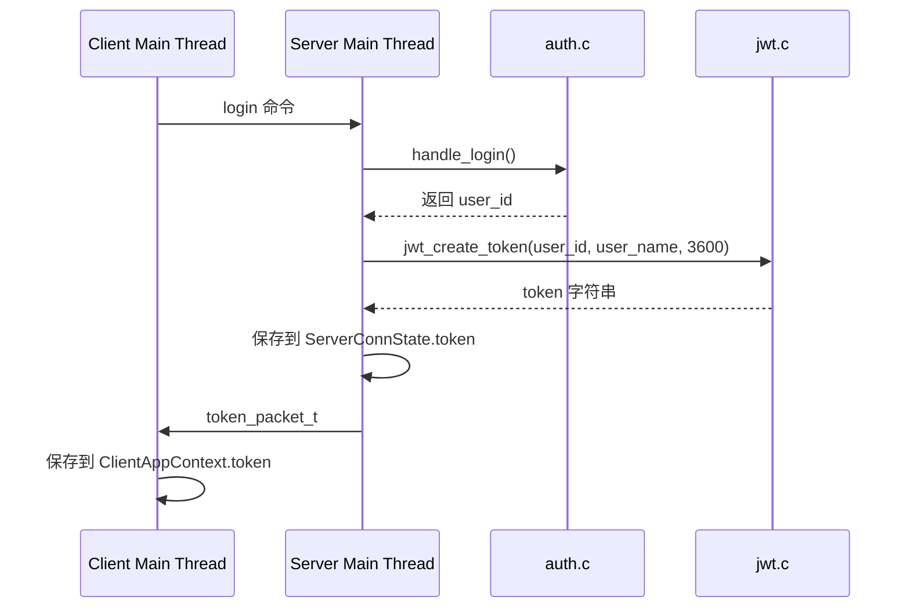
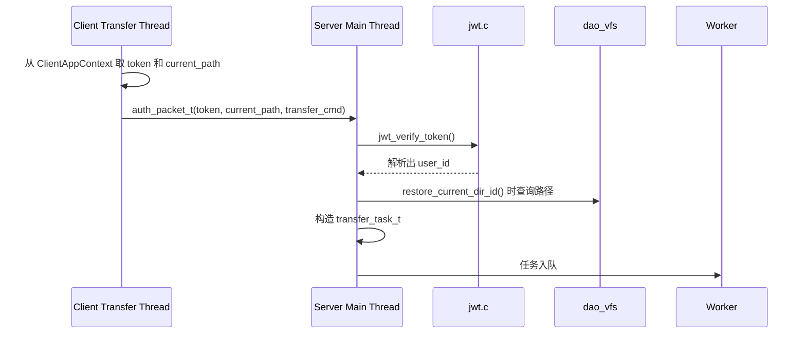

# WindCloud_V4 JWT 详解

## 1. 文档目标

这份文档专门解释当前 WindCloud_V4 项目里与 JWT 有关的全部关键内容：

1. JWT 的基本原理是什么
2. 当前项目为什么要引入 JWT
3. 当前项目里的 JWT 是怎样生成和校验的
4. JWT 在项目中的真实作用是什么
5. JWT、`ClientContext`、`ServerConnState`、`ClientAppContext` 之间分别是什么关系
6. 这些结构分别负责什么，不负责什么

这份文档会严格以当前仓库代码为准来说明，不只讲抽象概念。

当前项目中与 JWT 直接相关的代码主要有：

- `include/jwt.h`
- `src/server/jwt.c`
- `include/protocol.h`
- `src/common/protocol.c`
- `src/server/session.c`
- `include/conn_manager.h`
- `src/client/client_command_handle.c`
- `src/client/client_puts.c`
- `src/client/client_gets.c`

---

## 2. 为什么第四期要引入 JWT

在 V3 里，客户端和服务端的关系比较简单：

1. 一个连接长期存在
2. 这个连接上的会话状态直接保存在服务端处理这条连接的上下文里
3. 上传下载也复用这条连接

V4 做了一个重要变化：

> 主连接处理短命令  
> 上传下载改成独立传输连接

这就带来了一个新问题：

> 新开的传输连接怎样让服务端知道“我是谁”

如果没有额外机制，独立传输连接一连上来，服务端只看到一个新的 `fd`，它并不知道：

- 这个连接属于哪个用户
- 这个用户是不是已经登录过
- 这个用户当前在哪个逻辑目录

所以第四期需要一套“轻量级身份证明”机制，让独立传输连接能够快速告诉服务端：

> 我对应的是哪一个已经登录过的用户

当前项目选择的方案就是：

> 登录成功后，服务端签发 JWT  
> 客户端后续每次发起独立传输连接时携带这个 JWT  
> 服务端校验通过后，再继续上传或下载

---

## 3. JWT 的基本原理

## 3.1 JWT 可以理解成“带签名的字符串”

JWT 的全称是：

> JSON Web Token

它本质上是一段字符串，但这段字符串不是随便拼出来的，它通常由三部分组成：

```text
Header.Payload.Signature
```

这三部分之间用点号 `.` 分隔。

## 3.2 三部分分别是什么

### 3.2.1 Header

Header 用来描述：

- 这是什么类型的 token
- 签名算法是什么

在当前项目中，头部固定是：

```c
#define JWT_HEADER_JSON "{\"alg\":\"HS256\",\"typ\":\"JWT\"}"
```

也就是说，当前项目使用的是：

- 类型：`JWT`
- 算法：`HS256`

### 3.2.2 Payload

Payload 用来保存真正想表达的数据。

当前项目里，payload 里保存的是：

- 用户 id
- 用户名
- 签发时间
- 过期时间

当前代码里实际构造的 JSON 是：

```c
snprintf(payload_json,
         sizeof(payload_json),
         "{\"uid\":%d,\"uname\":\"%s\",\"iat\":%lld,\"exp\":%lld}",
         user_id,
         user_name,
         (long long)now_time,
         (long long)exp_time);
```

也就是：

```json
{
  "uid": 123,
  "uname": "alice",
  "iat": 1710000000,
  "exp": 1710003600
}
```

### 3.2.3 Signature

Signature 是最关键的一部分。

它不是“再保存一份数据”，而是：

> 用密钥对 `Header.Payload` 做签名

这样服务端以后再拿到这段 token 时，就能重新计算一次签名并比较。

如果比较一致，说明：

1. 这个 token 确实是自己签发过的
2. 中间内容没有被人改过

---

## 4. 当前项目里 JWT 是怎样生成的

生成逻辑在 `src/server/jwt.c` 的 `jwt_create_token()` 中。

## 4.1 当前项目使用的是 HS256

关键签名函数是：

```c
static int hmac_sha256_sign(const char *data, unsigned char *sign, unsigned int *sign_len) {
    unsigned char *ret = NULL;

    ret = HMAC(EVP_sha256(),
               g_jwt_secret,
               (int)strlen(g_jwt_secret),
               (const unsigned char *)data,
               strlen(data),
               sign,
               sign_len);

    if (ret == NULL) {
        return -1;
    }

    return 0;
}
```

这里使用的是：

- `HMAC`
- `SHA-256`

所以算法是：

> HS256

## 4.2 当前项目里 JWT 生成的大致步骤

`jwt_create_token()` 可以拆成下面几步：

1. 准备固定头部 JSON
2. 构造 payload JSON
3. 把头部做 Base64URL 编码
4. 把 payload 做 Base64URL 编码
5. 把两者拼成 `header.payload`
6. 对这段字符串做 HMAC-SHA256
7. 把签名结果再做 Base64URL 编码
8. 最后拼成 `header.payload.signature`

关键代码如下：

```c
if (base64url_encode((const unsigned char *)JWT_HEADER_JSON,
                     strlen(JWT_HEADER_JSON),
                     header_b64,
                     sizeof(header_b64)) != 0) {
    return -1;
}

snprintf(payload_json,
         sizeof(payload_json),
         "{\"uid\":%d,\"uname\":\"%s\",\"iat\":%lld,\"exp\":%lld}",
         user_id,
         user_name,
         (long long)now_time,
         (long long)exp_time);

if (base64url_encode((const unsigned char *)payload_json,
                     strlen(payload_json),
                     payload_b64,
                     sizeof(payload_b64)) != 0) {
    return -1;
}

snprintf(sign_input, sizeof(sign_input), "%s.%s", header_b64, payload_b64);

if (hmac_sha256_sign(sign_input, sign_buf, &sign_len) != 0) {
    return -1;
}

if (base64url_encode(sign_buf, sign_len, sign_b64, sizeof(sign_b64)) != 0) {
    return -1;
}

snprintf(token, token_size, "%s.%s.%s", header_b64, payload_b64, sign_b64);
```

## 4.3 为什么当前项目用了 Base64URL

JWT 一般不会直接把原始 JSON 和原始二进制签名放进字符串里，而是会先编码成：

> Base64URL

Base64URL 和普通 Base64 的主要差别是：

1. `+` 改成 `-`
2. `/` 改成 `_`
3. 去掉末尾的 `=`

这样做的好处是：

- 更适合在网络传输中作为普通字符串使用
- 不容易和 URL、路径、参数分隔符冲突

当前项目中对应代码是：

```c
static void base64_to_base64url(char *str) {
    ...
}

static int base64url_to_base64(const char *src, char *dst, size_t dst_size) {
    ...
}
```

---

## 5. 当前项目里 JWT 是怎样校验的

校验逻辑在 `src/server/jwt.c` 的 `jwt_verify_token()` 中。

## 5.1 校验步骤可以拆成十一小步

当前代码做的事情大致是：

1. 检查 token 字符串是否合法
2. 用 `.` 把 token 切成三段
3. 重新拼出 `header.payload`
4. 用当前密钥重新计算一遍期望签名
5. 把 token 中的签名从 Base64URL 解码出来
6. 比较签名长度
7. 比较签名内容
8. 把 payload 解码成 JSON
9. 解析出 `uid`、`uname`、`iat`、`exp`
10. 检查是否过期
11. 把解析出的用户信息返回给调用方

关键代码如下：

```c
header_part = strtok(token_buf, ".");
payload_part = strtok(NULL, ".");
sign_part = strtok(NULL, ".");

snprintf(sign_input, sizeof(sign_input), "%s.%s", header_part, payload_part);

if (hmac_sha256_sign(sign_input, expected_sign, &expected_sign_len) != 0) {
    return -1;
}

if (base64url_decode(sign_part, recv_sign, sizeof(recv_sign), &recv_sign_len) != 0) {
    return -1;
}

if (recv_sign_len != expected_sign_len) {
    return -1;
}

if (memcmp(recv_sign, expected_sign, expected_sign_len) != 0) {
    return -1;
}

if (base64url_decode(payload_part, payload_json, sizeof(payload_json) - 1, &payload_len) != 0) {
    return -1;
}

if (parse_payload_json((char *)payload_json, user_id, user_name, user_name_size, &parsed_exp_time) != 0) {
    return -1;
}

if (parsed_exp_time < time(NULL)) {
    return -1;
}
```

## 5.2 当前项目里“校验通过”到底意味着什么

如果 `jwt_verify_token()` 返回 `0`，说明至少满足了三件事：

1. token 的格式是完整的三段式
2. token 的签名与服务端当前密钥匹配
3. token 还没有过期

同时还会把这些信息解析出来：

- `user_id`
- `user_name`
- `exp_time`

这里真正被后续业务用到的核心字段是：

> `user_id`

因为后续上传下载要通过 `user_id` 去查数据库里的逻辑目录和文件信息。

---

## 6. 当前项目里 JWT 的密钥是怎样管理的

在 `src/server/jwt.c` 中，当前使用的是一个全局密钥缓冲区：

```c
static char g_jwt_secret[JWT_SECRET_LEN] = JWT_DEFAULT_SECRET;
```

默认值是：

```c
#define JWT_DEFAULT_SECRET "WindCloud_V4_Default_JWT_Secret"
```

同时还提供了一个接口：

```c
int jwt_set_secret(const char *secret);
```

它允许以后把密钥换成新的字符串。

## 6.1 当前代码里 `jwt_set_secret()` 有没有实际调用

根据当前仓库代码检索结果：

> `jwt_set_secret()` 目前已经实现，但当前代码里没有实际调用

这意味着：

1. 当前运行时默认使用 `JWT_DEFAULT_SECRET`
2. 未来如果要从配置文件读取密钥，可以直接接这个接口

---

## 7. JWT 在本项目中的真实作用

这一节最重要，因为很多人容易把 JWT 理解成“万能会话状态”。

当前项目里，JWT 的真实作用只有一句话：

> 用来让独立传输连接向服务端证明“我属于哪个已经登录过的用户”

## 7.1 JWT 不负责什么

在当前项目里，JWT **不负责**：

1. 保存当前目录节点 ID
2. 保存当前虚拟路径
3. 直接驱动 `file_cmds.c` 业务
4. 替代数据库中的目录状态
5. 替代主连接状态管理

换句话说，JWT 负责的是：

> 身份证明

而不是：

> 完整会话对象

## 7.2 JWT 具体在什么场景被用到

当前项目里 JWT 只在两处关键场景出现：

### 场景 A：登录成功后生成 token

代码在 `session_handle_main_command()` 中：

```c
if (jwt_create_token(ctx.user_id, user_name, JWT_EXPIRE_SECONDS, token, sizeof(token)) == 0) {
    strncpy(state->token, token, sizeof(state->token) - 1);
    token_packet_t token_packet;
    init_token_packet(&token_packet, state->token, 1);
    send_token_packet(client_fd, &token_packet);
}
```

也就是说：

1. 主连接登录成功
2. 服务端根据 `user_id` 和 `user_name` 生成 token
3. token 保存在 `ServerConnState`
4. 同时通过 `token_packet_t` 发给客户端

### 场景 B：独立传输连接认证

代码在 `session_build_transfer_task()` 中：

```c
if (jwt_verify_token(auth_packet->token,
                     &task->ctx.user_id,
                     user_name,
                     sizeof(user_name),
                     &exp_time) != 0) {
    return -1;
}
```

也就是说：

1. 客户端新开一个传输连接
2. 先发送 `auth_packet_t`
3. 其中携带 token
4. 服务端主线程校验 token
5. 校验通过后恢复 `task->ctx.user_id`

然后服务端才允许继续构造上传或下载任务。

---

## 8. JWT 在当前项目中的完整调用链

## 8.1 登录成功后 token 的下发链路



## 8.2 上传下载时 token 的使用链路



---

## 9. JWT、`ClientContext`、`ServerConnState`、`ClientAppContext` 之间的关系

这是当前项目里最容易混淆的一部分，必须分开讲。

## 9.1 先看四者的职责总表

| 对象 | 所在位置 | 主要职责 | 是否长期保存 | 是否直接代表身份 | 是否直接代表目录状态 |
| --- | --- | --- | --- | --- | --- |
| JWT | 网络字符串 | 身份证明 | 客户端和服务端都可短期保存 | 是 | 否 |
| `ClientContext` | 服务端业务层 | 业务执行时的用户和目录上下文 | 否，通常是阶段性使用 | 部分是 | 是 |
| `ServerConnState` | 服务端主线程 | 主连接长期状态 | 是 | 是 | 是 |
| `ClientAppContext` | 客户端主线程 | 客户端长期状态 | 是 | 间接是 | 是 |

## 9.2 JWT 和 `ClientContext` 的关系

这两个东西最容易被误以为是同一类对象，但实际上完全不是。

### JWT 负责什么

JWT 负责：

1. 证明这个独立传输连接对应哪个用户
2. 证明这个身份信息没有被篡改
3. 证明 token 还没有过期

### `ClientContext` 负责什么

`ClientContext` 负责：

1. 当前用户是谁
2. 当前目录路径是什么
3. 当前目录节点 ID 是什么

也就是说：

> JWT 解决“你是谁”  
> `ClientContext` 解决“你是谁，并且你现在在哪个目录”

### 当前代码里二者如何衔接

服务端在传输连接认证时，并不是“拿到 JWT 就直接得到完整 `ClientContext`”。

当前真实过程是：

1. 先用 `jwt_verify_token()` 从 JWT 中恢复 `user_id`
2. 再从 `auth_packet_t.current_path` 里拿到当前路径
3. 再调用 `restore_current_dir_id()` 根据路径查出目录节点 ID
4. 最后才把这些信息拼成 `ClientContext`

也就是说：

> `ClientContext` 是通过“JWT + 当前路径 + 数据库查询”共同恢复出来的

而不是 JWT 单独恢复出来的。

## 9.3 JWT 和 `ServerConnState` 的关系

`ServerConnState` 是服务端主线程长期维护的连接状态。

当前结构中和 JWT 直接相关的字段有：

```c
char token[TOKEN_LEN];
int user_id;
char current_path[CMD_DATA_LEN];
int current_dir_id;
```

它们之间的关系是：

1. 用户在主连接登录成功后
2. 服务端生成 JWT
3. 把这个 JWT 保存到 `ServerConnState.token`
4. 同时把 `user_id`、`current_path`、`current_dir_id` 等主连接状态也保存在 `ServerConnState`

所以：

> `ServerConnState` 是“主连接的完整长期状态”  
> JWT 只是其中一个字段

换句话说，`ServerConnState` 比 JWT 信息更完整。

## 9.4 JWT 和 `ClientAppContext` 的关系

`ClientAppContext` 是客户端长期维护的状态，定义如下：

```c
typedef struct {
    int sock_fd;
    int is_logged_in;
    char current_path[CMD_DATA_LEN];
    char token[TOKEN_LEN];
    char server_ip[64];
    char server_port[32];
} ClientAppContext;
```

JWT 在这里的作用是：

1. 登录成功后，客户端从 `token_packet_t` 中拿到 token
2. 把 token 保存到 `ClientAppContext.token`
3. 以后每次启动上传或下载线程时，都从这里复制 token

所以：

> `ClientAppContext` 是客户端保存 JWT 的位置  
> JWT 本身不是客户端状态对象

## 9.5 `ClientContext` 和 `ClientAppContext` 也不是一回事

这两个名字很像，但职责完全不同：

### `ClientContext`

它在服务端使用，交给：

- `file_cmds.c`
- `file_transfer.c`

本质上是：

> 服务端业务函数运行时用的上下文

### `ClientAppContext`

它在客户端使用，保存：

- 主连接 fd
- 登录状态
- 当前路径
- token

本质上是：

> 客户端主线程长期维护的状态

所以当前项目里：

- `ClientContext` 是服务端对象
- `ClientAppContext` 是客户端对象

两者名字相近，但不要混淆。

---

## 10. 当前项目里 `ClientContext` 到底是怎样被恢复出来的

这部分对理解 JWT 很关键。

## 10.1 主连接上的 `ClientContext`

主连接上的 `ClientContext` 来自：

```c
conn_state_to_client_ctx(state, &ctx)
```

也就是说，它来自：

> `ServerConnState`

这里并不需要 JWT 参与，因为主连接本来就已经有长期状态。

## 10.2 独立传输连接上的 `ClientContext`

独立传输连接上的 `ClientContext` 来源完全不同。

它在 `session_build_transfer_task()` 中是这样恢复的：

### 第一步：用 JWT 恢复 `user_id`

```c
jwt_verify_token(auth_packet->token, &task->ctx.user_id, ...)
```

### 第二步：用认证包恢复当前路径

```c
strncpy(task->ctx.current_path, auth_packet->current_path, ...)
```

### 第三步：根据路径查目录节点 ID

```c
restore_current_dir_id(task->ctx.user_id, task->ctx.current_path, &task->ctx.current_dir_id)
```

### 第四步：工作线程再把任务中的上下文恢复成业务层 `ClientContext`

```c
ctx.user_id = task->ctx.user_id;
ctx.current_dir_id = task->ctx.current_dir_id;
strncpy(ctx.current_path, task->ctx.current_path, ...)
```

所以当前项目里，JWT 和 `ClientContext` 的真正关系可以总结为：

> JWT 只负责恢复 `user_id`  
> `current_path` 来自认证包  
> `current_dir_id` 来自数据库查询  
> 三者合起来才组成最终的 `ClientContext`

---

## 11. 当前项目里为什么不能只靠 JWT，不要 `ClientContext`

这个问题非常典型。

答案是：

> 因为业务层不仅需要知道“用户是谁”，还需要知道“当前目录在哪里”

举几个最直接的例子：

### 11.1 `handle_puts()` 需要什么

`handle_puts()` 不只需要：

- `user_id`

还需要：

- `current_path`
- `current_dir_id`

因为它要：

1. 拼逻辑路径
2. 检查当前目录下是否重名
3. 在当前目录下创建逻辑文件节点

### 11.2 `handle_gets()` 需要什么

`handle_gets()` 也不只需要：

- `user_id`

还需要：

- `current_path`

因为它要先把“当前目录 + 文件名”拼成逻辑全路径。

### 11.3 为什么 JWT 不直接把目录状态也带进去

理论上可以把更多目录信息也写进 JWT，但当前项目没有这么做，原因很实际：

1. 当前目录是会经常变化的
2. 如果把目录状态放进 JWT，`cd` 成功后就要重新签发 token
3. 这样会让主连接和传输连接的同步更复杂

当前项目选择的是更直观的做法：

1. JWT 只负责证明用户身份
2. 当前路径由客户端单独放进 `auth_packet_t`
3. 目录节点 ID 由服务端再查数据库恢复

这更符合当前项目“在 V3 基础上尽量少改结构”的目标。

---

## 12. 当前项目里与 JWT 配套的协议结构

JWT 并不是单独存在的，它要通过协议包在客户端和服务端之间传递。

## 12.1 `token_packet_t`

定义在 `include/protocol.h`：

```c
typedef struct {
    int cmd_type;
    int is_ok;
    int data_len;
    char token[TOKEN_LEN];
} token_packet_t;
```

它负责：

1. 登录成功后，把 token 从服务端发给客户端
2. 让客户端知道当前 token 是否有效

## 12.2 `auth_packet_t`

定义在 `include/protocol.h`：

```c
typedef struct {
    int cmd_type;
    int transfer_cmd;
    int data_len;
    char current_path[CMD_DATA_LEN];
    char token[TOKEN_LEN];
} auth_packet_t;
```

它负责：

1. 告诉服务端“这是独立传输连接”
2. 告诉服务端“我要执行的是 `puts` 还是 `gets`”
3. 把当前路径带给服务端
4. 把 JWT 带给服务端

这两个结构体可以理解成：

- `token_packet_t` 是“服务端下发 token 的包”
- `auth_packet_t` 是“客户端回传 token 的包”

---

## 13. 客户端端到端是怎样使用 JWT 的

## 13.1 登录成功后保存 token

客户端在 `recv_login_token()` 中：

```c
if (recv_token_packet(ctx->sock_fd, &token_packet) <= 0) {
    return -1;
}

if (token_packet.is_ok != 1 || token_packet.token[0] == '\0') {
    return -1;
}

strncpy(ctx->token, token_packet.token, sizeof(ctx->token) - 1);
ctx->is_logged_in = 1;
strcpy(ctx->current_path, "/");
```

这里做了三件关键事情：

1. 接收服务端发来的 token 包
2. 把 token 保存到 `ClientAppContext`
3. 把客户端本地登录状态切到已登录

## 13.2 上传线程怎样使用 token

在 `client_puts.c` 中：

```c
init_auth_packet(&auth_packet, CMD_TYPE_PUTS, transfer_args->current_path, transfer_args->token);
send_auth_packet(sock_fd, &auth_packet);
```

也就是说，上传线程会把：

- 当前路径
- token

一起发给服务端。

## 13.3 下载线程怎样使用 token

在 `client_gets.c` 中也是同样的模式：

```c
init_auth_packet(&auth_packet, CMD_TYPE_GETS, transfer_args->current_path, transfer_args->token);
send_auth_packet(sock_fd, &auth_packet);
```

所以在客户端看来，JWT 的使用方式非常统一：

1. 登录成功时接收并保存
2. 每次上传下载时重新带上

---

## 14. 服务端端到端是怎样使用 JWT 的

## 14.1 登录成功时签发

在 `session_handle_main_command()` 中：

1. 先调用 `handle_login()`
2. 登录成功后调用 `jwt_create_token()`
3. 把 token 保存到 `ServerConnState.token`
4. 通过 `send_token_packet()` 发给客户端

## 14.2 传输连接到来时校验

在 `session_build_transfer_task()` 中：

1. 先收 `auth_packet_t`
2. 调用 `jwt_verify_token()`
3. 如果失败，直接返回 `-1`
4. 如果成功，拿到 `task->ctx.user_id`

## 14.3 校验通过后并不会立即进入业务层

校验通过后，服务端还要做两步：

1. 从 `auth_packet_t.current_path` 恢复路径
2. 用 `restore_current_dir_id()` 查出目录节点 ID

直到这两步完成后，服务端才真正构造出完整的传输任务。

这说明：

> JWT 校验通过只是“身份证明通过”  
> 还不等于“完整业务上下文已经恢复”

---

## 15. 当前实现的优点

### 15.1 不需要新建数据库会话表

当前实现里：

- 主连接长期状态由 `ServerConnState` 维护
- 独立传输连接身份由 JWT 证明

所以当前项目不需要额外维护数据库会话表。

### 15.2 独立传输连接认证很轻

一个新传输连接到来时，不需要再次输入用户名密码，只需要：

1. 发 token
2. 服务端验签
3. 恢复用户身份

这比重新登录更直接。

### 15.3 职责边界清楚

当前项目里的职责划分是清楚的：

- JWT 负责身份证明
- `ClientContext` 负责业务执行上下文
- `ServerConnState` 负责主连接长期状态
- `ClientAppContext` 负责客户端长期状态

这比把所有状态都塞进一个对象里更清楚。

### 15.4 对 V3 工程骨架改动较小

当前做法没有推翻：

- `auth.c`
- `file_cmds.c`
- `file_transfer.c`
- DAO 层

而是在它们外侧增加了一层：

- token 签发
- token 校验
- 认证包

这正符合第四期“尽量在 V3 基础上补充”的目标。

---

## 16. 当前实现的局限和后续可优化点

### 16.1 当前密钥默认写在代码里

虽然已经实现了 `jwt_set_secret()`，但当前运行时默认还是：

```c
JWT_DEFAULT_SECRET
```

后续更合适的做法是：

1. 从配置文件读取密钥
2. 服务端启动时调用 `jwt_set_secret()`

### 16.2 当前 payload 结构是固定格式解析

当前解析 payload 的做法是：

```c
sscanf(payload_json,
       "{\"uid\":%d,\"uname\":\"%63[^\"]\",\"iat\":%lld,\"exp\":%lld}",
       ...)
```

这非常直观，但也意味着：

- payload 结构必须保持固定
- 不适合频繁扩字段

### 16.3 当前没有做更细的标准字段校验

当前项目主要校验的是：

- 签名
- 过期时间

没有再去扩展：

- `iss`
- `aud`
- `sub`

这些更完整的 JWT 标准字段。

### 16.4 当前 JWT 只负责传输连接认证

当前 token 不参与：

- 主连接免密恢复
- 多端会话管理
- 主连接自动续期

所以当前实现是：

> 面向第四期目标的实用版本

而不是完整的统一身份系统。

---

## 17. 一句话总结当前项目中的 JWT

WindCloud_V4 中的 JWT 可以概括为：

> 服务端在主连接登录成功后签发一个带 HS256 签名的 token，客户端把它保存在 `ClientAppContext` 中；以后每次新建上传或下载连接时，客户端通过 `auth_packet_t` 携带这个 token，服务端主线程校验通过后恢复 `user_id`，再结合当前路径和数据库查询重建 `ClientContext`，最终把这次传输任务交给工作线程执行。
