# WindCloud_V4 整体项目架构详解

## 1. 文档目标

这份文档不是“理想化架构图”，而是基于当前仓库代码的**真实实现**来解释 V4：

1. 客户端和服务端分别由哪些模块组成
2. 控制连接、传输连接、线程池、时间轮分别承担什么职责
3. 一条普通命令从终端输入到数据库查询，具体经过哪些层
4. 上传 `puts` 和下载 `gets` 如何经过“控制连接预申请票据 + 独立传输连接执行”
5. 虚拟目录、真实文件、协议包、一次性传输票据、数据库连接池之间如何协作

当前版本包含：

- 登录 / 注册
- 虚拟目录命令：`pwd`、`cd`、`ls`、`mkdir`、`touch`、`rm`、`rmdir`
- 文件上传 `puts`
- 文件下载 `gets`
- 断点续传
- 基于 SHA-256 的秒传 / 去重
- `100M` 大文件 `mmap` 规则
- 控制连接与传输连接分离
- 上传 / 下载使用独立传输线程和独立传输连接
- 控制连接时间轮超时踢出
- 每次上传 / 下载先申请短时一次性传输票据
- 服务端真实文件实体目录：`test/server_files`
- 客户端本地上传读取、下载写入目录：`test/server_files`

---

## 2. 总体架构总览

### 2.1 V4 逻辑分层图

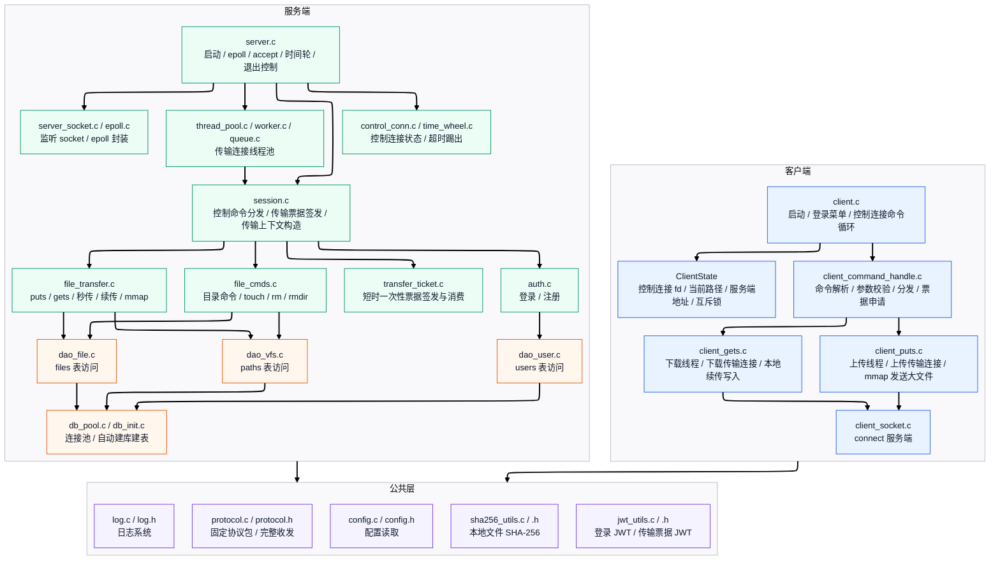

### 2.2 V4 的核心变化

V3 的主要模型是：

```text
一个客户端连接
-> 一个服务端工作线程
-> 这个线程持续处理该连接上的普通命令和文件传输
```

V4 的当前模型是：

```text
控制连接：常驻，负责登录、目录命令、传输票据申请
传输连接：短连接，只负责一次 puts 或 gets
```

这意味着：

1. `pwd`、`cd`、`ls`、`mkdir`、`touch`、`rm`、`rmdir` 走控制连接。
2. `puts`、`gets` 先在控制连接上申请一次性传输票据。
3. 客户端拿到票据后启动独立线程，新建一条传输连接。
4. 服务端识别传输连接后，把它放入传输线程池。
5. 工作线程消费票据，构造本次传输上下文，然后只执行一次上传或下载。

---

## 3. 目录与模块组织

### 3.1 当前源码目录

```text
include/
├── protocol.h
├── client_state.h
├── client_command_handle.h
├── client_socket.h
├── control_conn.h
├── time_wheel.h
├── transfer_ticket.h
├── jwt_utils.h
├── auth.h
├── file_cmds.h
├── file_transfer.h
├── dao_user.h
├── dao_vfs.h
├── dao_file.h
├── db_pool.h
├── db_init.h
├── thread_pool.h
├── queue.h
├── worker.h
├── server_socket.h
├── epoll.h
├── path_utils.h
├── config.h
├── log.h
└── sha256_utils.h

src/client/
├── client.c
├── client_command_handle.c
├── client_gets.c
├── client_puts.c
└── client_socket.c

src/server/
├── server.c
├── server_socket.c
├── epoll.c
├── control_conn.c
├── time_wheel.c
├── thread_pool.c
├── worker.c
├── queue.c
├── session.c
├── transfer_ticket.c
├── auth.c
├── file_cmds.c
├── file_transfer.c
├── dao_user.c
├── dao_vfs.c
├── dao_file.c
├── db_pool.c
├── db_init.c
└── path_utils.c

src/common/
├── protocol.c
├── config.c
├── log.c
├── jwt_utils.c
└── sha256_utils.c
```

### 3.2 两套文件系统

当前项目仍然维护两套系统：

1. **虚拟文件系统**
   - 面向用户展示
   - 由数据库 `paths` 表保存
   - 每个用户有自己的目录树
   - `current_path` 和 `current_dir_id` 表示当前会话所在逻辑目录

2. **真实文件系统**
   - 面向服务端物理存储
   - 真实文件目录是 `test/server_files`
   - 文件名是 SHA-256，而不是用户原始文件名
   - 相同内容只保存一份真实实体

所以项目本质上是：

> 控制面 / 传输面分离的虚拟网盘 + SHA-256 去重文件仓库。

---

## 4. 服务端架构详解

## 4.1 服务端启动链

服务端入口是 `src/server/server.c`。

启动顺序如下：

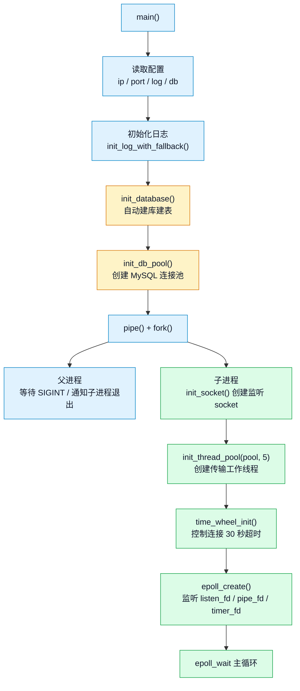

几个关键点：

1. 服务端仍然使用 `pipe + fork` 管理退出。
2. 父进程处理 `SIGINT`，子进程跑真正的服务器循环。
3. 服务端启动时会自动建库建表，并初始化数据库连接池。
4. V4 的线程池不再处理控制连接长会话，它只处理传输连接。
5. 控制连接由主线程 epoll 管理，并纳入时间轮超时检测。

## 4.2 连接接入与角色识别

每条 TCP 连接建立后，客户端都会先发送：

```c
conn_init_packet_t
```

其中 `role` 决定这条连接的处理方式：

- `CONN_ROLE_CTRL`：控制连接
- `CONN_ROLE_TRANSFER`：传输连接

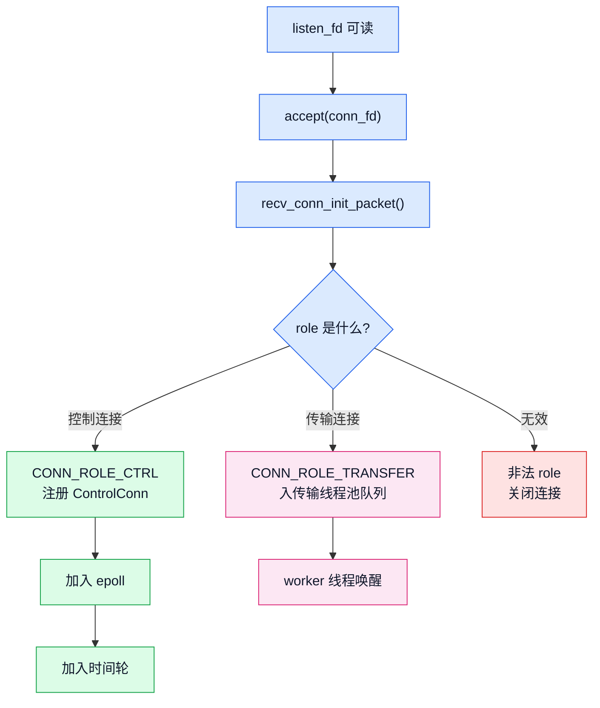

## 4.3 控制连接模型

控制连接由服务端主线程直接管理。

核心结构体是 `ControlConn`：

```c
typedef struct ControlConn {
    int fd;
    ClientContext ctx;
    long long expire_tick;
    int wheel_slot;
    struct TimeWheelNode *wheel_node;
} ControlConn;
```

它保存：

- 控制连接 fd
- 当前登录用户和当前虚拟路径
- 时间轮过期位置
- 时间轮节点指针

控制连接处理流程：

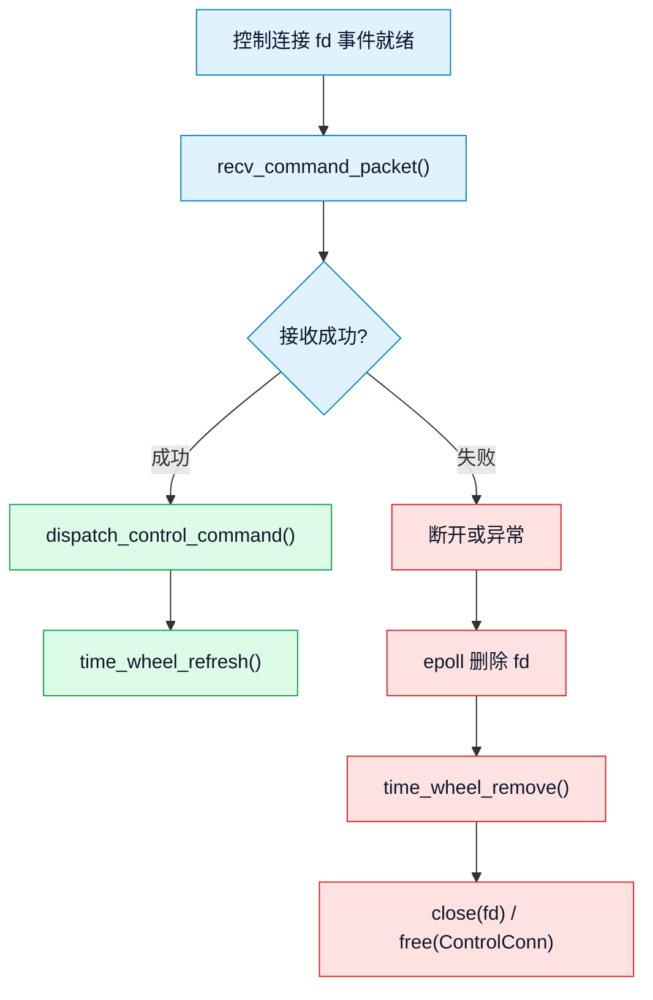

## 4.4 时间轮超时管理

V4 把控制连接纳入时间轮：

- 超时时间：`CTRL_TIMEOUT_SEC = 30`
- 定时源：`timerfd`
- 每秒触发一次 `time_wheel_tick()`
- 有控制命令到达后调用 `time_wheel_refresh()`

这里管理的是控制连接，不是正在执行传输的连接。

含义是：

1. 控制连接空闲超过 30 秒会被踢出。
2. 已经进入线程池的传输连接由 worker 设置 socket 读写超时。
3. 控制连接被踢出后，客户端无法再申请新的传输票据。
4. 已经签发并进入执行的传输任务，不因为控制连接超时被主线程直接中断。

## 4.5 传输线程池模型

线程池由：

- `thread_pool.c`
- `worker.c`
- `queue.c`

组成。

V4 中线程池只处理传输连接：

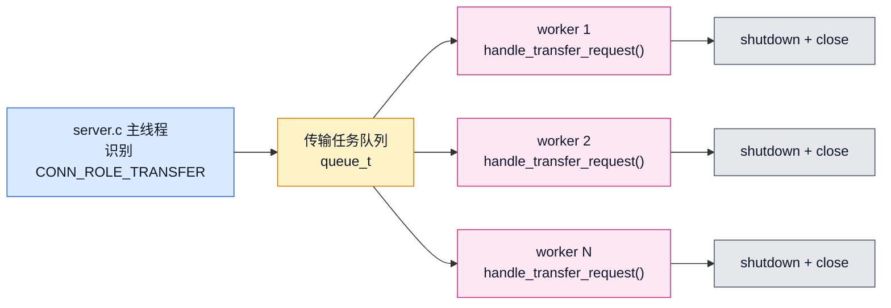

worker 线程做的事情：

1. 从队列取出传输连接 fd。
2. 设置 `SO_RCVTIMEO` 和 `SO_SNDTIMEO` 为 30 秒。
3. 调用 `handle_transfer_request(client_fd)`。
4. 本次上传 / 下载完成后主动 `shutdown()`。
5. 关闭 fd，标记线程空闲。

---

## 5. 会话层 `session.c`

`session.c` 是 V4 的关键枢纽。

它现在同时负责两类入口：

1. 控制连接事件：`dispatch_control_command()`
2. 传输连接任务：`handle_transfer_request()`

## 5.1 控制连接命令分发

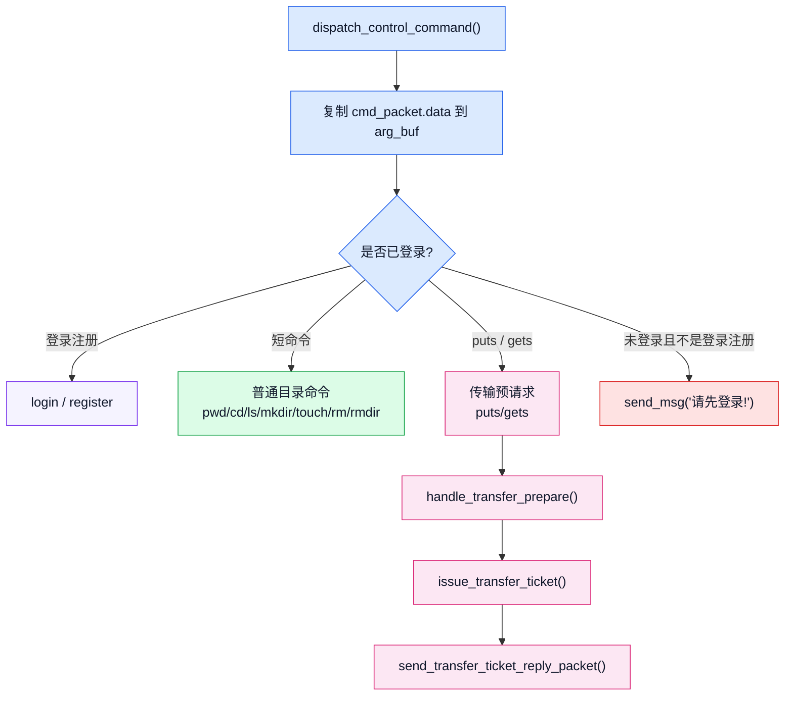

控制连接上的 `puts` / `gets` 不直接传文件，只做“传输预请求”：

1. 根据控制连接的 `current_path` 和用户输入文件名拼完整虚拟路径。
2. 调用 `issue_transfer_ticket()` 签发一次性票据。
3. 把票据通过 `transfer_ticket_reply_packet_t` 返回客户端。

## 5.2 传输连接上下文构造

传输连接不继承某条控制连接的内存对象。

它拿到票据后，服务端从票据里解析：

- `user_id`
- `cmd_type`
- `full_path`
- `ticket_id`

然后通过 `build_transfer_context()` 构造一份新的 `ClientContext`：

```text
full_path = /doc/a.txt
-> parent_path = /doc
-> file_name = a.txt
-> 查 paths，确认 /doc 是目录
-> ctx.user_id = user_id
-> ctx.current_path = /doc
-> ctx.current_dir_id = /doc 对应的目录节点 id
```

如果父目录是 `/`，则 `current_dir_id = 0`。

---

## 6. 一次性传输票据

V4 的上传 / 下载不是直接复用登录 JWT 做传输认证，而是引入短时一次性票据。

相关模块：

- `src/server/transfer_ticket.c`
- `src/common/jwt_utils.c`
- `include/transfer_ticket.h`
- `include/jwt_utils.h`

## 6.1 票据签发

签发流程：

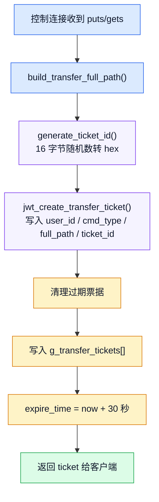

当前票据表限制：

- 最大票据数量：`1024`
- 票据 ID 长度：`32` 位 hex + `\0`
- 过期时间：`30` 秒
- 使用互斥锁保护全局票据表

## 6.2 票据消费

消费流程：

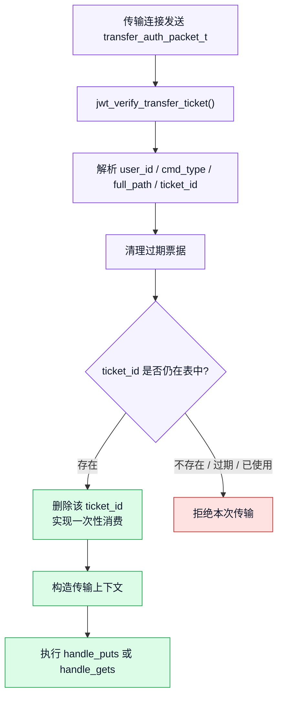

票据的意义：

1. 控制连接重新成为每次传输的入口。
2. 传输连接只执行被批准的单次任务。
3. 同一张票据不能重复使用。
4. 控制连接超时或断开后，客户端无法继续申请新的合法传输任务。

---

## 7. 业务层架构详解

业务层仍然由三条主线组成：

- `auth.c`
- `file_cmds.c`
- `file_transfer.c`

## 7.1 认证业务 `auth.c`

注册流程：

1. 解析 `用户名/密码`。
2. 生成随机盐。
3. 计算 `SHA256(password + salt)`。
4. 写入 `users` 表。
5. 返回注册结果。

登录流程：

1. 按用户名查询 `users`。
2. 取出数据库中的盐和密码哈希。
3. 对用户输入密码重新加盐计算哈希。
4. 比对成功后返回登录响应。
5. 服务端控制连接的 `ctx.user_id` 被设置为登录用户 ID。
6. 客户端 `ClientState` 保存登录状态、用户 ID、JWT 和当前路径。

## 7.2 虚拟文件系统命令 `file_cmds.c`

`file_cmds.c` 负责：

- `pwd`
- `ls`
- `cd`
- `mkdir`
- `touch`
- `rm`
- `rmdir`

这里操作的是数据库中的虚拟目录树，不是进程工作目录。

关键点：

1. `cd` 会查 `paths`，确认目标存在且是目录，然后更新 `ClientContext`。
2. `ls` 根据 `user_id + current_dir_id` 查询当前目录子节点。
3. `mkdir` 插入 `type=1` 的目录节点。
4. `touch` 会确保空文件真实实体存在，并在 `files` / `paths` 两张表里建立对应关系。
5. `rm` 会先删逻辑文件节点，再维护 `files.count`，引用为 0 时删除真实实体。
6. `rmdir` 只允许删除空目录。

真实文件实体目录已经统一为：

```text
test/server_files/<sha256>
```

## 7.3 文件传输业务 `file_transfer.c`

`file_transfer.c` 负责：

- `puts`
- `gets`
- 秒传
- 断点续传
- 文件实体完整性检查
- 大文件 `mmap` 传输分支

### 7.3.1 真实文件仓库

真实文件仓库路径：

```text
test/server_files/<sha256>
```

特点：

1. 真实文件名是 SHA-256。
2. 用户原始文件名保存在 `paths.file_name`。
3. 真实文件元数据保存在 `files`。
4. 多个逻辑文件可以共享同一个真实实体。

### 7.3.2 `100M` 大文件规则

当前代码中统一阈值是：

```c
#define LARGE_FILE_MMAP_THRESHOLD ((off_t)100 * 1024 * 1024)
```

当前分支如下：

| 场景 | 小于等于 100M | 大于 100M |
| --- | --- | --- |
| 客户端上传发送端 | `read + send_full` | `mmap + send_full` |
| 服务端上传接收端 | `recv + write` | `mmap + recv` |
| 服务端下载发送端 | `sendfile` | `mmap + send_full` |
| 客户端下载接收端 | `recv_full + write` | `recv_full + write` |

严格说，当前实现让“发送端大文件使用 `mmap`”已经对齐；服务端上传接收端也按同一阈值做了分支。

---

## 8. 上传 `puts` 的完整链路

V4 的 `puts` 分成两个阶段：

1. 控制连接申请一次性传输票据。
2. 上传线程建立传输连接并执行真正上传。

## 8.1 `puts` 总体流程图


## 8.2 `puts` 链路的关键设计点

### A. 控制连接只负责批准，不负责传文件

客户端执行 `puts` 时，主线程不会直接进入长时间文件发送。

它只做：

1. 本地参数校验。
2. 通过控制连接发送 `command_packet(PUTS, 文件名)`。
3. 等待服务端返回一次性传输票据。
4. 成功后启动上传线程。

### B. 传输连接只携带一次性票据

上传线程新建连接后只发送：

1. `conn_init_packet(CONN_ROLE_TRANSFER)`
2. `transfer_auth_packet(ticket)`

传输连接不再直接携带登录 JWT，也不直接携带完整路径明文参数。

完整路径已经被服务端写进票据并签名。

### C. 服务端从票据构造传输上下文

服务端 worker 消费票据后，从 `full_path` 拆出：

- 父目录路径
- 文件名

再查 `paths` 确认父目录存在，构造：

```c
ClientContext ctx
```

这样 `file_transfer.c` 可以继续复用原来的 `handle_puts(client_fd, &ctx, file_name)` 形态。

### D. 秒传不只信任数据库

服务端命中 `files.sha256sum` 后，还会检查：

1. `test/server_files/<hash>` 是否存在
2. 是否是普通文件
3. 磁盘大小是否等于 `files.size`

只有真实实体完整，才走秒传。

### E. 数据库关系只在文件完整后写入

除秒传和空文件外，正常上传只有在文件完整收满后才写：

- `files`
- `paths`

这样可以避免半截文件进入数据库，后续被错误下载或秒传。

---

## 9. 下载 `gets` 的完整链路

V4 的 `gets` 同样分成两个阶段：

1. 控制连接申请一次性传输票据。
2. 下载线程建立传输连接并执行真正下载。

## 9.1 `gets` 总体流程图


## 9.2 `gets` 链路的关键设计点

### A. 下载定位路径不是直接按文件名找磁盘

服务端下载链路是：

```text
文件名
-> 控制连接当前路径拼 full_path
-> 票据中携带 full_path
-> 传输连接解析 full_path
-> dao_vfs 查 paths.file_id
-> dao_file 查 files.sha256sum
-> 打开 test/server_files/<sha256>
```

这仍然体现“虚拟目录”和“真实文件实体”分离。

### B. 客户端本地断点续传

客户端下载前检查：

```text
test/server_files/<文件名>
```

如果本地已有同名文件：

- 本地大小小于服务端大小：从本地大小继续下载
- 本地大小等于服务端大小：认为已完整，无需下载
- 本地大小大于服务端大小：从 0 重新下载

### C. 服务端下载发送端按 100M 阈值分支

服务端发送文件时：

- 小文件：`sendfile`
- 大文件：`mmap + send_full`

这样既保留小文件原有高效路径，又对齐第二期大文件 `mmap` 规则。

---

## 10. DAO 层架构详解

DAO 层仍然分成三类：

- `dao_user.c`
- `dao_vfs.c`
- `dao_file.c`

## 10.1 `dao_user.c`

负责 `users` 表：

- `dao_get_user_by_name()`
- `dao_insert_user()`

认证业务不直接访问数据库连接池，而是通过用户 DAO 完成。

## 10.2 `dao_vfs.c`

负责 `paths` 表，也就是虚拟目录树：

- `dao_get_node_by_path()`
- `dao_list_dir()`
- `dao_create_node()`
- `dao_create_file_node()`
- `dao_get_file_info_by_path()`
- `dao_is_dir_empty()`
- `dao_delete_node()`

根目录约定：

- `/` 的逻辑 `id = 0`
- 根目录不一定真实存在于 `paths` 表
- 顶层节点的 `parent_id = 0`

## 10.3 `dao_file.c`

负责 `files` 表：

- `dao_file_find_by_sha256()`
- `dao_file_insert()`
- `dao_file_add_ref_count()`
- `dao_file_sub_ref_count()`
- `dao_file_get_ref_count()`
- `dao_file_delete()`
- `dao_file_get_info_by_id()`

这一层解决：

1. 某份内容是否已有真实文件实体
2. 真实文件的 `id` 是多少
3. 真实文件大小是多少
4. 当前有多少逻辑文件节点引用它

---

## 11. 数据库模型详解

当前数据库是 `netdisk_db`，核心三张表：

## 11.1 `users`

表示账号系统。

关键字段：

- `id`
- `username`
- `password_hash`
- `salt`

## 11.2 `files`

表示真实文件实体。

关键字段：

- `id`
- `sha256sum`
- `size`
- `count`

语义：

1. 一份内容只保存一条 `files` 记录。
2. 多个用户或多个路径中的同内容文件可以共用它。
3. `count` 表示有多少个逻辑文件节点引用这份真实实体。

## 11.3 `paths`

表示用户看到的虚拟目录树。

关键字段：

- `id`
- `user_id`
- `path`
- `file_id`
- `parent_id`
- `file_name`
- `type`

语义：

- `type = 1`：目录，`file_id = NULL`
- `type = 0`：普通文件，`file_id` 指向 `files.id`

### 11.4 三张表关系图

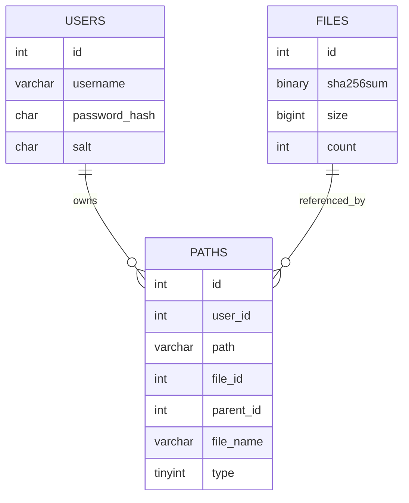

---

## 12. 协议层架构详解

协议层定义在：

- `include/protocol.h`
- `src/common/protocol.c`

## 12.1 当前协议包

| 协议包 | 用途 |
| --- | --- |
| `conn_init_packet_t` | 新连接建立后声明控制连接或传输连接 |
| `command_packet_t` | 普通命令、普通文本响应、传输预请求 |
| `file_packet_t` | 上传 / 下载文件大小、hash、offset 协商 |
| `transfer_auth_packet_t` | 传输连接携带一次性传输票据 |
| `auth_reply_packet_t` | 登录响应，返回登录结果、user_id、JWT |
| `transfer_ticket_reply_packet_t` | 控制连接返回传输票据申请结果 |

## 12.2 协议关系图

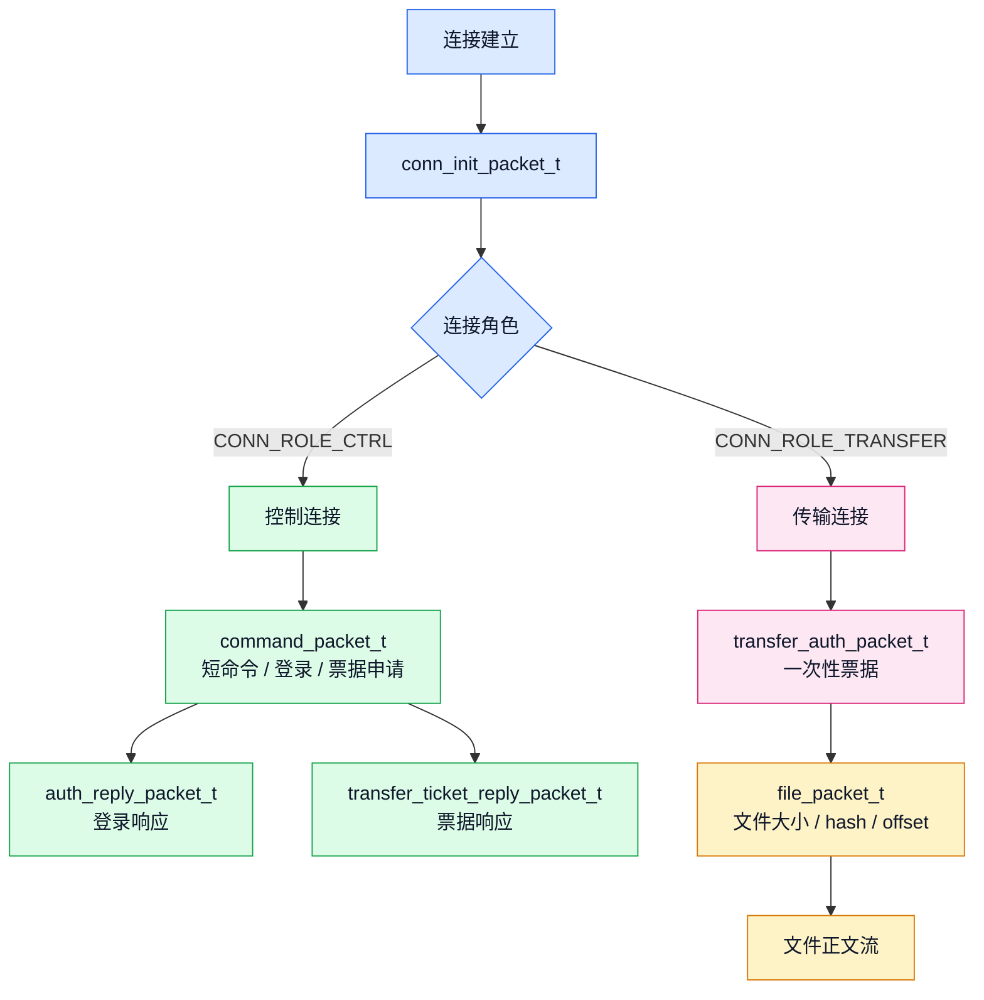

## 12.3 为什么仍然封装 `send_full()` / `recv_full()`

因为一次 `send()` / `recv()` 不能保证完整传完一个结构体。

所以公共协议层继续封装：

- `send_full()`
- `recv_full()`
- `send_command_packet()`
- `recv_command_packet()`
- `send_file_packet()`
- `recv_file_packet()`
- `send_conn_init_packet()`
- `recv_conn_init_packet()`
- `send_transfer_auth_packet()`
- `recv_transfer_auth_packet()`
- `send_transfer_ticket_reply_packet()`
- `recv_transfer_ticket_reply_packet()`

这样客户端和服务端都按固定结构体大小收发，避免半包导致协议错位。

---

## 13. 客户端架构详解

## 13.1 客户端模块分工

| 文件 | 职责 |
| --- | --- |
| `client.c` | 启动、读配置、建立控制连接、登录菜单、命令循环 |
| `client_command_handle.c` | 输入解析、参数校验、普通命令发送、票据申请、命令分发 |
| `client_puts.c` | 上传任务创建、上传线程、上传传输连接、SHA-256、mmap 发送大文件 |
| `client_gets.c` | 下载任务创建、下载线程、下载传输连接、本地断点续传 |
| `client_socket.c` | 连接服务端 |
| `ClientState` | 控制连接 fd、登录状态、当前路径、服务端地址、互斥锁 |

## 13.2 客户端控制连接启动

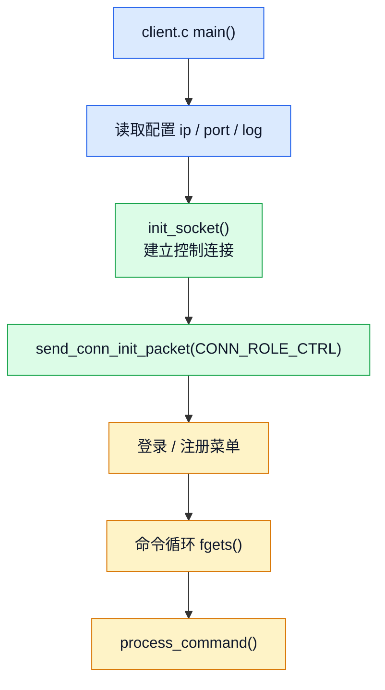

## 13.3 客户端命令分发

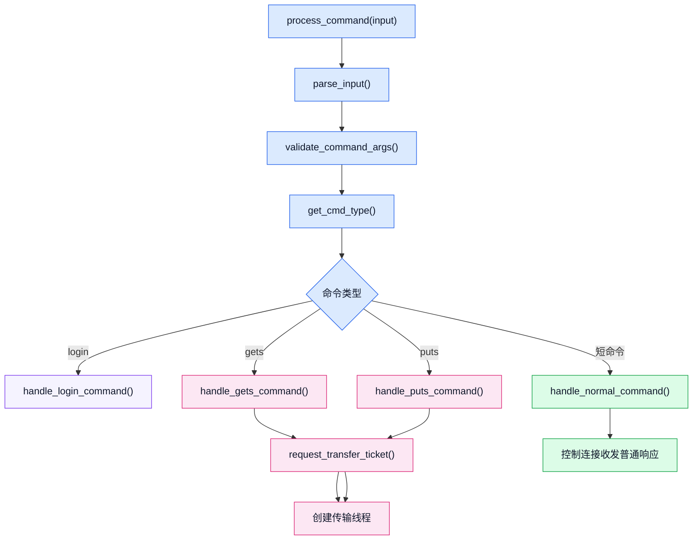

## 13.4 客户端本地文件目录

当前代码中：

- `puts` 从 `test/server_files/<文件名>` 读取本地文件
- `gets` 写入 `test/server_files/<文件名>`

客户端支持两种启动位置：

1. 从 `bin` 目录启动：优先使用 `../test/server_files`
2. 从项目根目录启动：使用 `./test/server_files`

---

## 14. 典型调用链总览

## 14.1 普通目录命令调用链

以 `mkdir demo` 为例：

```text
client.c
-> process_command()
-> handle_normal_command()
-> send_command_packet(ctrl_fd)
-> server.c: handle_control_event()
-> session.c: dispatch_control_command()
-> file_cmds.c: handle_mkdir()
-> dao_vfs.c: dao_create_node()
-> db_pool.c
-> MySQL paths
-> send_msg()
-> client_command_handle.c: recv_server_reply()
```

## 14.2 上传 `puts` 调用链

```text
client.c
-> process_command()
-> client_puts.c: handle_puts_command()
-> request_transfer_ticket(PUTS)
-> 控制连接发送 command_packet(PUTS)
-> server.c: handle_control_event()
-> session.c: handle_transfer_prepare()
-> transfer_ticket.c: issue_transfer_ticket()
-> 控制连接返回 transfer_ticket_reply_packet_t
-> client_puts.c 创建上传线程
-> 上传线程新建传输连接
-> send_conn_init_packet(CONN_ROLE_TRANSFER)
-> send_transfer_auth_packet(ticket)
-> server.c 把传输连接入线程池
-> worker.c: handle_transfer_request()
-> transfer_ticket.c: verify_and_consume_transfer_ticket()
-> session.c: build_transfer_context()
-> file_transfer.c: handle_puts()
-> dao_vfs / dao_file / MySQL
-> test/server_files/<sha256>
-> 服务端最终 reply
-> 上传线程退出
```

## 14.3 下载 `gets` 调用链

```text
client.c
-> process_command()
-> client_gets.c: handle_gets_command()
-> request_transfer_ticket(GETS)
-> 控制连接发送 command_packet(GETS)
-> server.c: handle_control_event()
-> session.c: handle_transfer_prepare()
-> transfer_ticket.c: issue_transfer_ticket()
-> 控制连接返回 transfer_ticket_reply_packet_t
-> client_gets.c 创建下载线程
-> 下载线程新建传输连接
-> send_conn_init_packet(CONN_ROLE_TRANSFER)
-> send_transfer_auth_packet(ticket)
-> server.c 把传输连接入线程池
-> worker.c: handle_transfer_request()
-> transfer_ticket.c: verify_and_consume_transfer_ticket()
-> session.c: build_transfer_context()
-> file_transfer.c: handle_gets()
-> dao_vfs 查 paths.file_id
-> dao_file 查 files.sha256sum
-> test/server_files/<sha256>
-> sendfile 或 mmap 发送正文
-> client_gets.c 写入 test/server_files/<文件名>
-> 下载线程退出
```

---

## 15. 当前架构的优点

### 15.1 控制面和传输面已经分离

普通命令不会被大文件传输阻塞在同一条连接上。

控制连接负责：

- 登录注册
- 虚拟目录命令
- 传输批准
- 超时管理

传输连接负责：

- 单次上传
- 单次下载

### 15.2 传输请求具备独立性

传输连接通过一次性票据拿到：

- 用户 ID
- 命令类型
- 完整虚拟路径

所以传输线程不需要依赖某条控制连接的内存对象。

### 15.3 安全边界比 V3 更清楚

登录 JWT 不再被每条传输连接长期复用。

每次 `puts` / `gets` 都必须先经过控制连接批准，拿到短时一次性票据。

### 15.4 真实文件与虚拟目录继续保持解耦

`paths` 表负责用户目录树。

`files` 表和 `test/server_files` 负责真实文件实体。

这让秒传、去重、引用计数、删除回收都能继续工作。

### 15.5 大文件规则更明确

当前代码已经明确体现：

- 超过 `100M` 的上传发送端使用 `mmap`
- 超过 `100M` 的下载发送端使用 `mmap`
- 上传接收端也按 `100M` 阈值切换 `recv+write` 和 `mmap+recv`

---

## 16. 当前架构下仍然值得继续优化的点

这些不是当前文档要求必须修改的内容，而是基于现架构的后续优化方向。

### 16.1 客户端本地目录工具可以抽公共模块

当前 `client_puts.c` 和 `client_gets.c` 都有一套：

- 获取 `test` 根目录
- 确保 `test/server_files`
- 拼接本地文件路径

后续可以抽成 `client_file_path.c`，减少重复。

### 16.2 服务端真实仓库工具可以继续抽公共模块

当前 `file_cmds.c` 和 `file_transfer.c` 都维护了 `test/server_files` 路径逻辑。

后续可以抽成：

- `store_utils.c`
- `store_path.c`

### 16.3 票据表是进程内内存表

当前一次性票据存在服务端进程内数组中。

这对单进程学习项目足够直观，但如果未来做多进程、多实例部署，需要迁移到：

- Redis
- MySQL
- 共享内存

### 16.4 数据库多步写入还可以事务化

例如：

- 插入 `files`
- 插入 `paths`
- 增加 `files.count`

这些多步操作如果未来追求更强一致性，可以用事务包裹。

### 16.5 控制连接关闭后不主动取消已开始传输

当前设计是：

- 控制连接超时后，不能再申请新传输
- 已经进入传输线程池的任务继续执行

如果后续希望“控制连接断开后强制取消所有未完成传输”，需要建立：

- 用户传输任务登记表
- 控制连接与传输任务的反向索引
- worker 中断机制

---

## 17. 一句话总结当前架构

`WindCloud_V4` 当前可以概括为：

> 一个基于固定协议结构体通信、由 `epoll` 管理控制连接、由线程池处理独立传输连接、通过时间轮踢出空闲控制连接、以短时一次性传输票据批准每次 `puts/gets`、并用 `paths + files + test/server_files` 实现虚拟目录和真实文件去重存储的 C 语言网盘系统。

如果要抓住 V4 最核心的七个关键词，就是：

1. **控制连接**
2. **传输连接**
3. **一次性传输票据**
4. **时间轮超时**
5. **虚拟目录**
6. **SHA-256 去重**
7. **大文件 mmap**
