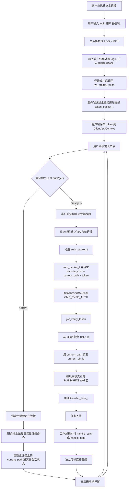
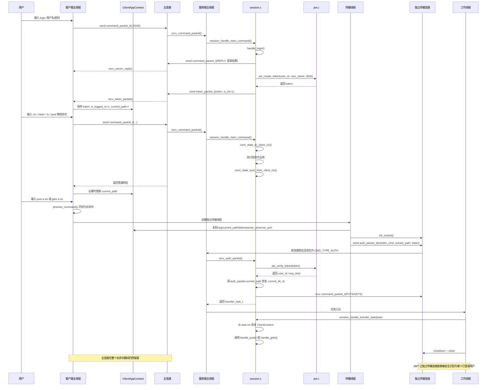
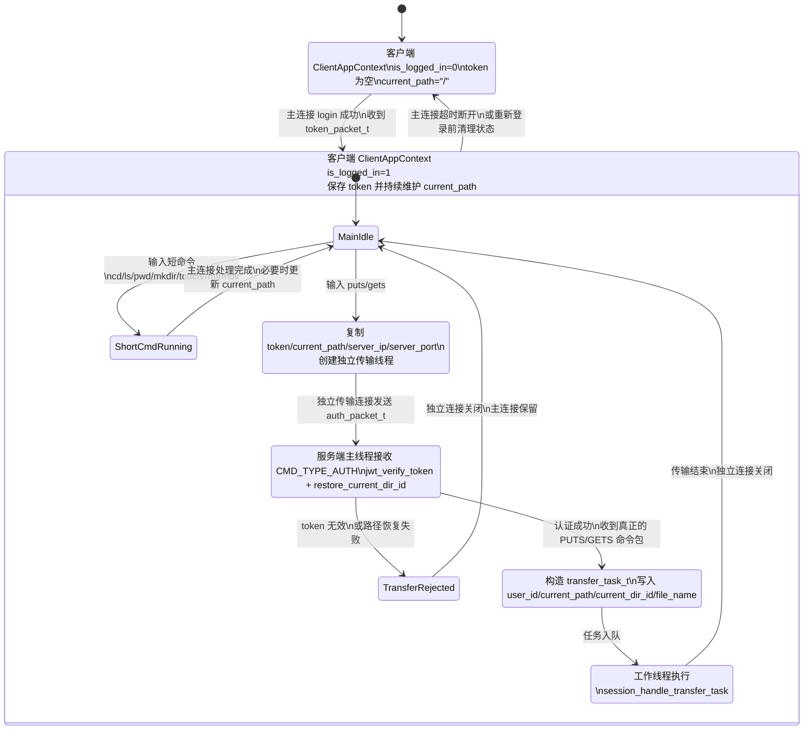

# WindCloud_V4 长短命令分离与JWT协同详解

## 1. 文档目标

这份文档专门解释一个核心问题：

> 为什么当前 V4 里的“长短命令分离”必须和 JWT 配合起来使用  
> 二者在实际代码里是如何一起工作的

这不是把“长短命令分离”和“JWT”当成两个互不相关的功能分别介绍，而是把它们放到同一条执行链里讲清楚。

本文主要对应这些实际代码：

- [client_command_handle.c](/home/liwenshuo/my_project/WindCloud_V4/src/client/client_command_handle.c:301)
- [client_puts.c](/home/liwenshuo/my_project/WindCloud_V4/src/client/client_puts.c:153)
- [client_gets.c](/home/liwenshuo/my_project/WindCloud_V4/src/client/client_gets.c:194)
- [server.c](/home/liwenshuo/my_project/WindCloud_V4/src/server/server.c:417)
- [session.c](/home/liwenshuo/my_project/WindCloud_V4/src/server/session.c:112)
- [jwt.c](/home/liwenshuo/my_project/WindCloud_V4/src/server/jwt.c:289)
- [protocol.h](/home/liwenshuo/my_project/WindCloud_V4/include/protocol.h:62)

---

## 2. 先说结论

当前 V4 的核心设计是：

1. 短命令继续走主连接，由服务端主线程直接处理。
2. 长命令 `puts/gets` 不再占用主连接，而是新建独立传输连接。
3. 既然长命令不再走主连接，那服务端就不能再依赖“这条连接之前已经登录过”来识别用户。
4. 所以登录成功后，服务端要先通过主连接签发 JWT。
5. 客户端发起独立传输连接时，再把 JWT 和当前路径一起放进 `auth_packet_t`。
6. 服务端主线程在独立传输连接上先校验 JWT，再恢复这次传输需要的用户身份和目录上下文。

一句话概括就是：

> 长短命令分离解决“连接和线程如何分工”的问题  
> JWT 解决“独立传输连接如何证明自己属于哪个已登录用户”的问题

---

## 3. 如果只有长短命令分离，没有 JWT，会卡在哪里

V3 里 `puts/gets` 直接跑在原连接上，所以服务端天然知道：

1. 这条连接对应哪个用户
2. 当前路径是什么
3. 当前目录节点 id 是什么

但 V4 改成独立传输连接后，服务端新 `accept` 到的这条传输连接在一开始只知道：

1. 这是一个新的 `fd`
2. 对端刚建立 TCP 连接

它并不知道：

1. 这个连接属于谁
2. 这个用户是否真的已经登录
3. 这次上传或下载应该在用户的哪个逻辑目录下执行

如果没有额外认证手段，服务端就会遇到两个根本问题：

### 3.1 无法把独立传输连接和某个已登录用户绑定起来

因为独立传输连接不是主连接，服务端不能直接从 `ConnManager` 里拿到原来那条主连接的 `ServerConnState` 继续用。

### 3.2 无法恢复这次传输应使用的目录上下文

上传下载都要依赖：

- `user_id`
- `current_path`
- `current_dir_id`

其中：

- `user_id` 需要通过登录身份确定
- `current_path` 由客户端主连接上的短命令不断维护
- `current_dir_id` 需要服务端根据路径恢复

所以 V4 才把 `auth_packet_t` 设计成：

```c
typedef struct {
    int cmd_type;
    int transfer_cmd;
    int data_len;
    char current_path[CMD_DATA_LEN];
    char token[TOKEN_LEN];
} auth_packet_t;
```

也就是说，独立传输连接不是只带一个 token，而是带两类信息：

1. `token`：证明“我是谁”
2. `current_path`：告诉服务端“我要在哪个逻辑路径下做这次传输”

---

## 4. 当前实现里，二者各自负责什么

## 4.1 长短命令分离负责什么

长短命令分离负责的是“执行模型”：

1. 客户端输入命令后，先在 `process_command()` 中分流。
2. `puts/gets` 走独立线程和独立传输连接。
3. 其它命令继续走主连接。
4. 服务端主线程通过 `peek_cmd_type()` 识别这条连接是普通命令还是认证连接。
5. 长命令不再由某个工作线程长期守着主连接，而是整理成 `transfer_task_t` 后再交给线程池。

对应代码：

- [process_command()](/home/liwenshuo/my_project/WindCloud_V4/src/client/client_command_handle.c:301)
- [puts_thread_func()](/home/liwenshuo/my_project/WindCloud_V4/src/client/client_puts.c:153)
- [gets_thread_func()](/home/liwenshuo/my_project/WindCloud_V4/src/client/client_gets.c:194)
- [server.c 主循环中的 `CMD_TYPE_AUTH` 分支](/home/liwenshuo/my_project/WindCloud_V4/src/server/server.c:417)

## 4.2 JWT 负责什么

JWT 负责的是“身份恢复”：

1. 登录成功后，服务端生成 token 并发给客户端。
2. 客户端把 token 保存到 `ClientAppContext`。
3. 客户端发起独立传输连接时，把 token 放进 `auth_packet_t`。
4. 服务端收到认证包后，先校验 token。
5. 校验通过后，从 token 中解析出 `user_id`。

对应代码：

- [session_handle_main_command() 登录成功后签发 token](/home/liwenshuo/my_project/WindCloud_V4/src/server/session.c:138)
- [recv_login_token()](/home/liwenshuo/my_project/WindCloud_V4/src/client/client_command_handle.c:208)
- [jwt_create_token()](/home/liwenshuo/my_project/WindCloud_V4/src/server/jwt.c:289)
- [jwt_verify_token()](/home/liwenshuo/my_project/WindCloud_V4/src/server/jwt.c:361)
- [session_build_transfer_task()](/home/liwenshuo/my_project/WindCloud_V4/src/server/session.c:229)

## 4.3 二者怎么配合

二者在当前代码里的分工可以压缩成下面这张表：

| 功能 | 解决的问题 | 当前实现位置 |
| --- | --- | --- |
| 长短命令分离 | 谁走主连接，谁走独立传输连接 | `client_command_handle.c`、`server.c` |
| JWT | 独立传输连接如何证明自己属于哪个已登录用户 | `session.c`、`jwt.c` |
| `current_path` 回传 | 独立传输连接如何告诉服务端“当前在哪个目录” | `client_puts.c`、`client_gets.c`、`session.c` |
| `restore_current_dir_id()` | 服务端如何把路径恢复成业务层可用目录状态 | `session.c` |

---

## 5. 协同总流程图

下面这张流程图专门画“长短命令分离”和“JWT 配合”这一条联合链路。



## 5.1 这张图要抓住的重点

### 5.1.1 token 不是为了主连接短命令服务的

主连接短命令本来就有 `ServerConnState`，并不依赖 JWT 才能运行。

token 真正服务的是：

> 后面新建出来的独立传输连接

### 5.1.2 JWT 校验发生在工作线程之前

这一点非常关键。  
当前代码不是把认证工作扔给工作线程，而是由服务端主线程先做：

1. `recv_auth_packet`
2. `jwt_verify_token`
3. 恢复目录上下文
4. 收后续命令包
5. 组装 `transfer_task_t`

只有这些都成功，才会真正入队。

### 5.1.3 JWT 只恢复身份，不直接恢复全部业务上下文

token 能恢复的是：

- `user_id`

但这次传输所在的目录，还要结合：

- `auth_packet_t.current_path`

然后通过：

- `restore_current_dir_id()`

才能得到真正可供业务函数使用的：

- `current_dir_id`

---

## 6. 协同时序图

下面这张时序图把“长短命令分离”和“JWT”放在同一条完整链里。



## 6.1 这张时序图体现了哪几个关键配合点

### 6.1.1 token 通过主连接签发，通过独立连接使用

这就是二者的第一个直接配合点。

如果没有“长短命令分离”，token 不必专门给独立传输连接用。  
如果没有 JWT，“独立传输连接”又无法和主连接上的已登录身份接起来。

### 6.1.2 `ClientAppContext` 是两条链之间的桥

客户端主线程把这些信息长期保存在 `ClientAppContext`：

- `sock_fd`
- `is_logged_in`
- `token`
- `current_path`
- `server_ip`
- `server_port`

然后在执行长命令时，把其中最关键的三项复制给传输线程：

1. `token`
2. `current_path`
3. 服务端地址

所以 `ClientAppContext` 在这里扮演的是：

> 主连接长期状态缓存

### 6.1.3 `session_build_transfer_task()` 是协同链的中心点

这个函数把“长短命令分离”和“JWT”真正接到了一起。

它内部做了四件事：

1. 校验 `transfer_cmd` 只能是 `GETS/PUTS`
2. 调 `jwt_verify_token()` 恢复 `user_id`
3. 根据 `current_path` 恢复 `current_dir_id`
4. 收真正的 `command_packet_t` 并填充 `transfer_task_t`

所以它的作用可以概括成一句话：

> 把一个刚接入的独立传输连接，转换成线程池可直接执行的一次传输任务

---

## 7. 关键代码对照

## 7.1 客户端命令分流

```c
if (cmd_type == CMD_TYPE_GETS) {
    return handle_gets_command(ctx, parsed.arg);
}

if (cmd_type == CMD_TYPE_PUTS) {
    return handle_puts_command(ctx, parsed.arg);
}

return handle_normal_command(ctx, cmd_type, input, parsed.arg);
```

对应位置：

- [process_command()](/home/liwenshuo/my_project/WindCloud_V4/src/client/client_command_handle.c:301)

这里决定了：

1. 短命令继续走主连接
2. 长命令改走独立线程

## 7.2 登录成功后保存 token

```c
if (cmd_type == CMD_TYPE_LOGIN && ret == 1) {
    if (recv_login_token(ctx) != 0) {
        reset_client_login_state(ctx);
        return -1;
    }
}
```

对应位置：

- [handle_normal_command()](/home/liwenshuo/my_project/WindCloud_V4/src/client/client_command_handle.c:244)

这里决定了：

> 长命令能不能启动，不只看是否登录成功，还要看是否真的收到了有效 token

## 7.3 传输线程发认证包

上传线程：

```c
init_auth_packet(&auth_packet, CMD_TYPE_PUTS, transfer_args->current_path, transfer_args->token);
send_auth_packet(sock_fd, &auth_packet);
```

下载线程：

```c
init_auth_packet(&auth_packet, CMD_TYPE_GETS, transfer_args->current_path, transfer_args->token);
send_auth_packet(sock_fd, &auth_packet);
```

对应位置：

- [puts_thread_func()](/home/liwenshuo/my_project/WindCloud_V4/src/client/client_puts.c:153)
- [gets_thread_func()](/home/liwenshuo/my_project/WindCloud_V4/src/client/client_gets.c:194)

这里体现的就是：

> 独立传输连接一上来先发认证包，而不是先发文件命令包

## 7.4 服务端识别认证连接

```c
if (cmd_type == CMD_TYPE_AUTH) {
    auth_packet_t auth_packet;
    transfer_task_t task;

    if (recv_auth_packet(fd, &auth_packet) <= 0) {
        ...
    }

    if (session_build_transfer_task(fd, &auth_packet, &task) != 0) {
        ...
    }

    del_epoll_fd(epfd, fd);
    conn_manager_remove(&conn_manager, fd);
    ...
}
```

对应位置：

- [server.c](/home/liwenshuo/my_project/WindCloud_V4/src/server/server.c:417)

这里体现的是：

1. 主线程先识别这是不是传输连接
2. 识别后先做认证和任务整理
3. 成功后才从主线程管理中移除并交给线程池

## 7.5 登录成功后签发 JWT

```c
if (jwt_create_token(ctx.user_id, user_name, JWT_EXPIRE_SECONDS, token, sizeof(token)) == 0) {
    strncpy(state->token, token, sizeof(state->token) - 1);
    token_packet_t token_packet;
    init_token_packet(&token_packet, state->token, 1);
    send_token_packet(client_fd, &token_packet);
}
```

对应位置：

- [session_handle_main_command()](/home/liwenshuo/my_project/WindCloud_V4/src/server/session.c:138)

这里体现的是：

> JWT 的生成属于短命令登录链的一部分  
> 但它的使用目标是后面的长命令链

## 7.6 传输连接上校验 JWT 并恢复上下文

```c
if (jwt_verify_token(auth_packet->token,
                     &task->ctx.user_id,
                     user_name,
                     sizeof(user_name),
                     &exp_time) != 0) {
    return -1;
}

strncpy(task->ctx.current_path, auth_packet->current_path, sizeof(task->ctx.current_path) - 1);
if (restore_current_dir_id(task->ctx.user_id, task->ctx.current_path, &task->ctx.current_dir_id) != 0) {
    return -1;
}
```

对应位置：

- [session_build_transfer_task()](/home/liwenshuo/my_project/WindCloud_V4/src/server/session.c:229)

这里正好说明：

1. JWT 负责恢复 `user_id`
2. `current_path` 负责恢复目录位置
3. 两者缺一不可

---

## 8. 为什么这套设计是合理的

## 8.1 避免工作线程长期空等

这是长短命令分离直接解决的问题。

`puts/gets` 的长时间文件传输不再占住主连接，也不再让主线程堵在单个用户身上。

## 8.2 不把主连接状态直接共享给传输线程

如果强行让独立传输连接去“找回原主连接对象”，代码会变得非常绕：

1. 需要额外建立“传输连接和主连接的绑定关系”
2. 要处理主连接先超时、传输连接后到达的边界
3. 还要处理多个并发传输连接共享同一主连接状态的同步问题

当前实现没有走这条路，而是采用：

> 用 JWT + current_path 重新恢复一次本次传输真正需要的最小上下文

这样更简单，也更贴合当前项目“在 V3 基础上补功能”的目标。

## 8.3 主连接和传输连接职责边界清楚

当前职责划分非常明确：

- 主连接：登录、短命令、长期状态维护、时间轮管理
- 独立传输连接：一次上传或下载
- JWT：把登录链和传输链接起来

这种边界清楚以后，后面不管是讲代码、讲架构，还是做汇报，逻辑都会比较顺。

---

## 9. 一句话总结

如果要把当前 V4 的这套协同机制压缩成一句话，可以这样说：

> 长短命令分离把短命令留在主连接上，把 `puts/gets` 拆到独立传输连接上；JWT 则负责把“这条新传输连接属于哪个已登录用户”这件事重新证明出来，再配合 `current_path` 恢复目录上下文，最后把这次长命令整理成 `transfer_task_t` 交给工作线程执行。

---

## 10. 对象关系状态图

前面的流程图和时序图已经说明了“步骤怎么走”。  
下面再补一张状态图，专门说明四个核心对象之间的关系：

1. `ClientAppContext`
2. `ServerConnState`
3. JWT
4. `transfer_task_t`

这张图更适合回答下面这类问题：

1. 登录成功后，哪些状态留在客户端主线程一侧
2. 服务端主连接长期维护哪些状态
3. 独立传输连接为什么不直接复用主连接状态
4. `transfer_task_t` 到底是在什么时刻出现的



## 10.1 这张状态图怎么读

### 10.1.1 `ClientAppContext` 是客户端长期状态容器

它主要跨越两个阶段：

1. 未登录阶段：`is_logged_in=0`，`token` 为空
2. 已登录阶段：`is_logged_in=1`，保存 token，并随 `cd` 等短命令持续维护 `current_path`

对应代码：

- [client.c 中的 `init_client_app_context()`](/home/liwenshuo/my_project/WindCloud_V4/src/client/client.c:21)
- [recv_login_token()](/home/liwenshuo/my_project/WindCloud_V4/src/client/client_command_handle.c:208)
- [handle_normal_command()](/home/liwenshuo/my_project/WindCloud_V4/src/client/client_command_handle.c:244)

所以 `ClientAppContext` 的职责不是参与文件传输本身，而是：

> 给后续短命令和长命令提供统一的客户端侧状态来源

### 10.1.2 `ServerConnState` 只长期服务主连接

服务端主线程会先为每条新连接建立一份默认的 `ServerConnState`。  
对于主连接，这份状态会长期保留并持续刷新；对于独立传输连接，这份状态只是主线程识别协议类型前的临时登记，认证成功后就会从 `ConnManager` 中移除。

长期保留在主连接上的 `ServerConnState` 里面主要保存：

1. `is_logged_in`
2. `user_id`
3. `current_path`
4. `current_dir_id`
5. `token`（正常情况下非空）
6. 时间轮相关字段

对应代码：

- [conn_manager.h 中的 `ServerConnState`](/home/liwenshuo/my_project/WindCloud_V4/include/conn_manager.h:14)
- [session_handle_main_command()](/home/liwenshuo/my_project/WindCloud_V4/src/server/session.c:112)

这里最关键的一点是：

> 独立传输连接不会直接拿主连接那份长期状态继续执行上传下载

原因不是做不到，而是这样会把主连接、传输连接、线程池三者的耦合拉得很重。  
当前实现改为“在独立传输连接上重新认证一次，并只恢复本次传输真正需要的最小上下文”。

### 10.1.3 JWT 的生命周期比 `transfer_task_t` 更长

JWT 的状态变化大致是：

1. 登录成功后生成
2. 保存在 `ClientAppContext`
3. 需要执行 `puts/gets` 时，被复制到 `auth_packet_t`
4. 在服务端主线程上被校验

而 `transfer_task_t` 的生命周期更短，它只在下面这个时间段存在：

1. 服务端主线程收到认证包
2. 校验 JWT 成功
3. 恢复目录上下文成功
4. 收到真正的 `PUTS/GETS` 命令包
5. 组装任务并入队
6. 工作线程执行完成后，这个任务对象的使命就结束了

对应代码：

- [jwt_create_token()](/home/liwenshuo/my_project/WindCloud_V4/src/server/jwt.c:289)
- [jwt_verify_token()](/home/liwenshuo/my_project/WindCloud_V4/src/server/jwt.c:361)
- [session_build_transfer_task()](/home/liwenshuo/my_project/WindCloud_V4/src/server/session.c:229)

所以二者的关系可以概括成：

> JWT 是“独立传输连接的身份证明”  
> `transfer_task_t` 是“认证通过后交给工作线程的执行载体”

### 10.1.4 为什么状态图里要把“认证失败”单独画出来

因为这正是长短命令分离和 JWT 配合后的一个关键边界：

1. 主连接已经登录成功，不代表所有后续独立传输连接都必然有效
2. 某一次 `puts/gets` 的 token 可能为空、过期、损坏
3. `current_path` 也可能无法恢复成有效目录

此时当前实现的处理是：

1. 这条独立传输连接直接失败
2. 不构造 `transfer_task_t`
3. 主连接仍然保留
4. 客户端可以继续输入短命令，或者重新发起下一次长命令

这正好说明：

> 主连接登录态和某一次独立传输连接是否认证成功，是相关但不完全等价的两件事

## 10.2 再压缩成一句对象关系说明

如果只从四个对象的关系来记，可以记成下面这句话：

> `ClientAppContext` 在客户端长期保存 token 和当前路径；`ServerConnState` 在服务端主连接一侧长期保存登录态和目录状态；JWT 负责让独立传输连接重新证明自己的用户身份；`transfer_task_t` 则把这次已经认证完成的长命令整理成一次可由工作线程执行的具体任务。
