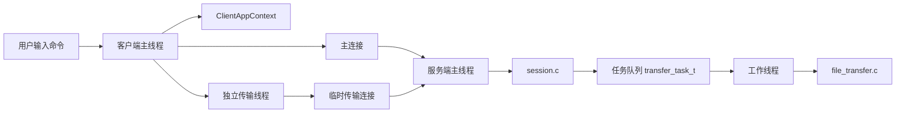
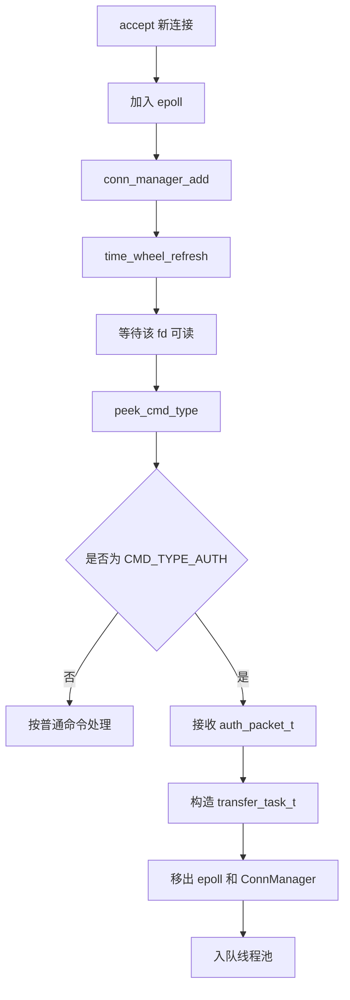
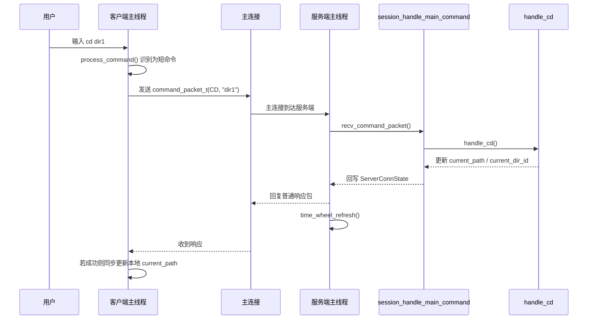
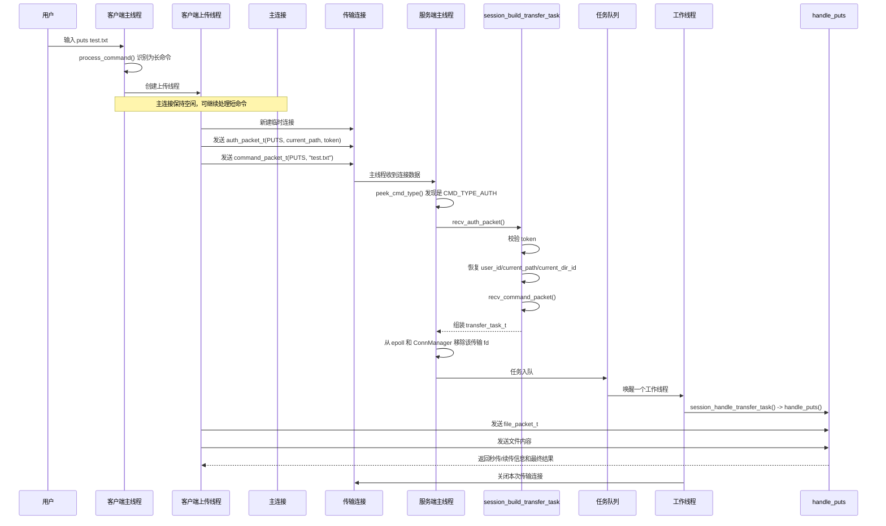
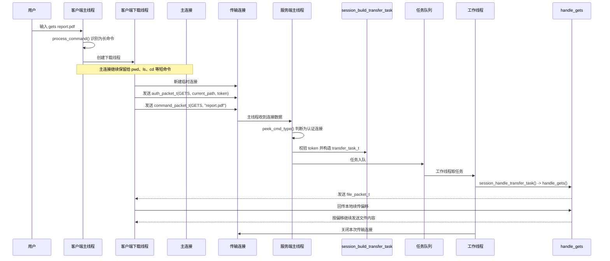

# WindCloud_V4 长短命令分离详解

## 1. 文档目标

这份文档专门说明 V4 中“长短命令分离”的设计与实现。

本文不只解释概念，还会结合当前仓库中的真实代码，详细说明下面这些问题：

1. 什么是长命令，什么是短命令
2. V3 为什么会在 `puts`、`gets` 场景下出现线程被长期占用的问题
3. V4 为什么要做长短命令分离
4. V4 具体是如何把短命令和长命令拆开的
5. 客户端、服务端、线程池、JWT、`ClientContext` 分别在这个设计里承担什么职责
6. 一次 `puts` 和一次 `gets` 从输入命令到真正完成传输，完整链路是怎样的

本文主要对应这些代码文件：

- `src/client/client.c`
- `src/client/client_command_handle.c`
- `src/client/client_puts.c`
- `src/client/client_gets.c`
- `src/server/server.c`
- `src/server/session.c`
- `src/server/worker.c`
- `src/server/thread_pool.c`
- `src/server/queue.c`
- `include/protocol.h`
- `src/common/protocol.c`

---

## 2. 什么是长命令和短命令

在这个项目里，所谓“长短命令分离”，本质上不是按命令名字长短来分，而是按：

> 这条命令会不会长时间占用连接和线程

来分。

### 2.1 短命令

短命令的特点是：

1. 协议往返次数少
2. 处理时间短
3. 不需要持续传输大块数据
4. 主线程可以直接完成

当前项目中的短命令包括：

- `login`
- `register`
- `pwd`
- `cd`
- `ls`
- `mkdir`
- `touch`
- `rm`
- `rmdir`

这些命令通常只需要：

1. 客户端发一个 `command_packet_t`
2. 服务端做一次业务处理
3. 服务端回一个普通响应包

它们的共同特点是：

> 命令处理完成后，连接马上回到“等待下一条命令”的状态

### 2.2 长命令

长命令的特点是：

1. 协议阶段多
2. 会传输真实文件内容
3. 连接会持续占用一段时间
4. 线程一旦阻塞在收发文件内容上，就很难立刻回去处理别的连接

当前项目中的长命令只有两个：

- `puts`
- `gets`

例如：

- `puts` 不只是发一个命令字，还要继续发文件元信息、继续发文件内容
- `gets` 不只是发一个命令字，还要继续收文件信息、继续收文件内容

所以它们天然就属于“长命令”。

---

## 3. V3 为什么会遇到问题

### 3.1 V3 的连接模型

V3 的基本做法可以概括为：

1. 主线程 `accept()` 新连接
2. 把这个连接交给线程池
3. 某个工作线程长期服务这条连接
4. 这个客户端后续所有命令都走这一条连接

也就是说，V3 更接近：

> 一个客户端连接，对应一个长期服务它的工作线程

### 3.2 这个模型在短命令场景下没问题

如果客户端只是在不停执行：

- `pwd`
- `ls`
- `cd`
- `mkdir`

这样的命令，那么工作线程虽然长期绑定了这个连接，但每次处理都比较快，问题还不算明显。

### 3.3 这个模型在长命令场景下会暴露问题

如果客户端开始执行 `puts` 或 `gets`，问题就会出现。

原因是：

1. 上传和下载会持续传输文件内容
2. 工作线程会一直阻塞在文件收发逻辑里
3. 这期间它无法去处理别的客户端
4. 如果有多个客户端同时传大文件，线程池很快就会被占满

这类问题的本质不是“线程池不能用”，而是：

> 线程池里处理的对象太粗了  
> V3 处理的是“整条连接”，而不是“一次具体任务”

---

## 4. V4 的核心思路

V4 的关键改动只有一句话：

> 短命令继续走主连接，长命令改走独立传输连接

把这句话展开，就是下面四个动作。

### 4.1 主连接只保留给短命令

客户端登录成功后，会一直保留一条主连接。

这条连接只负责：

- 登录注册
- 虚拟目录切换
- 普通文件系统命令
- 接收登录成功后的 token

也就是说，主连接的职责变成了：

> 维护用户会话，处理短命令

### 4.2 长命令不再复用主连接

客户端执行 `puts` 或 `gets` 时，不再让主连接继续承担文件传输。

而是：

1. 启动一个独立线程
2. 在线程里重新建立一个临时 socket 连接
3. 先发送认证包
4. 再发送真正的 `puts` 或 `gets` 命令
5. 文件传输完成后关闭这条临时连接

也就是说，长命令的连接模型从：

> 主连接直接传文件

改成了：

> 每次文件传输单独开一条连接

### 4.3 主线程先分流，再决定谁处理

服务端主线程不再只是负责 `accept()`。

它现在还要负责：

1. 判断当前连接发来的首包是什么
2. 如果是普通命令，就直接在主线程处理
3. 如果是认证包，就说明这是传输连接
4. 认证通过后，整理成传输任务，交给线程池

所以 V4 的主线程已经从“接入层”变成了：

> 接入 + 分流 + 短命令处理

### 4.4 线程池改成处理“传输任务”

V3 线程池处理的是：

> 一条连接

V4 线程池处理的是：

> 一次上传任务，或者一次下载任务

这一点在 `transfer_task_t` 里体现得很清楚：

```c
typedef struct{
    int client_fd;
    int cmd_type;
    ClientContext ctx;
    char arg[CMD_DATA_LEN];
}transfer_task_t;
```

也就是说，线程池现在拿到的不是“给你一条连接，你一直处理它”，而是：

1. 这次传输使用哪个 `fd`
2. 这次是 `puts` 还是 `gets`
3. 这次传输对应哪个用户、哪个虚拟目录
4. 这次传输的参数是什么

工作线程做完这一次任务后，就会把连接关闭，然后回去继续等下一个任务。

---

## 5. V4 的总体结构图



这张图里最重要的两点是：

1. 主连接和传输连接已经分成两条链路
2. 工作线程只接触传输任务，不再长期接管主连接

---

## 6. 客户端是如何完成长短命令分离的

## 6.1 客户端长期状态：`ClientAppContext`

V4 客户端新增了一个主连接上下文：

```c
typedef struct {
    int sock_fd;
    int is_logged_in;
    char current_path[CMD_DATA_LEN];
    char token[TOKEN_LEN];
    char server_ip[64];
    char server_port[32];
} ClientAppContext;
```

它保存的是客户端长期状态：

1. 主连接 fd
2. 当前是否已登录
3. 当前虚拟路径
4. 登录后服务端下发的 token
5. 服务端地址

这几个字段正好支撑了长短命令分离需要的全部前提。

例如：

- 短命令要知道主连接是哪个 `fd`
- `cd` 成功后，要更新 `current_path`
- `puts/gets` 启动新线程时，要把 `token`、`current_path`、服务端地址都复制过去

### 6.2 命令分流发生在 `process_command()`

核心分流代码在 `src/client/client_command_handle.c`：

```c
cmd_type = get_cmd_type(parsed.cmd);

if (cmd_type == CMD_TYPE_GETS) {
    return handle_gets_command(ctx, parsed.arg);
}

if (cmd_type == CMD_TYPE_PUTS) {
    return handle_puts_command(ctx, parsed.arg);
}

return handle_normal_command(ctx, cmd_type, input, parsed.arg);
```

这里已经把客户端分成两条路径：

1. `gets` 走独立下载连接
2. `puts` 走独立上传连接
3. 其它命令继续走主连接

这就是客户端侧最直接的“长短命令分离”。

### 6.3 短命令仍然走主连接

普通命令最终会进入 `handle_normal_command()`：

```c
init_command_packet(&cmd_packet, cmd_type, arg);

if (send_command_packet(ctx->sock_fd, &cmd_packet) == -1) {
    ...
}

ret = recv_server_reply(ctx->sock_fd, &reply_packet);
```

这个流程说明：

1. 短命令仍然只使用 `ctx->sock_fd`
2. 发一个 `command_packet_t`
3. 收一个普通响应包
4. 如果是 `login`，还会继续收一个 `token_packet_t`
5. 如果是 `cd`，客户端还会同步更新本地路径

### 6.4 长命令会启动独立线程

以上传为例，`handle_puts_command()` 的核心逻辑是：

```c
transfer_args = (ClientTransferArgs *)calloc(1, sizeof(ClientTransferArgs));

strncpy(transfer_args->arg, arg, sizeof(transfer_args->arg) - 1);
strncpy(transfer_args->current_path, ctx->current_path, sizeof(transfer_args->current_path) - 1);
strncpy(transfer_args->token, ctx->token, sizeof(transfer_args->token) - 1);
strncpy(transfer_args->server_ip, ctx->server_ip, sizeof(transfer_args->server_ip) - 1);
strncpy(transfer_args->server_port, ctx->server_port, sizeof(transfer_args->server_port) - 1);

ret = pthread_create(&tid, NULL, puts_thread_func, transfer_args);
pthread_detach(tid);
```

这段代码说明：

1. 主线程不会直接上传文件
2. 它先把本次传输需要的全部参数复制出来
3. 然后启动后台线程
4. 后台线程独立完成这次上传

下载 `handle_gets_command()` 也是同样模式。

这一步非常关键，因为它保证了：

> 主连接线程和传输线程之间不会争抢同一份可变参数

### 6.5 传输线程会重新建立一条连接

上传线程 `puts_thread_func()` 的关键代码：

```c
init_socket(&sock_fd, transfer_args->server_ip, transfer_args->server_port);

init_auth_packet(&auth_packet, CMD_TYPE_PUTS, transfer_args->current_path, transfer_args->token);
send_auth_packet(sock_fd, &auth_packet);

run_puts_transfer(sock_fd, transfer_args->arg);
```

下载线程 `gets_thread_func()` 的逻辑也是一样：

1. 重新连接服务端
2. 发送 `auth_packet_t`
3. 再执行真正的下载协议

所以客户端侧的本质变化可以总结成：

> 用户只看到一个命令  
> 但客户端内部会把 `puts/gets` 拆成“传输线程 + 临时连接 + 认证包 + 文件协议”

---

## 7. 服务端是如何完成长短命令分离的

## 7.1 主线程成为统一入口

V4 服务端的主循环在 `src/server/server.c`。

现在所有新连接都会先进入主线程，由主线程决定这条连接是什么用途。



这说明 V4 的服务端并没有一开始就区分“主连接”还是“传输连接”。

它真正的做法是：

1. 所有连接先统一接进来
2. 先登记状态
3. 等这个连接发来第一包
4. 再看这第一包到底是什么类型

### 7.2 服务端先用 `peek_cmd_type()` 预读首包类型

关键代码：

```c
ret = recv(client_fd, cmd_type, sizeof(int), MSG_PEEK | MSG_WAITALL);
```

这里使用 `MSG_PEEK` 的意义是：

1. 先看一眼包头里的 `cmd_type`
2. 但不把数据真正从 socket 缓冲区取走
3. 这样后续还能继续按完整结构体接收

于是主线程就可以先判断：

- 这是普通 `command_packet_t`
- 还是 `auth_packet_t`

### 7.3 如果不是认证包，就按短命令处理

服务端主线程处理短命令的逻辑是：

```c
if (recv_command_packet(fd, &cmd_packet) <= 0) {
    ...
}

if (session_handle_main_command(fd, state, &cmd_packet) != 0) {
    ...
}

time_wheel_refresh(&time_wheel, state);
```

这里能看出三件事：

1. 主线程直接接收普通命令包
2. 主线程直接调用 `session_handle_main_command()`
3. 命令处理完后刷新超时位置

所以在 V4 中：

> 短命令根本不会进入线程池

这和 V3 已经完全不同。

### 7.4 如果首包是认证包，就按长命令处理

关键代码：

```c
if (cmd_type == CMD_TYPE_AUTH) {
    auth_packet_t auth_packet;
    transfer_task_t task;

    recv_auth_packet(fd, &auth_packet);

    if (session_build_transfer_task(fd, &auth_packet, &task) != 0) {
        ...
    }

    del_epoll_fd(epfd, fd);
    conn_manager_remove(&conn_manager, fd);

    enQueue(&pool.queue, &task);
    pthread_cond_signal(&pool.cond);
    continue;
}
```

这一段完整体现了 V4 的长命令思路：

1. 主线程先接收认证包
2. 主线程先做认证和任务整理
3. 这条传输连接不会继续留在主线程里
4. 主线程把它转换成一个传输任务
5. 然后交给工作线程执行

这正是“连接级处理”向“任务级处理”的变化。

---

## 8. `session.c` 在长短命令分离中的作用

`session.c` 是 V4 长短命令分离的关键粘合层。

它现在主要承担三件事：

1. 主线程处理普通命令
2. 主线程构造传输任务
3. 工作线程执行传输任务

## 8.1 `session_handle_main_command()` 负责短命令

这个函数的职责是：

1. 把 `ServerConnState` 转成业务层可用的 `ClientContext`
2. 检查登录状态
3. 分发 `pwd/cd/ls/mkdir/touch/rm/rmdir/login/register`
4. 命令处理完成后，把上下文再同步回连接状态

其中 V4 新增的一件重要事情是：

> 登录成功后签发 token

关键代码：

```c
if (old_user_id == -1 && ctx.user_id != -1) {
    strcpy(ctx.current_path, "/");
    ctx.current_dir_id = 0;

    if (jwt_create_token(ctx.user_id, user_name, JWT_EXPIRE_SECONDS, token, sizeof(token)) == 0) {
        strncpy(state->token, token, sizeof(state->token) - 1);
        token_packet_t token_packet;
        init_token_packet(&token_packet, state->token, 1);
        send_token_packet(client_fd, &token_packet);
    }
}
```

也就是说，主连接不只是负责短命令，还负责为后续长命令准备认证材料。

## 8.2 `session_build_transfer_task()` 负责把传输连接变成任务

这个函数是长短命令分离里最核心的函数之一。

它做的事情可以拆成八步：

1. 检查认证包是否合法
2. 确认本次只允许 `puts` 或 `gets`
3. 校验 token
4. 从 token 中恢复 `user_id`
5. 从认证包中取出 `current_path`
6. 调数据库恢复 `current_dir_id`
7. 再接收这条连接上的真正命令包
8. 组装出 `transfer_task_t`

关键代码：

```c
if (jwt_verify_token(auth_packet->token,
                     &task->ctx.user_id,
                     user_name,
                     sizeof(user_name),
                     &exp_time) != 0) {
    return -1;
}

strncpy(task->ctx.current_path, auth_packet->current_path, sizeof(task->ctx.current_path) - 1);
if (restore_current_dir_id(task->ctx.user_id, task->ctx.current_path, &task->ctx.current_dir_id) != 0) {
    return -1;
}

if (recv_command_packet(client_fd, &cmd_packet) <= 0) {
    return -1;
}

task->client_fd = client_fd;
task->cmd_type = cmd_packet.cmd_type;
strncpy(task->arg, cmd_packet.data, sizeof(task->arg) - 1);
```

这一段代码特别重要，因为它说明：

> 工作线程不需要再自己登录、自己切目录、自己维护连接状态  
> 主线程在任务入队前，就把传输所需上下文整理好了

## 8.3 `session_handle_transfer_task()` 负责在工作线程中执行一次任务

工作线程最终调用的是：

```c
if (task->cmd_type == CMD_TYPE_GETS) {
    handle_gets(task->client_fd, &ctx, (char *)task->arg);
    return;
}

if (task->cmd_type == CMD_TYPE_PUTS) {
    handle_puts(task->client_fd, &ctx, (char *)task->arg);
    return;
}
```

这意味着工作线程现在只做一件很纯粹的事：

> 拿到准备好的上下文，执行一次上传或下载

它不会再进入“长时间循环读取不同命令”的状态。

---

## 9. 线程池为什么也必须改

如果只是在客户端开一条新连接，而服务端线程池模型不改，那么问题并没有真正解决。

V4 之所以成立，是因为线程池处理对象也一起改了。

## 9.1 队列里保存的已经不是 fd

当前任务队列保存的是 `transfer_task_t`：

```c
typedef struct node_s{
    transfer_task_t task;
    struct node_s*pNext;
}node_t;
```

这说明主线程入队的不是“某个客户端连接”，而是“一次具体传输任务”。

## 9.2 工作线程只在需要时才被唤醒

`worker.c` 中的核心逻辑：

```c
while (pool->queue.size==0 && !pool->exitFlag) {
    pthread_cond_wait(&pool->cond, &pool->lock);
}

transfer_task_t task;
if (deQueue(&pool->queue, &task) != 0) {
    ...
}

session_handle_transfer_task(&task);

shutdown(task.client_fd, SHUT_RDWR);
close(task.client_fd);
```

这个模型说明：

1. 没有传输任务时，工作线程休眠
2. 有传输任务入队时，被唤醒
3. 执行一次 `puts` 或 `gets`
4. 关闭这次传输连接
5. 返回等待状态

因此 V4 线程池真正变成了：

> 按需消费长命令任务的执行池

而不是：

> 每个线程长期绑定一条客户端连接

---

## 10. 协议层为了长短命令分离增加了什么

长短命令分离不是只改控制流，协议层也必须跟着改。

## 10.1 新增了两个命令类型

在 `include/protocol.h` 中，V4 增加了：

```c
CMD_TYPE_AUTH,
CMD_TYPE_TOKEN,
```

它们分别表示：

- `CMD_TYPE_AUTH`：传输连接建立后先发的认证包
- `CMD_TYPE_TOKEN`：登录成功后服务端额外下发的 token 包

## 10.2 新增了两个协议结构体

### `auth_packet_t`

```c
typedef struct {
    int cmd_type;
    int transfer_cmd;
    int data_len;
    char current_path[CMD_DATA_LEN];
    char token[TOKEN_LEN];
} auth_packet_t;
```

它的作用是让传输连接告诉服务端：

1. 我是一条认证连接
2. 我后面真正要执行的是 `puts` 还是 `gets`
3. 我当前在哪个虚拟目录
4. 我是谁的连接

### `token_packet_t`

```c
typedef struct {
    int cmd_type;
    int is_ok;
    int data_len;
    char token[TOKEN_LEN];
} token_packet_t;
```

它的作用是让服务端在主连接登录成功后，把后续传输需要使用的 token 下发给客户端。

如果没有这两个协议结构体，长短命令分离在网络层就无法成立。

---

## 11. 一次短命令的完整链路

下面以 `cd dir1` 为例。



这条链路的特点是：

1. 不进入线程池
2. 不建立新连接
3. 不需要认证包
4. 主线程直接完成

---

## 12. 一次 `puts` 的完整链路



这条链路最重要的结构变化有三点：

1. `puts` 已经不再占用主连接
2. 主线程只负责认证和入队
3. 工作线程只负责真正上传

---

## 13. 一次 `gets` 的完整链路



下载链路和上传链路的结构完全一致，只是文件收发方向相反。

---

## 14. JWT 在长短命令分离里为什么是必需的

长短命令分离之后，会出现一个新问题：

> `puts/gets` 已经不再走主连接  
> 那服务端如何知道这条新建的传输连接属于谁

V4 的答案是：

> 传输连接先带上 JWT，再由服务端主线程校验

客户端在登录成功后，会在主连接上收到 `token_packet_t`，然后把 token 保存到 `ClientAppContext.token`。

以后每次启动 `puts/gets` 线程时，都会把这个 token 放进 `auth_packet_t`：

```c
init_auth_packet(&auth_packet, CMD_TYPE_PUTS, transfer_args->current_path, transfer_args->token);
```

服务端在 `session_build_transfer_task()` 中校验这个 token：

```c
if (jwt_verify_token(auth_packet->token,
                     &task->ctx.user_id,
                     user_name,
                     sizeof(user_name),
                     &exp_time) != 0) {
    return -1;
}
```

这样，独立传输连接虽然不是原来的主连接，但服务端仍然能恢复：

1. 这是谁的连接
2. 这个用户当前在哪个目录

因此从架构关系上看：

- 长短命令分离负责“把连接拆开”
- JWT 负责“让拆开的连接仍然能识别身份”

两者是配套关系。

---

## 15. `ClientContext` 在长短命令分离里负责什么

这里很容易混淆，必须分开看。

## 15.1 `ClientAppContext` 是客户端长期状态

它存在于客户端主线程中，主要解决：

1. 主连接是谁
2. 当前路径是什么
3. token 是什么
4. 以后传输线程该连哪台服务器

## 15.2 `ClientContext` 是服务端业务上下文

它定义在协议层：

```c
typedef struct{
    int user_id;
    char current_path[256];
    int current_dir_id;
}ClientContext;
```

它存在于服务端业务处理过程中，主要解决：

1. 当前用户是谁
2. 当前虚拟路径是什么
3. 当前目录节点 id 是多少

`handle_pwd()`、`handle_cd()`、`handle_ls()`、`handle_puts()`、`handle_gets()` 这些业务函数真正依赖的是它。

## 15.3 为什么 JWT 不能代替 `ClientContext`

JWT 只能解决：

1. 身份是谁
2. token 有没有过期
3. token 有没有被篡改

但它并不直接提供：

1. 当前目录节点 id
2. 本次业务函数需要使用的完整目录上下文

所以服务端在传输连接认证通过后，仍然要：

1. 用 JWT 恢复 `user_id`
2. 用 `auth_packet_t.current_path` 恢复当前路径
3. 用数据库查询恢复 `current_dir_id`
4. 最后重新拼成一个完整的 `ClientContext`

因此更准确的说法是：

> JWT 负责证明身份  
> `ClientContext` 负责承载业务处理所需的完整上下文

---

## 16. 这个设计带来了什么效果

## 16.1 主连接不会再被文件传输长期占住

`puts/gets` 改成独立连接后，主连接就能继续服务短命令，也能继续被时间轮管理。

## 16.2 工作线程只在真正需要时才处理长命令

线程池不再因为某个客户端长时间空闲而白白占住线程。

## 16.3 结构更接近“主线程调度，工作线程执行”

V4 的结构已经从 V3 的“连接长期托管”变成了更清晰的职责分工：

1. 主线程维护连接和分流
2. `session.c` 负责协议衔接和任务整理
3. 工作线程负责一次传输任务

## 16.4 传输连接可以天然做到“一次一用”

每次 `puts/gets` 都是：

1. 新建连接
2. 认证
3. 传输
4. 关闭

这种模型简单直接，也符合当前项目保持初学者代码风格的目标。

---

## 17. 当前实现的边界和取舍

当前项目的长短命令分离实现是务实型实现，它的优点是改动路径清晰，能直接接在 V3 上。

但它也有几个明确边界：

1. 传输连接不是连接池模型，而是每次新建一次
2. 主连接和传输连接之间的状态同步，主要靠 `token + current_path`
3. 主线程仍然要先接收认证包和命令包，再把任务交给线程池
4. 时间轮主要管理主连接，传输连接只是先经过主线程识别，再移出状态管理

这些取舍都不是错误，而是当前版本为了：

> 在尽量保持 V3 项目结构不大改的前提下，把第四期功能接进去

所做的合理选择。

---

## 18. 一句话总结

V4 的“长短命令分离”并不是简单地把 `puts` 和 `gets` 放到别的文件里，而是从客户端、协议层、服务端主循环、会话层、线程池模型五个层面一起做了改造：

> 客户端主连接专门处理短命令；`puts/gets` 启动独立线程并建立临时传输连接；服务端主线程先根据首包完成分流，短命令自己处理，长命令认证后整理成 `transfer_task_t` 交给工作线程；工作线程只执行一次上传或下载任务，做完就关闭这条传输连接。

