# WindCloud_V5 全流程时序图详解

## 1. 文档目标

这份文档用**时序图**解释 V5 代码中的关键交互顺序。

这三份“全流程图解”文档的分工如下：

1. [V5全流程活动图详解.md](/home/liwenshuo/my_project/WindCloud_V4/docs/V5全流程活动图详解.md)
   重点看流程骨架、判断分支和循环结构。
2. [V5全流程时序图详解.md](/home/liwenshuo/my_project/WindCloud_V4/docs/V5全流程时序图详解.md)
   重点看模块交互顺序、协议包顺序和调用顺序。
3. `V5全流程状态图详解.md`
   重点看核心对象的状态变化和状态切换条件。

如果说活动图主要回答的是：

- 先做什么
- 后做什么
- 在哪里分支

那么时序图主要回答的是：

- 是谁先调用了谁
- 是谁先给谁发送了什么数据
- 某一步完成后，下一步由哪个模块继续接手
- 某个失败分支在哪一侧被发现，又是如何返回的

本文会把 V5 的时序拆成下面这些核心场景：

1. 客户端登录成功并接收 JWT
2. 客户端注册
3. 一条普通短命令的完整交互
4. `cd` 成功后客户端和服务端如何同步路径
5. `puts` 在控制连接上申请一次性票据
6. `puts` 上传的完整交互
7. `puts` 的秒传分支
8. `puts` 的续传 / 中断分支
9. `gets` 在控制连接上申请多点下载方案
10. `gets` 为每个分片申请区间票据
11. `gets` 单个分片下载的完整交互
12. 下载管理线程合并和恢复流程
13. 控制连接超时断开
14. 服务端退出时主线程与工作线程的协作

本文主要对照这些代码：

- `src/client/client.c`
- `src/client/client_command_handle.c`
- `src/client/client_puts.c`
- `src/client/client_gets.c`
- `src/client/multipart_meta.c`
- `src/server/core/server.c`
- `src/server/core/session.c`
- `src/server/core/worker.c`
- `src/server/file/file_transfer.c`
- `src/server/security/auth.c`
- `src/server/security/transfer_ticket.c`
- `src/server/data/dao_vfs.c`
- `src/server/data/dao_file.c`
- `src/server/data/dao_file_source.c`
- `src/common/protocol.c`

---

## 2. 阅读时序图的方法

### 2.1 先看参与者，再看消息

Mermaid 的 `sequenceDiagram` 里最重要的是两件事：

1. 左右有哪些参与者
2. 这些参与者之间按什么顺序传递消息

在本文里，常见参与者有：

- `U`：用户输入
- `CMain`：客户端主线程
- `CPut`：客户端上传线程
- `CGetMgr`：客户端下载管理线程
- `CGetPart`：客户端分片下载线程
- `CtrlConn`：客户端控制连接
- `TransConn`：客户端独立传输连接
- `SMain`：服务端主线程
- `Sess`：`session.c`
- `Auth`：`auth.c`
- `Ticket`：`transfer_ticket.c`
- `Worker`：工作线程
- `FT`：`file_transfer.c`
- `VFS`：`dao_vfs.c`
- `DF`：`dao_file.c`
- `FSrc`：`dao_file_source.c`
- `DB`：MySQL
- `Disk`：`test/server_files/<sha256>` 里的真实文件
- `Meta`：`.multipart` 元数据文件

### 2.2 时序图和活动图的关系

活动图文档偏重：

- 流程骨架
- 判断分支
- 循环结构

这一份时序图文档偏重：

- 消息顺序
- 协议包顺序
- 模块交接顺序

可以把两份文档配合起来读：

1. 先用活动图确定流程大方向
2. 再用时序图看这条链里每一步是谁和谁交互

图中的背景色按阶段区分：蓝色多用于入口和控制请求，黄色用于连接建立或准备动作，绿色用于认证、票据和正常业务处理，紫色用于数据读写或数据库协作，红色用于关闭、失败或收尾。

---

## 3. 登录成功并接收 JWT 时序图

这是 V5 所有后续链路的起点。

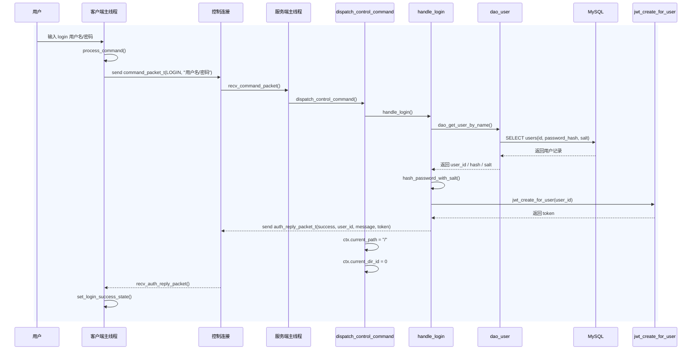

### 3.1 这条时序最关键的四件事

#### A. 登录成功后只返回一包 `auth_reply_packet_t`

和 V4 不同，V5 登录成功后不再是：

1. 先回文本响应
2. 再回独立 token 包

而是直接一次返回：

```c
auth_reply_packet_t
```

里面同时包含：

1. `success`
2. `user_id`
3. `message`
4. `token`

#### B. JWT 是登录态的一部分

客户端登录成功后会保存：

1. `logged_in = 1`
2. `user_id`
3. `token`
4. `current_path = "/"`

后续控制连接不会每次都显式发 JWT，但传输票据签发前必须先经过这条登录链。

#### C. 登录成功时，服务端会同时初始化目录状态

在 `dispatch_control_command()` 里，首次登录成功后会执行：

```c
strcpy(ctx->current_path, "/");
ctx->current_dir_id = 0;
```

这一步很重要，因为：

1. 后续控制连接短命令要依赖所在目录
2. 后续传输票据要根据所在目录拼完整虚拟路径

---

## 4. 注册命令时序图

注册没有 JWT，下图可以和登录流程对照看。

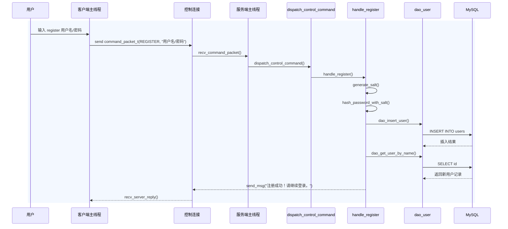

### 4.1 为什么注册不下发 JWT

因为项目里：

> JWT 代表“已经通过登录校验的会话身份”

注册只是创建用户，并不代表已经进入登录态。
因此注册成功后，客户端仍停留在登录菜单，而不是直接进入已登录主循环。

---

## 5. 普通短命令时序图

下面先用 `pwd` 作为最简单的短命令例子。

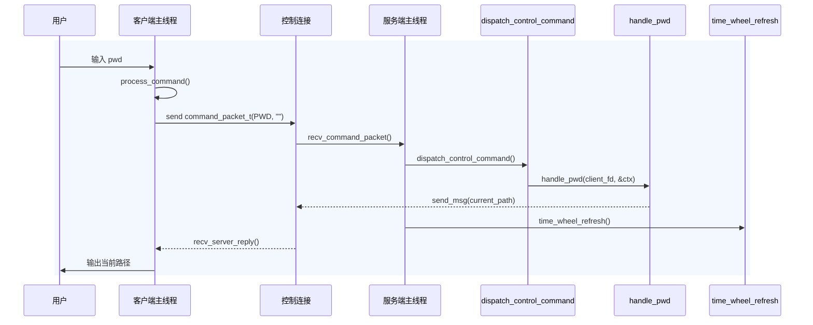

### 5.1 这条链路的关键点

#### A. 短命令不会进入线程池

V5 中，控制连接上的：

- `pwd`
- `ls`
- `mkdir`
- `touch`
- `rm`
- `rmdir`

都是主线程在 `handle_control_event()` 里直接收包，再交给 `dispatch_control_command()` 处理。

#### B. 短命令处理完成后会刷新时间轮

这表示：

> 一条普通短命令本身就代表“这个控制连接最近有活动”

因此，超时位置要往后顺延。

---

## 6. `cd` 成功后的路径同步时序图

`cd` 比 `pwd` 多一层“客户端本地路径也要同步”的动作。

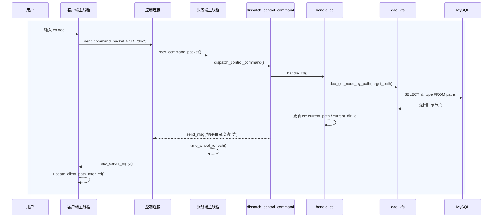

### 6.1 为什么 `cd` 要两边都更新

服务端更新是为了后续业务正确执行。
客户端更新是为了后续：

1. `puts` 申请传输票据
2. `gets` 申请下载方案

都能基于正确的远端目录拼出完整虚拟路径。

---

## 7. `puts` 在控制连接上申请一次性票据

这张图对应 `request_transfer_ticket()` 和服务端 `handle_transfer_prepare()`。

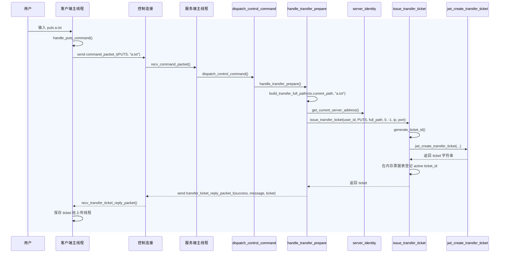

### 7.1 这张图的关键点

#### A. 控制连接上的 `puts` 不传文件内容

它只负责：

1. 把 `current_path + 文件名` 拼成完整虚拟路径
2. 读取本服务端地址
3. 签发一张一次性传输票据

文件内容完全不走控制连接。

#### B. 票据里不仅绑定用户和命令，还绑定目标数据源地址

也就是说，后续传输连接拿着这张票据，只能连到票据中指定的那台服务器。

---

## 8. `puts` 上传的完整交互

这是 V5 里最重要的图之一。

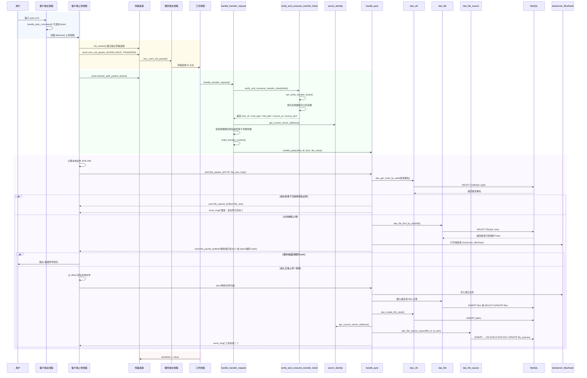

## 8.1 为什么 `puts` 的时序要分成“主线程接入”和“工作线程执行”

因为 V5 的实现明确分成了两层：

### 第一层：主线程做连接角色分流

主线程只负责：

1. 收 `conn_init_packet_t`
2. 判断这是控制连接还是传输连接
3. 把传输连接 fd 投递给线程池

### 第二层：工作线程执行传输

工作线程负责：

1. 收 `transfer_auth_packet_t`
2. 校验并消费一次性票据
3. 恢复传输上下文
4. 进入 `handle_puts()`

这和 V4 明显不同，V5 不再需要“主线程先 peek 再收 auth 包再构造任务”的那一套。

---

## 9. `puts` 秒传分支时序图

秒传是 `puts` 的一个重要分支，单独拆出来更容易理解。

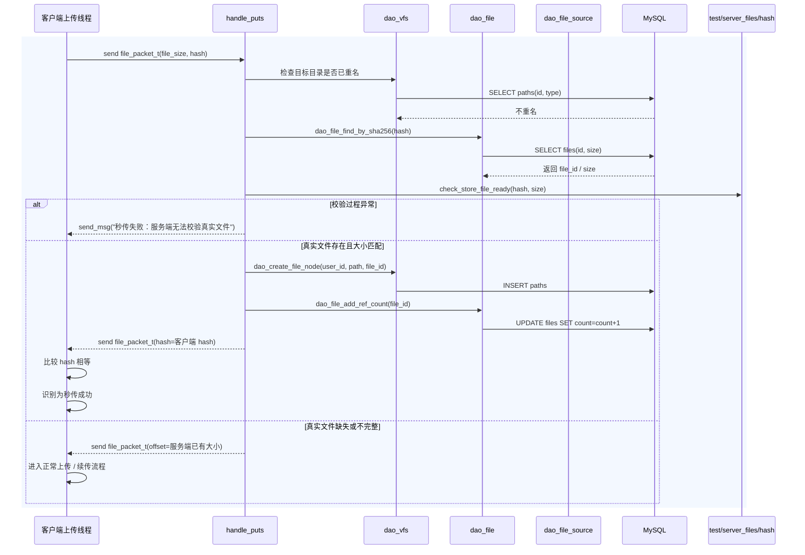

### 9.1 秒传不只看数据库

服务端不会因为 `files` 表里查到相同 hash，就立刻秒传。
它还会继续检查：

1. `test/server_files/<hash>` 是否存在
2. 它是不是普通文件
3. 它的大小是否和 `files.size` 一致

只有这几项都成立，才会进入秒传。

---

## 10. `puts` 续传 / 中断分支时序图

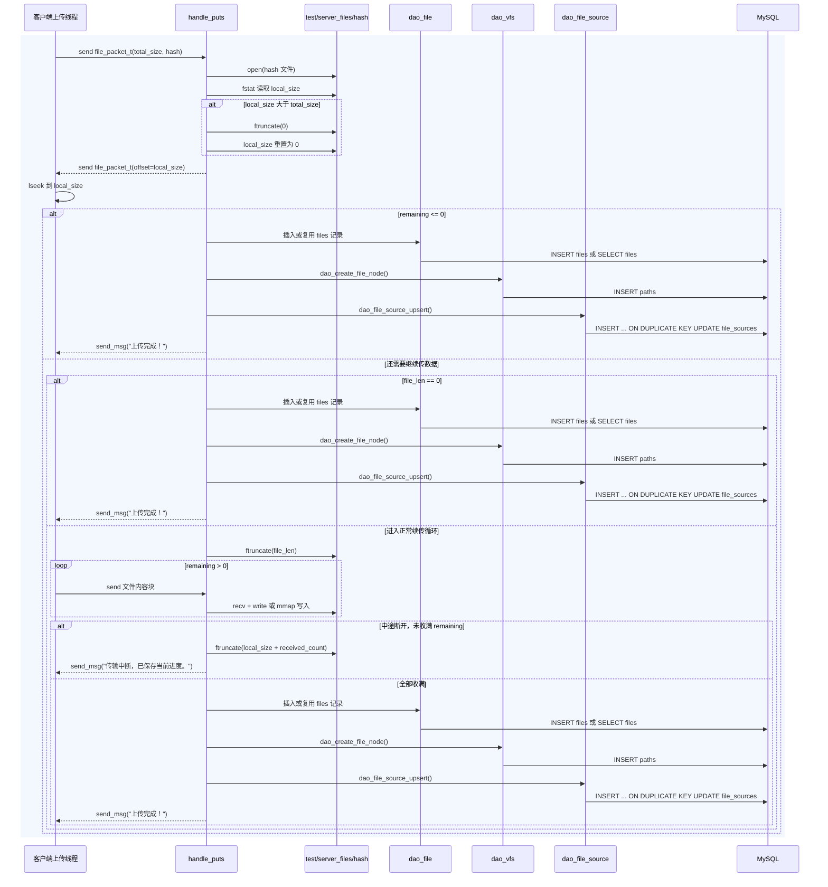

### 10.1 为什么中断后还要 `ftruncate`

因为服务端在接收前可能已经：

```c
ftruncate(file_fd, file_len);
```

把文件扩展到了目标总大小。
如果中途断开却不把它截回真实收到的位置，就会留下尾部空洞或脏内容。

---

## 11. `gets` 在控制连接上申请多点下载方案

这是第五期新增的重要时序。

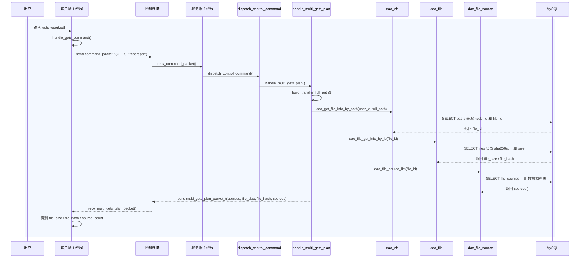

### 11.1 这条时序的关键点

#### A. 控制连接上的 `gets` 不是“直接下载”

它现在只负责：

1. 查逻辑文件
2. 查真实文件大小和 hash
3. 查可用数据源服务器
4. 返回一份完整下载方案

#### B. `file_sources` 是第五期多点下载的关键表

没有这张表，控制服务器就不知道：

> 哪些服务器可以提供同一份真实文件

---

## 12. `gets` 为每个分片申请区间票据

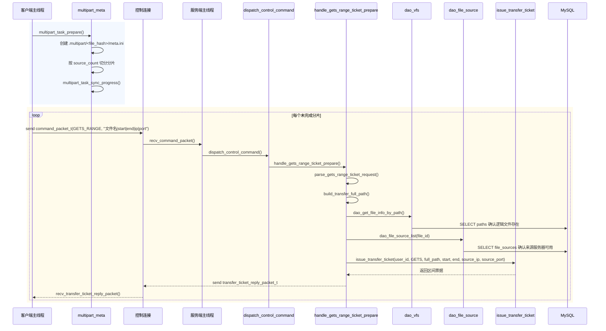

### 12.1 为什么每个分片都要单独申请票据

因为票据绑定了：

1. 用户
2. 命令类型
3. 完整路径
4. 分片区间
5. 目标数据源服务器

因此，每个分片天然都应该拿到自己的独立票据。

---

## 13. `gets` 单个分片下载完整时序图

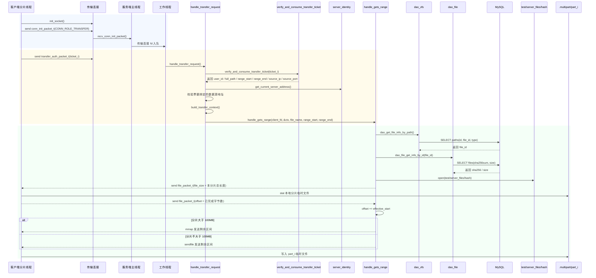

### 13.1 这条时序里最重要的两个点

#### A. V5 的分片下载仍然复用了旧的“服务端先发 file_packet，客户端再回 offset”协议骨架

因此，第五期不是重写下载协议，而是在原协议外面又包了一层：

1. 下载方案申请
2. 区间票据申请
3. 传输连接认证

#### B. 分片线程并不直接写最终文件

它只写：

```text
.multipart/<file_hash>/part_i
```

最终文件是在下载管理线程里统一合并出来的。

---

## 14. 下载管理线程合并和恢复时序图

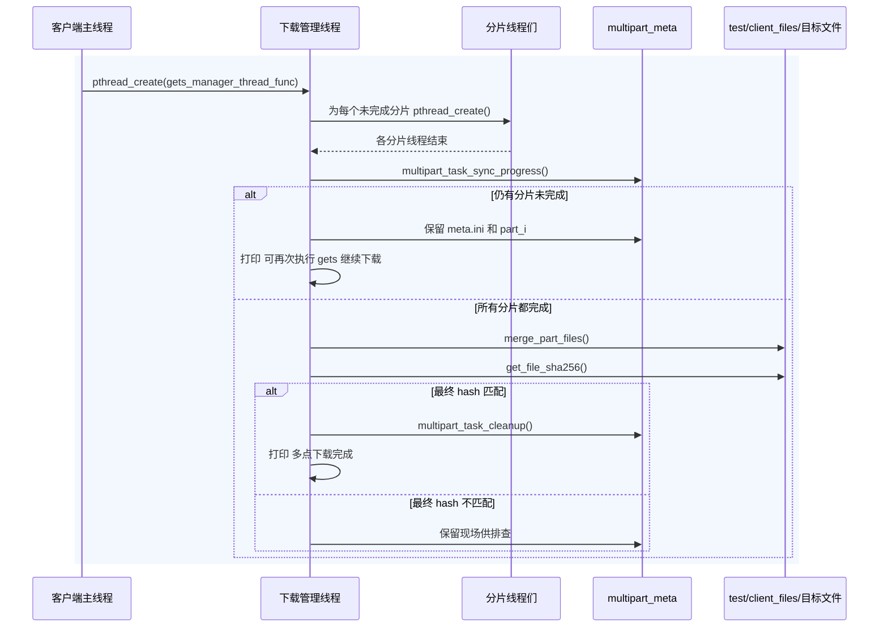

### 14.1 为什么第五期必须单独有这张图

因为下载流程已经不再是“一个线程拉完整文件”。

而是：

1. 主线程负责申请方案和票据
2. 管理线程负责组织整轮下载
3. 分片线程负责联网收数据
4. 管理线程最后再负责合并和校验

如果不把管理线程单独画出来，就很难解释为什么：

1. 分片没下完时还能恢复
2. 最终文件不是边下边写出来的

---

## 15. 控制连接超时断开时序图

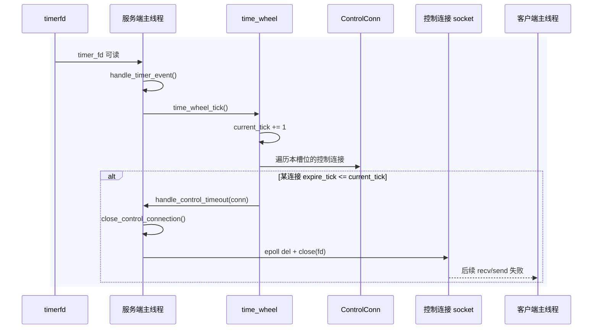

### 15.1 这里和 V4 的一个关键差异

V5 客户端代码里没有自动重连逻辑。
所以服务端把控制连接超时关闭后，客户端后续只会表现为：

1. 控制连接上的命令发送失败或接收失败
2. 主循环继续存在
3. 由用户决定后续如何处理

---

## 16. 服务端退出时主线程与工作线程的协作

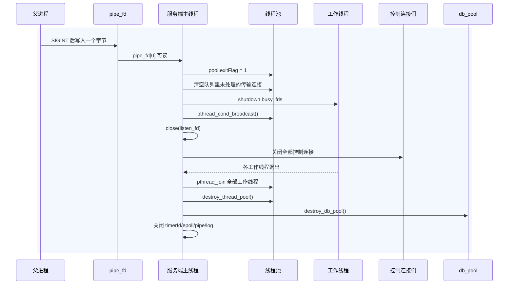

### 16.1 为什么退出流程也值得画时序图

因为服务端退出不是“主线程自己结束”这么简单。

它还要和：

1. 父进程
2. 管道
3. 工作线程
4. 控制连接
5. 数据库连接池

发生一整串协作，才能把进程退出做干净。

---

## 17. 总结

V5 的时序骨架可以概括成一句话：

> 控制连接负责登录、短命令、上传票据、下载方案和分片票据；传输连接只负责拿着一次性票据做文件传输；第五期 `gets` 又在客户端内部拆成“主线程申请方案 + 管理线程组织 + 分片线程下载 + 管理线程合并”的四段时序。
