# WindCloud_V5 全流程活动图详解

## 1. 文档目标

这份文档用**活动图**把 V5 代码中的主要执行流程拆开讲清楚。

这三份“全流程图解”文档的分工如下：

1. [V5全流程活动图详解.md](/home/liwenshuo/my_project/WindCloud_V4/docs/V5全流程活动图详解.md)
   重点看流程骨架、判断分支和循环结构。
2. `V5全流程时序图详解.md`
   重点看模块交互顺序、协议包顺序和调用顺序。
3. `V5全流程状态图详解.md`
   重点看核心对象的状态变化和状态切换条件。

本文的重点不是模块分层，而是：

1. 程序从哪里开始进入
2. 每条主链路经历了哪些判断
3. 每个阶段可能分出哪些分支
4. 分支最终如何回到主流程，或者直接结束

为了方便对照代码，本文中的活动图会尽量对应到实际文件：

- `src/server/core/server.c`
- `src/server/core/session.c`
- `src/server/core/worker.c`
- `src/server/net/time_wheel.c`
- `src/client/client.c`
- `src/client/client_command_handle.c`
- `src/client/client_puts.c`
- `src/client/client_gets.c`
- `src/client/multipart_meta.c`

这份文档重点解决“**流程骨架怎么跑**”的问题。  
如果要继续向下钻细节，建议再配合时序图文档和状态图文档一起看。

---

## 2. 阅读方法

活动图和时序图、状态图的关注点不同。

### 2.1 活动图看什么

活动图主要看：

1. 流程执行到哪一步
2. 这一步会做什么判断
3. 判断成功和判断失败分别往哪里走
4. 哪些流程会结束，哪些流程会回到循环入口

因此，活动图特别适合回答这类问题：

- 服务端启动时先做什么、后做什么
- 客户端登录成功后下一步会进入哪个循环
- 服务端怎么判断一条新连接是控制连接还是传输连接
- `puts` 和 `gets` 在哪一步分叉
- 第五期多点下载是先申请方案，还是先起线程
- 控制连接超时后是从哪里切出去的

### 2.2 本文为什么拆成多张活动图

如果把 V5 所有流程都硬塞进一张大图，会很难读。

所以本文按代码执行层次，拆成下面几部分：

1. V5 总体执行骨架
2. 服务端启动与退出流程
3. 客户端启动、登录与命令循环流程
4. 客户端命令分流流程
5. 服务端 `epoll` 主循环流程
6. 控制连接命令处理流程
7. 传输连接票据校验与分发流程
8. 上传 `puts` 活动图
9. 下载 `gets` 活动图
10. 工作线程执行传输任务流程
11. 时间轮超时处理流程

这样读的时候，可以先看总图，再顺着某一条分支钻进去。

图中的颜色按流程阶段区分：蓝色通常表示入口或准备阶段，黄色表示判断和分流，青色表示控制链或票据链，绿色表示传输和正常执行，紫色表示收尾，红色表示失败、中断或保留现场。

---

## 3. V5 总体执行骨架

先用一张总活动图把客户端和服务端的主要运行方式放在一起。

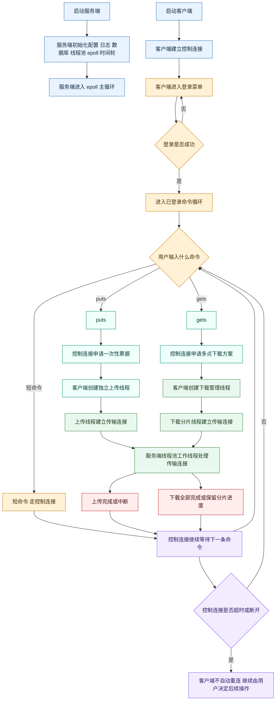

这张总图只强调一件事：

> V5 的核心不是“多了几个模块”，而是命令从输入开始就分成控制链和传输链；`gets` 进一步拆成“方案申请 + 分片下载”两阶段。

---

## 4. 服务端启动与退出活动图

服务端入口是 `src/server/core/server.c` 的 `main()`。

## 4.1 服务端启动主流程

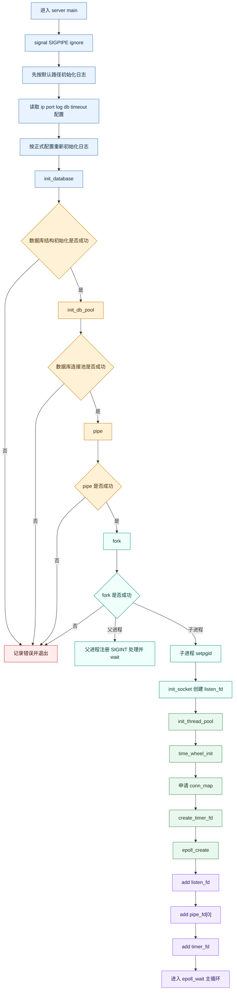

### 4.1.1 这张图要抓住的重点

#### A. 服务端仍然不是单进程死循环

代码里仍然保留：

```c
pipe(pipe_fd);
pid_t pid = fork();
```

也就是说：

1. 父进程负责接收 `SIGINT`
2. 父进程通过管道通知子进程退出
3. 子进程才运行服务器主逻辑

#### B. V5 的主线程不仅负责监听新连接

启动阶段已经能看出 V5 的主线程后面还要管理：

1. `timerfd`
2. 控制连接 `epoll`
3. 控制连接时间轮

这说明模型不是“主线程只做 `accept`”，而是：

> 主线程直接管理控制连接，线程池只处理传输连接

---

## 4.2 服务端退出活动图

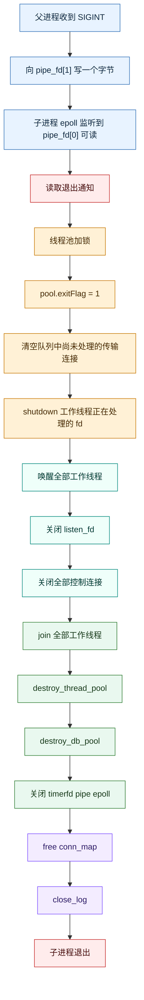

### 4.2.1 退出流程为什么值得单独画

因为代码不是“只关主线程”，而是还要处理：

1. 队列中尚未开始的传输连接
2. 工作线程正在处理的传输连接
3. 主线程维护的控制连接映射表
4. 时间轮中的控制连接

因此，V5 的退出流程是一条完整的“全局清理链”，不是简单 `exit()`。

---

## 5. 客户端启动、登录与主循环活动图

客户端入口是 `src/client/client.c` 的 `main()`。

## 5.1 客户端启动与登录总流程

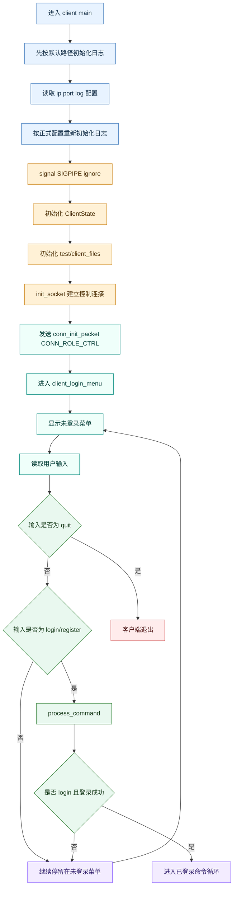

### 5.1.1 这里和 V4 的一个关键差异

`client.c` 里已经没有“控制连接失效后自动重连”的代码路径。

也就是说，V5 客户端主流程是：

1. 启动时建立一次控制连接
2. 登录成功后进入命令循环
3. 后续命令如果因为控制连接断开而失败，`main()` 不会自动重连

因此活动图里不能再画 V4 那条“重新建立主连接并重新登录”的链路。

---

## 5.2 已登录命令循环活动图

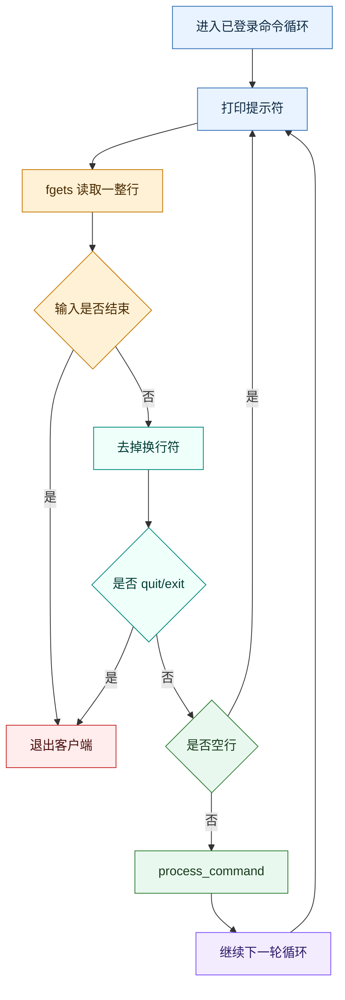

### 5.2.1 这条流程里最重要的事实

V5 客户端主循环很直接：

1. 读输入
2. 交给 `process_command()`
3. 不做自动重连分支
4. 继续下一轮

因此，后续复杂度都转移到了 `process_command()` 和 `puts/gets` 各自的处理函数里。

---

## 6. 客户端命令分流活动图

客户端把命令分成“短命令链”和“长命令链”的位置，在 `src/client/client_command_handle.c` 的 `process_command()`。

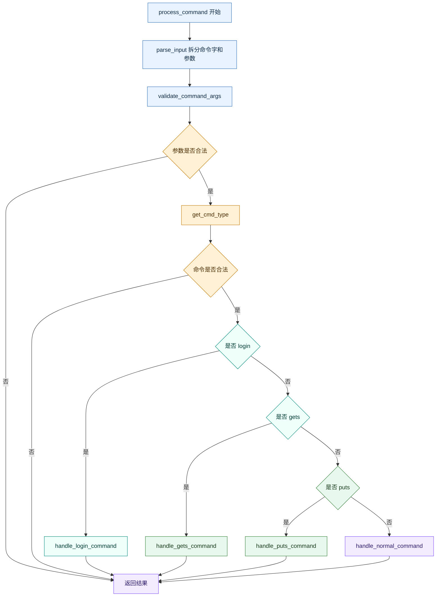

### 6.1 这张图为什么重要

因为这就是 V5 长短命令分离的**第一个分叉点**。

在这一步之前，所有命令都只是用户输入的一行字符串。  
从这一步开始，命令被拆成四类：

1. 非法命令
2. 登录命令
3. 长命令 `puts/gets`
4. 其它普通短命令

---

## 6.2 普通短命令活动图

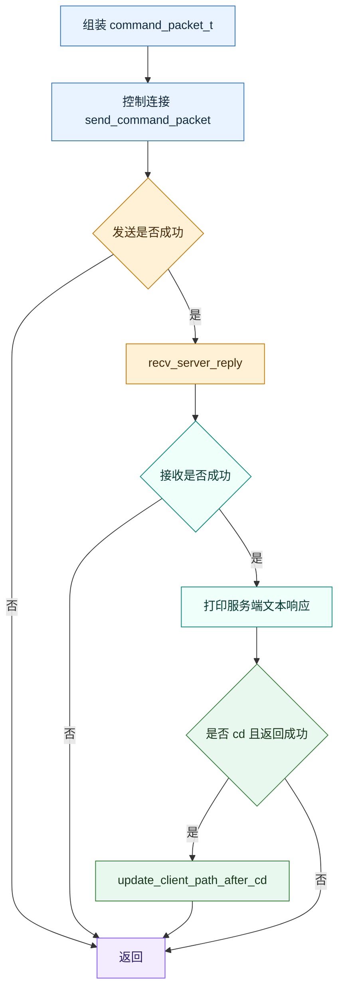

这张图说明：

> 短命令虽然都走控制连接，但 `cd` 成功后还会额外修改客户端本地保存的远端路径。

---

## 7. 服务端 `epoll` 主循环活动图

这张图是 V5 里最关键的一张活动图，因为所有服务端连接最终都先经过这里。

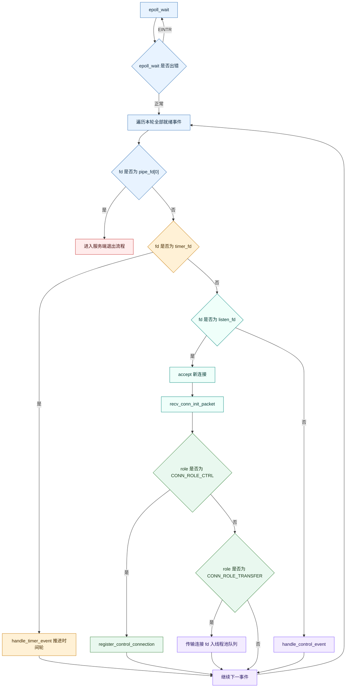

## 7.1 这张图的核心意义

这张图说明 V5 服务端主线程同时承担了四件事：

1. 监听退出信号
2. 推进时间轮
3. 接收并分类新连接
4. 处理控制连接命令

和 V4 最大的差异在于：

> V5 不再需要靠“预读命令类型”区分长短命令，而是新连接一开始就先收 `conn_init_packet_t`，直接按连接角色分流。

---

## 8. 控制连接命令处理活动图

控制连接最终进入的是 `dispatch_control_command()`。

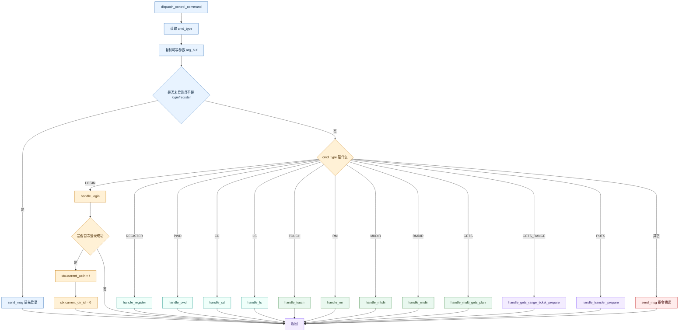

### 8.1 这张图的关键点

#### A. V5 的 `gets` 在控制连接上不是“直接下载”

代码里：

```c
case CMD_TYPE_GETS:
    handle_multi_gets_plan(...)
```

这说明控制连接上的 `gets` 只负责：

1. 查目标逻辑文件
2. 查真实文件大小和 hash
3. 查可用数据源列表
4. 返回 `multi_gets_plan_packet_t`

#### B. `puts` 在控制连接上只负责签发票据

代码里：

```c
case CMD_TYPE_PUTS:
    handle_transfer_prepare(...)
```

也就是说，控制连接不会直接接收上传内容。

---

## 9. 传输连接票据校验与分发活动图

线程池工作线程处理传输连接时，入口是 `handle_transfer_request()`。

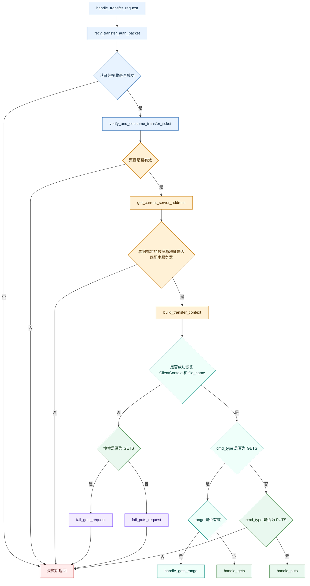

### 9.1 这张图的核心意义

这张图说明 V5 的传输连接不是“连上就开始传文件”，而是必须先经过：

1. 一次性票据校验
2. 票据消费
3. 数据源地址匹配校验
4. 临时 `ClientContext` 恢复

之后才会进入上传或下载函数。

---

## 10. 上传 `puts` 活动图

V5 的上传拆成“控制连接申请票据 + 传输连接上传”两段。

## 10.1 客户端 `puts` 总流程

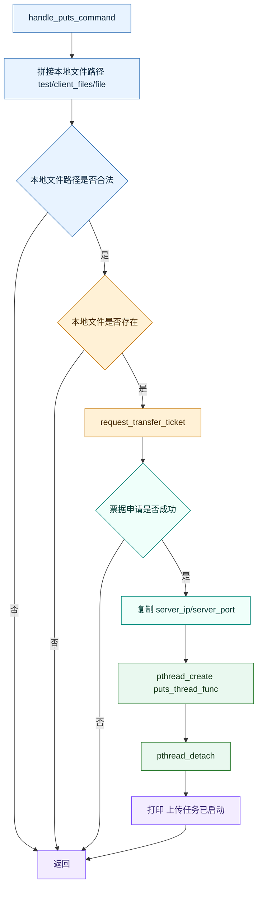

## 10.2 上传线程执行流程

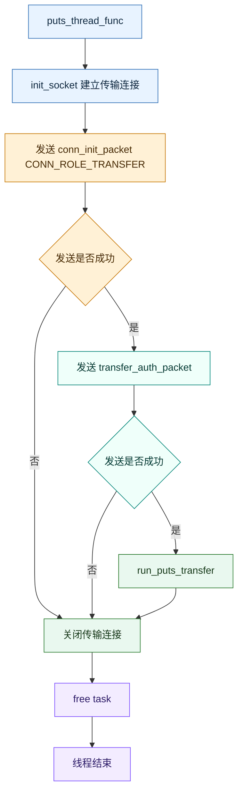

## 10.3 服务端上传流程

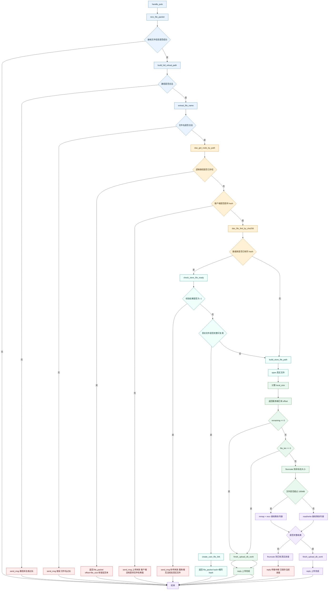

### 10.4 这张上传活动图最重要的三点

#### A. V5 的 `puts` 依然保留了第二期和第三期的断点续传骨架

也就是说，传输连接进入 `handle_puts()` 后，仍然是：

1. 客户端先发 `file_packet_t`
2. 服务端回一个 `offset`
3. 客户端从这个 `offset` 继续发剩余内容

#### B. V5 新增的一次性票据只影响“能不能进入上传函数”

它不推翻 `handle_puts()` 本身的文件传输骨架。

#### C. 上传完成后还要多维护 `file_sources`

因为第五期 `gets` 申请方案时，需要通过 `file_id` 查：

> 哪些服务器能提供这份真实文件

---

## 11. 下载 `gets` 活动图

V5 的 `gets` 是项目里流程最长的一条链。

## 11.1 客户端 `gets` 总流程

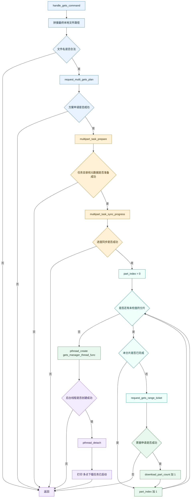

## 11.2 下载管理线程流程

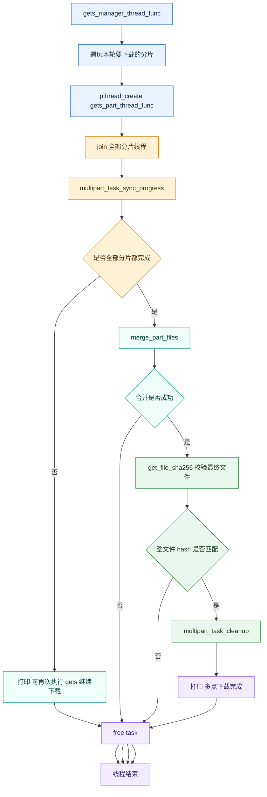

## 11.3 单个分片下载线程流程

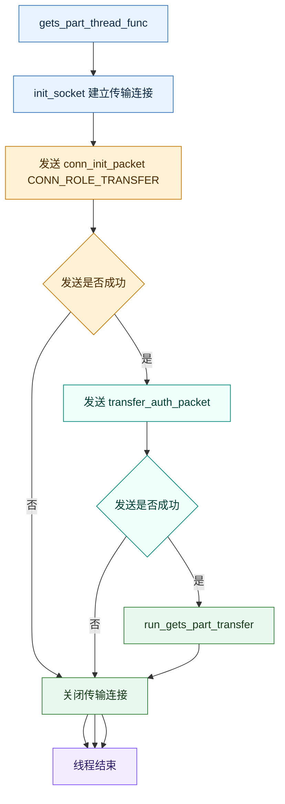

## 11.4 服务端下载流程

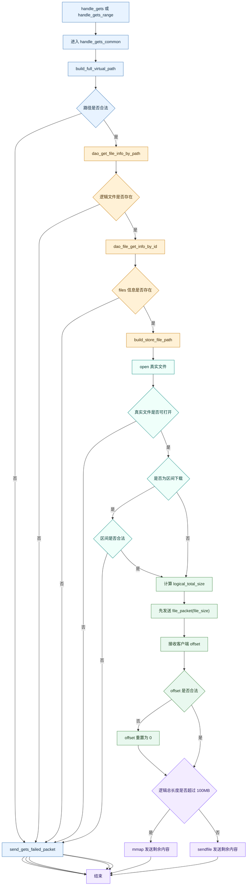

### 11.5 这张下载活动图最重要的三点

#### A. V5 的 `gets` 分成两段

第一段是控制连接上的：

1. 下载方案申请
2. 区间票据申请

第二段才是传输连接上的：

1. 分片下载
2. 分片续传
3. 分片合并

#### B. 分片没下完时，不会强行删除现场

管理线程会保留：

1. `.multipart/<file_hash>/meta.ini`
2. 下载好的 `part_i`

这样下一次再次执行 `gets` 时，还能继续复用已有分片。

#### C. 传输连接上的 `gets` 依然复用了旧的文件发送骨架

也就是说，即使进入第五期，数据发送核心仍然是：

1. 服务端先发 `file_packet_t`
2. 客户端回传已完成偏移
3. 服务端从偏移继续发剩余字节

---

## 12. 工作线程执行传输任务流程

V5 的工作线程入口是 `src/server/core/worker.c` 的 `thread_func()`。

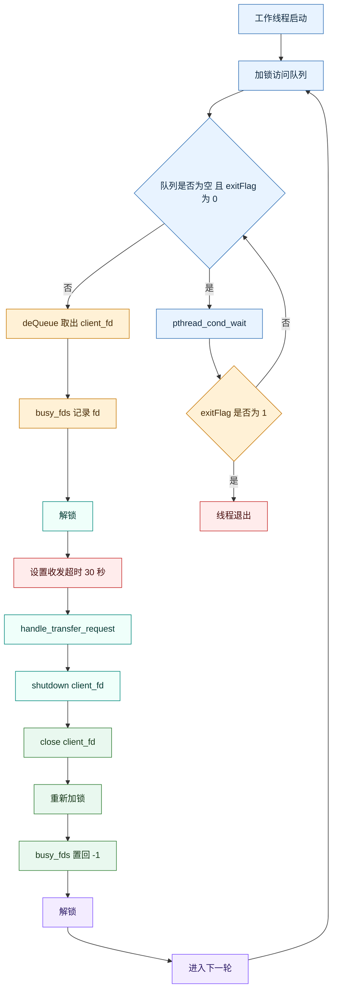

这张图说明：

> 线程池在 V5 里只负责传输连接，不再负责控制连接。

---

## 13. 时间轮超时处理流程

时间轮相关逻辑分散在：

- `src/server/core/server.c`
- `src/server/net/time_wheel.c`

## 13.1 timerfd 驱动时间轮推进流程

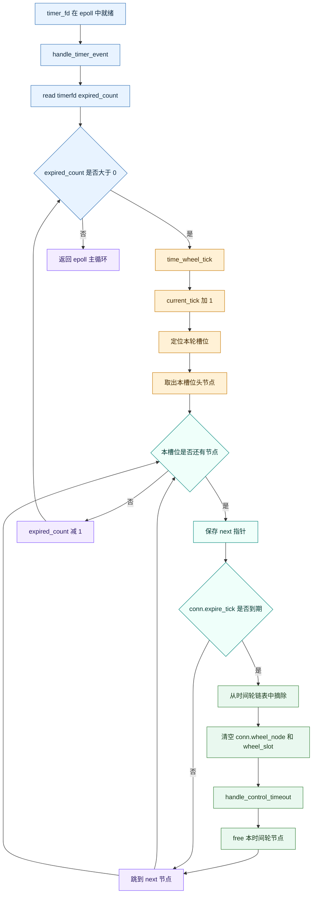

## 13.2 控制连接在时间轮中的生命周期

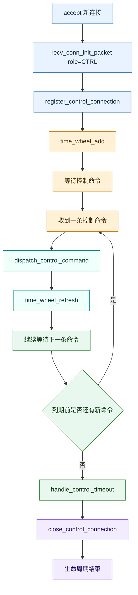

### 13.3 时间轮流程的关键点

#### A. 时间轮只服务控制连接

传输连接不会被挂到时间轮上。

#### B. 超时推进不是手写 `sleep`

而是：

1. `timerfd` 每秒触发
2. `epoll` 收到 `timerfd` 可读
3. `handle_timer_event()` 推进时间轮

#### C. 控制连接每处理完一条命令，都会刷新超时位置

这一点在 `handle_control_event()` 里是显式存在的：

```c
dispatch_control_command(...);
time_wheel_refresh(wheel, conn);
```

---

## 14. 总结

V5 的活动图骨架可以概括成一句话：

> 客户端所有命令先在 `process_command()` 分流，服务端所有新连接先在 `recv_conn_init_packet()` 分流，控制连接由主线程 `epoll + 时间轮` 管理，传输连接由线程池执行，而第五期 `gets` 又在控制阶段和传输阶段之间多插入了一层“方案申请 + 分片票据申请”流程。
