# WindCloud_V5 全流程状态图详解

## 1. 文档目标

这份文档用**状态图**解释 V5 代码中的核心对象如何变化。

这三份“全流程图解”文档的分工如下：

1. [V5全流程活动图详解.md](/home/liwenshuo/my_project/WindCloud_V4/docs/V5全流程活动图详解.md)
   重点看流程骨架、判断分支和循环结构。
2. [V5全流程时序图详解.md](/home/liwenshuo/my_project/WindCloud_V4/docs/V5全流程时序图详解.md)
   重点看模块交互顺序、协议包顺序和调用顺序。
3. [V5全流程状态图详解.md](/home/liwenshuo/my_project/WindCloud_V4/docs/V5全流程状态图详解.md)
   重点看核心对象的状态变化和状态切换条件。

如果说：

- 活动图主要讲“流程怎么走”
- 时序图主要讲“谁先和谁交互”

那么状态图主要讲：

> 某个对象在运行过程中，会处于哪些状态
> 它为什么会从状态 A 进入状态 B
> 哪段代码负责触发这次变化

这份文档重点覆盖下面这些对象：

1. 客户端 `ClientState`
2. 服务端 `ControlConn`
3. 控制连接
4. 传输连接
5. 线程池工作线程
6. 时间轮中的控制连接节点
7. 一次性传输票据
8. 上传任务状态
9. 第五期多点下载任务状态
10. 分片任务状态

本文主要对应这些代码文件：

- `include/client_state.h`
- `src/client/client.c`
- `src/client/client_command_handle.c`
- `src/client/client_puts.c`
- `src/client/client_gets.c`
- `src/client/multipart_meta.c`
- `include/control_conn.h`
- `src/server/net/control_conn.c`
- `src/server/core/server.c`
- `src/server/core/session.c`
- `src/server/core/worker.c`
- `src/server/net/time_wheel.c`
- `src/server/security/transfer_ticket.c`

---

## 2. 阅读状态图的方法

### 2.1 状态图看什么

状态图最适合回答下面这类问题：

- 一个对象刚创建时有哪些初始字段
- 什么时候算“已登录”
- 什么时候一条控制连接会被时间轮踢出
- 一条传输连接什么时候才算“被授权”
- 一张一次性票据什么时候会从“可用”变成“已失效”
- 多点下载任务什么时候算“可恢复”，什么时候算“彻底完成”

### 2.2 项目里的“状态”通常有两种来源

代码中的状态变化，主要来自两类信息：

#### A. 显式字段

例如：

- `ClientState.logged_in`
- `ClientState.token`
- `ControlConn.ctx.user_id`
- `ControlConn.expire_tick`
- `thread_pool_t.busy_fds[i]`

这些字段本身就是状态的一部分。

#### B. 对象所处的位置

例如：

- 一条控制连接是否还在 `conn_map + epoll + time_wheel`
- 一条传输连接是在监听主线程里，还是已经进入线程池
- 一个下载分片只是写入 `part_i`，还是已经被合并进最终文件

这类状态不是单一字段，而是“对象现在被哪个模块持有”。

图中的颜色按状态阶段区分：蓝色表示初始或连接建立，黄色表示活跃等待或准备，青色表示认证和传输中间态，绿色表示完成或成功态，紫色表示最终收尾态，红色表示失败、过期、中断或可恢复未完成态。

---

## 3. 先看 V5 的总体状态关系

先用一张总状态图把几个核心对象的关系放在一起。

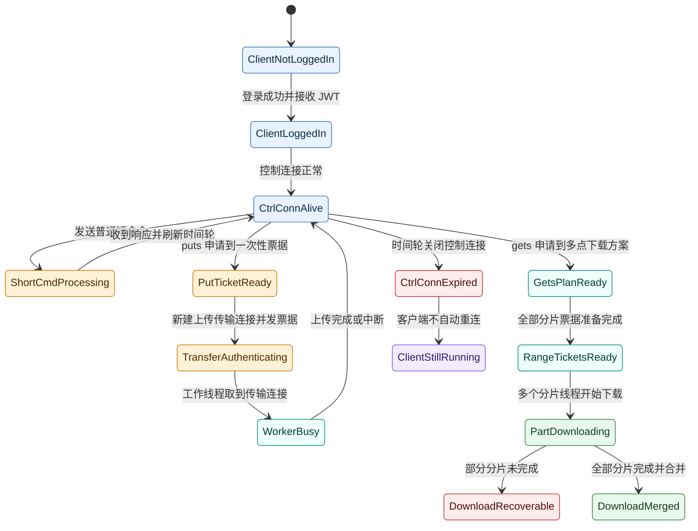

这张图强调的是：

1. 控制连接状态是一条长期状态线
2. 传输连接状态是一条短生命周期状态线
3. `gets` 在 V5 中比 `puts` 多出“方案态、分片票据态、分片任务态”

---

## 4. `ClientState` 的状态图

`ClientState` 定义在 [client_state.h](/home/liwenshuo/my_project/WindCloud_V4/include/client_state.h)：

```c
typedef struct {
    int ctrl_fd;
    int logged_in;
    int user_id;
    char token[TOKEN_LEN];
    char current_path[256];
    char server_ip[64];
    char server_port[64];
    char client_file_dir[MAX_PATH_LEN];
    pthread_mutex_t lock;
} ClientState;
```

它是客户端主线程长期维护的状态对象。

## 4.1 `ClientState` 总状态图

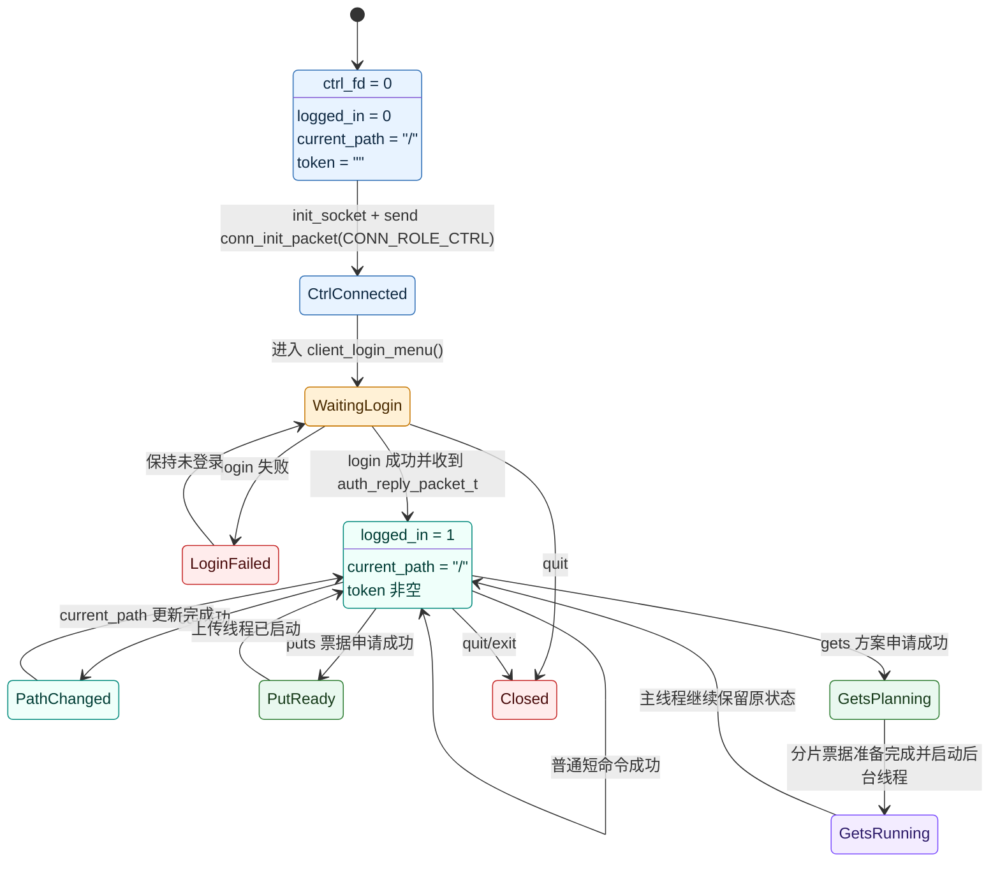

## 4.2 `ClientState` 的关键状态切换

### 4.2.1 初始化态

由 `client.c` 的主函数触发：

```c
memset(&state, 0, sizeof(state));
strcpy(state.current_path, "/");
```

所以它刚创建时的特征是：

1. 控制连接 fd 还没建立
2. 还没有登录
3. 路径先按根目录处理
4. token 为空

控制连接 fd 建立，是在后面的：

```c
init_socket(&state.ctrl_fd, ip, port);
send_conn_init_packet(state.ctrl_fd, &init_packet);
```

### 4.2.2 登录成功态

由 `set_login_success_state()` 触发：

```c
state->logged_in = 1;
state->user_id = user_id;
snprintf(state->token, ...);
snprintf(state->current_path, ..., "/");
```

所以从“未登录”切到“已登录”，不是只看服务端文本里有没有“登录成功”，而是要成功收到：

```c
auth_reply_packet_t.success == 1
```

### 4.2.3 路径变化态

由 `handle_normal_command()` 中的 `cd` 成功分支触发：

```c
if (cmd_type == CMD_TYPE_CD && ret == 1) {
    update_client_path_after_cd(state, arg);
}
```

这说明：

> 客户端路径不是服务端主动推送过来的，而是客户端根据 `cd` 参数和结果自行维护的。

### 4.2.4 V5 没有自动重连态

这点必须特别明确。

`client.c` 里，主循环只是：

```c
process_command(&state, input);
```

并没有 V4 那种“控制连接失效后自动重连并重新登录”的状态链。

所以 `ClientState` 不会进入“自动重连中”状态。

---

## 5. `ControlConn` 的状态图

`ControlConn` 定义在 [control_conn.h](/home/liwenshuo/my_project/WindCloud_V4/include/control_conn.h)：

```c
typedef struct ControlConn {
    int fd;
    ClientContext ctx;
    long long expire_tick;
    int wheel_slot;
    struct TimeWheelNode *wheel_node;
} ControlConn;
```

它是服务端主线程维护的“控制连接级状态对象”。

## 5.1 `ControlConn` 总状态图

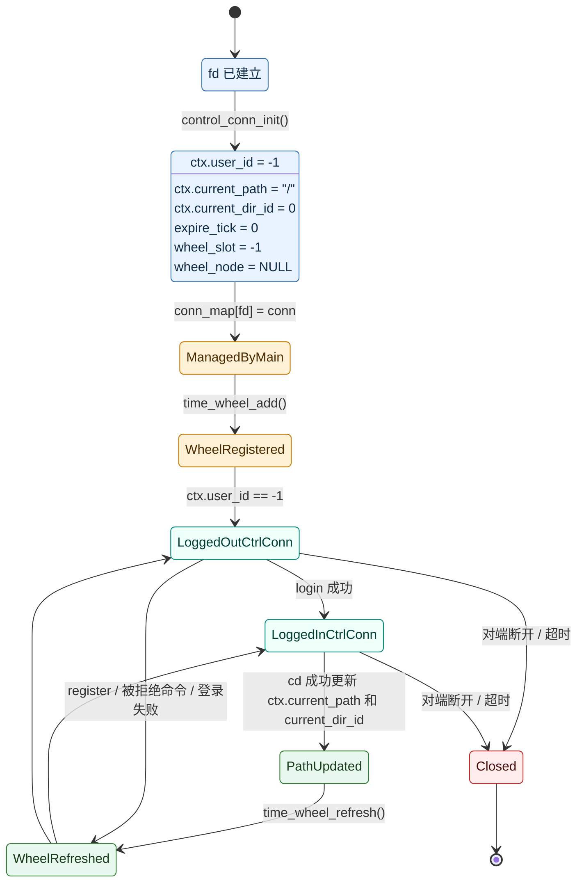

## 5.2 `ControlConn` 的核心状态切换

### 5.2.1 新连接默认态

由 `control_conn_init()` 触发：

```c
conn->ctx.user_id = -1;
strcpy(conn->ctx.current_path, "/");
conn->ctx.current_dir_id = 0;
conn->expire_tick = 0;
conn->wheel_slot = -1;
conn->wheel_node = NULL;
```

所以“新控制连接默认态”的含义很明确：

1. 已有 fd
2. 还没有身份
3. 目录先按根目录
4. 还没进入有效时间轮位置

### 5.2.2 登录成功态

在 `dispatch_control_command()` 里，登录成功后会更新：

```c
ctx->user_id != -1
ctx->current_path = "/"
ctx->current_dir_id = 0
```

而 `ControlConn` 保存的就是这份 `ctx`，所以登录成功后，这条控制连接才变成“已登录控制连接状态”。

### 5.2.3 时间轮刷新态

在 `handle_control_event()` 里，每处理完一条控制命令都会执行：

```c
time_wheel_refresh(wheel, conn);
```

所以一条控制连接的“活跃状态”由两部分共同定义：

1. `ctx` 表示什么会话身份
2. `expire_tick` 被刷新到了哪个时刻

---

## 6. 控制连接的状态图

这里的“控制连接”不是某个结构体，而是“客户端长期保留、服务端主线程长期管理”的那条连接。

## 6.1 控制连接生命周期状态图

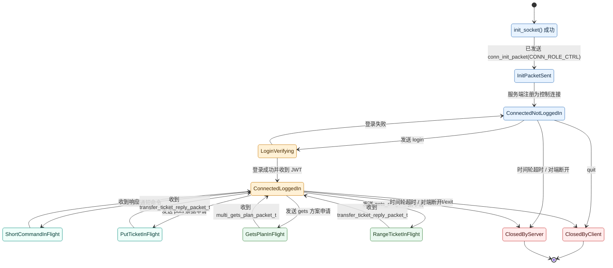

## 6.2 控制连接状态与传输连接状态的边界

控制连接的一个核心特点是：

> 它不会因为 `puts/gets` 启动就切换成“传输中”状态。

因为 V5 的设计是：

- 控制连接继续保持在“已登录、可发短命令 / 可申请票据 / 可申请方案”的状态
- `puts/gets` 自己另开独立传输连接

这也是 V5 相比 V3 和 V4 最重要的状态拆分之一。

---

## 7. 传输连接的状态图

传输连接的生命周期比控制连接短很多。

## 7.1 传输连接生命周期状态图

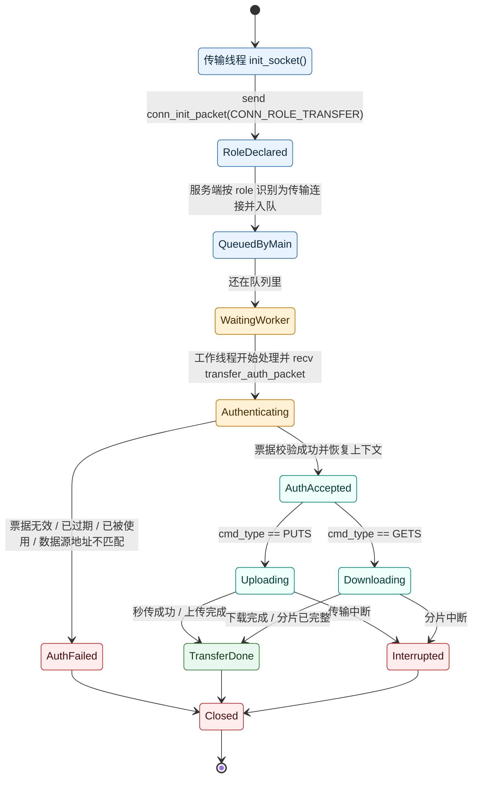

## 7.2 V5 的传输连接有一个关键“身份切换点”

在服务端主线程刚 `accept` 到它时，它还只是：

> 一个带有 `role = CONN_ROLE_TRANSFER` 的 fd

在工作线程里 `verify_and_consume_transfer_ticket()` 成功之前，它还不具备业务身份。
只有票据验证通过并恢复 `ClientContext` 后，这条连接才变成：

> 一个携带用户、路径、区间和数据源绑定信息的传输连接

---

## 8. 工作线程的状态图

工作线程入口在 [worker.c](/home/liwenshuo/my_project/WindCloud_V4/src/server/core/worker.c)。

## 8.1 工作线程状态图

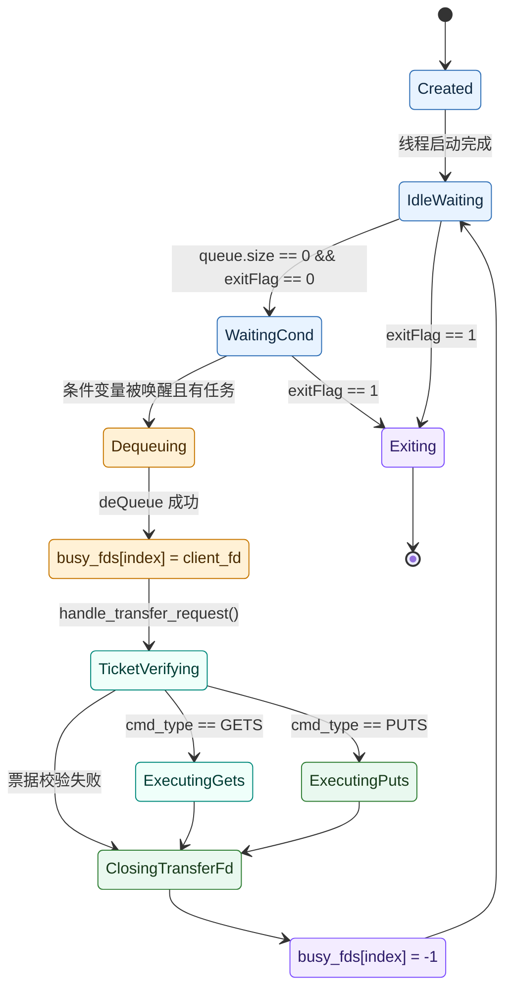

## 8.2 `busy_fds` 是工作线程状态的一部分

`thread_pool_t` 中有：

```c
int *busy_fds;
```

这个数组不是普通缓存，而是：

> 主线程用于感知“哪个工作线程手里有传输连接”

状态切换位置很明确：

开始处理任务前：

```c
pool->busy_fds[worker_index] = client_fd;
```

处理结束后：

```c
pool->busy_fds[worker_index] = -1;
```

因此，工作线程的“空闲 / 忙碌”状态可以直接通过 `busy_fds[index]` 判断。

---

## 9. 时间轮中的控制连接节点状态图

V5 的时间轮节点不是单独保存 `fd`，而是直接保存：

```c
ControlConn *conn
```

所以 V5 的时间轮状态图比 V4 更直接。

## 9.1 时间轮节点状态图

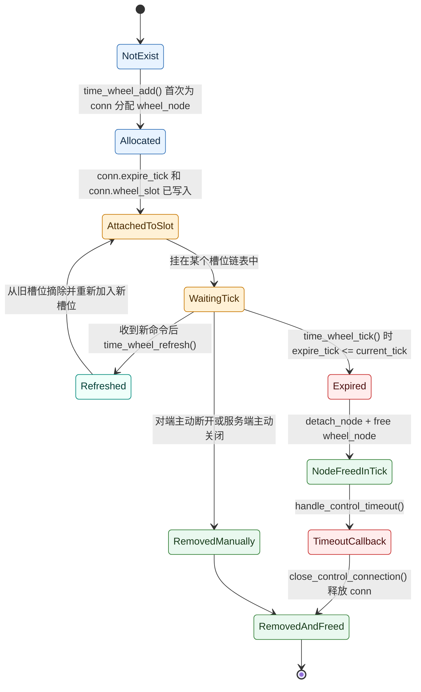

## 9.2 时间轮节点和 `ControlConn` 是强绑定关系

因为实现里：

```c
conn->wheel_node
conn->wheel_slot
conn->expire_tick
```

都直接挂在 `ControlConn` 上，所以状态判断比 V4 更直观：

1. `wheel_node == NULL`
   - 不在时间轮里
2. `wheel_node != NULL`
   - 已挂入时间轮
3. `wheel_slot >= 0`
   - 知道自己在哪个槽位

---

## 10. 一次性传输票据的状态图

第五期后，一次性票据已经成为独立的重要状态对象。

虽然源码里没有单独暴露结构体头文件，但在 `transfer_ticket.c` 中，票据状态实际由：

```c
active
ticket_id
expire_time
```

这三类信息决定。

## 10.1 一次性票据状态图

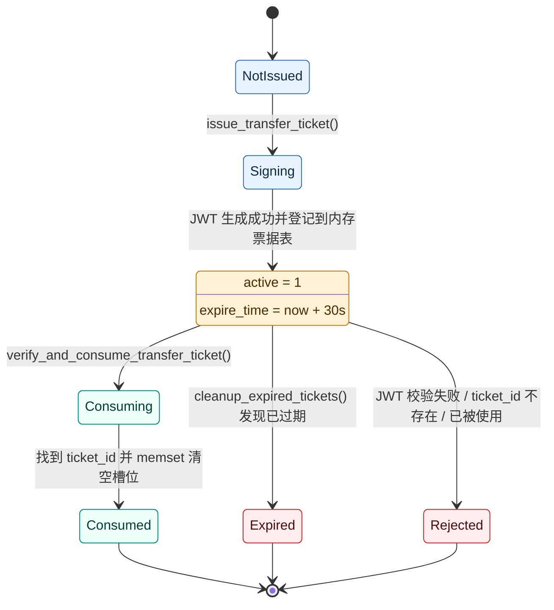

## 10.2 票据状态的两个关键特点

### A. 票据既有 JWT 状态，也有内存表状态

也就是说，一张票据要可用，必须同时满足：

1. JWT 本身合法、未过期、未被篡改
2. 内存票据表里存在这张 `ticket_id`
3. 这张 `ticket_id` 还没被消费

### B. 票据消费成功后会立刻失效

这不是“使用后标记一下”，而是直接：

```c
memset(&g_transfer_tickets[i], 0, sizeof(TransferTicketNode));
```

因此，同一张票据无法再次成功使用。

---

## 11. 上传任务状态图

这里说的“上传任务状态”，不是单一结构体，而是一次 `puts` 业务从申请票据到结束的业务状态。

## 11.1 上传任务状态图

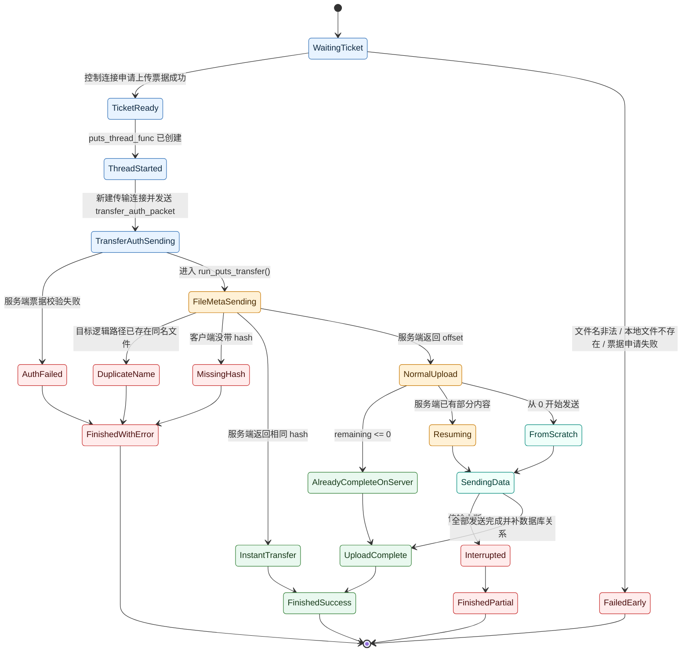

## 11.2 上传任务里有三个容易混淆的结束态

### A. `InstantTransfer`

也就是秒传成功。
特点是：

1. 客户端不再发送真实文件内容
2. 服务端只补逻辑节点和引用计数

### B. `UploadComplete`

也就是服务端确认这次上传已经完成。
特点是：

1. 可能是本次连接收满了全部剩余字节
2. 也可能是服务端真实文件本来就完整，只需要补数据库关系
3. 最终都会补齐 `files`、`paths` 和 `file_sources`

### C. `FinishedPartial`

这不是完整成功，但也不是彻底失败。
特点是：

1. 本次连接中断
2. 已收到的内容被保留
3. 下次还可以继续续传

---

## 12. 第五期多点下载任务状态图

这里说的“多点下载任务”对应的是 `GetsManagerTask + MultipartTaskMeta` 这一整轮任务的业务状态。

## 12.1 多点下载任务状态图

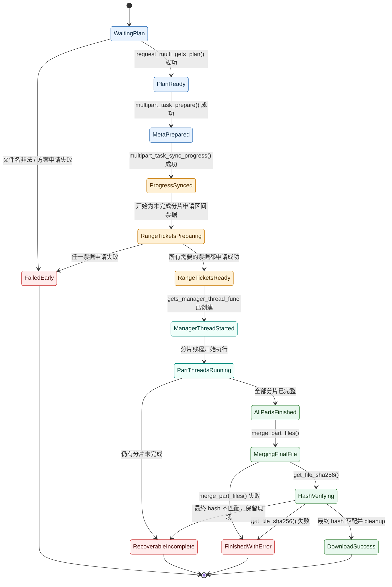

## 12.2 这张状态图的核心意义

它说明第五期下载任务不再是：

> “发一个 gets，然后等文件下完”

而是有一条很清楚的多阶段状态链：

1. 先拿方案
2. 再准备本地元数据
3. 再拿分片票据
4. 再跑分片线程
5. 最后判断是“可恢复未完成”还是“完整成功”

---

## 13. 单个分片任务状态图

`MultipartPartInfo` 定义在 [multipart_meta.h](/home/liwenshuo/my_project/WindCloud_V4/include/multipart_meta.h)：

```c
typedef struct {
    int part_index;
    off_t range_start;
    off_t range_end;
    off_t finished_bytes;
    char source_ip[64];
    char source_port[16];
    char part_file_path[MAX_PATH_LEN];
} MultipartPartInfo;
```

它描述的是“某个分片下到了哪里”。

## 13.1 分片任务状态图

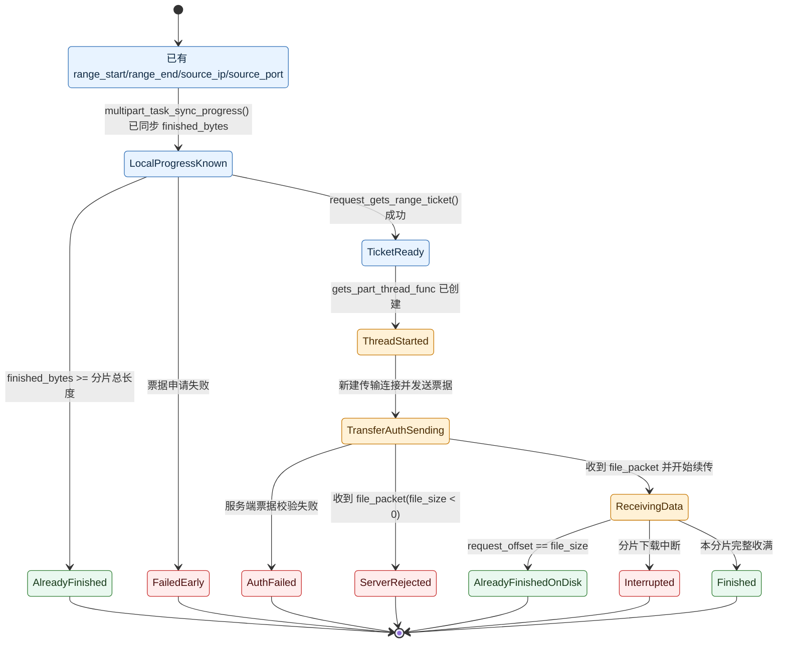

## 13.2 `finished_bytes` 是分片状态的核心字段

因为分片是否完成，本质上就看：

```c
finished_bytes >= range_end - range_start + 1
```

也就是说，单个分片的状态不是靠额外枚举字段决定的，而是由：

1. 区间长度
2. `finished_bytes`

共同决定。

---

## 14. `.multipart` 任务目录的状态图

`.multipart` 目录虽然不是 C 结构体，但它在第五期已经是一个真实的“可观察状态对象”。

## 14.1 `.multipart` 任务目录状态图

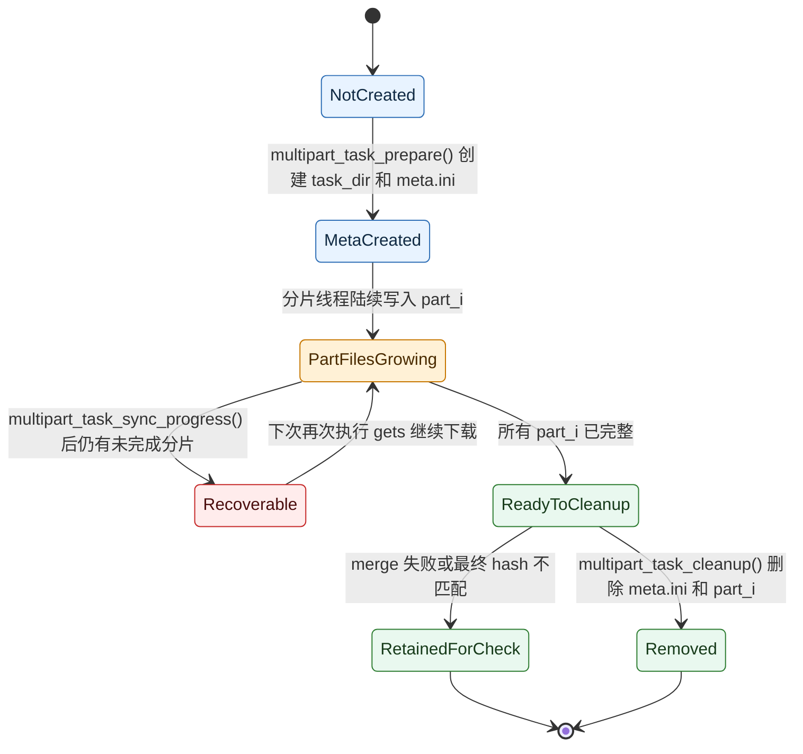

## 14.2 为什么 `.multipart` 也是状态

因为第五期“下载恢复”不是抽象逻辑，而是直接依赖这组文件是否存在：

1. `meta.ini`
2. `part_0`
3. `part_1`
4. ...

因此，`.multipart` 本身就承载了任务状态。

---

## 15. 总结

V5 的状态骨架可以概括成一句话：

> 客户端长期状态由 `ClientState` 维护，服务端长期控制状态由 `ControlConn` 维护，传输连接通过一次性票据短暂获得业务身份，而第五期新增的 `.multipart` 元数据和分片文件又把“可恢复下载任务”本身变成了一个新的状态对象。
