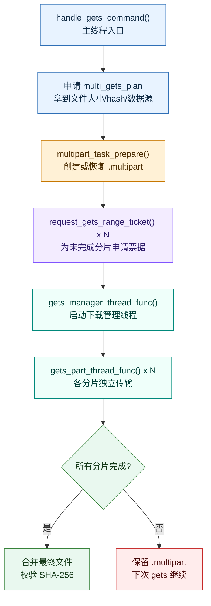
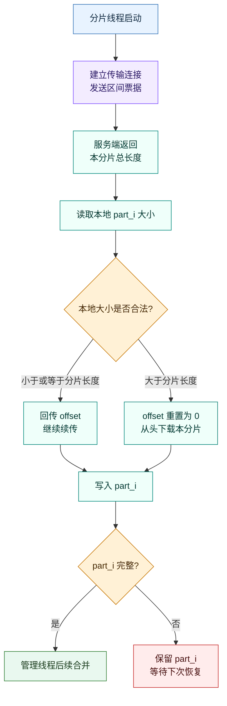

# V5 多点下载详解

## 1. 文档目标

这份文档专门讲解 WindCloud 第五期的多点下载实现。

重点回答三个问题：

1. 多点下载要解决什么问题。
2. 代码里多点下载是怎样一步步实现的。
3. 这套实现的边界在哪里，后续继续演进时应该往哪里改。

本文只讨论第五期的 `gets` 多点下载，不讨论上传 `puts` 的多点扩展。

---

## 2. 先说结论：多点下载是什么

V5 的多点下载不是 P2P，也不是 BitTorrent，更不是块存储系统。

它的模型是：

1. 客户端先连接控制服务器。
2. 控制服务器根据逻辑路径，查询这份文件有哪些可用数据源服务器。
3. 客户端把一个完整文件按区间切成多个分片。
4. 每个分片各自申请一张一次性区间票据。
5. 每个分片线程拿着自己的票据，去对应数据源服务器下载固定区间。
6. 下载过程中，每个分片都支持断点续传。
7. 所有分片完成后，客户端再把这些 `part_i` 合并成最终文件。

这套实现的本质是：

> 控制连接做协商，传输连接做分片下载，本地 `.multipart` 目录做恢复。

整体链路可以这样看：

```mermaid
flowchart LR
    A["客户端主线程<br>申请下载方案"]
    B["控制服务器<br>查询 paths/files/file_sources"]
    C["本地 .multipart<br>生成分片任务"]
    D["分片票据<br>每个区间一张"]
    E["多个数据源服务器<br>并发发送区间数据"]
    F["管理线程<br>合并 part_i 并校验 hash"]

    A --> B --> C --> D --> E --> F

    classDef client fill:#E8F3FF,stroke:#2F6FB6,color:#102A43
    classDef control fill:#E9F8EF,stroke:#2E7D32,color:#173B1A
    classDef meta fill:#FFF1D6,stroke:#C77700,color:#4A2B00
    classDef ticket fill:#F3ECFF,stroke:#7C4DFF,color:#2D1B69
    classDef transfer fill:#EFFFFA,stroke:#00897B,color:#003D35
    classDef finish fill:#FFECEC,stroke:#C62828,color:#4A0D0D

    class A client
    class B control
    class C meta
    class D ticket
    class E transfer
    class F finish
```



---

## 3. 为什么第五期要做多点下载

第四期已经完成了：

1. 控制连接和传输连接分离
2. 一次性传输票据
3. `gets` 断点续传

但第四期的 `gets` 仍然是：

1. 一个文件
2. 一条传输连接
3. 一个下载线程
4. 一台服务器发送整文件

这会有两个问题：

1. 单连接下载速度受单服务器和单连接吞吐限制。
2. 如果下载中断，只能恢复“整文件下载进度”，不能恢复更细粒度的分片进度。

第五期的改法不是推翻旧下载协议，而是在旧下载协议外面加一层“协商 + 分片 + 恢复”。

这样做有两个直接好处：

1. 客户端可以从多个服务器并发拉取不同区间。
2. 中断时只要某些分片已经下完，就不需要再重复下载这些分片。

---

## 4. 实现采用了什么简化模型

理解第五期代码时，要先接受它的简化边界，否则很容易把实现想复杂。

### 4.1 不是块存储系统

服务端不会保存“某文件的第几块在哪台机器”。

它只记录：

> 某台服务器是否拥有这份完整真实文件

这类信息保存在 `file_sources` 表里，对应代码在：

- `src/server/data/dao_file_source.c`

### 4.2 每个数据源服务器都持有完整文件

现有模型是：

1. 服务器 A 有完整文件
2. 服务器 B 也有完整文件
3. 客户端让 A 发前半段，让 B 发后半段

而不是：

1. A 只存前半段
2. B 只存后半段

这样设计有三个好处：

1. 可以直接复用真实文件存储模型 `test/server_files/<sha256>`
2. 区间发送逻辑只需要在整文件发送基础上做收缩
3. 不需要引入复杂的块元数据系统

### 4.3 恢复只依赖客户端本地目录

第五期恢复能力依赖：

1. `test/client_files/.multipart/<file_hash>/meta.ini`
2. `test/client_files/.multipart/<file_hash>/part_0`
3. `test/client_files/.multipart/<file_hash>/part_1`
4. ...

不依赖数据库记录客户端任务进度。

这样实现简单，也符合学习项目的节奏。

---

## 5. 多点下载涉及的核心模块

### 5.1 客户端模块

1. `src/client/client_command_handle.c`
   - 负责控制连接上的下载方案申请
   - 负责控制连接上的分片票据申请
2. `src/client/client_gets.c`
   - 负责主线程、管理线程、分片线程三层下载逻辑
3. `src/client/multipart_meta.c`
   - 负责 `.multipart` 任务目录
   - 负责 `meta.ini` 创建、恢复、刷新、清理

### 5.2 服务端模块

1. `src/server/core/session.c`
   - 负责 `GETS` 下载方案协商
   - 负责 `GETS_RANGE` 分片票据签发
   - 负责传输连接票据校验和上下文恢复
2. `src/server/security/transfer_ticket.c`
   - 负责一次性区间票据签发和消费
3. `src/server/file/file_transfer.c`
   - 负责整文件下载和区间下载
4. `src/server/data/dao_file_source.c`
   - 负责数据源服务器列表查询

---

## 6. 先看多点下载的数据基础

第五期多点下载依赖三层数据：

1. `paths`
   - 解决“用户所在目录下这个文件名对应哪条逻辑路径”
2. `files`
   - 解决“这条逻辑路径背后对应哪份真实文件，以及它的 hash 和大小是什么”
3. `file_sources`
   - 解决“有哪些服务器拥有这份真实文件”

这条关系链可以写成：

```text
文件名
-> 完整逻辑路径
-> paths.file_id
-> files.sha256sum / files.size
-> file_sources(server_ip, server_port)
```

看懂这条链，才能看懂第五期的控制阶段。

---

## 7. 客户端侧的总体思路

客户端下载一个文件时，不是“直接开下载线程”，而是明确分四步：

1. 申请下载方案
2. 准备本地任务目录和分片信息
3. 为每个未完成分片申请区间票据
4. 启动管理线程，由管理线程再启动多个分片线程

设计核心是：

> 主线程只做协商和准备，不直接做耗时下载；耗时部分全部交给后台线程。

客户端侧的阶段划分如下：



---

## 8. 第一步：申请多点下载方案

### 8.1 客户端入口

客户端入口在：

- `src/client/client_gets.c`
- `handle_gets_command()`

这一步首先调用：

```c
request_multi_gets_plan(state, arg, &plan_packet)
```

而 `request_multi_gets_plan()` 在：

- `src/client/client_command_handle.c`

它做的事情很直接：

1. 组一个 `command_packet_t`
2. `cmd_type = CMD_TYPE_GETS`
3. `data = 用户输入的文件名`
4. 发到控制连接
5. 等服务端返回 `multi_gets_plan_packet_t`

### 8.2 服务端如何处理这一步

服务端控制连接入口在：

- `src/server/core/session.c`
- `dispatch_control_command()`

代码里：

```c
case CMD_TYPE_GETS:
    handle_multi_gets_plan(client_fd, ctx, arg_buf);
    break;
```

换句话说，第五期的 `GETS` 在控制连接上不再表示“立刻下载”，而是表示：

> 请给我一份下载方案

### 8.3 下载方案里有什么

服务端会返回 `multi_gets_plan_packet_t`，里面包含：

1. 文件名
2. 文件总大小
3. 文件 hash
4. 数据源数量
5. 数据源列表
6. 提示消息

这意味着客户端在开始传输之前，已经知道：

1. 文件多大
2. 文件内容标识是什么
3. 可以从哪些服务器下载

---

## 9. 第二步：准备 `.multipart` 本地任务目录

### 9.1 入口函数

客户端在拿到下载方案后，会调用：

```c
multipart_task_prepare(state->client_file_dir, &plan_packet, &manager_task->meta)
```

代码位置：

- `src/client/multipart_meta.c`

### 9.2 `.multipart` 目录长什么样

任务目录结构是：

```text
test/client_files/.multipart/<file_hash>/
├── meta.ini
├── part_0
├── part_1
└── ...
```

这里用 `file_hash` 当任务目录名，有两个好处：

1. 同一份文件再次恢复下载时，可以直接复用旧任务目录
2. 不需要额外发明新的任务编号体系

### 9.3 `meta.ini` 里记录什么

实现会把这些信息写入 `meta.ini`：

1. 文件名
2. 文件 hash
3. 文件总大小
4. 分片数量
5. 每个分片的起始位置
6. 每个分片的结束位置
7. 每个分片已完成字节数
8. 每个分片对应的数据源 IP
9. 每个分片对应的数据源端口

这正是第五期恢复功能的关键。

### 9.4 分片切分策略是什么

分片切分在 `init_parts_from_plan()` 里实现。

策略很直接：

1. `part_count = source_count`
2. `base_size = file_size / part_count`
3. `remainder = file_size % part_count`
4. 每个分片先分到 `base_size`
5. 前 `remainder` 个分片各额外补 1 字节

这是一种最适合学习项目的平均切分策略。

优点：

1. 简单
2. 不容易出错
3. 总字节数刚好能覆盖整个文件

缺点：

1. 没有考虑不同服务器速度差异
2. 没有考虑不同分片恢复进度差异

### 9.5 为什么还要再次 `multipart_task_sync_progress()`

`multipart_task_prepare()` 之后，客户端又会立刻调用：

```c
multipart_task_sync_progress(&manager_task->meta)
```

原因是：

1. `meta.ini` 里记录的是上次保存时的状态
2. `part_i` 的真实文件大小可能才是更可靠的状态

因此，实现思路是：

> 先读元数据，再用本地真实分片文件大小纠正元数据。

这一步是合理的，也很适合学习项目。

---

## 10. 第三步：为每个未完成分片申请区间票据

### 10.1 为什么要按分片申请票据

这里不是“整文件拿一张票据，然后客户端下载任意区间”。

而是：

1. 每个分片单独申请一张票据
2. 每张票据都绑定固定区间和固定数据源服务器

这样设计的好处是：

1. 服务端不需要相信客户端后续传过来的区间参数
2. 客户端不能拿一张分片票据越权下载别的区间
3. 客户端不能拿本来给 A 服务器的票据去连 B 服务器

### 10.2 客户端怎么申请

客户端在 `handle_gets_command()` 里遍历 `meta.parts`。

如果某个分片已经完成：

```c
if (is_part_finished(meta_part)) {
    continue;
}
```

它就不会再申请票据，也不会再起线程。

对于未完成分片，客户端会调用：

```c
request_gets_range_ticket(...)
```

这一步通过控制连接发送：

```text
文件名|range_start|range_end|source_ip|source_port
```

### 10.3 服务端如何校验这一步

服务端对应函数在：

- `src/server/core/session.c`
- `handle_gets_range_ticket_prepare()`

它会做 5 件事：

1. 解析参数
2. 根据用户和所在路径拼出完整逻辑路径
3. 确认用户确实能访问这份逻辑文件
4. 确认客户端请求的数据源服务器确实在 `file_sources` 可用列表里
5. 签发一次性区间票据

这个设计很关键，它说明：

> 第五期控制服务器仍然掌握授权权力，客户端不能自行决定去哪台服务器、下哪个区间。

---

## 11. 第四步：启动下载管理线程

在所有需要的分片票据都准备完成之后，客户端才会创建后台管理线程：

```c
pthread_create(&tid, NULL, gets_manager_thread_func, manager_task)
```

然后立刻：

```c
pthread_detach(tid);
```

这意味着：

1. 主线程不阻塞
2. 用户还能继续发其它短命令
3. 后台管理线程独立负责整轮下载

这复用了第四期“长短命令分离”的核心思想：

> 短命令继续走控制连接主循环，长任务放后台线程。

---

## 12. 第五步：下载管理线程怎么组织整轮下载

### 12.1 管理线程的职责

管理线程入口在：

- `src/client/client_gets.c`
- `gets_manager_thread_func()`

它有三个职责：

1. 启动本轮需要联网下载的分片线程
2. 等全部分片线程结束
3. 统一决定是保留现场、合并文件，还是清理任务目录

### 12.2 为什么要有管理线程，而不是主线程直接起多个分片线程

因为管理线程的存在，让第五期下载结构清楚很多：

1. 主线程负责协商
2. 管理线程负责总控
3. 分片线程负责联网收数据

如果没有管理线程，主线程就必须同时负责：

1. 启动分片线程
2. 等分片结束
3. 决定是否合并
4. 决定是否清理

这样会把职责搅在一起。

### 12.3 管理线程的结束判定逻辑

管理线程结束时有三种结果：

1. 还有分片没完成
   - 打印“可再次执行 gets 继续下载”
   - 保留 `.multipart`
2. 所有分片都完成，但合并失败或最终 hash 校验失败
   - 保留 `.multipart`
3. 所有分片完成，合并成功，最终 hash 匹配
   - 调用 `multipart_task_cleanup()`
   - 删除 `meta.ini` 和所有 `part_i`

这就是第五期“可恢复”和“最终一致性校验”的关键。

---

## 13. 第六步：单个分片线程做了什么

### 13.1 分片线程入口

分片线程入口在：

- `src/client/client_gets.c`
- `gets_part_thread_func()`

每个分片线程都做 3 件事：

1. 建立独立传输连接
2. 发 `conn_init_packet(CONN_ROLE_TRANSFER)`
3. 发本分片自己的区间票据

然后进入：

```c
run_gets_part_transfer(sock_fd, task)
```

### 13.2 分片线程内部协议顺序

这部分很重要，顺序是：

1. 服务端先回 `file_packet_t(file_size = 本分片总长度)`
2. 客户端根据本地 `part_i` 真实大小计算 `request_offset`
3. 客户端再回一个 `file_packet_t(offset = request_offset)`
4. 服务端从这个偏移继续发送剩余区间
5. 客户端把收到的数据写入 `part_i`

这说明：

> 第五期分片下载并没有重写协议，而是复用了第二期整文件下载的断点续传骨架。

### 13.3 分片线程如何判断是续传、已完成还是从头开始

客户端的判断逻辑是：

1. 如果本地 `part_i` 小于服务端 `file_size`
   - 继续续传
2. 如果本地 `part_i` 等于服务端 `file_size`
   - 该分片已经完整，无需继续下载
3. 如果本地 `part_i` 反而大于服务端 `file_size`
   - 认为临时文件异常，从头开始下载

这套策略务实，也适合教学型项目。

### 13.4 分片线程为什么不直接写最终文件

因为实现明确选择了：

1. 每个分片线程只写 `part_i`
2. 最终文件由管理线程统一合并

这样可以避免：

1. 多线程同时写同一个文件
2. 中断后最终文件状态不清楚
3. 合并和校验逻辑不清晰

单个分片的传输与恢复流程如下：



---

## 14. 第七步：服务端如何执行区间下载

### 14.1 传输连接入口

服务端传输连接入口在：

- `src/server/core/session.c`
- `handle_transfer_request()`

这一步先做：

1. 接收 `transfer_auth_packet`
2. 校验并消费票据
3. 检查本服务器地址是否和票据绑定的数据源地址一致
4. 恢复 `ClientContext`
5. 根据票据里的 `range_start/range_end` 决定走 `handle_gets_range()` 还是 `handle_gets()`

### 14.2 为什么服务端还要检查本服务器地址

因为区间票据里不仅绑定了：

1. 用户
2. 文件
3. 区间

还绑定了：

4. 允许连接的数据源服务器 IP 和端口

这样客户端就不能：

1. 拿着本来发给 A 服务器的票据
2. 转头去连 B 服务器

这一步是第五期安全边界的重要组成部分。

### 14.3 区间下载最终收口到哪里

服务端整文件下载和区间下载最终都收口到：

- `src/server/file/file_transfer.c`
- `handle_gets_common()`

整文件下载调用：

```c
handle_gets_common(..., 0, 0, -1)
```

区间下载调用：

```c
handle_gets_common(..., 1, range_start, range_end)
```

### 14.4 `handle_gets_common()` 具体做了什么

这条函数内部的逻辑可以概括成：

1. 根据用户和虚拟路径查 `paths`
2. 根据 `file_id` 查 `files`
3. 根据 `sha256` 拼真实文件路径
4. 打开 `test/server_files/<sha256>`
5. 如果是区间下载，就收紧到 `range_start ~ range_end`
6. 先发 `file_packet_t(file_size = 本次逻辑总长度)`
7. 再收客户端回传的 `offset`
8. 把逻辑偏移换算成真实文件绝对偏移
9. 用 `sendfile` 或 `mmap` 发送剩余内容

这一步的关键点是：

> 第五期不是重写下载内核，而是在原有“整文件发送”内核上，增加了区间裁剪。

---

## 15. 票据在第五期里为什么这么关键

第五期如果没有票据，理论上也能做多点下载，但会立刻遇到两个问题：

1. 新开的分片连接怎么证明自己属于哪个用户
2. 客户端怎么证明自己只能下载某个固定区间，而且只能连指定数据源

区间票据正好把这两个问题一起解决了。

### 15.1 票据的优点

1. 一次性
2. 短时过期
3. 绑定用户
4. 绑定文件完整路径
5. 绑定区间
6. 绑定数据源服务器

### 15.2 票据的实现方式

票据有两层约束：

1. JWT 负载层
   - 负责保存票据里的业务信息
2. 内存票据表层
   - 负责保证“一次性使用”

只有两层都通过，传输连接才算被授权。

---

## 16. `.multipart` 恢复机制为什么值得重点学习

第五期多点下载里，`.multipart` 目录很重要，因为它把“恢复”能力落成了显式文件系统状态。

### 16.1 恢复机制的优点

1. 直观
2. 好调试
3. 客户端进程退出后还能恢复
4. 不依赖数据库额外记任务状态

### 16.2 恢复机制的具体策略

1. 先看有没有旧 `meta.ini`
2. 如果有，就尝试加载
3. 再检查旧元数据是否和服务端返回的新下载方案兼容
4. 如果兼容，就继续复用旧任务
5. 如果不兼容，就按新方案重建任务

兼容性检查主要看：

1. 文件名
2. 文件 hash
3. 文件大小
4. 分片数
5. 数据源地址列表

这一步很关键，它说明实现没有盲目复用旧任务，而是做了必要校验。

---

## 17. 实现里最值得关注的地方

### 17.1 复用意识很强

第五期没有推翻第四期下载和票据体系，而是复用了：

1. 控制连接 / 传输连接分离
2. 一次性票据
3. 旧版下载断点协议
4. 真实文件仓库模型

这让第五期虽然复杂，但没有长成另一套独立系统。

### 17.2 职责拆分清楚

职责边界很清楚：

1. 主线程
   - 协商
2. 管理线程
   - 组织整轮下载
3. 分片线程
   - 联网下载
4. `multipart_meta`
   - 只负责本地任务状态
5. 服务端控制连接
   - 做授权和方案发放
6. 服务端传输连接
   - 发送数据

### 17.3 恢复逻辑简单但有效

恢复没有搞成复杂事务系统，而是利用：

1. `part_i` 真实大小
2. `meta.ini`
3. 分片区间信息

就把“分片断点恢复”做出来了。

这很适合项目定位。

---

## 18. 实现局限

### 18.1 数据源选择策略很简单

`dao_file_source_list()` 目前按 `id ASC` 返回可用数据源。

这意味着系统还没有考虑：

1. 数据源带宽差异
2. 延迟差异
3. 失败率差异
4. 客户端和服务器的网络拓扑距离

### 18.2 分片切分策略过于平均

分片切分按“平均字节数”进行，没有考虑：

1. 某些服务器更快
2. 某些分片已经部分完成
3. 小文件没必要切太多

### 18.3 分片失败后的补偿能力还比较弱

如果某个分片线程失败：

1. 本轮只会保留现场
2. 需要用户再次手动执行 `gets`

目前没有：

1. 自动重试
2. 自动切换备用数据源
3. 同一轮内部重新调度未完成分片

### 18.4 服务端还没有更细粒度的数据源状态管理

`file_sources` 目前只有一个 `status=1` 的可用状态概念。

没有进一步区分：

1. 临时不可用
2. 正在同步
3. 文件已删除但记录未清理
4. 最近下载失败次数过多

---

## 19. 后续改进方向

下面这些改进方向，都可以沿着现有代码结构自然推进。

### 19.1 方向一：引入更合理的数据源选择策略

可以在控制服务器返回下载方案时，加入更智能的排序或筛选。

例如：

1. 优先返回响应更快的数据源
2. 优先返回最近成功率更高的数据源
3. 如果文件很小，只返回 1 个数据源，避免切分开销

这一步主要改动点会在：

1. `dao_file_source_list()`
2. 下载方案生成逻辑

### 19.2 方向二：把分片切分从“平均切分”升级成“动态切分”

平均切分简单，但不够灵活。

后续可以考虑：

1. 让更快的数据源承担更大区间
2. 遇到某分片中断时，把剩余区间重新分给其它数据源
3. 结合已有 `finished_bytes` 做不均匀再切分

这一步主要改动点会在：

1. `multipart_meta.c` 的分片初始化策略
2. 客户端下载管理线程的调度逻辑

### 19.3 方向三：增加同轮自动重试

分片失败后，目前只能靠下一次手工 `gets` 继续。

后续可以改成：

1. 某个分片失败后，管理线程自动重新申请新票据
2. 换一个备用数据源继续下剩余区间

这样会让第五期从“可恢复”提升到“更接近实际可用”。

### 19.4 方向四：把 `.multipart` 元数据做得更完整

`meta.ini` 已经够用，但还可以继续增强：

1. 记录任务创建时间
2. 记录上次恢复时间
3. 记录每个分片最近一次失败原因
4. 记录每个分片最近一次对应的数据源

这样调试和恢复决策都会更方便。

### 19.5 方向五：引入真正的数据源健康管理

现在只知道：

- 某台服务器在 `file_sources` 里

后续可以增加：

1. 最近是否可连通
2. 最近成功下载次数
3. 最近失败下载次数
4. 最后一次心跳时间

这会让控制服务器在返回下载方案时更靠谱。

### 19.6 方向六：为多点下载增加更清晰的用户可见进度

用户现在能看到：

1. 任务已启动
2. 未完成可继续下载
3. 下载完成

后续可以增加：

1. 每个分片进度
2. 整体百分比
3. 使用了哪些数据源
4. 哪个分片失败了

这一步主要是体验改进，不是架构硬需求。

---

## 20. 最后总结

V5 的多点下载实现不是一套追求复杂功能的系统，而是一套适合当前项目阶段的工程化版本。

它的核心思路可以总结成三句话：

1. 控制连接只负责协商，不负责传数据。
2. 每个分片都是“独立传输连接 + 独立区间票据 + 独立本地临时文件”。
3. 管理线程统一做恢复、合并、校验和清理。

如果要真正掌握这套多点下载实现，最值得反复跟的代码有五处：

1. `src/client/client_gets.c`
2. `src/client/multipart_meta.c`
3. `src/server/core/session.c`
4. `src/server/security/transfer_ticket.c`
5. `src/server/file/file_transfer.c`

把这五处代码串起来，第五期多点下载就基本掌握了。
