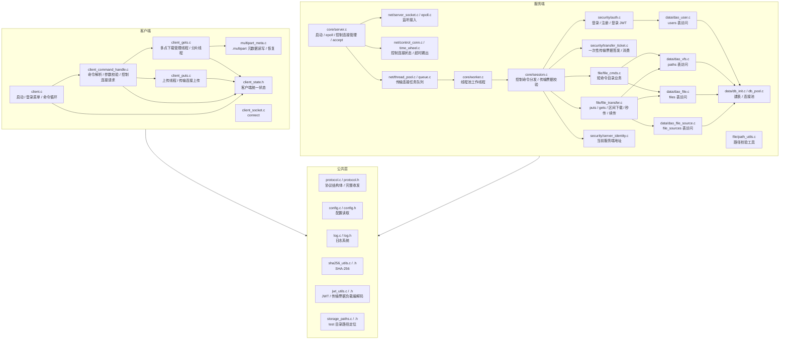
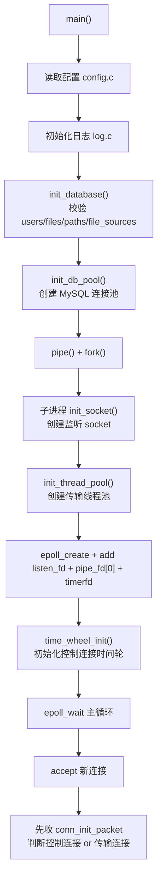
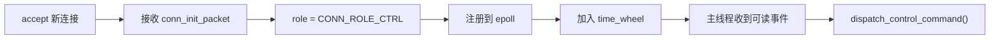
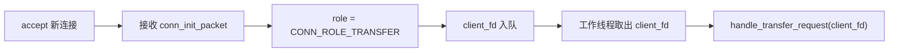
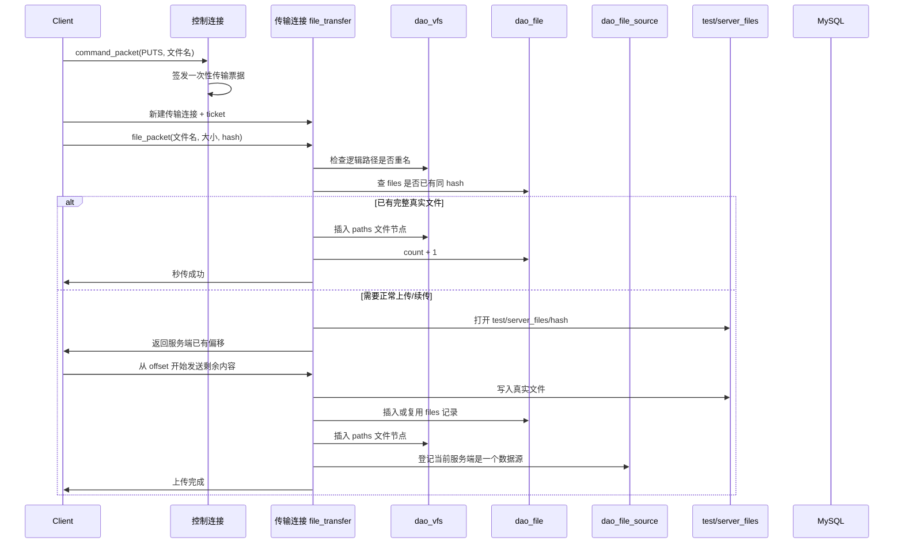

# WindCloud_V5 整体项目架构详解

## 1. 文档目标

这份文档不是“理想化分层图”，而是基于当前仓库第五期代码的真实实现，解释下面这些问题：

1. 当前客户端和服务端分别由哪些模块组成
2. 第四期和第五期引入的控制连接、传输连接、JWT、一次性票据、多点下载分别放在哪一层
3. 一条短命令、一条上传命令、一条第五期 `gets` 命令，分别会经过哪些模块
4. 虚拟目录、真实文件、数据库四张核心表、时间轮、线程池分别扮演什么角色

当前版本已经包含：

- 登录 / 注册
- 虚拟目录命令：`pwd`、`cd`、`ls`、`mkdir`、`touch`、`rm`、`rmdir`
- 上传 `puts`
- 下载 `gets`
- 断点续传
- 基于 SHA-256 的秒传 / 去重
- 控制连接与传输连接分离
- JWT 登录态
- 一次性传输票据
- 控制连接空闲超时踢出
- 第五期多点下载第一版
- 第五期本地分片任务元数据恢复

---

## 2. 总体架构总览

### 2.1 逻辑分层图



### 2.2 当前项目可以映射成的推荐分层

虽然仓库目录没有完全按“传统三层架构”命名，但从职责上已经可以很清楚地映射成下面几层：

| 分层 | 当前模块 |
| --- | --- |
| 协议层 `protocol` | `include/protocol.h`、`src/common/protocol.c` |
| 客户端状态层 `client_state` | `include/client_state.h` |
| 会话层 `session` | `src/server/core/session.c`、`ClientContext` |
| 业务层 `auth / file_cmds / file_transfer` | `src/server/security/auth.c`、`src/server/file/file_cmds.c`、`src/server/file/file_transfer.c` |
| 票据安全层 `jwt / transfer_ticket` | `src/common/jwt_utils.c`、`src/server/security/transfer_ticket.c` |
| DAO层 `dao_*` | `src/server/data/dao_user.c`、`dao_vfs.c`、`dao_file.c`、`dao_file_source.c` |
| 基建层 `server / net / db_pool / log / config` | `src/server/core/server.c`、`src/server/net/*`、`src/server/data/db_pool.c`、`src/common/log.c`、`src/common/config.c` |

这里最关键的理解是：

- 协议层解决“包长什么样、怎么完整收发”
- 会话层解决“这条连接现在是什么角色、属于谁、该分发到哪里”
- 业务层解决“具体命令要做什么”
- DAO层解决“数据库怎么查和改”
- 基建层解决“线程池、时间轮、日志、配置、监听套接字怎么运转”

---

## 3. 目录与模块组织

### 3.1 当前源码目录

```text
include/
├── auth.h
├── client_command_handle.h
├── client_socket.h
├── client_state.h
├── config.h
├── control_conn.h
├── dao_file.h
├── dao_file_source.h
├── dao_user.h
├── dao_vfs.h
├── db_init.h
├── db_pool.h
├── epoll.h
├── file_cmds.h
├── file_transfer.h
├── jwt_utils.h
├── multipart_meta.h
├── path_utils.h
├── protocol.h
├── queue.h
├── server_identity.h
├── server_socket.h
├── session.h
├── sha256_utils.h
├── storage_paths.h
├── thread_pool.h
├── time_wheel.h
├── transfer_ticket.h
└── worker.h

src/client/
├── client.c
├── client_command_handle.c
├── client_gets.c
├── client_puts.c
├── client_socket.c
└── multipart_meta.c

src/common/
├── config.c
├── jwt_utils.c
├── log.c
├── protocol.c
├── sha256_utils.c
└── storage_paths.c

src/server/
├── core/
│   ├── server.c
│   ├── session.c
│   └── worker.c
├── net/
│   ├── control_conn.c
│   ├── epoll.c
│   ├── queue.c
│   ├── server_socket.c
│   ├── thread_pool.c
│   └── time_wheel.c
├── data/
│   ├── dao_file.c
│   ├── dao_file_source.c
│   ├── dao_user.c
│   ├── dao_vfs.c
│   ├── db_init.c
│   └── db_pool.c
├── file/
│   ├── file_cmds.c
│   ├── file_transfer.c
│   └── path_utils.c
└── security/
    ├── auth.c
    ├── server_identity.c
    └── transfer_ticket.c
```

### 3.2 第五期最关键的模块

当前 V5 中最能体现当前架构特点的模块主要有：

1. `client_state.h`
   - 客户端把控制连接状态、当前远端路径、本地文件目录统一收口
2. `jwt_utils.c`
   - 登录 JWT 和传输票据负载共用这套编解码工具
3. `transfer_ticket.c`
   - 负责一次性传输票据签发、消费和“只能使用一次”的约束
4. `control_conn.c` / `time_wheel.c`
   - 控制连接改成 `epoll + 时间轮`
5. `dao_file_source.c`
   - 第五期新增 `file_sources`，用于记录当前有哪些服务器拥有同一份真实文件
6. `multipart_meta.c`
   - 第五期本地多点下载恢复的核心

### 3.3 模块关系的一个关键事实

当前项目实际维护三套并行但有关联的系统：

1. 逻辑文件系统
   - 面向用户
   - 保存到数据库 `paths`
   - 负责 `pwd/cd/ls/mkdir/touch/rm/rmdir`
2. 真实文件系统
   - 面向服务端存储
   - 保存到 `test/server_files/<sha256>`
   - 负责上传下载、断点续传、去重
3. 数据源系统
   - 面向第五期多点下载
   - 保存到数据库 `file_sources`
   - 负责告诉控制服务器“这份真实文件可以从哪些服务器下载”

因此当前项目本质上已经可以概括成：

> 基于控制连接与传输连接分离的虚拟文件系统 + 去重真实存储系统 + 多点下载协商系统

---

## 4. 服务端架构详解

## 4.1 服务端启动链

服务端入口是 `src/server/core/server.c`。

当前启动顺序如下：



### 4.1.1 当前服务端不是单进程直跑

当前服务端仍然保留：

1. `pipe()`
2. `fork()`
3. 父进程接收 `SIGINT`
4. 子进程跑真正服务端逻辑

父进程通过管道通知子进程退出，这部分仍然属于“父进程控制退出、子进程执行业务”的结构。

### 4.1.2 `epoll` 当前负责的范围

当前 V5 里，`epoll` 除了监听新连接和退出通知，还额外负责：

1. 控制连接 fd 的可读事件
2. `timerfd` 的时间推进事件

这意味着当前服务端并发模型已经变成：

> 控制连接由主线程 `epoll` 驱动，传输连接由线程池处理

### 4.1.3 启动时数据库表会自动校验 / 创建

当前 `db_init.c` 会自动保证下面四张核心表存在：

1. `users`
2. `files`
3. `paths`
4. `file_sources`

因此第五期的数据源系统并不是“额外手工建表”，而是服务端启动时自动保证存在。

---

## 4.2 当前并发模型

当前服务端的关键设计，就是把连接明确拆成两类：

1. 控制连接
2. 传输连接

### 4.2.1 控制连接模型

控制连接由主线程管理，流程是：



主线程直接处理：

1. 登录 / 注册
2. `pwd/cd/ls/mkdir/touch/rm/rmdir`
3. `puts` 预请求
4. 第五期 `gets` 下载方案申请
5. 第五期 `gets` 分片区间票据申请

### 4.2.2 传输连接模型

传输连接进入线程池，流程是：



传输连接只负责两类真正耗时的任务：

1. `puts` 文件上传
2. `gets` 文件下载或区间下载

### 4.2.3 为什么说当前是“控制连接事件驱动 + 传输连接线程池”

因为：

1. 控制连接不再长期占住某个工作线程
2. 传输连接才进入线程池
3. 主线程通过 `epoll` 同时管理多个控制连接
4. 控制连接超时由时间轮统一踢出

---

## 4.3 控制连接子系统

控制连接相关模块主要包括：

- `src/server/net/control_conn.c`
- `src/server/net/time_wheel.c`
- `src/server/core/server.c`

### 4.3.1 `ControlConn` 的作用

控制连接需要维护：

1. 当前 fd
2. 当前是否已经挂到时间轮
3. 相关链表指针

它的存在意义是：

> 让主线程可以把一个控制连接当成“可超时、可移动、可删除”的对象来管理

### 4.3.2 时间轮的职责

时间轮只服务控制连接，不服务传输连接。

它的作用是：

1. 新控制连接建立时加入时间轮
2. 控制连接每次收到命令后刷新超时位置
3. 到期时关闭这条控制连接

当前超时秒数来自配置项：

- `ctrl_timeout_sec`

### 4.3.3 为什么传输连接不进时间轮

因为当前项目的设计是：

1. 控制连接数量多、命令短、空闲多
2. 传输连接本身就是一次性耗时任务

所以第五期当前实现里，只把“长时间空闲会话”问题交给控制连接时间轮处理。

---

## 4.4 会话层 `session.c`

`src/server/core/session.c` 是整个服务端业务调度的枢纽。

### 4.4.1 `ClientContext` 是什么

当前仍定义在 `include/protocol.h`：

```c
typedef struct{
    int user_id;
    char current_path[256];
    int current_dir_id;
} ClientContext;
```

这个结构体仍然表示“单条连接在服务端内存中的会话态”：

- `user_id`
  - 当前连接归属哪个登录用户
- `current_path`
  - 当前虚拟路径
- `current_dir_id`
  - 当前目录节点 ID

### 4.4.2 现在要区分两个层次的状态

当前最容易混淆的一点是：

1. `ClientContext`
   - 是连接内存态
   - 服务端自己维护
   - 只在这条连接活着时有效
2. JWT / 传输票据
   - 是客户端随请求携带的身份凭证
   - 用于让新开的传输连接也能证明“自己属于谁”

它们不冲突，职责也不同。

### 4.4.3 会话层现在分成两条入口

#### A. 控制连接分发入口

`dispatch_control_command()`

负责：

1. 接收控制连接普通命令包
2. 检查登录态
3. 把命令分发给 `auth`、`file_cmds`、`file_transfer` 预请求逻辑

#### B. 传输连接入口

`handle_transfer_request()`

负责：

1. 接收 `transfer_auth_packet`
2. 校验并消费一次性票据
3. 恢复出：
   - 用户 id
   - 命令类型
   - 完整虚拟路径
   - 区间范围
   - 允许连接的数据源服务器
4. 构造一个临时 `ClientContext`
5. 分发到 `handle_puts()`、`handle_gets()` 或 `handle_gets_range()`

### 4.4.4 第五期控制连接上的两个关键新增命令

#### `CMD_TYPE_GETS`

在 V5 中不再表示“立刻下载整文件”，而是表示：

> 申请多点下载方案

控制服务器会返回：

1. 文件名
2. 文件总大小
3. 文件 hash
4. 可用数据源列表

#### `CMD_TYPE_GETS_RANGE`

这是第五期新增内部命令，用于：

> 为某个下载分片申请区间票据

客户端把：

1. 文件名
2. `range_start`
3. `range_end`
4. `source_ip`
5. `source_port`

编码成一个字符串发到控制连接，服务端解析、校验并签发票据。

---

## 5. 业务层架构详解

当前业务层的主线仍然是三条：

- `auth.c`
- `file_cmds.c`
- `file_transfer.c`

但第五期以后，它们被新的票据系统和数据源系统包住了。

## 5.1 认证业务 `auth.c`

### 5.1.1 注册

注册流程仍然是：

1. 从 `用户名/密码` 字符串中拆出用户名和密码
2. 生成随机盐
3. 计算 `SHA256(password + salt)`
4. 插入 `users`
5. 返回注册结果

### 5.1.2 登录

登录流程仍然是：

1. 按用户名查 `users`
2. 取回 `password_hash` 和 `salt`
3. 重算用户输入密码的加盐哈希
4. 对比是否一致
5. 成功后把 `ctx->user_id` 设为用户 id

### 5.1.3 第四期后新增的登录返回内容

当前登录成功后，服务端不只返回“登录成功”文本，还返回：

1. `user_id`
2. JWT

这个 JWT 不直接拿来做第五期多点下载的最终授权，但它仍然是客户端长期登录态的一部分。

---

## 5.2 虚拟文件系统命令 `file_cmds.c`

这个模块负责：

- `pwd`
- `ls`
- `cd`
- `mkdir`
- `touch`
- `rm`
- `rmdir`

### 5.2.1 它操作的始终是虚拟目录

这里操作的是数据库 `paths`，不是 Linux 进程当前目录。

例如：

```text
cd work
```

实际做的是：

1. 根据 `current_path` 拼逻辑路径
2. 去 `paths` 表里查目标节点
3. 确认是目录
4. 更新 `ctx.current_path` 和 `ctx.current_dir_id`

### 5.2.2 这些命令和第五期关系不大，但它们提供了下载语义基础

第五期 `gets` 虽然已经变成多点下载，但“你现在站在哪个目录、输入的文件名到底对应哪条逻辑路径”这件事，仍然依赖这套虚拟目录系统。

也就是说：

> 多点下载只是扩展了传输方式，没有改变虚拟路径系统本身

---

## 5.3 文件传输业务 `file_transfer.c`

这是当前项目里最复杂的核心模块。

它负责：

- `puts`
- `gets`
- 区间 `gets`
- 断点续传
- 秒传
- 去重
- `file_sources` 维护

### 5.3.1 真实文件存储策略

真实文件统一存放在：

```text
test/server_files/<sha256>
```

其特点是：

1. 真实文件名不是用户原名，而是内容哈希
2. 逻辑目录树和物理文件彻底分离
3. 相同内容天然共用一份真实文件

### 5.3.2 上传 `puts` 的完整链路



### 5.3.3 当前第五期 `gets` 的工作方式

当前 `gets` 是：

1. 控制连接先申请“多点下载方案”
2. 客户端根据数据源数量切分分片
3. 每个未完成分片在控制连接上单独申请区间票据
4. 客户端为每个分片创建独立传输连接
5. 各分片写入 `.multipart`
6. 全部分片完成后再合并为最终文件

### 5.3.4 当前下载发送端已经支持区间发送

服务端内部下载逻辑现在统一收口到：

- `handle_gets_common()`

它支持两种模式：

1. 整文件发送
2. 指定区间发送

第五期区间下载时，服务端会：

1. 校验 `range_start` / `range_end`
2. 计算本区间逻辑总大小
3. 客户端回传“本分片已完成字节数”
4. 服务端换算成真实文件绝对偏移再继续发

这使得：

> 分片内部也能继续复用第二期的断点续传机制

### 5.3.5 大文件传输路径

当前代码里，当文件超过 `100MB` 时：

1. 上传发送端改用 `mmap + send`
2. 下载发送端改用 `mmap` 发送

因此第二期“大文件使用 `mmap`”要求，到了当前 V5 仍然继续生效。

---

## 6. DAO层与数据库模型详解

## 6.1 四张核心表

当前数据库核心表是四张：

| 表 | 作用 |
| --- | --- |
| `users` | 保存用户认证信息 |
| `paths` | 保存每个用户虚拟目录树中的节点 |
| `files` | 保存真实文件实体元数据 |
| `file_sources` | 保存当前哪些服务器拥有某个真实文件 |

### 6.1.1 `users`

保存：

1. 用户名
2. 密码哈希
3. 盐值

### 6.1.2 `paths`

保存：

1. `user_id`
2. `path`
3. `parent_id`
4. `file_name`
5. `type`
6. `file_id`

它描述的是：

> 某个用户在虚拟目录里能看到什么

### 6.1.3 `files`

保存：

1. `sha256sum`
2. `size`
3. `count`

它描述的是：

> 真实文件实体是什么，它被多少个逻辑文件节点引用

### 6.1.4 `file_sources`

保存：

1. `file_id`
2. `server_ip`
3. `server_port`
4. `status`

它描述的是：

> 哪些服务器当前拥有这份真实文件

这张表就是第五期多点下载协商的数据库基础。

## 6.2 当前四张表之间的关系

可以这样理解：

```text
用户看到的文件
    ↓
paths
    ↓ file_id
files
    ↓ file_id
file_sources
```

也就是说：

1. `paths` 决定“用户逻辑上看见什么”
2. `files` 决定“真实实体是什么”
3. `file_sources` 决定“这份真实实体现在能从哪些服务器拿到”

---

## 7. 客户端架构详解

## 7.1 客户端入口 `client.c`

客户端入口是 `src/client/client.c`。

它负责：

1. 读取配置
2. 初始化日志
3. 初始化 `ClientState`
4. 初始化本地统一文件目录
5. 建立控制连接
6. 进入登录菜单
7. 进入命令循环

### 7.1.1 `ClientState` 的作用

当前客户端所有核心状态都统一收口到：

```c
typedef struct {
    int ctrl_fd;
    int logged_in;
    int user_id;
    char token[TOKEN_LEN];
    char current_path[256];
    char server_ip[64];
    char server_port[64];
    char client_file_dir[MAX_PATH_LEN];
    pthread_mutex_t lock;
} ClientState;
```

这个结构体存在的意义是：

> 让主线程和传输线程共享同一份客户端状态，而不是各自维护零散全局变量

## 7.2 命令分发 `client_command_handle.c`

这是客户端命令入口。

它负责：

1. 解析用户输入
2. 做本地参数校验
3. 发送登录命令
4. 发送普通短命令
5. 发送 `puts` 预请求
6. 发送第五期 `gets` 下载方案请求
7. 发送第五期 `gets` 区间票据请求

### 7.2.1 第五期后客户端 `gets` 的控制层逻辑已经变了

当前 `process_command()` 遇到 `gets` 后，不再直接启动一个简单下载线程，而是进入：

- `handle_gets_command()`

而这个函数的第一步是：

- `request_multi_gets_plan()`

也就是说：

> 第五期客户端先拿方案，再决定如何下载

## 7.3 上传模块 `client_puts.c`

当前上传模块的职责是：

1. 先在控制连接上申请传输票据
2. 再新建一条传输连接
3. 传输线程执行真正上传

它仍然维持“一次上传对应一个后台传输线程”的第四期模型，没有被第五期改成分片上传。

## 7.4 下载模块 `client_gets.c`

这是第五期变化最大的客户端模块。

### 7.4.1 当前下载任务分成两层线程

#### 第一层：管理线程

由：

- `gets_manager_thread_func()`

负责：

1. 等待所有分片线程结束
2. 刷新本地元数据
3. 判断是否全部完成
4. 合并分片文件
5. 计算最终哈希
6. 清理 `.multipart` 任务目录

#### 第二层：分片线程

由：

- `gets_part_thread_func()`

负责：

1. 连接指定数据源服务器
2. 发送区间票据
3. 执行本分片真正下载
4. 写入本地分片临时文件

### 7.4.2 当前下载分片切分策略

在当前第一版实现里，客户端采用最直观的平均切分策略：

1. 按 `source_count` 平均切文件
2. 有余数字节就从前往后补
3. 一个分片对应一个数据源

这不是最复杂的调度策略，但足够清楚，适合当前学习项目。

## 7.5 `multipart_meta.c`

这是第五期恢复能力的关键模块。

它负责：

1. 创建 `.multipart` 根目录
2. 创建以文件 hash 命名的任务目录
3. 生成 `meta.ini`
4. 加载旧任务元数据
5. 读取已有分片临时文件大小
6. 刷新每个分片的 `finished_bytes`
7. 下载完成后清理整个任务目录

当前本地恢复依赖的核心事实是：

> 再次执行 `gets` 时，客户端会优先检查本地是否已有同 hash 的任务目录和元数据

---

## 8. 协议层架构详解

第五期当前协议层的关键结构体包括：

1. `command_packet_t`
2. `file_packet_t`
3. `conn_init_packet_t`
4. `transfer_auth_packet_t`
5. `auth_reply_packet_t`
6. `transfer_ticket_reply_packet_t`
7. `source_server_t`
8. `multi_gets_plan_packet_t`

## 8.1 连接初始化协议

每条新连接建立后，客户端都会先发：

- `conn_init_packet_t`

其中 `role` 取值为：

1. `CONN_ROLE_CTRL`
2. `CONN_ROLE_TRANSFER`

这是服务端当前整体并发架构能成立的第一步。

## 8.2 控制连接协议

控制连接主要承载：

1. 登录 / 注册
2. 短命令
3. `puts` 传输票据申请
4. 第五期 `gets` 下载方案申请
5. 第五期 `gets` 区间票据申请

## 8.3 传输连接协议

传输连接主要承载：

1. 一次性票据认证
2. 上传文件包
3. 下载文件包
4. 分片区间下载

## 8.4 为什么要有两层凭证

当前项目里实际有两种凭证：

1. 登录 JWT
2. 一次性传输票据

它们的职责不同：

### 登录 JWT

负责：

1. 表示客户端当前已经登录
2. 保存长期一点的身份信息

### 一次性传输票据

负责：

1. 绑定某次具体上传或下载
2. 绑定完整路径
3. 绑定区间
4. 绑定目标服务器
5. 保证只能使用一次

因此第五期当前真正参与传输权限控制的，已经不是登录 JWT，而是一次性票据。

---

## 9. 三条核心调用链

## 9.1 一条短命令：`mkdir demo`

链路如下：

```text
终端输入
→ client.c 命令循环
→ client_command_handle.c
→ send_command_packet()
→ 服务端控制连接 epoll 事件
→ session.c dispatch_control_command()
→ file_cmds.c handle_mkdir()
→ dao_vfs.c
→ MySQL
→ send_msg()
→ 客户端打印结果
```

## 9.2 一条上传命令：`puts a.txt`

链路如下：

```text
终端输入
→ client_command_handle.c 申请 puts 票据
→ 服务端控制连接签发票据
→ client_puts.c 新建传输线程
→ 新建传输连接
→ transfer_ticket 校验并消费
→ file_transfer.c handle_puts()
→ files / paths / file_sources
→ test/server_files/<sha256>
```

## 9.3 一条第五期下载命令：`gets a.bin`

链路如下：

```text
终端输入
→ client_command_handle.c request_multi_gets_plan()
→ 服务端控制连接返回 multi_gets_plan_packet_t
→ multipart_meta.c 准备本地任务目录
→ client_gets.c 为每个未完成分片申请区间票据
→ 每个分片线程建立独立传输连接
→ 服务端校验并消费区间票据
→ file_transfer.c handle_gets_range()
→ 分片写入 .multipart/任务目录/part_i
→ 管理线程合并所有分片
→ 计算最终 hash
→ 清理任务目录
```

---

## 10. 一句话总结

如果用一句话概括当前 V5 的真实架构，它可以概括成：

> 基于虚拟文件系统和去重真实存储的网盘服务，在控制连接与传输连接分离的基础上，继续扩展出数据源登记、多点下载协商、区间分片下载和本地恢复机制。
