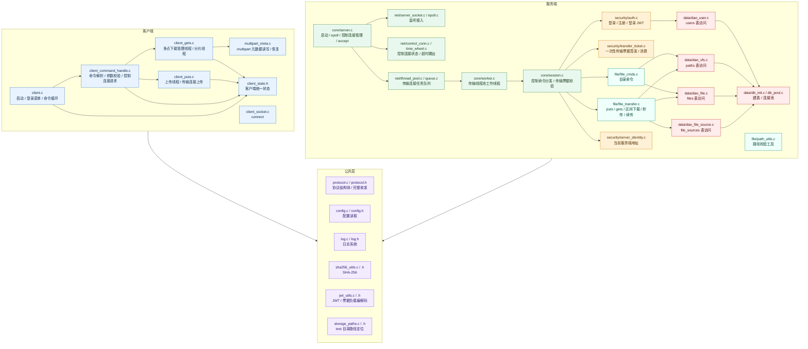
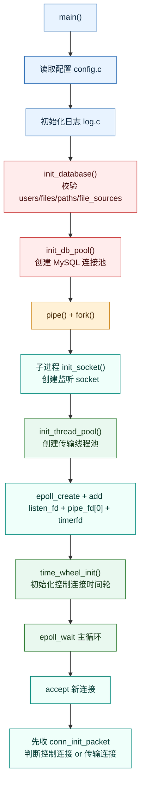
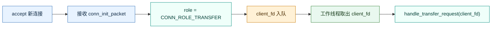
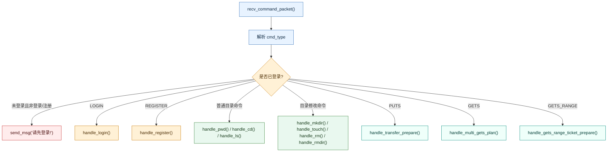
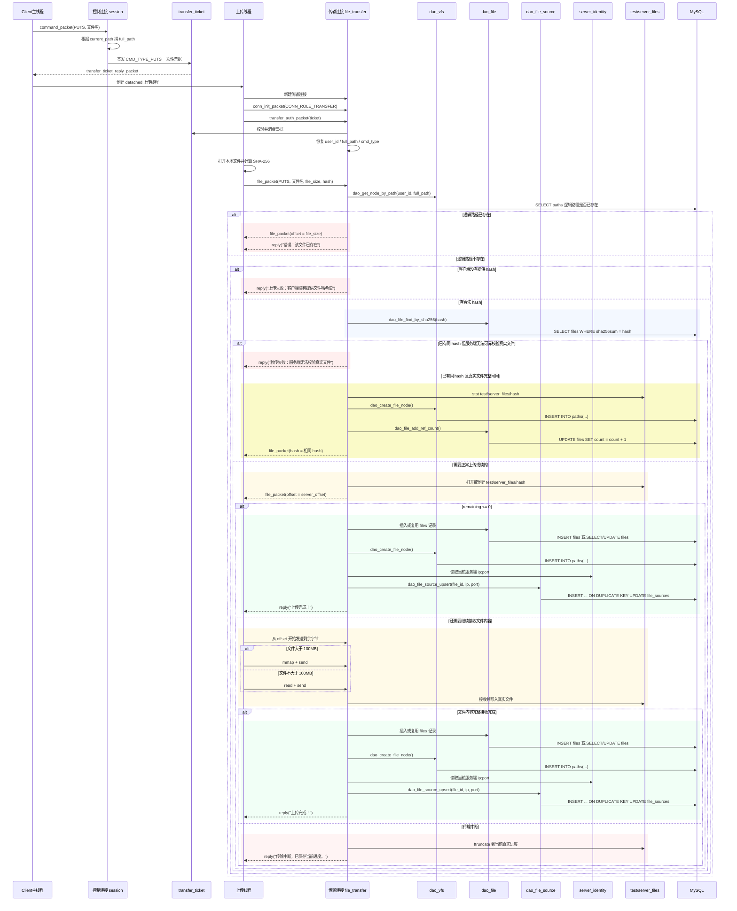
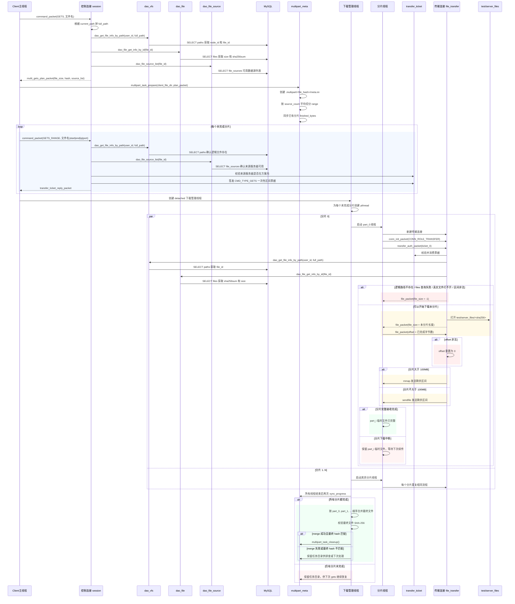
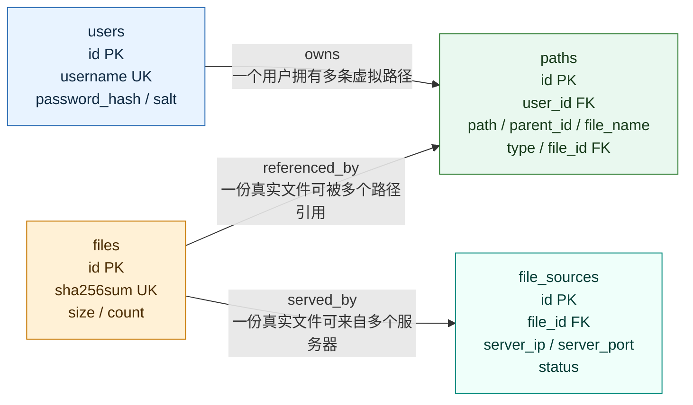
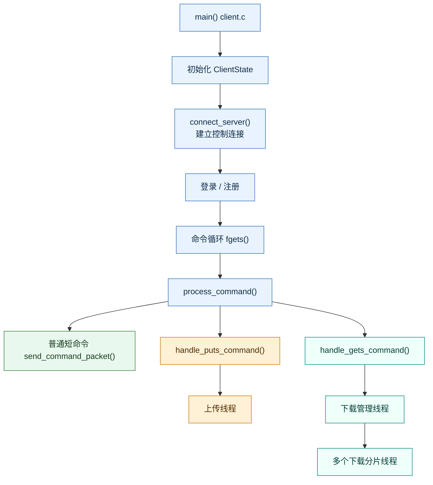

# WindCloud_V5 整体项目架构详解

## 1. 文档目标

这份文档不画脱离代码的“理想分层图”，而是以仓库中第五期的实际实现为依据，说明下面几个问题：

1. 客户端和服务端分别由哪些模块组成
2. 控制连接、传输连接、JWT、一次性票据、多点下载分别放在哪一层
3. 一条短命令、一条上传命令、一条第五期 `gets` 命令，分别会经过哪些模块
4. 虚拟目录、真实文件、数据库四张核心表、时间轮、线程池分别扮演什么角色

第五期版本已经包含：

- 登录 / 注册
- 虚拟目录命令：`pwd`、`cd`、`ls`、`mkdir`、`touch`、`rm`、`rmdir`
- 上传 `puts`
- 下载 `gets`
- 断点续传
- 基于 SHA-256 的秒传 / 去重
- 控制连接与传输连接分离
- JWT 登录态
- 一次性传输票据
- 控制连接空闲超时踢出
- 第五期多点下载第一版
- 第五期本地分片任务元数据恢复

---

## 2. 总体架构总览

### 2.1 逻辑分层图



### 2.2 项目职责分层

仓库目录没有完全按“传统三层架构”命名，但按职责可以清楚地分成下面几层：

| 分层 | 对应模块 |
| --- | --- |
| 协议层 `protocol` | `include/protocol.h`、`src/common/protocol.c` |
| 客户端状态层 `client_state` | `include/client_state.h` |
| 会话层 `session` | `src/server/core/session.c`、`ClientContext` |
| 业务层 `auth / file_cmds / file_transfer` | `src/server/security/auth.c`、`src/server/file/file_cmds.c`、`src/server/file/file_transfer.c` |
| 票据安全层 `jwt / transfer_ticket` | `src/common/jwt_utils.c`、`src/server/security/transfer_ticket.c` |
| DAO层 `dao_*` | `src/server/data/dao_user.c`、`dao_vfs.c`、`dao_file.c`、`dao_file_source.c` |
| 基建层 `server / net / db_pool / log / config` | `src/server/core/server.c`、`src/server/net/*`、`src/server/data/db_pool.c`、`src/common/log.c`、`src/common/config.c` |

理解这张表时，重点看每一层解决的问题：

- 协议层解决“包长什么样、怎么完整收发”
- 会话层解决“这条连接现在是什么角色、属于谁、该分发到哪里”
- 业务层解决“具体命令要做什么”
- DAO层解决“数据库怎么查和改”
- 基建层解决“线程池、时间轮、日志、配置、监听套接字怎么运转”

---

## 3. 目录与模块组织

### 3.1 源码目录

```text
include/
├── auth.h
├── client_command_handle.h
├── client_socket.h
├── client_state.h
├── config.h
├── control_conn.h
├── dao_file.h
├── dao_file_source.h
├── dao_user.h
├── dao_vfs.h
├── db_init.h
├── db_pool.h
├── epoll.h
├── file_cmds.h
├── file_transfer.h
├── jwt_utils.h
├── multipart_meta.h
├── path_utils.h
├── protocol.h
├── queue.h
├── server_identity.h
├── server_socket.h
├── session.h
├── sha256_utils.h
├── storage_paths.h
├── thread_pool.h
├── time_wheel.h
├── transfer_ticket.h
└── worker.h

src/client/
├── client.c
├── client_command_handle.c
├── client_gets.c
├── client_puts.c
├── client_socket.c
└── multipart_meta.c

src/common/
├── config.c
├── jwt_utils.c
├── log.c
├── protocol.c
├── sha256_utils.c
└── storage_paths.c

src/server/
├── core/
│   ├── server.c
│   ├── session.c
│   └── worker.c
├── net/
│   ├── control_conn.c
│   ├── epoll.c
│   ├── queue.c
│   ├── server_socket.c
│   ├── thread_pool.c
│   └── time_wheel.c
├── data/
│   ├── dao_file.c
│   ├── dao_file_source.c
│   ├── dao_user.c
│   ├── dao_vfs.c
│   ├── db_init.c
│   └── db_pool.c
├── file/
│   ├── file_cmds.c
│   ├── file_transfer.c
│   └── path_utils.c
└── security/
    ├── auth.c
    ├── server_identity.c
    └── transfer_ticket.c
```

### 3.2 第五期关键模块

V5 中最能体现架构变化的模块主要有：

1. `client_state.h`
   - 客户端把控制连接状态、远端路径、本地文件目录统一收口
2. `jwt_utils.c`
   - 登录 JWT 和传输票据负载共用这套编解码工具
3. `transfer_ticket.c`
   - 负责一次性传输票据签发、消费和“只能使用一次”的约束
4. `control_conn.c` / `time_wheel.c`
   - 控制连接改成 `epoll + 时间轮`
5. `dao_file_source.c`
   - 第五期新增 `file_sources`，用于记录哪些服务器拥有同一份真实文件
6. `multipart_meta.c`
   - 第五期本地多点下载恢复的核心

### 3.3 模块关系的一个关键事实

项目实际维护三套并行但相互关联的系统：

1. 逻辑文件系统
   - 面向用户
   - 保存到数据库 `paths`
   - 负责 `pwd/cd/ls/mkdir/touch/rm/rmdir`
2. 真实文件系统
   - 面向服务端存储
   - 保存到 `test/server_files/<sha256>`
   - 负责上传下载、断点续传、去重
3. 数据源系统
   - 面向第五期多点下载
   - 保存到数据库 `file_sources`
   - 负责告诉控制服务器“这份真实文件可以从哪些服务器下载”

因此，V5 的整体模型可以概括为：

> 基于控制连接与传输连接分离的虚拟文件系统 + 去重真实存储系统 + 多点下载协商系统

---

## 4. 服务端架构详解

## 4.1 服务端启动链

服务端入口是 `src/server/core/server.c`。

启动顺序如下：



### 4.1.1 服务端不是单进程直跑

服务端仍然保留：

1. `pipe()`
2. `fork()`
3. 父进程接收 `SIGINT`
4. 子进程跑真正服务端逻辑

父进程通过管道通知子进程退出，整体仍是“父进程控制退出、子进程执行业务”的结构。

### 4.1.2 `epoll` 负责的范围

在 V5 中，`epoll` 除了监听新连接和退出通知，还负责：

1. 控制连接 fd 的可读事件
2. `timerfd` 的时间推进事件

这意味着服务端并发模型已经变成：

> 控制连接由主线程 `epoll` 驱动，传输连接由线程池处理

### 4.1.3 启动时数据库表会自动校验 / 创建

`db_init.c` 会在启动时保证下面四张核心表存在：

1. `users`
2. `files`
3. `paths`
4. `file_sources`

因此，第五期的数据源系统不需要额外手工建表，服务端启动时会自动完成校验和创建。

---

## 4.2 并发模型

服务端的关键设计，是把连接明确拆成两类：

1. 控制连接
2. 传输连接

### 4.2.1 控制连接模型

控制连接由主线程管理，流程是：


主线程直接处理：

1. 登录 / 注册
2. `pwd/cd/ls/mkdir/touch/rm/rmdir`
3. `puts` 预请求
4. 第五期 `gets` 下载方案申请
5. 第五期 `gets` 分片区间票据申请

### 4.2.2 传输连接模型

传输连接进入线程池，流程是：



传输连接只负责两类真正耗时的任务：

1. `puts` 文件上传
2. `gets` 文件下载或区间下载

### 4.2.3 为什么是“控制连接事件驱动 + 传输连接线程池”

因为：

1. 控制连接不再长期占住某个工作线程
2. 传输连接才进入线程池
3. 主线程通过 `epoll` 同时管理多个控制连接
4. 控制连接超时由时间轮统一踢出

---

## 4.3 控制连接子系统

控制连接相关模块主要包括：

- `src/server/net/control_conn.c`
- `src/server/net/time_wheel.c`
- `src/server/core/server.c`

### 4.3.1 `ControlConn` 的作用

控制连接需要维护以下信息：

1. fd
2. 对应的 `ClientContext`
3. 是否已经挂到时间轮
4. 相关链表指针

它的作用是：

> 让主线程可以把一个控制连接当成“可超时、可移动、可删除”的对象来管理

### 4.3.2 时间轮的职责

时间轮只服务控制连接，不服务传输连接。

它的作用是：

1. 新控制连接建立时加入时间轮
2. 控制连接每次收到命令后刷新超时位置
3. 到期时关闭这条控制连接

超时时间来自配置项：

- `ctrl_timeout_sec`

### 4.3.3 为什么传输连接不进时间轮

原因在于：

1. 控制连接数量多、命令短、空闲多
2. 传输连接本身就是一次性耗时任务

所以 V5 只把“长时间空闲会话”交给控制连接时间轮处理。

---

## 4.4 会话层 `session.c`

`src/server/core/session.c` 是整个服务端业务调度的枢纽。

### 4.4.1 `ClientContext` 是什么

它仍定义在 `include/protocol.h`：

```c
typedef struct{
    int user_id;
    char current_path[256];
    int current_dir_id;
} ClientContext;
```

该结构体表示“单条连接在服务端内存中的会话态”：

- `user_id`
  - 连接归属的登录用户
- `current_path`
  - 连接所在的虚拟路径
- `current_dir_id`
  - 连接所在的目录节点 ID

### 4.4.2 两类状态要分清

这里最容易混淆的是：

1. `ClientContext`
   - 是连接内存态
   - 服务端自己维护
   - 只在这条连接活着时有效
2. JWT / 传输票据
   - 是客户端随请求携带的身份凭证
   - 用于让新开的传输连接也能证明“自己属于谁”

它们不冲突，职责也不同。

### 4.4.3 会话层分成两条入口

#### A. 控制连接分发入口

`dispatch_control_command()`

负责：

1. 接收控制连接普通命令包
2. 检查登录态
3. 把命令分发给 `auth`、`file_cmds`、`file_transfer` 预请求逻辑

#### B. 传输连接入口

`handle_transfer_request()`

负责：

1. 接收 `transfer_auth_packet`
2. 校验并消费一次性票据
3. 恢复出：
   - 用户 id
   - 命令类型
   - 完整虚拟路径
   - 区间范围
   - 允许连接的数据源服务器
4. 构造一个临时 `ClientContext`
5. 分发到 `handle_puts()`、`handle_gets()` 或 `handle_gets_range()`

### 4.4.4 控制命令分发图



### 4.4.5 第五期控制连接上的两个关键新增命令

#### `CMD_TYPE_GETS`

在 V5 中不再表示“立刻下载整文件”，而是表示：

> 申请多点下载方案

控制服务器会返回：

1. 文件名
2. 文件总大小
3. 文件 hash
4. 可用数据源列表

#### `CMD_TYPE_GETS_RANGE`

这是第五期新增内部命令，用于：

> 为某个下载分片申请区间票据

客户端把：

1. 文件名
2. `range_start`
3. `range_end`
4. `source_ip`
5. `source_port`

编码成一个字符串发到控制连接，服务端解析、校验并签发票据。

---

## 5. 业务层架构详解

业务层仍以三条主线为核心：

- `auth.c`
- `file_cmds.c`
- `file_transfer.c`

进入第五期后，票据系统和数据源系统包在这三条主线外侧，负责连接授权和多点下载协商。

## 5.1 认证业务 `auth.c`

### 5.1.1 注册

注册流程为：

1. 从 `用户名/密码` 字符串中拆出用户名和密码
2. 生成随机盐
3. 计算 `SHA256(password + salt)`
4. 插入 `users`
5. 返回注册结果

### 5.1.2 登录

登录流程为：

1. 按用户名查 `users`
2. 取回 `password_hash` 和 `salt`
3. 重算用户输入密码的加盐哈希
4. 对比是否一致
5. 成功后把 `ctx->user_id` 设为用户 id

### 5.1.3 第四期后新增的登录返回内容

登录成功后，服务端不只返回“登录成功”文本，还会返回：

1. `user_id`
2. JWT

JWT 不直接作为第五期多点下载的最终授权凭证，但它仍是客户端长期登录态的一部分。

---

## 5.2 虚拟文件系统命令 `file_cmds.c`

该模块负责：

- `pwd`
- `ls`
- `cd`
- `mkdir`
- `touch`
- `rm`
- `rmdir`

### 5.2.1 操作对象始终是虚拟目录

这些命令操作的是数据库 `paths`，不是 Linux 进程的当前目录。

例如：

```text
cd work
```

实际做的是：

1. 根据 `current_path` 拼逻辑路径
2. 去 `paths` 表里查目标节点
3. 确认是目录
4. 更新 `ctx.current_path` 和 `ctx.current_dir_id`

### 5.2.2 目录命令提供下载语义基础

第五期 `gets` 虽然变成了多点下载，但“用户位于哪个目录、输入的文件名对应哪条逻辑路径”仍然依赖这套虚拟目录系统。

换句话说：

> 多点下载只是扩展了传输方式，没有改变虚拟路径系统本身

---

## 5.3 文件传输业务 `file_transfer.c`

这是项目里最复杂的核心模块。

它负责：

- `puts`
- `gets`
- 区间 `gets`
- 断点续传
- 秒传
- 去重
- `file_sources` 维护

### 5.3.1 真实文件存储策略

真实文件统一存放在：

```text
test/server_files/<sha256>
```

其特点是：

1. 真实文件名不是用户原名，而是内容哈希
2. 逻辑目录树和物理文件彻底分离
3. 相同内容天然共用一份真实文件

### 5.3.2 上传 `puts` 的完整链路

图中颜色含义：蓝色表示票据和查询阶段，黄色表示正常传输或续传阶段，绿色表示成功落库和收尾，红色表示错误或中断分支。



### 5.3.3 上传链路里的关键设计点

#### A. `puts` 不再直接在控制连接上传文件

控制连接只负责：

1. 判断用户是否已登录
2. 根据 `current_path` 和文件名生成完整虚拟路径
3. 签发一次性传输票据

文件内容只走传输连接。

#### B. “秒传成功”不仅要求数据库有相同 hash，还要求真实文件可用

服务端会先确认：

1. `files` 里存在同 hash 记录
2. `test/server_files/<sha256>` 这份真实文件确实存在且完整

只有同时满足，才会直接创建逻辑文件节点并返回秒传成功。

#### C. 上传成功后不只维护 `paths` 和 `files`

第五期还需要额外维护：

- `file_sources`

原因是第五期 `gets` 申请下载方案时，需要根据 `file_id` 反查：

> 哪些服务器拥有这份真实文件

### 5.3.4 下载 `gets` 的完整链路

图中颜色沿用上传链路的约定：蓝色表示控制连接协商，黄色表示传输执行，绿色表示完成收尾，红色表示失败或保留续传现场。



### 5.3.5 下载链路里的关键设计点

#### A. 第五期 `gets` 拆成“控制阶段 + 传输阶段”

控制阶段负责：

1. 判断当前逻辑路径下有没有这个文件
2. 通过 `paths -> files -> file_sources` 反查下载方案
3. 为每个分片签发一次性区间票据

传输阶段负责：

1. 各分片独立建立传输连接
2. 各分片分别续传
3. 合并最终文件

#### B. 第五期下载不再直接依赖控制连接里的目录状态做传输

控制连接只提供：

1. 文件名对应的完整逻辑路径
2. 下载方案
3. 区间票据

真正下载时，传输连接只信任票据中恢复出的信息：

1. 用户 id
2. 目标完整路径
3. `range_start`
4. `range_end`
5. 允许连接的数据源地址

#### C. “多点下载”基于多个完整数据源服务器，而不是单机多文件块表

换句话说，服务端不会保存“某个文件只存了一半”的块信息。

现有模型是：

1. 某台服务器如果在 `file_sources` 里登记了这份文件
2. 就表示这台服务器拥有整份真实文件
3. 客户端只是向不同服务器要不同区间

### 5.3.6 下载发送端已经支持区间发送

服务端内部下载逻辑统一收口到：

- `handle_gets_common()`

它支持两种模式：

1. 整文件发送
2. 指定区间发送

第五期区间下载时，服务端会：

1. 校验 `range_start` / `range_end`
2. 计算本区间逻辑总大小
3. 客户端回传“本分片已完成字节数”
4. 服务端换算成真实文件绝对偏移再继续发

这使得：

> 分片内部也能继续复用第二期的断点续传机制

### 5.3.7 大文件传输路径

代码中，当文件超过 `100MB` 时：

1. 上传发送端改用 `mmap + send`
2. 下载发送端改用 `mmap` 发送

因此，第二期“大文件使用 `mmap`”的要求在 V5 中仍然生效。

---

## 6. DAO层与数据库模型详解

## 6.1 `dao_user.c`

该模块职责很集中，主要做两件事：

1. 根据用户名查询用户
2. 插入新用户

### 6.1.1 `dao_get_user_by_name()`

查询：

```text
SELECT id, password_hash, salt FROM users WHERE username = ?
```

它主要给：

1. 登录校验使用
2. 注册后回查用户 id 使用

### 6.1.2 `dao_insert_user()`

插入：

```text
INSERT INTO users(username, password_hash, salt)
```

DAO 层只负责执行 SQL，不组织“用户名重复时提示什么”这类业务语义。

---

## 6.2 `dao_vfs.c`

该模块负责虚拟目录树 `paths`。

它相当于项目里的“文件系统索引层”。

### 6.2.1 核心能力

1. `dao_get_node_by_path()`
   - 根据 `user_id + 逻辑路径` 查一个节点
2. `dao_list_dir()`
   - 列出某个目录的直接子节点
3. `dao_create_node()`
   - 创建目录节点
4. `dao_create_file_node()`
   - 创建文件节点，并关联 `file_id`
5. `dao_get_file_info_by_path()`
   - 根据文件逻辑路径查出 `node_id + file_id`
6. `dao_is_dir_empty()`
   - 判断目录是否为空
7. `dao_delete_node()`
   - 删除一条逻辑节点记录

### 6.2.2 `paths` 表的语义

它描述的是：

> 某个用户在虚拟目录树里“看得到什么”

需要特别注意一个实现细节：

- 根目录 `/` 在代码里约定为 `current_dir_id = 0`
- 它不是 `paths` 表里真的存在的一条普通记录

因此，`dao_vfs.c` 中不少逻辑都会把根目录作为特判处理。

---

## 6.3 `dao_file.c`

该模块负责真实文件实体 `files`。

### 6.3.1 核心能力

1. `dao_file_find_by_sha256()`
   - 按内容 hash 查真实文件记录
2. `dao_file_insert()`
   - 新建真实文件记录
3. `dao_file_add_ref_count()`
   - 逻辑文件节点新增引用时加一
4. `dao_file_sub_ref_count()`
   - 逻辑文件节点删除引用时减一
5. `dao_file_get_ref_count()`
   - 查询引用计数
6. `dao_file_delete()`
   - 彻底删除真实文件记录
7. `dao_file_get_info_by_id()`
   - 按 `file_id` 查询 `sha256sum + size`

### 6.3.2 `files.count` 的意义

它不是“这个文件被下载了多少次”，而是：

> 有多少个逻辑文件节点正在引用这份真实文件

例如：

1. 用户 A 上传一份 `hash=X` 的文件
2. 用户 B 上传同内容文件，触发秒传
3. 数据库里仍然只有一条 `files(hash=X)` 记录
4. 但 `count` 会变成 2

---

## 6.4 `dao_file_source.c`

这是第五期新增的关键 DAO。

### 6.4.1 核心能力

1. `dao_file_source_upsert()`
   - 记录某个 `file_id` 可从哪台服务器下载
2. `dao_file_source_list()`
   - 查询某个 `file_id` 有哪些可用数据源
3. `dao_file_source_delete_by_file_id()`
   - 真实文件被彻底删除时，清理对应数据源记录

### 6.4.2 为什么要用 `upsert`

系统需要保证：

> 同一个 `file_id` 在同一台服务器上只保留一条可用来源记录

所以这里使用：

```text
INSERT ... ON DUPLICATE KEY UPDATE
```

目的就是避免重复登记相同 `ip:port`。

---

## 6.5 四张核心表的关系

### 6.5.1 关系图



### 6.5.2 每张表的职责

| 表 | 作用 |
| --- | --- |
| `users` | 保存用户认证信息 |
| `paths` | 保存每个用户虚拟目录树中的节点 |
| `files` | 保存真实文件实体元数据 |
| `file_sources` | 保存哪些服务器拥有某个真实文件 |

### 6.5.3 一条 `gets` 命令为什么会同时经过三张表

以：

```text
gets report.pdf
```

为例，控制服务器会做：

1. 先用 `paths` 判断“当前目录下是否有 `report.pdf`”
2. 再从 `paths.file_id` 找到 `files.id`
3. 再通过 `files.id` 去 `file_sources` 查询有哪些服务器持有这份真实文件

所以第五期的实际查找链是：

```text
文件名 -> 逻辑路径 -> paths -> file_id -> files -> file_sources
```

---

## 7. 客户端架构详解

## 7.1 客户端模块划分

| 模块 | 职责 |
| --- | --- |
| `client.c` | 启动客户端、读取配置、建立控制连接、进入命令循环 |
| `client_command_handle.c` | 命令解析、参数校验、普通短命令发送、票据申请、下载方案申请 |
| `client_puts.c` | 上传线程、上传续传、秒传协作 |
| `client_gets.c` | 多点下载管理线程、分片线程、合并与校验 |
| `multipart_meta.c` | `.multipart` 任务目录创建、元数据写回、恢复进度 |
| `client_socket.c` | 建立 TCP 连接 |

### 7.1.1 客户端调用关系图



---

## 7.2 `ClientState` 的意义

客户端已经不再只是“拿一条 socket 发命令”的简单程序。

它现在有一份统一状态：

```c
typedef struct {
    int ctrl_fd;
    int logged_in;
    int user_id;
    char token[TOKEN_LEN];
    char current_path[256];
    char server_ip[64];
    char server_port[64];
    char client_file_dir[MAX_PATH_LEN];
    pthread_mutex_t lock;
} ClientState;
```

它负责保存：

1. 控制连接 fd
2. 是否已登录
3. 登录用户 id
4. 登录得到的 JWT
5. 客户端记录的远端虚拟路径
6. 服务端地址
7. 本地统一文件目录 `test/client_files`

---

## 7.3 普通短命令链路

下面这些短命令：

- `pwd`
- `ls`
- `cd`
- `mkdir`
- `touch`
- `rm`
- `rmdir`

仍然走最简单的控制连接链路：


这些命令不会创建新的传输连接，也不会进入线程池。

---

## 7.4 上传 `puts` 的客户端链路

### 7.4.1 主线程阶段

客户端输入：

```text
puts a.txt
```

主线程会做：

1. 检查本地 `test/client_files/a.txt` 是否存在
2. 通过 `request_transfer_ticket()` 在控制连接上申请一次性上传票据
3. 创建 detached 上传线程

### 7.4.2 上传线程阶段

上传线程会做：

1. 重新新建一条传输连接
2. 先发 `conn_init_packet(CONN_ROLE_TRANSFER)`
3. 再发 `transfer_auth_packet(ticket)`
4. 打开本地文件并计算 SHA-256
5. 发送 `file_packet_t`
6. 接收服务端返回的 `offset`
7. 从这个偏移开始发送剩余内容
8. 接收最终文本结果

### 7.4.3 客户端上传调用链

```text
process_command()
-> handle_puts_command()
-> request_transfer_ticket()
-> pthread_create(upload_thread)
-> puts_thread_func()
-> connect_server()
-> send_conn_init_packet()
-> send_transfer_auth_packet()
-> run_puts_transfer()
```

---

## 7.5 下载 `gets` 的客户端链路

### 7.5.1 主线程阶段

客户端输入：

```text
gets report.pdf
```

主线程会做：

1. 调用 `request_multi_gets_plan()`
2. 收到 `multi_gets_plan_packet_t`
3. 调用 `multipart_task_prepare()`
4. 按未完成分片逐个调用 `request_gets_range_ticket()`
5. 创建 detached 下载管理线程

### 7.5.2 下载管理线程阶段

下载管理线程会做：

1. 为每个未完成分片创建一个下载线程
2. 等待所有分片线程结束
3. 再次同步各分片完成进度
4. 如果全部完成，就合并最终文件并校验 SHA-256
5. 如果没有全部完成，就保留 `.multipart` 目录给下次继续

### 7.5.3 单个分片线程阶段

每个分片线程会做：

1. 单独建立一条传输连接
2. 发送 `conn_init_packet(CONN_ROLE_TRANSFER)`
3. 发送 `transfer_auth_packet(ticket)`
4. 先接收服务端返回的“本分片总长度”
5. 把本分片已完成字节数作为 `offset` 回传
6. 从这一步继续接收剩余字节
7. 写入 `.multipart/<file_hash>/part_i`
8. 分片线程结束后，由管理线程统一 `multipart_task_sync_progress()`

### 7.5.4 客户端下载调用链

```text
process_command()
-> handle_gets_command()
-> request_multi_gets_plan()
-> multipart_task_prepare()
-> request_gets_range_ticket() x N
-> pthread_create(manager_thread)
-> gets_manager_thread_func()
-> pthread_create(part_thread) x N
-> gets_part_thread_func()
-> connect_server()
-> send_conn_init_packet()
-> send_transfer_auth_packet()
-> run_gets_part_transfer()
-> multipart_task_sync_progress()
-> [未完成则保留 .multipart | 完成则 merge_part_files() -> get_file_sha256() -> multipart_task_cleanup()]
```

---

## 8. 协议层详解

协议层文件是：

- `include/protocol.h`
- `src/common/protocol.c`

项目中的协议包已经按职责拆成多类固定结构体，不再用一种通用包承载所有语义。

## 8.1 普通命令包 `command_packet_t`

```c
typedef struct {
    int cmd_type;
    int data_len;
    char data[CMD_DATA_LEN];
} command_packet_t;
```

它主要承载：

1. 登录 / 注册命令字符串
2. `pwd/cd/ls/mkdir/touch/rm/rmdir`
3. `puts` 票据申请
4. `gets` 方案申请
5. `gets_range` 区间票据申请
6. 普通文本响应

---

## 8.2 文件包 `file_packet_t`

```c
typedef struct {
    int cmd_type;
    int data_len;
    off_t file_size;
    off_t offset;
    char file_name[FILE_NAME_LEN];
    char hash[65];
} file_packet_t;
```

它主要承载：

1. 上传阶段告诉服务端：
   - 文件名
   - 文件总大小
   - 文件 hash
2. 下载阶段告诉客户端：
   - 本次传输的逻辑总长度
3. 断点续传时互相传递：
   - 应该从哪个偏移继续

---

## 8.3 连接初始化包和认证包

### 8.3.1 `conn_init_packet_t`

```c
typedef struct {
    int role;
} conn_init_packet_t;
```

它的目的很单一：

> 新连接建立后，先告诉服务端“这条连接是控制连接还是传输连接”

### 8.3.2 `transfer_auth_packet_t`

```c
typedef struct {
    char ticket[TRANSFER_TICKET_LEN];
} transfer_auth_packet_t;
```

它只在传输连接上使用。

服务端收到后，会在 `handle_transfer_request()` 里：

1. 校验票据
2. 消费票据
3. 恢复传输上下文

---

## 8.4 登录响应包、票据响应包、下载方案包

### 8.4.1 `auth_reply_packet_t`

用于登录响应，包含：

1. 是否成功
2. `user_id`
3. 提示消息
4. JWT

### 8.4.2 `transfer_ticket_reply_packet_t`

用于 `puts` 和 `gets_range` 票据申请响应，包含：

1. 是否成功
2. 提示消息
3. 一次性票据

### 8.4.3 `multi_gets_plan_packet_t`

这是第五期新增的重要协议包，包含：

1. 是否成功
2. 文件总大小
3. 文件名
4. 文件 hash
5. 数据源数量
6. 数据源列表
7. 提示消息

它的意义是：

> 让客户端在真正开始传输前，先拿到完整的多点下载计划

---

## 8.5 协议辅助函数

`protocol.c` 里有一组完整收发辅助函数：

1. `send_full()`
2. `recv_full()`
3. `send_command_packet()` / `recv_command_packet()`
4. `send_file_packet()` / `recv_file_packet()`
5. `send_conn_init_packet()` / `recv_conn_init_packet()`
6. `send_transfer_auth_packet()` / `recv_transfer_auth_packet()`
7. `send_auth_reply_packet()` / `recv_auth_reply_packet()`
8. `send_transfer_ticket_reply_packet()` / `recv_transfer_ticket_reply_packet()`
9. `send_multi_gets_plan_packet()` / `recv_multi_gets_plan_packet()`

它们的作用很直接：

> 统一收口“结构体完整收发”，避免业务层反复编写 `send/recv` 拼接逻辑

---

## 9. 三条典型调用链汇总

## 9.1 短命令链路

```text
终端输入
-> client_command_handle.c 解析
-> send_command_packet(ctrl_fd)
-> server.c 主线程 epoll 收到控制连接可读
-> dispatch_control_command()
-> auth.c 或 file_cmds.c
-> dao_*.c
-> 返回 command_packet_t
-> 客户端显示结果
```

## 9.2 上传 `puts` 链路

```text
终端输入 puts
-> handle_puts_command()
-> request_transfer_ticket()
-> 控制连接签发一次性票据
-> 创建上传线程
-> 上传线程新建传输连接
-> handle_transfer_request()
-> 校验并消费票据
-> handle_puts()
-> dao_vfs / dao_file / dao_file_source
-> test/server_files/<sha256>
-> 返回上传结果
```

## 9.3 第五期 `gets` 链路

```text
终端输入 gets
-> handle_gets_command()
-> request_multi_gets_plan()
-> 控制连接查询 paths/files/file_sources
-> 返回 multi_gets_plan_packet_t
-> multipart_task_prepare()
-> request_gets_range_ticket() x N
-> 创建下载管理线程
-> 创建分片线程 x N
-> 每个分片线程新建传输连接
-> handle_transfer_request()
-> handle_gets_range()
-> test/server_files/<sha256>
-> 写入 .multipart/<hash>/part_i
-> 全部完成后合并最终文件
```

---

## 10. 总结

V5 的真实架构可以概括成一句话：

> 控制连接负责短命令和协商，传输连接负责真正耗时的数据传输，`paths/files/file_sources` 三层数据共同支撑虚拟目录、去重存储和第五期多点下载。
