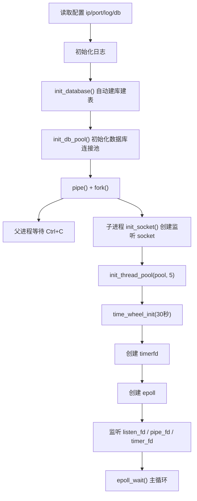
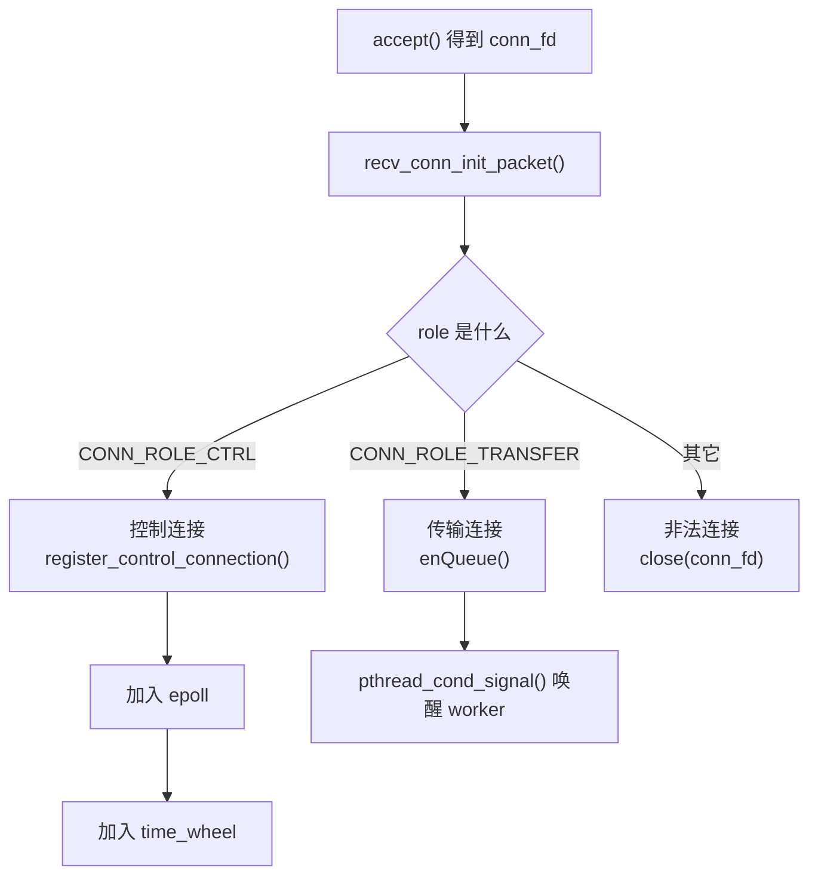
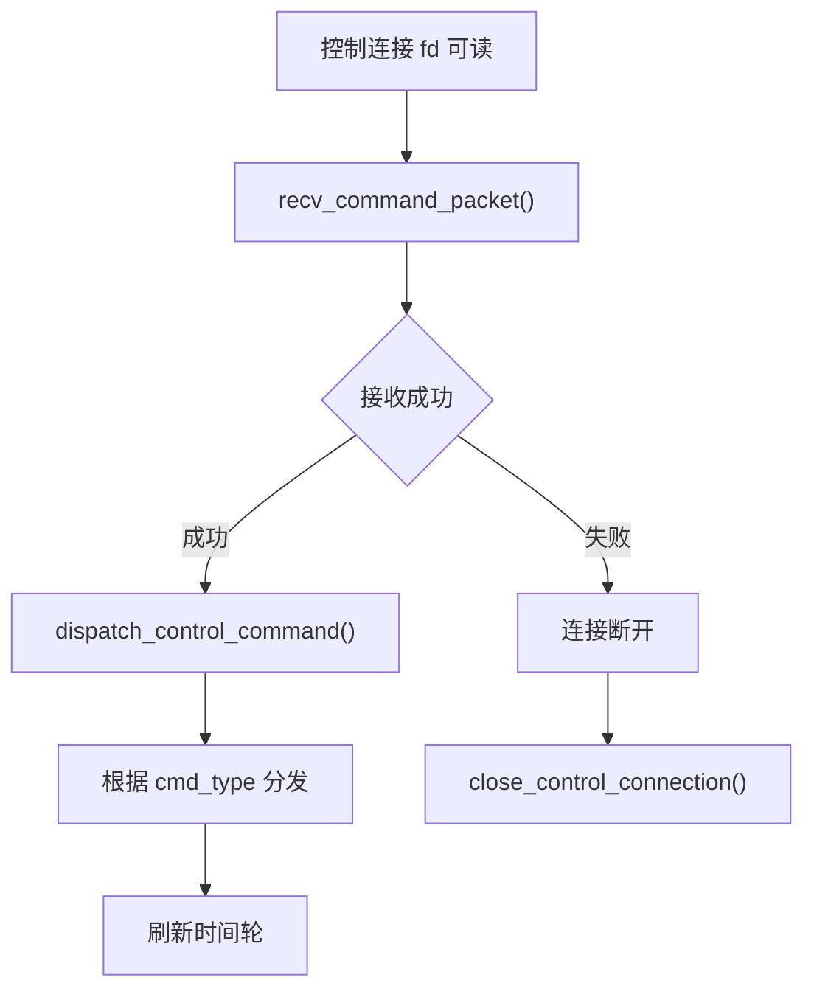
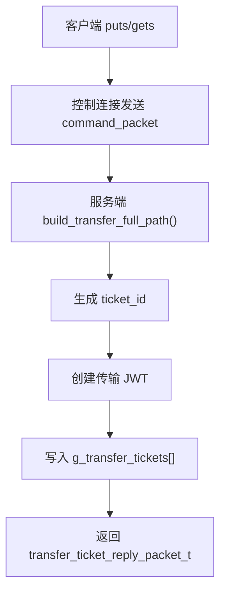
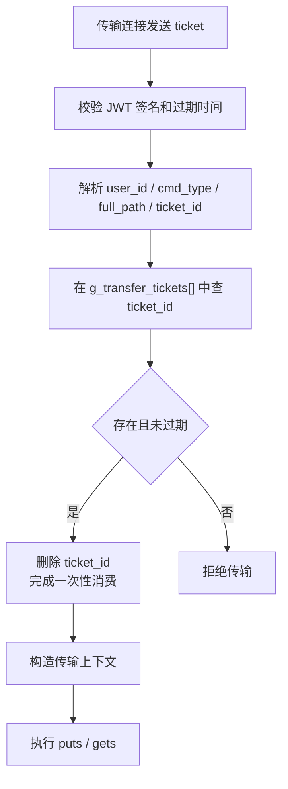
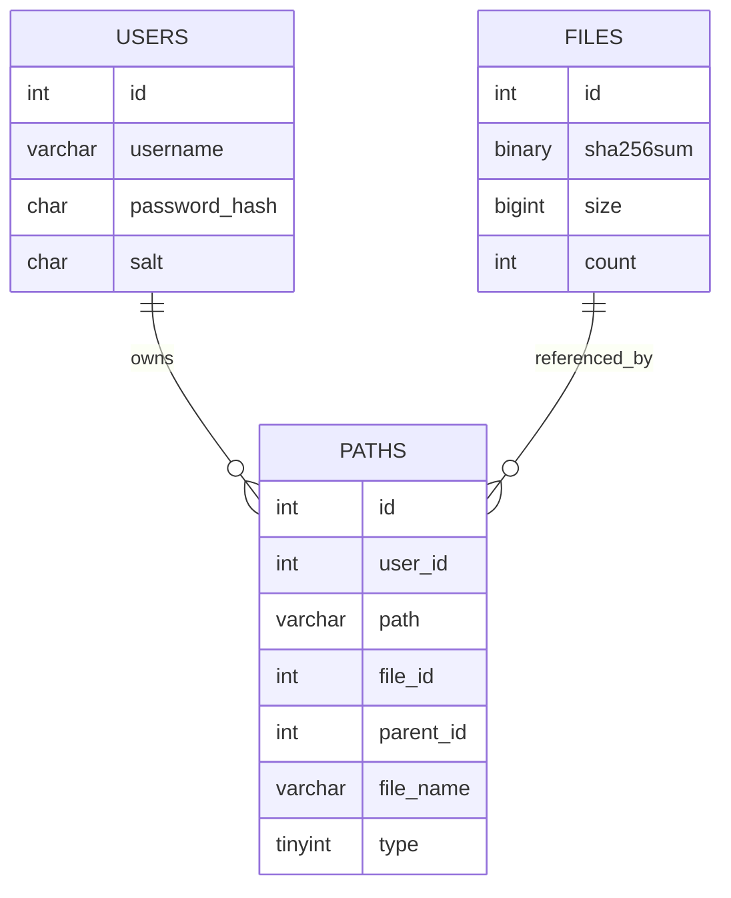
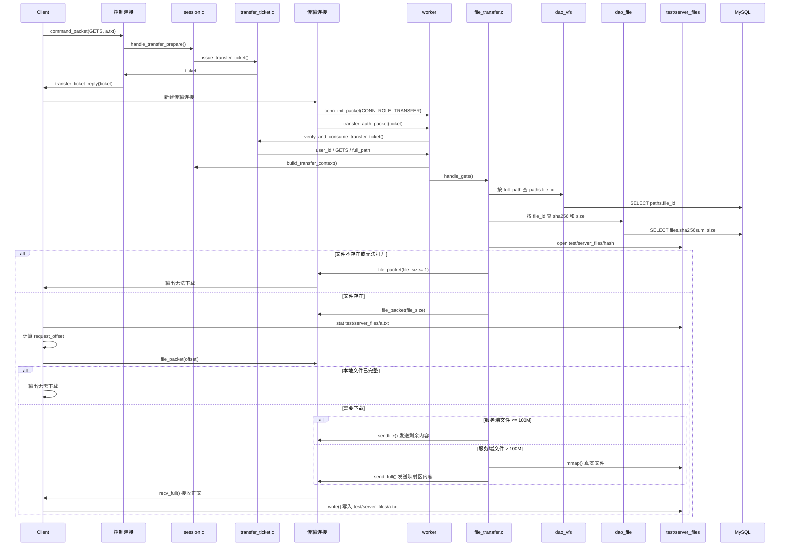
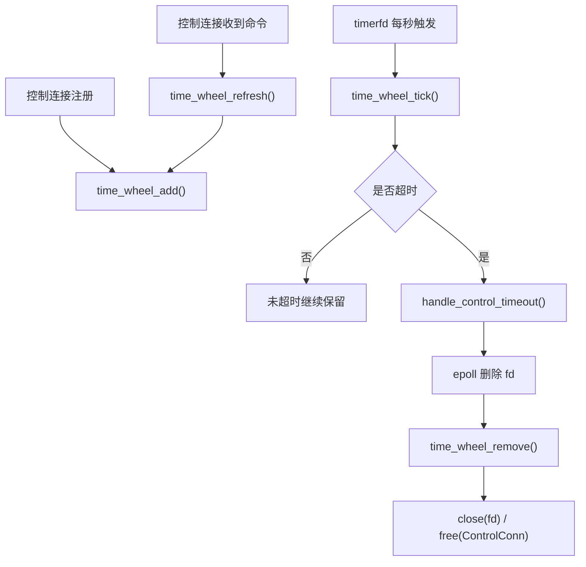
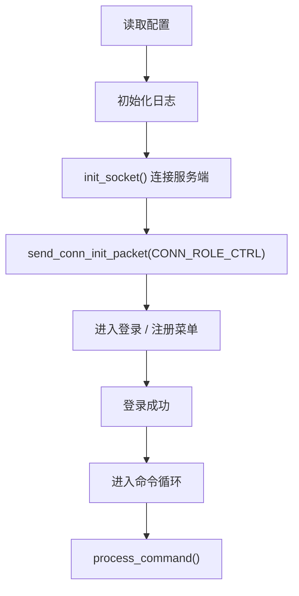
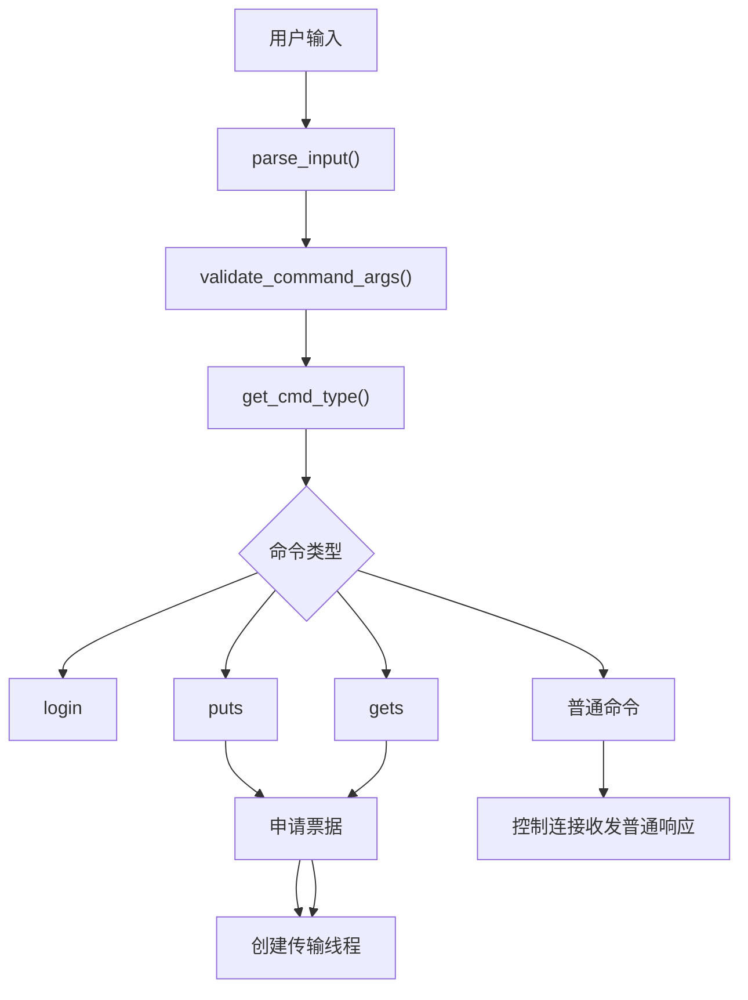

# WindCloud_V4 学习文档

## 1. 这是什么项目

`WindCloud_V4` 是一个用 C 语言实现的学习型网盘项目。

它不是只做“上传 / 下载”的小 demo，而是把网络通信、协议设计、线程池、`epoll`、MySQL、虚拟文件系统、去重存储、断点续传、一次性传输票据和超时踢出组合在一起。

当前版本已经支持：

1. 客户端和服务端通过 TCP 通信
2. 客户端和服务端使用统一的固定结构体协议
3. 服务端使用 `epoll` 管理控制连接
4. 服务端使用线程池处理独立传输连接
5. 控制连接和传输连接分离
6. 控制连接使用时间轮做空闲超时踢出
7. 上传 `puts` 和下载 `gets` 每次先申请短时一次性传输票据
8. 服务端使用 MySQL 保存用户、虚拟目录树、真实文件信息
9. 支持登录 / 注册
10. 支持目录命令：`pwd`、`cd`、`ls`、`mkdir`
11. 支持文件命令：`touch`、`rm`、`rmdir`
12. 支持上传 `puts`、下载 `gets`
13. 支持上传断点续传、下载断点续传
14. 支持基于 SHA-256 的秒传与文件去重
15. 支持第二期要求的 `100M` 大文件 `mmap` 规则
16. 服务端真实文件实体保存到 `test/server_files`
17. 客户端本地上传读取、下载写入也使用 `test/server_files`

如果只用一句话概括 V4，可以这样理解：

> 它是一个“控制面和传输面分离的虚拟网盘 + 基于 SHA-256 的去重文件仓库”。

---

## 2. 先抓住项目主干

第一次学习这个项目，不建议一开始逐行看所有 `.c` 文件。

你应该先抓住下面 10 句话：

1. 客户端启动后先建立一条控制连接。
2. 控制连接负责登录、注册、目录命令、传输票据申请。
3. `puts` / `gets` 不直接在控制连接上传文件。
4. 每次 `puts` / `gets` 都先通过控制连接申请一次性传输票据。
5. 客户端拿到票据后，启动独立线程，新建一条传输连接。
6. 服务端通过 `conn_init_packet_t.role` 区分控制连接和传输连接。
7. 控制连接由服务端主线程 `epoll` 管理，并进入时间轮。
8. 传输连接进入服务端线程池，由 worker 独占处理一次上传或下载。
9. 用户看到的目录树保存在 `paths` 表，真实文件元数据保存在 `files` 表。
10. 真实文件内容保存在 `test/server_files/<sha256>`。

只要你理解了这 10 句话，再去看代码，V4 的结构就不会散。

---

## 3. 当前代码结构

### 3.1 客户端

```text
src/client/
├── client.c
├── client_command_handle.c
├── client_gets.c
├── client_puts.c
└── client_socket.c
```

职责分工：

- `client.c`
  - 客户端入口
  - 读取配置
  - 初始化日志
  - 建立控制连接
  - 发送 `CONN_ROLE_CTRL`
  - 登录 / 注册菜单
  - 已登录后的命令循环
- `client_command_handle.c`
  - 解析用户输入
  - 校验参数
  - 普通命令发送
  - 登录响应接收
  - 为 `puts/gets` 申请一次性传输票据
  - 分发到上传或下载模块
- `client_puts.c`
  - 检查本地 `test/server_files/<文件名>`
  - 申请传输票据
  - 创建上传线程
  - 新建传输连接
  - 发送传输认证票据
  - 计算 SHA-256
  - 上传断点续传
  - 大于 `100M` 时使用 `mmap` 发送
- `client_gets.c`
  - 申请传输票据
  - 创建下载线程
  - 新建传输连接
  - 发送传输认证票据
  - 检查本地 `test/server_files/<文件名>` 的续传进度
  - 接收文件正文并写入本地文件
- `client_socket.c`
  - 创建 socket
  - 连接服务端

### 3.2 服务端

```text
src/server/
├── server.c
├── server_socket.c
├── epoll.c
├── control_conn.c
├── time_wheel.c
├── thread_pool.c
├── worker.c
├── queue.c
├── session.c
├── transfer_ticket.c
├── auth.c
├── file_cmds.c
├── file_transfer.c
├── dao_user.c
├── dao_vfs.c
├── dao_file.c
├── db_pool.c
├── db_init.c
└── path_utils.c
```

职责分工：

- `server.c`
  - 服务端入口
  - 读取配置
  - 初始化日志
  - 自动建库建表
  - 初始化数据库连接池
  - 创建监听 socket
  - 创建传输线程池
  - 创建控制连接时间轮
  - `epoll_wait()` 主循环
  - 接收新连接并识别连接角色
  - 管理控制连接事件和传输连接入队
- `control_conn.c`
  - 初始化控制连接状态
  - 保存控制连接 fd、`ClientContext`、时间轮信息
- `time_wheel.c`
  - 控制连接超时管理
  - 空闲控制连接 30 秒后被踢出
- `thread_pool.c` / `worker.c` / `queue.c`
  - 传输线程池和任务队列
  - worker 只处理传输连接
- `session.c`
  - 控制命令分发
  - 传输票据签发
  - 传输连接票据校验
  - 根据票据构造传输上下文
  - 调用 `handle_puts()` / `handle_gets()`
- `transfer_ticket.c`
  - 签发一次性传输票据
  - 校验并消费一次性传输票据
  - 维护进程内票据表
- `auth.c`
  - 登录 / 注册
- `file_cmds.c`
  - 虚拟目录和文件命令
  - `pwd`、`ls`、`cd`、`mkdir`、`touch`、`rm`、`rmdir`
- `file_transfer.c`
  - 上传 / 下载
  - 秒传
  - 断点续传
  - 大文件 `mmap`
  - 真实文件仓库 `test/server_files`
- `dao_user.c`
  - `users` 表访问
- `dao_vfs.c`
  - `paths` 表访问
- `dao_file.c`
  - `files` 表访问
- `db_pool.c`
  - MySQL 连接池
- `db_init.c`
  - 自动创建数据库和表

### 3.3 公共层

```text
src/common/
├── protocol.c
├── config.c
├── log.c
├── jwt_utils.c
└── sha256_utils.c
```

职责分工：

- `protocol.c`
  - 固定协议包初始化
  - 固定协议包完整收发
  - `send_full()` / `recv_full()`
- `config.c`
  - 读取 `config.ini`
- `log.c`
  - 日志系统
- `jwt_utils.c`
  - 登录 JWT
  - 一次性传输票据 JWT
- `sha256_utils.c`
  - 调用 `sha256sum` 计算文件哈希

---

## 4. 推荐阅读顺序

如果你第一次读 V4，建议按下面顺序：

1. `include/protocol.h`
2. `src/client/client.c`
3. `src/client/client_command_handle.c`
4. `src/server/server.c`
5. `include/control_conn.h`
6. `src/server/control_conn.c`
7. `src/server/time_wheel.c`
8. `src/server/session.c`
9. `src/server/transfer_ticket.c`
10. `src/client/client_puts.c`
11. `src/client/client_gets.c`
12. `src/server/file_transfer.c`
13. `src/server/file_cmds.c`
14. `src/server/dao_vfs.c`
15. `src/server/dao_file.c`
16. `src/server/db_pool.c`

原因是：

- 先看协议，知道双方到底传什么。
- 再看客户端入口，知道控制连接怎么建立。
- 再看服务端入口，知道控制连接和传输连接怎么分流。
- 再看 `session.c`，知道控制命令和传输任务怎么进入业务层。
- 最后看文件系统、传输、DAO，理解具体功能实现。

---

## 5. 从启动开始理解整个系统

## 5.1 服务端启动流程

服务端入口在 `src/server/server.c`。

启动流程：



这里要注意 4 件事。

### 第一，服务端仍然使用 `pipe + fork`

父进程负责接收 `Ctrl+C`。

子进程负责真正跑服务器。

父进程收到信号后，通过管道通知子进程退出。

### 第二，服务端启动时会初始化数据库

`db_init.c` 会确保数据库和表存在：

- `users`
- `files`
- `paths`

所以数据库结构是服务端启动链的一部分。

### 第三，服务端创建的是“传输线程池”

V3 里线程池偏向“连接级会话线程池”。

V4 里线程池只处理传输连接。

控制连接不进线程池，而是由主线程 `epoll` 管理。

### 第四，控制连接会进入时间轮

服务端用 `timerfd` 每秒推动时间轮。

控制连接空闲超过 30 秒后，会被关闭并移出 `epoll`。

---

## 6. 连接角色：V4 最重要的入口变化

V4 每条连接建立后，客户端第一件事都是发送：

```c
conn_init_packet_t
```

其中：

```c
typedef enum {
    CONN_ROLE_INVALID = 0,
    CONN_ROLE_CTRL = 1,
    CONN_ROLE_TRANSFER = 2,
} conn_role_t;
```

服务端收到新连接后会判断：

```text
CONN_ROLE_CTRL      -> 注册为控制连接，加入 epoll 和时间轮
CONN_ROLE_TRANSFER  -> 放入传输线程池队列
其它值              -> 关闭连接
```

流程图：



这个设计是 V4 的核心。

它把“短命令”和“长传输”从连接层面拆开了。

---

## 7. 控制连接是什么

控制连接是客户端启动后建立的第一条连接。

它负责：

1. 登录
2. 注册
3. `pwd`
4. `cd`
5. `ls`
6. `mkdir`
7. `touch`
8. `rm`
9. `rmdir`
10. 为 `puts/gets` 申请一次性传输票据

控制连接不传输文件正文。

## 7.1 服务端如何保存控制连接状态

控制连接结构体定义在 `include/control_conn.h`：

```c
typedef struct ControlConn {
    int fd;
    ClientContext ctx;
    long long expire_tick;
    int wheel_slot;
    struct TimeWheelNode *wheel_node;
} ControlConn;
```

其中最重要的是：

- `fd`
  - 控制连接 socket
- `ctx`
  - 当前登录用户和当前目录
- `expire_tick`
  - 当前连接预计过期时间
- `wheel_slot`
  - 当前连接挂在哪个时间轮槽位
- `wheel_node`
  - 指向时间轮节点

## 7.2 `ClientContext` 是什么

`ClientContext` 定义在 `include/protocol.h`：

```c
typedef struct{
    int user_id;
    char current_path[256];
    int current_dir_id;
} ClientContext;
```

它表示一个会话的虚拟目录状态：

- `user_id`
  - 登录后的用户 ID
- `current_path`
  - 当前虚拟路径，例如 `/doc/work`
- `current_dir_id`
  - 当前所在目录的节点 ID
  - 根目录约定为 `0`

### 为什么 `current_dir_id` 很重要

`current_dir_id` 不是父目录 ID。

它表示：

> 当前所在目录自己的节点 ID。

它会被用于：

- `ls`
  - 查询当前目录下的子节点
- `mkdir`
  - 新目录的 `parent_id`
- `touch`
  - 新空文件的 `parent_id`
- `puts`
  - 新上传文件逻辑节点的 `parent_id`

## 7.3 控制连接命令处理流程

服务端主线程在 `epoll` 中发现控制连接可读后：

```text
server.c: handle_control_event()
-> recv_command_packet()
-> session.c: dispatch_control_command()
-> 具体业务函数
-> time_wheel_refresh()
```

流程图：



---

## 8. 传输连接是什么

传输连接是 `puts` 或 `gets` 时临时创建的连接。

它的特点：

1. 每次传输新建一条连接。
2. 只处理一次上传或下载。
3. 进入服务端传输线程池。
4. 先发送一次性票据。
5. 服务端校验并消费票据后才开始传输。
6. 传输结束后主动关闭。

传输连接的入口是：

```text
worker.c
-> handle_transfer_request(client_fd)
```

worker 会先设置 socket 超时：

```text
SO_RCVTIMEO = 30 秒
SO_SNDTIMEO = 30 秒
```

这样异常传输连接不会长期卡住 worker。

---

## 9. 一次性传输票据怎么理解

V4 不让传输连接直接复用登录 JWT。

它要求每次上传 / 下载都先经过控制连接申请一张短时票据。

相关模块：

- `src/server/transfer_ticket.c`
- `src/common/jwt_utils.c`
- `src/server/session.c`
- `src/client/client_command_handle.c`

## 9.1 为什么要有一次性传输票据

如果传输线程只带登录 JWT，那么只要客户端还保存 JWT，就可能绕过控制连接继续发起传输。

V4 的目标是：

> 控制连接决定是否允许传输，传输连接只执行已经批准的单次任务。

所以票据要满足：

1. 短时有效
2. 只能使用一次
3. 绑定用户
4. 绑定命令类型
5. 绑定完整虚拟路径

## 9.2 票据里有什么

传输票据本质上也是 JWT。

里面会包含：

- `user_id`
- `cmd_type`
- `full_path`
- `ticket_id`
- 过期时间

`ticket_id` 还会保存在服务端进程内票据表中：

```c
static TransferTicketNode g_transfer_tickets[MAX_TRANSFER_TICKET_COUNT];
```

这样服务端不仅能验证 JWT 签名，还能判断这张票据是否已经被使用过。

## 9.3 票据签发流程

客户端执行 `puts a.txt` 或 `gets a.txt` 时：

```text
client_command_handle.c: request_transfer_ticket()
-> 控制连接发送 command_packet(PUTS/GETS, "a.txt")
-> server.c: handle_control_event()
-> session.c: dispatch_control_command()
-> session.c: handle_transfer_prepare()
-> build_transfer_full_path()
-> transfer_ticket.c: issue_transfer_ticket()
-> 返回 transfer_ticket_reply_packet_t
```

流程图：



## 9.4 票据消费流程

传输连接建立后：

```text
传输线程发送 transfer_auth_packet(ticket)
-> worker.c: handle_transfer_request()
-> recv_transfer_auth_packet()
-> verify_and_consume_transfer_ticket()
-> 删除 g_transfer_tickets[] 中的 ticket_id
-> build_transfer_context()
-> handle_puts() 或 handle_gets()
```

流程图：



---

## 10. 协议层到底解决了什么问题

协议层在：

- `include/protocol.h`
- `src/common/protocol.c`

## 10.1 当前 V4 的协议包

### `conn_init_packet_t`

新连接建立后第一个发送。

作用是告诉服务端：

```text
我是控制连接
还是传输连接
```

### `command_packet_t`

普通命令包。

适用场景：

- `pwd`
- `cd`
- `ls`
- `mkdir`
- `touch`
- `rm`
- `rmdir`
- `login`
- `register`
- 控制连接上的 `puts/gets` 传输预请求
- 普通文本响应

### `transfer_ticket_reply_packet_t`

服务端对传输预请求的响应。

里面包含：

- `success`
- `message`
- `ticket`

### `transfer_auth_packet_t`

传输连接认证包。

里面只保存：

- 一次性传输票据 `ticket`

### `file_packet_t`

文件传输协商包。

适用场景：

- 上传时发送文件名、文件大小、SHA-256
- 上传时服务端返回续传 offset
- 秒传时服务端回传相同 hash
- 下载时服务端返回文件大小
- 下载时客户端返回本地已有 offset

### `auth_reply_packet_t`

登录响应包。

包含：

- 登录是否成功
- 登录用户 ID
- 提示消息
- 登录 JWT

## 10.2 为什么要封装 `send_full()` 和 `recv_full()`

一次 `send()` 或 `recv()` 不保证完整发送或接收一个结构体。

所以协议层封装了：

- `send_full()`
- `recv_full()`
- `send_command_packet()`
- `recv_command_packet()`
- `send_file_packet()`
- `recv_file_packet()`
- `send_conn_init_packet()`
- `recv_conn_init_packet()`
- `send_transfer_auth_packet()`
- `recv_transfer_auth_packet()`

学习这个项目时，要始终记住：

> 固定结构体协议只有配合完整收发函数才可靠。

---

## 11. 数据库为什么设计成三张表

当前数据库是 `netdisk_db`，核心三张表是：

- `users`
- `files`
- `paths`

## 11.1 `users` 表

作用：存账号信息。

关键字段：

- `id`
- `username`
- `password_hash`
- `salt`

## 11.2 `files` 表

作用：存真实文件元数据。

关键字段：

- `id`
- `sha256sum`
- `size`
- `count`

这里最重要的是：

> `files` 表不关心用户原始文件名，也不关心用户目录。

它只表示：

```text
这份内容是否存在
这份内容大小是多少
有多少个逻辑文件引用它
```

## 11.3 `paths` 表

作用：存用户看到的虚拟目录树。

关键字段：

- `id`
- `user_id`
- `path`
- `file_id`
- `parent_id`
- `file_name`
- `type`

其中：

- `type = 1`
  - 目录
  - `file_id = NULL`
- `type = 0`
  - 普通文件
  - `file_id` 指向 `files.id`

## 11.4 三张表如何配合



核心理解：

- `users` 决定“是谁”
- `paths` 决定“这个用户看到什么目录和文件”
- `files` 决定“真实文件实体是什么”

---

## 12. 登录 / 注册功能怎么工作

认证逻辑在 `src/server/auth.c`。

## 12.1 注册

客户端输入：

```text
register 用户名/密码
```

服务端会：

1. 拆出用户名和密码
2. 生成随机盐 `salt`
3. 计算 `SHA256(密码 + salt)`
4. 调用 `dao_insert_user()` 写入 `users`
5. 返回注册结果

## 12.2 登录

客户端输入：

```text
login 用户名/密码
```

服务端会：

1. 根据用户名查出数据库中的 `password_hash` 和 `salt`
2. 用用户输入密码重新计算加盐哈希
3. 比较是否一致
4. 一致则登录成功
5. 控制连接中的 `ctx.user_id` 变成当前用户 ID
6. 控制连接中的 `ctx.current_path` 重置为 `/`
7. 控制连接中的 `ctx.current_dir_id` 重置为 `0`

客户端收到登录成功响应后，也会更新 `ClientState`：

- `logged_in`
- `user_id`
- `token`
- `current_path`

注意：

当前登录 JWT 仍然会返回给客户端，但传输连接已经不直接使用登录 JWT。

---

## 13. 虚拟文件系统怎么工作

目录和文件命令集中在 `src/server/file_cmds.c`。

关键思想：

> 用户操作的是虚拟路径，不是 Linux 进程真实目录。

## 13.1 `pwd`

直接返回：

```text
ctx.current_path
```

## 13.2 `cd`

`cd` 不调用 `chdir()`。

它做的是：

1. 根据当前路径和参数拼目标虚拟路径
2. 到 `paths` 表里查目标是否存在
3. 检查目标是否是目录
4. 更新 `ctx.current_path`
5. 更新 `ctx.current_dir_id`

## 13.3 `ls`

`ls` 的本质是查数据库：

```text
SELECT file_name, type
FROM paths
WHERE user_id = 当前用户
  AND parent_id = ctx.current_dir_id
```

所以 `ls` 是查当前目录的孩子节点。

## 13.4 `mkdir`

`mkdir demo` 会：

1. 拼出目标虚拟路径
2. 检查目标是否已经存在
3. 检查目录名长度
4. 插入 `paths` 记录
5. `type = 1`
6. `parent_id = ctx.current_dir_id`

目录不需要真实文件实体，所以不写 `files`。

## 13.5 `touch`

`touch` 当前不是只插一条 `paths` 空壳记录。

它会：

1. 拼出目标虚拟路径
2. 检查是否重名
3. 确保空文件真实实体存在
4. 确保 `files` 表里有空文件对应记录
5. 在 `paths` 里插入普通文件节点
6. 普通文件节点的 `file_id` 指向空文件实体
7. 如果复用已有空文件实体，则 `files.count + 1`

空文件 SHA-256 是：

```text
e3b0c44298fc1c149afbf4c8996fb92427ae41e4649b934ca495991b7852b855
```

真实空文件路径是：

```text
test/server_files/<空文件sha256>
```

## 13.6 `rm`

`rm` 删除的是普通文件。

流程：

1. 查目标虚拟路径是否存在
2. 校验目标不是目录
3. 根据路径查出 `file_id`
4. 删除 `paths` 逻辑节点
5. `files.count - 1`
6. 如果 `count == 0`
   - 删除 `test/server_files/<sha256>`
   - 删除 `files` 表记录

这说明 `rm` 同时维护：

- 虚拟目录树
- 引用计数
- 真实文件实体回收

## 13.7 `rmdir`

`rmdir` 删除的是空目录。

流程：

1. 查目标虚拟路径是否存在
2. 校验目标是目录
3. 调用 `dao_is_dir_empty()`
4. 只有目录为空才允许删除
5. 删除 `paths` 目录节点

---

## 14. 文件传输核心怎么工作

文件传输逻辑在 `src/server/file_transfer.c`。

它负责：

- 上传 `puts`
- 下载 `gets`
- 秒传
- 上传断点续传
- 下载断点续传
- 真实文件完整性检查
- 大文件 `mmap`

## 14.1 真实文件为什么按 hash 存

真实文件统一保存在：

```text
test/server_files/<sha256>
```

这样有 4 个好处：

1. 同内容文件只保存一份。
2. 秒传判断很直接。
3. 用户文件名和真实文件名解耦。
4. 多个用户、多个路径可以共享一份真实实体。

## 14.2 上传 `puts` 的整体思路

V4 的上传不是一条连接从头干到底。

它分成两个阶段。

### 第一阶段：控制连接申请票据

```text
用户输入 puts a.txt
-> 客户端检查 test/server_files/a.txt 是否存在
-> 控制连接发送 command_packet(PUTS, "a.txt")
-> 服务端根据当前控制连接目录拼 full_path
-> 服务端签发一次性传输票据
-> 客户端收到 ticket
```

### 第二阶段：传输连接真正上传

```text
客户端创建上传线程
-> 上传线程新建传输连接
-> 发送 conn_init_packet(CONN_ROLE_TRANSFER)
-> 发送 transfer_auth_packet(ticket)
-> 服务端 worker 校验并消费 ticket
-> 服务端从 ticket 中得到 user_id / full_path / PUTS
-> 服务端构造 ClientContext
-> 进入 handle_puts()
```

## 14.3 上传 `puts` 详细流程图


## 14.4 上传最值得学习的点

### 第一，`puts` 的命令和文件正文不走同一条连接

控制连接只申请票据。

文件正文走传输连接。

这就是 V4 相比 V3 最大的结构变化。

### 第二，秒传不是“什么都不做”

秒传只是跳过文件正文传输。

它仍然必须：

1. 插入 `paths` 逻辑文件节点
2. 增加 `files.count`

否则用户目录里看不到这个文件。

### 第三，秒传要检查真实文件

服务端不会只信 `files` 表。

它还会检查：

```text
test/server_files/<hash>
```

必须满足：

1. 文件存在
2. 是普通文件
3. 大小等于 `files.size`

才真正秒传。

### 第四，断点续传靠真实文件长度

服务端打开：

```text
test/server_files/<hash>
```

读出当前大小 `local_size`。

然后告诉客户端：

```text
从 local_size 开始继续发
```

如果传输中断，服务端会把文件截断到真实收到的位置。

### 第五，大文件上传发送端使用 `mmap`

当上传文件大于 `100M`：

- 客户端发送端：`mmap + send_full`
- 服务端接收端：`mmap + recv`

小文件则走：

- 客户端：`read + send_full`
- 服务端：`recv + write`

---

## 15. 下载 `gets` 的整体思路

下载也分成两个阶段。

### 第一阶段：控制连接申请票据

```text
用户输入 gets a.txt
-> 控制连接发送 command_packet(GETS, "a.txt")
-> 服务端根据当前目录拼 full_path
-> 服务端签发一次性传输票据
-> 客户端收到 ticket
```

### 第二阶段：传输连接真正下载

```text
客户端创建下载线程
-> 下载线程新建传输连接
-> 发送 conn_init_packet(CONN_ROLE_TRANSFER)
-> 发送 transfer_auth_packet(ticket)
-> 服务端 worker 校验并消费 ticket
-> 服务端从 ticket 中得到 user_id / full_path / GETS
-> 服务端构造 ClientContext
-> 进入 handle_gets()
```

## 15.1 下载 `gets` 详细流程图



## 15.2 下载最值得学习的点

### 第一，下载不是直接用文件名找磁盘

服务端下载链路是：

```text
用户输入文件名
-> 当前虚拟目录拼 full_path
-> paths 表查 file_id
-> files 表查 sha256
-> test/server_files/<sha256>
```

这是虚拟目录和真实存储分离的核心体现。

### 第二，客户端下载续传靠本地文件长度

客户端会检查：

```text
test/server_files/<文件名>
```

然后决定：

- 本地文件小于服务端文件：从本地大小继续下载
- 本地文件等于服务端文件：不下载
- 本地文件大于服务端文件：从 0 重新下载

### 第三，服务端下载发送端按 100M 分支

小文件：

```text
sendfile()
```

大文件：

```text
mmap() + send_full()
```

这样既保留 `sendfile` 的简单高效，又满足大文件 `mmap` 要求。

---

## 16. 时间轮超时怎么理解

时间轮相关代码在：

- `src/server/time_wheel.c`
- `include/time_wheel.h`
- `src/server/server.c`

当前时间轮只管理控制连接。

核心目标：

> 控制连接长时间没有命令输入，就关闭它。

## 16.1 为什么只管理控制连接

控制连接是长期存在的。

传输连接是短连接：

- 只做一次上传或下载
- 由 worker 处理
- worker 设置 socket 读写超时
- 传完就关闭

所以 V4 里：

- 控制连接：时间轮管理
- 传输连接：socket 超时 + 任务结束关闭

## 16.2 时间轮工作流程



## 16.3 控制连接超时意味着什么

控制连接超时后：

1. 客户端不能继续通过这条连接发命令。
2. 客户端不能继续申请新的传输票据。
3. 已经进入传输线程池的任务不会被主线程强制取消。

也就是说，当前 V4 的控制点是：

> 控制连接失效后，新的传输任务无法再被批准。

---

## 17. 客户端当前怎么工作

客户端入口是 `src/client/client.c`。

## 17.1 客户端启动流程



最关键的一步是：

```text
send_conn_init_packet(CONN_ROLE_CTRL)
```

这让服务端知道这是一条控制连接。

## 17.2 客户端命令分发

`process_command()` 会：

1. 解析输入
2. 本地校验参数
3. 转换命令类型
4. 登录命令走 `handle_login_command()`
5. `gets` 走 `handle_gets_command()`
6. `puts` 走 `handle_puts_command()`
7. 其它命令走 `handle_normal_command()`

流程：



## 17.3 `ClientState` 的作用

`ClientState` 定义在 `include/client_state.h`。

它保存：

- 控制连接 fd
- 登录状态
- 当前用户 ID
- 登录 JWT
- 客户端当前认知的远端虚拟路径
- 服务端 IP
- 服务端端口
- 互斥锁

上传 / 下载线程启动前，会复制：

- 服务端 IP
- 服务端端口
- 一次性传输票据
- 文件名

这样传输线程不需要长期持有 `ClientState` 锁。

---

## 18. 数据访问层怎么理解

## 18.1 `db_pool.c`

`db_pool.c` 是数据库访问的基础设施。

它负责：

1. 初始化多个 MySQL 连接
2. 提供连接借出和归还
3. 执行查询 SQL
4. 执行更新 SQL

上层 DAO 不直接管理 MySQL 连接生命周期，而是通过连接池访问数据库。

## 18.2 `dao_user.c`

负责 `users` 表。

认证模块通过它完成：

- 按用户名查询用户
- 插入新用户

## 18.3 `dao_vfs.c`

负责 `paths` 表。

它解决虚拟目录树问题：

- 目标路径是否存在
- 当前目录有哪些子节点
- 创建目录节点
- 创建文件节点
- 删除节点
- 判断目录是否为空
- 根据逻辑路径找到 `file_id`

根目录约定：

```text
id = 0
type = 1
```

但根目录不一定真的存在于 `paths` 表。

## 18.4 `dao_file.c`

负责 `files` 表。

它解决真实文件实体问题：

- 按 SHA-256 查真实文件记录
- 插入真实文件记录
- 引用计数加一
- 引用计数减一
- 查询引用计数
- 删除真实文件记录
- 按 `file_id` 查 SHA-256 和文件大小

---

## 19. 学习这个项目时最该盯住什么

如果你已经会写基础 socket 程序，V4 最值得学习的是下面这些点。

## 19.1 固定结构体协议

优点：

1. 命令类型明确
2. 包大小固定
3. 客户端和服务端协议容易对齐
4. 文件传输协商信息统一

关键是必须配合 `send_full()` / `recv_full()`。

## 19.2 控制连接和传输连接分离

这是 V4 的核心设计。

它解决的是：

> 大文件传输不应该阻塞普通命令控制面。

控制连接负责短命令。

传输连接负责长任务。

## 19.3 一次性传输票据

这让控制面重新掌握传输任务的批准权。

没有控制连接批准，就没有合法票据。

没有合法票据，传输连接无法执行。

## 19.4 虚拟目录树

项目没有用真实目录直接表示用户目录。

它用：

```text
paths 表 + parent_id
```

模拟用户看到的目录树。

这是网盘项目非常重要的思想。

## 19.5 逻辑文件和真实文件分离

`paths` 是用户看到的文件。

`files` 是真实文件实体。

`test/server_files/<sha256>` 是磁盘上的真实内容。

这一步让：

- 秒传
- 去重
- 引用计数
- 多用户共享同内容

都变得自然。

## 19.6 断点续传

上传续传：

```text
服务端已有 test/server_files/<hash> 多大
客户端就从哪个 offset 继续发
```

下载续传：

```text
客户端已有 test/server_files/<文件名> 多大
就告诉服务端从哪个 offset 继续发
```

## 19.7 大文件 `mmap`

当前项目用 `100M` 作为阈值。

需要重点看：

- `client_puts.c`
  - `send_upload_by_mmap()`
- `server/file_transfer.c`
  - `send_download_by_mmap()`
  - `recv_upload_by_mmap()`

---

## 20. 当前实现中的简化点

这是学习型项目，不是生产级网盘。

下面这些是当前实现的简化点，也是后续可以继续优化的方向。

## 20.1 SQL 仍然主要靠字符串拼接

好处是直观。

代价是生产项目中需要进一步考虑：

- SQL 注入
- 参数化查询
- 字符串转义

## 20.2 多步数据库写操作没有全面事务化

例如上传完成后可能涉及：

- 插入 `files`
- 插入 `paths`
- 修改 `files.count`

如果要进一步增强一致性，可以使用事务。

## 20.3 票据表是进程内数组

当前票据表是：

```text
g_transfer_tickets[1024]
```

这适合单进程学习项目。

如果未来做多实例服务，需要迁移到：

- Redis
- MySQL
- 共享内存

## 20.4 客户端本地路径工具有重复

`client_puts.c` 和 `client_gets.c` 都有：

- 获取 `test` 根目录
- 确保 `test/server_files`
- 拼本地文件路径

后续可以抽成客户端公共工具。

## 20.5 服务端真实仓库路径工具有重复

`file_cmds.c` 和 `file_transfer.c` 都维护了真实文件仓库路径逻辑。

后续可以抽成：

- `store_utils.c`
- `store_path.c`

## 20.6 控制连接断开后不主动取消已开始传输

当前行为是：

- 控制连接断开后不能申请新传输
- 已经开始的传输任务继续执行

如果未来要强制取消，需要额外维护：

- 用户到传输任务的映射
- 控制连接到传输连接的反向索引
- worker 中断机制

---

## 21. 如果你要亲手跑一遍，建议怎么观察

推荐学习方式：

1. 启动服务端
2. 启动客户端
3. 注册用户
4. 登录
5. 执行 `mkdir demo`
6. 执行 `cd demo`
7. 在 `test/server_files` 准备一个本地测试文件
8. 执行 `puts 文件名`
9. 再执行一次相同内容文件上传，观察秒传
10. 执行 `gets 文件名`
11. 等待控制连接空闲 30 秒，观察超时踢出
12. 对照 `log/server.log`
13. 对照 MySQL 中 `users`、`paths`、`files`
14. 对照 `test/server_files` 中真实文件

重点观察：

- 控制连接建立时是否发送 `CONN_ROLE_CTRL`
- 传输连接建立时是否发送 `CONN_ROLE_TRANSFER`
- 每次 `puts/gets` 是否先申请票据
- 票据是否只能使用一次
- `paths` 表何时插入目录或文件节点
- `files` 表何时插入，何时只增加 `count`
- 秒传时为什么没有发送文件正文
- 上传中断时真实文件大小如何变化
- 下载中断时客户端本地文件如何保留进度

---

## 22. 最后的总结

`WindCloud_V4` 的主线可以浓缩成下面几句话：

1. 客户端和服务端通过固定结构体协议通信。
2. 新连接建立后先声明自己是控制连接还是传输连接。
3. 控制连接由服务端主线程 `epoll` 管理。
4. 控制连接进入时间轮，空闲超时会被踢出。
5. 传输连接进入线程池，由 worker 独占处理一次上传或下载。
6. `puts/gets` 必须先在控制连接上申请一次性传输票据。
7. 传输连接只携带票据，服务端校验并消费票据后才执行传输。
8. 用户目录树保存在 `paths` 表。
9. 真实文件元数据保存在 `files` 表。
10. 真实文件内容保存在 `test/server_files/<sha256>`。
11. 上传时先按 hash 判断秒传，否则按 offset 续传。
12. 下载时先从虚拟路径找到真实 hash，再传输真实文件。
13. 大于 `100M` 的上传发送端和下载发送端使用 `mmap`。

如果你真正理解了这些内容，再回头读每个源码文件，就能知道：

- 它为什么存在
- 它属于控制面还是传输面
- 它处理的是协议、会话、业务、DAO 还是基础设施
- 它和上下游模块如何协作

这就是学习 `WindCloud_V4` 最关键的一步。
